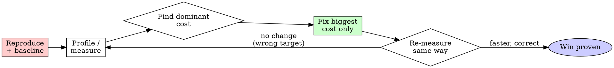

# Investigating Performance Regressions

## Overview

Optimization without measurement is guessing, and guessing makes code uglier and rarely faster. Find the regression with data, fix the dominant cost, and prove the win with the same measurement.

**Core principle:** Measure first. Fix the bottleneck the data points to — not the one your intuition prefers.

**Violating the letter of "measure first" is violating the spirit of it.** A "quick optimization" with no before-number is a guess.

## The Iron Law

```
NO PERFORMANCE FIX WITHOUT A BEFORE MEASUREMENT AND A RELIABLE REPRODUCTION
```

If you can't reproduce the slowdown and measure it, you can't prove you fixed it.

## When to Use

- A benchmark or CI perf gate regressed (e.g., cold start, keystroke latency, RSS, cache hit rate)
- A user reports "it got slow"
- Latency/memory exceeds a stated budget
- You feel the urge to optimize "for speed"

**Don't skip when:** "the fix is obvious" or "I know exactly what's slow." The profiler disagrees with intuition more often than not.

## The Process



### 1. Reproduce and Baseline

Pin it down before touching anything:

- Find the smallest input/scenario that shows the slowdown.
- Run it **multiple times**; record min/median (ignore one-off noise from a cold cache or a busy machine).
- If it regressed, `git bisect` between the last-good and first-bad commit. The diff usually names the culprit.

### 2. Measure — Don't Guess

Match the tool to the question:

| Question | Tool |
|----------|------|
| Where is wall-clock time going? | Sampling profiler / flamegraph (`perf`, `cargo flamegraph`, `py-spy`, devtools) |
| Where is time going in a microbench? | `cargo bench` / `criterion`, `hyperfine`, `pytest-benchmark` |
| What's allocating / leaking? | heap profiler (`dhat`, `valgrind --tool=massif`, `/proc` RSS, heap snapshots) |
| Too many DB/IO/syscalls? | query logs, `strace`/`dtruss`, request tracing |
| Algorithmic blowup? | count operations vs input size; check for accidental O(n²) |

Read the profile top-down: **what fraction of total time is the hottest frame?** Optimizing a 2% function is wasted effort (Amdahl's law).

### 3. Fix the Dominant Cost — One Change

Address the top item the data points to. Common real wins, roughly in order of payoff:

1. **Do less work** — cache, memoize, hoist out of loops, batch, short-circuit.
2. **Better algorithm/data structure** — O(n²)→O(n log n), set instead of linear scan, index a lookup.
3. **Cut I/O** — N+1 queries → one; avoid redundant reads; stream instead of buffering.
4. **Reduce allocation** — reuse buffers, borrow instead of clone, avoid needless boxing.
5. **Parallelize / micro-optimize** — last, only if the above didn't close the gap.

One change at a time, so the re-measurement attributes the win correctly.

### 4. Verify — Same Measurement

Re-run the **exact** baseline scenario. Confirm:

- The number improved by a meaningful, repeatable margin (not within noise).
- **Behavior is unchanged** — run the test suite. A fast wrong answer is a bug.
- The profile shifted (the old hot frame shrank).

State the result with evidence: `before: 240 ms median (n=20) → after: 38 ms median (n=20), tests green`.

## Common Mistakes

| Mistake | Reality |
|---------|---------|
| Optimizing without profiling | You'll speed up the wrong thing and add complexity |
| Measuring once | Noise; min/median over several runs is the signal |
| Micro-optimizing a cold path | 2% of runtime can't yield a 10% win — Amdahl |
| Benchmarking a debug build | Measure release/optimized builds for real numbers |
| Changing 5 things at once | Can't attribute the win; may hide a new regression |
| Trading correctness for speed | A wrong fast answer is still wrong — keep tests green |
| Premature caching | Caches add invalidation bugs; cache only proven-hot work |

## Red Flags - STOP

- "I'm pretty sure this loop is the problem" (no profile)
- "Let me just optimize this while I'm here"
- Reporting a speedup from a single run
- Tweaking constants until the benchmark passes without understanding why
- Skipping the test suite because "it's only a perf change"

**All of these mean: get a measurement first, or you're guessing.**

## Verification Checklist

- [ ] Reproduced the slowdown with a minimal, repeatable scenario
- [ ] Recorded a baseline (min/median over several runs, release build)
- [ ] Profiled and identified the dominant cost
- [ ] Made ONE targeted change at the bottleneck
- [ ] Re-measured the same scenario; improvement exceeds noise
- [ ] Full test suite still green (behavior unchanged)
- [ ] Reported before/after numbers as evidence

## The Bottom Line

Reproduce → measure → fix the biggest cost → re-measure. Numbers before and after, behavior unchanged. Anything else is folklore.
