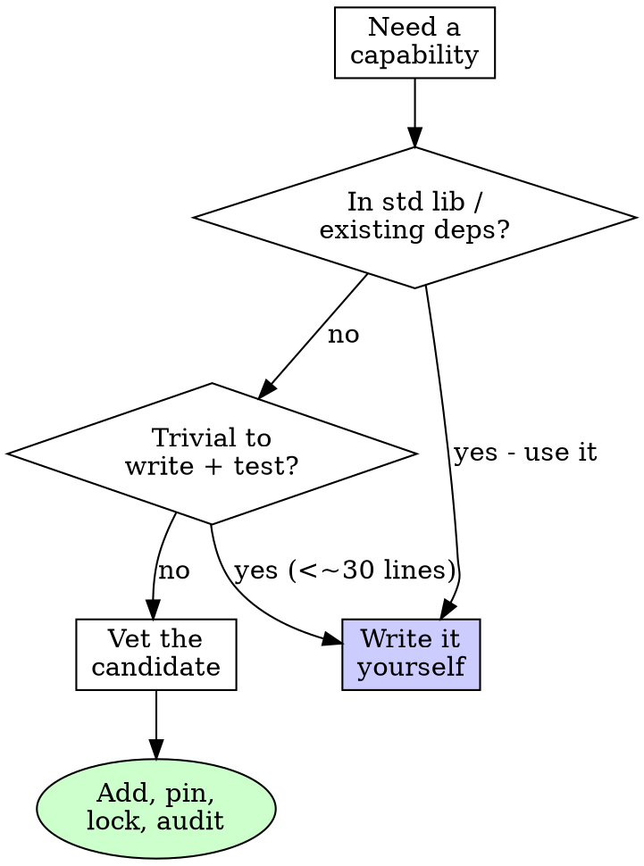

# Managing Dependencies

## Overview

Every dependency is code you ship but didn't write and must trust forever — its bugs, its vulnerabilities, its maintenance, and its transitive deps become yours. Add deliberately; pin and audit; remove without regret.

**Core principle:** A dependency is a long-term liability, not a free feature. Justify it before you add it.

## When to Use

- Adding a new library
- Upgrading or downgrading an existing one
- A lockfile changes (review what moved and why)
- An audit / advisory / Dependabot alert fires
- Removing dead dependencies

**Don't skip when:** "it's a tiny package", "everyone uses it", or "it's just a dev dependency." Small packages still pull trees; dev deps still run on your machine and in CI.

## Before Adding: The Gate

Don't add a dependency for something the standard library or an existing dependency already does, or that's a few well-understood lines you can test yourself (avoid the "left-pad" trap).

## Vetting a Candidate

Check before you commit:

| Signal | Why it matters | Red flag |
|--------|----------------|----------|
| **Maintenance** | Unmaintained = your problem when it breaks | No release/commit in 1–2 yrs; open critical issues ignored |
| **Popularity / adoption** | More eyes find bugs faster | Near-zero usage, single author, no tests |
| **License** | Must be compatible with yours | GPL/AGPL in a permissive project; "no license" |
| **Transitive weight** | You inherit the whole tree | One small need pulls 40 packages |
| **Security history** | Past handling predicts future | Unpatched advisories; no disclosure policy |
| **Footprint** | Bundle size, build time, binary size | Huge dep for a small feature |
| **API stability** | Churn = upgrade pain | Pre-1.0 with frequent breaking changes (acceptable, but know it) |

Prefer the smallest dependency that does the job, from the most credible source.

## Pin, Lock, and Reproduce

- **Commit the lockfile** (`Cargo.lock`, `package-lock.json`, `poetry.lock`, `go.sum`). It makes builds reproducible and audits meaningful.
- Pin to a known-good version; let the lockfile freeze the transitive tree.
- Use the ecosystem's integrity mechanism (hashes in the lock, `go.sum`, `--require-hashes`).
- Treat a lockfile diff as real review surface — a one-line manifest change can move dozens of transitive packages.

## Audit and Upgrade

- Run the ecosystem auditor and act on results: `cargo audit` / `cargo deny`, `npm audit`, `pip-audit`, `govulncheck`, `osv-scanner`.
- Upgrade in **small, reviewable steps**, not one giant bump. Read the changelog for breaking changes; run the full test suite after each.
- Security patches: apply promptly, but still test — a patch can change behavior.
- Pre-upgrade, skim the changelog/release notes. Post-upgrade, the test suite is your safety net.

## Supply-Chain Safety

- **Typosquatting:** verify the exact package name and source before installing (`reqeusts` ≠ `requests`).
- **Provenance:** prefer packages from the official registry/repo; be wary of forks with renamed packages.
- **Install scripts:** know that some ecosystems run arbitrary code on install — that code runs in CI and on dev machines.
- **New maintainer / sudden version jump:** a long-stable package suddenly very active can signal a compromise; check the diff.

## Removing Dependencies

Removal is a feature. When code stops using a dep:

- Remove it from the manifest AND regenerate the lockfile.
- Check for now-orphaned transitive deps and drop them.
- Re-run the build and tests to confirm nothing relied on it transitively.

## Red Flags - STOP

- Adding a dependency to avoid writing ~10 lines you understand
- Committing a manifest change without the updated lockfile
- "I'll deal with the audit warnings later"
- A manifest one-liner that balloons the lockfile by dozens of packages
- Upgrading across a major version without reading the changelog
- Installing a package whose name you didn't double-check
- Ignoring an advisory because "we don't use that code path" (transitive deps still ship)

## Verification Checklist

- [ ] The capability isn't already covered by std lib or an existing dep
- [ ] Candidate vetted: maintenance, license, transitive weight, security history
- [ ] Version pinned and lockfile committed (and reviewed for transitive churn)
- [ ] Auditor run; advisories resolved or consciously accepted with a note
- [ ] Test suite green after the add/upgrade
- [ ] License compatible with the project's
- [ ] Removed deps fully pruned (manifest + lockfile + orphaned transitives)

## The Bottom Line

You will maintain every dependency you add for as long as you ship it. Justify it, vet it, pin it, audit it — and delete it the moment it stops earning its place.
