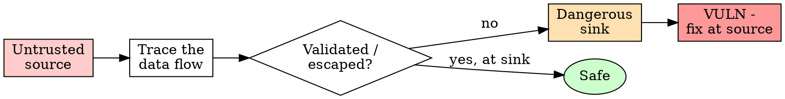

# Reviewing Security

## Overview

Most vulnerabilities are not exotic — they are missing checks on the boundary between trusted and untrusted data. Reviewing for security means tracing where untrusted input enters and proving it cannot reach a dangerous sink unchecked.

**Core principle:** Untrusted input is guilty until proven sanitized. Trace every input to every sink.

**Violating the letter of this review is violating the spirit of it.** A review that skips the boring sinks is not a review.

## When to Use

Use when the change touches ANY of:

- Input from users, network, files, env vars, CLI args, or other processes
- Authentication, authorization, sessions, or tokens
- Secrets: keys, passwords, credentials (creation, storage, logging)
- Filesystem paths derived from input (read, write, delete)
- Subprocess / shell execution
- Deserialization (JSON, YAML, pickle, rkyv, SQL row mapping)
- SQL, templating, or any string assembled into a command
- Cryptography (don't roll your own; check you didn't)

**Don't skip when:** "it's internal", "the input is already validated upstream", or "this is a small change." Internal boundaries get crossed; upstream validation gets removed.

## The Trust-Boundary Pass



For each untrusted source, identify the sink it can reach and the check in between. No check ⇒ finding.

## The Checklist (OWASP-flavored, language-agnostic)

| Class | What to look for | The fix |
|-------|------------------|---------|
| **Injection** | Input concatenated into SQL/shell/HTML/template | Parameterize / use safe APIs; never string-build commands |
| **Path traversal** | `../`, absolute paths, symlinks in input-derived paths | Canonicalize, then assert the result stays under an allowed root |
| **AuthN/AuthZ** | Endpoint/action with no permission check; IDOR | Check identity AND ownership for every object access |
| **Secrets** | Hard-coded keys; secrets in logs, errors, or VCS | Load from a vault/env; redact in `Debug`/logs; never commit |
| **Deserialization** | Untrusted bytes into a deserializer that runs code | Validate schema; reject unknown types; avoid `pickle`/`unsafe` paths |
| **SSRF/network** | Server fetches a URL from input | Allowlist hosts/schemes; block link-local & metadata IPs |
| **Crypto** | Custom crypto, MD5/SHA1 for security, fixed IVs, `==` on secrets | Use vetted libs; constant-time compares; modern primitives |
| **DoS** | Unbounded input → unbounded alloc/recursion/regex | Cap sizes, depth, timeouts; avoid catastrophic regex |
| **Errors** | Stack traces / internals leaked to users | Log detail server-side; return generic message |

## Secrets Hygiene

- Search the diff for high-entropy strings and known prefixes (`AKIA`, `ghp_`, `sk-`, `-----BEGIN`).
- A secret that ever touched VCS is compromised — rotate it, don't just delete the line.
- Confirm secrets never reach `tracing`/`println!`/error bodies. In this repo, `Secret<T>` must redact in `Debug`; flag any raw secret bytes through logging.

## Red Flags - STOP

- "I'll validate it later / upstream already did"
- Building a shell command or SQL with string interpolation
- Joining a user path without canonicalize-then-contains-check
- A new dependency pulled in to do crypto/auth by hand
- `# nosec`, `// nolint`, or a disabled security lint with no justification
- Catch-all that swallows an auth/validation error
- "It's not exploitable because the caller never does X" (callers change)

## What a Finding Looks Like

State it as: **source → sink → missing check → impact → fix.**

```
Source: `req.query.file` (untrusted)
Sink:   fs.readFile(path.join(ROOT, file))  // line 42
Gap:    no canonicalization; `../../etc/passwd` escapes ROOT
Impact: arbitrary file read
Fix:    realpath(joined); assert it startsWith realpath(ROOT) else 400
```

Rank by impact × reachability. Don't bury a critical RCE under style nits.

## Verification

- [ ] Every untrusted source in the diff traced to its sink(s)
- [ ] Each sink has a validation/escaping step, or a finding is filed
- [ ] No secrets in code, logs, errors, or VCS history (rotate if found)
- [ ] Authorization checked for every object access, not just authentication
- [ ] Input sizes/depth/timeouts bounded
- [ ] Disabled security lints each have a written justification
- [ ] Findings written as source→sink→gap→impact→fix, ranked by severity

Can't check a box? The review isn't done. Don't claim "looks secure."

## The Bottom Line

Security review is a boundary discipline, not a vibe. Trace input to sink, demand a check at every sink, and write findings as evidence. "I didn't see anything obvious" is not a review.
