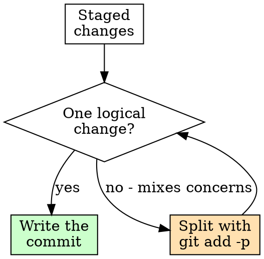

# Writing Commits and Pull Requests

## Overview

Commits and PRs are how your work is reviewed, understood, and — months later — debugged. A good history explains *why* a change happened, not just *what* changed; `git diff` already shows the what. Optimize for the reader and for `git blame`/`git bisect`.

**Core principle:** Each commit is one logical, self-contained change with a message that explains intent.

## When to Use

- Before `git commit`
- Before opening or updating a pull request
- When a "WIP" branch needs to be cleaned into reviewable history

**Don't skip when:** "it's a small change" or "I'll fix the message later." Small changes still get bisected; messages rarely get fixed later.

## Atomic Commits

One commit = one logical change that builds and passes tests on its own.



- Don't mix a refactor with a behavior change with a typo fix. Use `git add -p` to stage by hunk and split them.
- Each commit should compile and pass tests — so `git bisect` lands on a real culprit, not a broken intermediate.
- Keep formatting/whitespace-only churn in its own commit so it doesn't drown the real diff.

## Commit Message Format

```
<short imperative summary, ~50 chars, no trailing period>

<body: wrap ~72 cols. Explain WHY this change, what problem it solves,
and any context or trade-offs a reviewer or future-you will need.
The diff shows what changed; the body explains why.>

<footers: Fixes #123, Co-authored-by:, BREAKING CHANGE:, etc.>
```

- **Subject in the imperative mood:** "Add retry to fetch", not "Added"/"Adds"/"Fixing". (Read it as "If applied, this commit will _<subject>_".)
- If the project uses **Conventional Commits** (`feat:`, `fix:`, `refactor:`, `docs:`, `test:`, `chore:`), match it — and look first; don't impose a convention the repo doesn't use.
- The body is where the value is. Skip it only for truly trivial commits.

<Good>
```
Cap embedding batch size to avoid OOM on large repos

We loaded every file's embedding into one Vec before upsert, so a
10k-file repo allocated ~3 GB and OOM-killed the daemon. Batch in
chunks of 256 and flush between chunks; steady RSS now ~180 MB.

Fixes #482
```
</Good>

<Bad>
```
fix stuff
```
Vague subject, no why, can't bisect or review against intent.
</Bad>

## Before You Commit

- Review your own diff (`git diff --staged`) — catch debug prints, stray files, secrets, commented-out code.
- Run the relevant tests/linters. Don't commit known-broken state onto a shared branch. (See `superpowers:verification-before-completion`.)
- Confirm no secrets or generated junk are staged (`git status`).

## Writing the Pull Request

A reviewer should understand the change without reading every line first.

**Structure:**
- **Title:** imperative, specific. "Add retry with backoff to provider fetch" — not "updates".
- **What & why:** the problem, the approach, and *why this approach* over alternatives.
- **How to test / verify:** commands run, what the reviewer should check; paste key output or screenshots.
- **Scope & risk:** what's intentionally out of scope; migration/rollback notes; breaking changes called out loudly.
- **Links:** issue(s) the PR closes.

**Keep PRs small and focused.** A 200-line PR gets a real review; a 2,000-line PR gets a rubber stamp. Split unrelated changes into separate PRs. If a PR must be large (e.g. a generated file or mechanical rename), say so up front and separate mechanical commits from substantive ones.

## Cleaning History Before Review

- Rebase/squash "WIP", "fix typo", "address review" noise into the logical commits they belong to (`git rebase -i`).
- **Never rewrite history that others have already pulled** from a shared branch. Rewrite only your own un-pushed or unshared commits.
- The goal is a history you'd want to read during a 2 a.m. incident.

## Red Flags - STOP

- Subject lines like "fix", "wip", "stuff", "misc changes"
- One commit that mixes refactor + feature + formatting
- Committing without reading your own diff
- A PR description that's empty or just restates the title
- A giant PR bundling unrelated changes
- "I'll write a real message when I squash" (you won't)
- Force-pushing a rewrite over a branch teammates have pulled

## Verification Checklist

- [ ] Each commit is one logical change that builds + passes tests
- [ ] Subject is imperative, concise, matches repo convention
- [ ] Body explains *why* (problem, approach, trade-offs) for non-trivial commits
- [ ] Self-reviewed the diff; no debug code, secrets, or stray files
- [ ] PR has what/why, how-to-verify, scope/risk, and issue links
- [ ] PR is focused and reasonably sized (or large size is justified)
- [ ] History cleaned of WIP noise; no rewrite of shared history

## The Bottom Line

Write the commit and PR for the person who reads them later under pressure — often you. Atomic commits, imperative subjects, a body that explains *why*, and a focused PR that says how to verify it.
