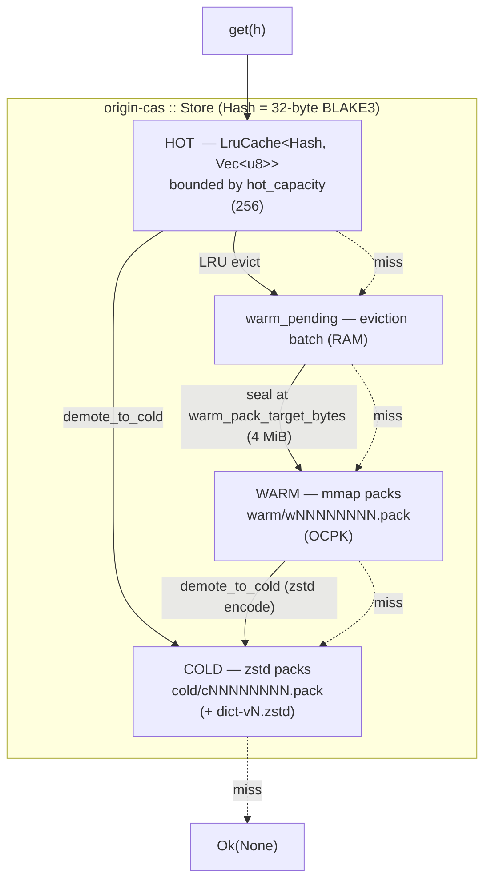
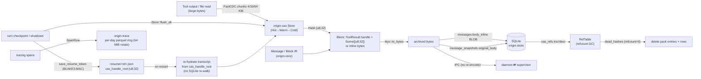

# Data &amp; Storage Architecture

> Last reviewed against workspace version 0.9.8

## Abstract

`origin` is an agentic harness whose runtime continuously produces large,
highly-repetitive byte streams: tool outputs, file reads, model transcripts,
embeddings, memory bodies, and code-graph node payloads. Persisting these
naively — once per turn, per session, per swarm worker — would blow up disk and
RAM with near-duplicate copies of the same content. The storage stack is built
to avoid exactly that.

This document describes the four cooperating storage subsystems and how data
flows between them:

| Subsystem | Crate | Role |
|---|---|---|
| Content-addressed store (CAS) | `origin-cas` | Dedup + tiered persistence of opaque byte blobs keyed by their content hash |
| Relational store | `origin-store` | SQLite metadata, refcounts, code-graph, memory, plan op-log, message rows; refinery migrations |
| Archived IR | `origin-core` | `rkyv`-archivable `Message` / `Block` IR that serializes once and flows through IPC, SQLite blobs, and ring buffers |
| Trace ring | `origin-trace` | Per-day parquet ring of structured spans for observability |

The two load-bearing ideas are **content addressing** (identical bytes are
stored once, anywhere they appear) and **zero-copy archived IR** (the
in-memory transcript representation is byte-identical to what is written to
disk and shipped over IPC, so there is no encode/decode tax on the hot path).

---

## Content-addressed storage (origin-cas)

`origin-cas` is the workspace's content-addressed store: an opaque
`bytes → Hash → bytes` key/value layer where the key is **derived from the
value**. Storing the same bytes twice — whether from the same turn, a later
turn, a resumed session, or a parallel swarm worker — yields the same address
and stores the payload exactly once.

### The value proposition: dedup across turns, sessions, and the swarm

Agentic workloads are pathologically repetitive:

- **Tool outputs** — the same `Read` of the same file, the same `Grep`, the
  same directory listing, repeated across turns and sub-agents.
- **File reads** — large source files re-read after small edits; only the
  changed region differs.
- **Embeddings &amp; memory bodies** — memory entries store their body in CAS
  (`memories.body_handle`, see V5 below) and only an inline quantized vector
  delta in SQLite.
- **Code-graph nodes** — each node's signature and body are CAS handles
  (`code_nodes.signature_handle`, `code_nodes.body_handle`), so two functions
  with identical bodies, or the same function re-ingested across rebuilds,
  collapse to one shard.

Because the address *is* the content hash, dedup is free and global: every
producer that hashes the same bytes gets the same handle, and the store's
`put` short-circuits if the hash is already resident in any tier.

### The content hash and addressing scheme

The canonical address is `origin_cas::Hash` — **a 32-byte BLAKE3 hash**
(`crates/origin-cas/src/hash.rs`):

```rust
/// A 32-byte blake3 hash. The canonical CAS address.
#[derive(Clone, Copy, PartialEq, Eq, Hash, Debug)]
pub struct Hash([u8; 32]);

impl Hash {
    pub fn of(bytes: &[u8]) -> Self { Self(*blake3::hash(bytes).as_bytes()) }
    pub const fn from_bytes(b: [u8; 32]) -> Self { Self(b) }
    pub const fn as_bytes(&self) -> &[u8; 32] { &self.0 }
}
```

Key properties exploited across the workspace:

- **Fixed 32 bytes** — the hash embeds directly into SQLite `BLOB` columns
  (`cas_refs.hash`, `memories.body_handle`, `code_nodes.*_handle`,
  `plan_snapshots.state_handle`), into the rkyv IR (`Block::ToolResult.handle:
  Option<[u8; 32]>`, `crates/origin-core/src/types.rs`), and into the
  `ResumeToken.cas_handle_root: [u8; 32]`
  (`crates/origin-resume-token/src/lib.rs`). No varint, no length prefix.
- **`Display` is lowercase hex** — used for pack-derived filenames and the
  human-facing handle form.
- **Deterministic + collision-resistant** — BLAKE3 lets every actor (daemon,
  swarm worker, migration) independently compute the same address for the same
  bytes with no coordination.

The same `Hash` type is also used as a MAC primitive elsewhere: resume tokens
are authenticated with `blake3::keyed_hash(key, payload)`
(`crates/origin-resume-token/src/lib.rs`), reusing BLAKE3 in keyed mode.

### Public surface

From `crates/origin-cas/src/lib.rs`:

```rust
pub use chunker::{chunks, ChunkIter, ChunkRef};
pub use dict::{DictError, DictVersion};
pub use hash::Hash;
pub use packfile::{IndexEntry, PackBuilder, PackError, PackReader, PackSlice};
pub use refs::{RefError, RefTable};
pub use store::{Store, StoreConfig, StoreError};
```

`Store` is the three-tier façade; `PackBuilder`/`PackReader` are the on-disk
pack format; `RefTable` is the SQLite-backed refcount/GC wrapper; `chunker` is
the FastCDC content-defined chunker; `dict` is the learned-dictionary zstd
trainer.

---

## Three-tier storage

The `Store` (`crates/origin-cas/src/store.rs`) resolves all content under a
single `Hash` namespace across three tiers. The module doc-comment states the
contract precisely: *Hot* = in-memory LRU; *Warm* = append-only mmap'd pack
files; *Cold* = zstd-compressed pack files (same on-disk format as Warm, but
each payload independently compressed before append).

| Tier | Backing | Eviction / promotion | Typical latency |
|---|---|---|---|
| **Hot** | In-memory `LruCache<Hash, Vec<u8>>`, bounded by `hot_capacity` entries | LRU evicts the least-recently-used entry; the evicted payload is pushed into the **pending warm batch** | RAM read + a `Vec` clone (sub-µs) |
| **Warm** | Append-only `mmap`'d pack files in `<root>/warm/wNNNNNNNN.pack`; a `PackReader` keeps each file mapped | A pending batch is **sealed** into a fresh warm pack once its accumulated size reaches `warm_pack_target_bytes` | mmap page-cache read + `Vec` copy out of the mapped slice (µs–tens of µs warm cache) |
| **Cold** | zstd-compressed single-payload pack files in `<root>/cold/cNNNNNNNN.pack` | `demote_to_cold(h)` pulls `h` from Hot/Warm-pending/Warm, zstd-compresses it, and writes a one-entry cold pack | mmap read + zstd decode (sub-ms; depends on payload size + dict) |

`StoreConfig` exposes the tunables:

```rust
pub struct StoreConfig {
    pub root: PathBuf,                 // holds warm/ and cold/ subdirs
    pub hot_capacity: usize,           // max Hot LRU entries
    pub warm_pack_target_bytes: u64,   // soft cap before a warm pack is sealed
    pub cold_zstd_level: i32,          // zstd level for Cold (typical: 3)
}
```

The daemon's production wiring (`crates/origin-daemon/src/main.rs`,
`daemon_setup`) opens the store with:

```rust
origin_cas::Store::open(origin_cas::StoreConfig {
    root: cas_root.clone().into(),
    hot_capacity: 256,
    warm_pack_target_bytes: 4 * 1024 * 1024, // 4 MiB
    cold_zstd_level: 3,
})
```

### Read path (promotion order)

`get(h)` walks the tiers in fixed order — **Hot → Warm-pending → Warm → Cold**
— and the first hit wins (`store.rs::get`):

1. `inner.hot.get(&h)` — LRU lookup; touching the entry refreshes its recency.
2. Linear scan of `warm_pending` (the not-yet-sealed eviction batch).
3. `warm_index[h]` → `warm_packs[idx].read(h)` — a zero-copy slice into the
   mmap, copied out as a `Vec<u8>`.
4. `cold_index[h]` → `cold_packs[idx].read(h)` → zstd decode. The store
   **drops the inner lock before decompression** so a slow cold decode never
   serializes other readers. If a learned dictionary is active it decodes
   with `Decoder::with_dictionary`, falling back to plain `zstd::decode_all`
   on dictionary mismatch.

### Write path (demotion order)

- `put(bytes)` hashes first, then short-circuits if the hash is already in Hot,
  Warm index, Cold index, or the pending batch — this is where global dedup
  happens. Otherwise it inserts into Hot. If the insert evicts an LRU victim,
  the victim is appended to `warm_pending` and `warm_bytes` is updated; once
  `warm_bytes >= warm_pack_target_bytes`, `seal_warm_pack()` flushes the batch
  into a new warm pack.
- `demote_to_cold(h)` is the explicit Warm→Cold (or Hot→Cold) demotion: it
  removes `h` from whichever upper tier holds it, zstd-compresses it (with the
  active dictionary if present), and writes a single-entry cold pack.

### Durability seams

Three flush entry points exist because Hot is RAM-only and a SIGKILL can skip
graceful shutdown:

- `flush_warm_pending()` — seals only the already-evicted pending batch.
- `flush_all()` — copies still-resident **Hot** entries into a warm pack
  *without evicting them* (reads stay fast, bytes become durable), skipping
  anything already durable. The doc-comment is explicit that this is what keeps
  offloaded tool-result handles resolvable across a restart: a handle persisted
  in the transcript whose payload lived only in Hot would otherwise "cas miss"
  after the next restart. It is meant to be called **at each turn checkpoint**
  and at shutdown.
- Pack `finalize()` itself calls `sync_all()` so the index + footer reach
  stable storage, not just the page cache.

### Concurrency model

`Store` holds two mutexes: `inner: Mutex<Inner>` (all in-memory state) and
`flush: Mutex<()>` (serializes pack-file flushes). `flush` is **always acquired
before `inner`** to avoid deadlock, and is held for the whole
take→write→install sequence so two concurrent flushes can never allocate the
same `wNNNNNNNN.pack` / `cNNNNNNNN.pack` filename. On a failed warm seal the
taken batch is restored to `warm_pending` so a recoverable I/O error never
silently discards already-`put` data.

### Learned-dictionary cold compression

`crates/origin-cas/src/dict.rs` trains a 64 KiB (`TARGET_DICT_BYTES`) zstd
dictionary from up to *N* decoded cold/warm samples (requires at least
`MIN_SAMPLES_FOR_TRAINING = 16`). `Store::train_dict_from_sample` persists it as
`<root>/dict-vN.zstd` with a `<root>/dict_meta` pointer, and subsequent cold
writes/reads use `Encoder/Decoder::with_dictionary`. `DictVersion(u32)` tags the
active dictionary so cold packs written under different dictionaries remain
decodable (with the plain-decode fallback as a safety net).

---

## FastCDC chunking &amp; pack files

### Why content-defined chunking

`crates/origin-cas/src/chunker.rs` wraps `fastcdc::v2020::FastCDC` with
average/min/max chunk sizes tuned for tool-output payloads:

```rust
const MIN_SIZE: u32 = 4  * 1024;   // 4 KiB
const AVG_SIZE: u32 = 16 * 1024;   // 16 KiB
const MAX_SIZE: u32 = 64 * 1024;   // 64 KiB
```

The module doc-comment captures the motivation exactly:

> Why FastCDC: a small edit (one byte inserted) shifts only the chunk that
> contains it; downstream chunks keep their content-defined boundaries and hash
> to the same address. This is the basis of CAS dedup across turns.

Fixed-size chunking has the **boundary-shift problem**: inserting one byte near
the front of a file re-aligns every subsequent block, so every chunk hashes
differently and dedup collapses to zero. FastCDC instead places chunk
boundaries at content-defined positions (a rolling hash crosses a threshold),
so an edit perturbs only the chunk straddling it. A re-read of a slightly-edited
1 MiB file shares ~63/64 of its chunks with the previous read — those chunks
hit the `put` short-circuit and store nothing new.

### How chunks dedupe

Each `ChunkRef { offset, length, hash }` carries the BLAKE3 hash of its slice
(`Hash::of(slice)`). Identical chunks — within a file, across files, across
turns — produce identical `Hash`es and therefore the same CAS address. The
panic-free `chunk(bytes) -> Vec<(offset, length)>` variant exists for fuzz
targets, since any panic in the chunker would be a soundness bug.

### Pack file format

Pack files (`crates/origin-cas/src/packfile.rs`) are the on-disk container for
both Warm and Cold tiers. The format is append-only, big-endian, and
mmap-friendly. From the module doc-comment:

```
magic:     4 bytes ("OCPK")
version:   u16
reserved:  u16
payloads:  repeated [hash:32][len:u32][bytes:len]
index:     repeated [hash:32][offset:u64][len:u32], count = entries
footer:    [entries:u64][index_offset:u64][magic:4 "OCFT"]
```

Conceptually:

- **Header** — `"OCPK"` magic + `VERSION = 1`.
- **Payload region** — each payload is self-describing: its hash, its length,
  then the bytes. For Warm packs the bytes are raw; for Cold packs the bytes are
  the zstd-compressed payload.
- **Index** — a trailing table of `(hash, offset, len)` triples (44 bytes each).
- **Footer** — entry count, the offset where the index begins, and the `"OCFT"`
  trailer magic, so a reader can `seek` to the end, read the footer, and locate
  the index without scanning payloads.

`PackBuilder` streams payloads through a `BufWriter`, buffers the index in RAM,
and on `finalize()` writes the index + footer, then `flush()` + `sync_all()` to
force bytes *and* metadata to stable storage (a host crash before writeback
would otherwise leave a pack missing its index/footer and unopenable).

`PackReader::open` validates header/footer magic and version, then `mmap`s the
whole file read-only and builds a `HashMap<Hash, (offset, len)>` from the index.
The preallocation is **clamped to `map.len() / 44`** so a corrupt `entries`
field cannot trigger an OOM-sized `HashMap`, and every index walk uses checked
arithmetic so a corrupt `index_offset`/`len` yields `Truncated`/`None` instead
of an out-of-bounds panic. `read(hash)` returns a `PackSlice` — a zero-copy
borrow into the mapped region — which the `Store` copies out only when handing
bytes to a caller.

`IndexEntry { offset, len }` exposes the payload location (past the embedded
`[hash:32][len:u32]` entry header) for alternate I/O backends.

### io_uring fast path (Linux)

On Linux with the `uring` cargo feature, warm-pack flushes route through
`packfile_uring::write_payloads_uring` instead of the `BufWriter` path
(`store.rs::write_pack`). Because `tokio_uring::start` panics if called from a
Tokio worker, the write hops onto a dedicated OS thread via
`block_in_place` + `spawn_blocking`, wrapped in
`origin_runtime::spawn_in(TaskClass::Background, …)` so the per-class semaphore
enforces the budget contract. The throughput benchmark
(`crates/origin-cas/benches/uring_throughput.rs`) pushes 64 MiB through the uring
path and asserts hard thresholds:

| Operation | Threshold |
|---|---|
| Sequential write | `>= 180.0 MiB/s` |
| Random-access read (`read_at_uring`) | `>= 250.0 MiB/s` |

(The bench is a no-op on non-Linux / non-`uring` builds.)

---

## Archived IR persistence (rkyv)

The transcript IR lives in `crates/origin-core/src/types.rs` and is
**rkyv-archivable** — it derives `Archive, Serialize, Deserialize` with
`#[archive(check_bytes)]`:

```rust
#[derive(Archive, Serialize, Deserialize, Debug, Clone, PartialEq, Eq)]
#[archive(check_bytes)]
pub struct Message {
    pub role: Role,
    pub blocks: Vec<Block>,
}

#[derive(Archive, Serialize, Deserialize, Debug, Clone, PartialEq, Eq)]
#[archive(check_bytes)]
pub enum Block {
    Text       { text: String, cache_marker: Option<CacheBoundary> },
    ToolUse    { id: String, name: String, input_json: Vec<u8>, cache_marker: Option<CacheBoundary> },
    ToolResult { tool_use_id: String, handle: Option<[u8; 32]>, inline: Option<Vec<u8>>, cache_marker: Option<CacheBoundary> },
    Thinking   { tokens: String, signature: Option<String> },
}
```

`Role` and `CacheBoundary` are `#[repr(u8)]` rkyv enums; `Role` exposes
`from_archived(&ArchivedRole)` so an archived buffer can be read without a full
deserialize.

### One serialization, three consumers

The same archived bytes serve every persistence and transport need, so a
`Message` is encoded once and re-validated (not re-decoded) on the way out:

1. **SQLite blobs** — `SessionStore::persist_message`
   (`crates/origin-daemon/src/session_store.rs`) does
   `rkyv::to_bytes::<_, 4096>(m)` and stores the bytes in
   `messages.body_inline` (a `BLOB`). Pre-compaction originals are archived the
   same way into `message_snapshots.original_body`
   (`snapshot_original`).
2. **CAS / ring buffers** — when a tool result is too large to inline, the
   payload goes to CAS and the `Block::ToolResult.handle: Option<[u8; 32]>`
   carries the 32-byte address instead of `inline` bytes — the IR and the CAS
   address share the same `[u8; 32]` representation, so no glue conversion is
   needed.
3. **IPC** — the archived buffer is shipped between daemon and supervisor with
   no re-encode.

### Validate vs decode cost

The asymmetry is deliberate. The notable `Block` doc-note ("the largest variant
(`ToolResult`) carries at most a 32-byte inline hash array plus a small
`Vec<u8>`") keeps variants stack-cheap. On load,
`SessionStore::load_messages` does:

```rust
let archived = rkyv::check_archived_root::<Message>(&bytes)?;       // validate
let m: Message = rkyv::Deserialize::deserialize(archived, &mut rkyv::Infallible)?; // decode
```

- `check_archived_root` is a **bounds-and-layout validation pass** over the raw
  buffer (enabled by `#[archive(check_bytes)]`). It can be used to read fields
  *in place* with zero allocation — the archived `Message` is a view over the
  bytes.
- `Deserialize` materializes an owned `Message` (allocates the `Vec<Block>`,
  the `String`s, etc.) and is the more expensive step.

Hot paths that only need to inspect the buffer (e.g. role/`from_archived`,
or scanning for a `tool_use_id`) can validate-and-view without paying the full
decode allocation; the SQLite resume path pays the full decode once per row.

### Self-healing on load

`load_messages` finishes by running `origin_core::types::strip_orphan_tool_results`
over the decoded transcript. This removes any `ToolResult` whose `tool_use_id`
has no matching `ToolUse` in the preceding kept message — a malformation
(reused session id, compaction hole, hand-edited store, migration) that the
Anthropic Messages API rejects with `400 unexpected tool_use_id`. A well-formed
transcript is returned byte-identical; a corrupt one self-heals instead of
hard-failing the next provider call.

---

## Relational store (origin-store + SQLite)

`origin-store` (`crates/origin-store/src/lib.rs`) is the SQLite-backed metadata
store. `Store::open` opens (or creates) the database, applies WAL pragmas, then
runs all pending migrations:

```rust
embed_migrations!("src/migrations");
// ...
conn.execute_batch("PRAGMA journal_mode = WAL; PRAGMA synchronous = NORMAL;")?;
migrations::runner().run(&mut conn)?;
```

### refinery embedded migrations

Schema is versioned with **refinery** `embed_migrations!`, which compiles the
`src/migrations/*.sql` files into the binary so the shipped daemon carries its
own schema. Each migration runs inside a transaction; because WAL mode cannot
be set inside a transaction, the `journal_mode`/`synchronous` pragmas are
applied on the connection *before* the runner runs. `StoreError` distinguishes
`Sqlite` from `Migration` failures. Connection access is serialized behind a
`Mutex<Connection>` via `with_conn`. `wal_checkpoint_truncate()` folds the WAL
back into the main DB file.

### Migration ledger

| Version | File | Adds | Purpose |
|---|---|---|---|
| V1 | `V1__init.sql` | `sessions`, `messages`, `idx_messages_session` | Session metadata + per-turn message rows (`body_inline BLOB`, `handle_root BLOB`, `summary`) |
| V2 | `V2__cas_refs.sql` | `cas_refs`, `idx_cas_refs_zero` | CAS refcount table: `hash` (32-byte BLAKE3 PK), `refcount`, `tier` (0=hot,1=warm,2=cold), `last_access`; partial index on `refcount = 0` |
| V3 | `V3__codegraph.sql` | `code_nodes`, `code_edges`, `code_communities`, `cross_links` (+ indices) | Code knowledge graph: nodes carry `signature_handle`/`body_handle` CAS handles; edges carry `evidence_handle`; communities carry `members_handle`/`god_nodes_handle`; `cross_links` join code ↔ memory |
| V4 | `V4__plan.sql` | `plan_ops`, `plan_snapshots` (+ indices) | Plan CRDT op-log (`lamport`,`actor` PK) + periodic snapshots whose `state_handle` is a CAS hash |
| V5 | `V5__memories.sql` | `memories`, `mem_edges`, `mem_tags`, `mem_quantizer` | Memory store: body in CAS (`body_handle`), quantized vector inline (`deltas` = 384 i8), `tags_bitset` (128-bit), centroid id, ULID PK, supersede links |
| V6 | `V6__migrated_tables.sql` | `migrated_sessions`, `migrated_skills` | Dedupe sinks for the `origin-migrate` import path (content-keyed) |
| V7 | `V7__message_snapshots.sql` | `message_snapshots` | Write-once pre-compaction `original_body` (rkyv blob) per `(session, turn)` for lossless rewind |
| V8 | `V8__migrated_memories.sql` | `migrated_memories` | Destination for imported memories so `apply_with_store` persists `bundle.memories` |

### Relational vs CAS: the split

The relational store holds **small, indexed, queryable metadata and graph
structure**; large opaque payloads live in CAS, referenced by a 32-byte handle.

| Stored relationally (SQLite) | Stored in CAS (handle in SQLite) |
|---|---|
| `sessions` rows (id, created_at, title, provider, model) | — |
| `messages` rows incl. small `body_inline` rkyv blobs &amp; `summary` | Large tool-result payloads (`handle_root`, `Block::ToolResult.handle`) |
| `cas_refs` refcount/tier/last_access per hash | the referenced shard bytes themselves |
| `code_nodes`/`code_edges`/`code_communities` structure + names | node signature/body, edge evidence, community member/god-node sets |
| `memories` vector deltas, tags bitset, centroid, links | memory body text (`body_handle`) |
| `plan_ops` op bodies; `plan_snapshots` metadata | snapshot state (`state_handle`) |

`origin-cas`'s `RefTable` (`crates/origin-cas/src/refs.rs`) is a zero-sized
typed wrapper over the V2 `cas_refs` table: `incr`/`decr` adjust refcounts
(UPSERT-insert at 1, error `BelowZero` on under-decrement), and
`dead_hashes()` enumerates rows with `refcount = 0` — the GC candidate set the
caller uses to delete pack entries and rows.

---

## Session persistence &amp; resume

A session is the unit of conversational state; persistence is split between
SQLite (the transcript) and a signed sidecar token (the resume checkpoint).

### Checkpointing

`SessionStore` (`crates/origin-daemon/src/session_store.rs`) wraps
`origin_store::Store` plus a `db_dir` used to derive a `resume/` subdirectory.
The persistence operations:

- **`persist_session`** — UPSERTs the `sessions` row. It deliberately uses
  `ON CONFLICT … DO UPDATE` (not `INSERT OR REPLACE`) so a re-persist never
  resets `created_at`, wipes the derived `title`, or cascade-deletes child
  message rows. The title is derived deterministically (no LLM) from the first
  non-blank line of the first user message and is stable once set
  (`COALESCE(sessions.title, excluded.title)`).
- **`persist_message`** — `rkyv::to_bytes` the `Message`, `INSERT OR REPLACE`
  into `messages` at `(session_id, turn_index)`.
- **`persist_transcript`** — persists each message at its positional index then
  **truncates the tail** (`turn_index >= len`). This truncation is load-bearing:
  re-persisting a *shorter* transcript over a reused session id would otherwise
  strand the previous run's higher-indexed rows, and a later load would splice
  the new prefix onto that stale tail — landing a `tool_result` without its
  `tool_use` and triggering the Anthropic `400 unexpected tool_use_id` error.
- **`snapshot_original`** — write-once (`INSERT OR IGNORE`) capture of a turn's
  pre-compaction body into `message_snapshots`, so the first/original snapshot
  always wins.

### The resume token

`origin-resume-token` (`crates/origin-resume-token/src/lib.rs`) carries the
cross-process `ResumeToken`, written by the daemon and replayed by the
supervisor:

```rust
pub struct ResumeToken {
    pub session_id: String,
    pub last_turn: u32,
    pub cas_handle_root: [u8; 32],     // CAS root for the session's message log
    pub pending_tool_calls: Vec<String>,
    pub plan_seq: u64,
    pub goal: Option<origin_goal::GoalSnapshot>,
    pub detached_at_unix: Option<u64>,
    pub memory_estimate_bytes: Option<u64>,
}
```

`SessionStore::save_resume_token` / `load_resume_token` persist it to
`<db_dir>/resume/<session_id>.json`. The on-disk form wraps the token JSON in an
`OnDisk { payload, mac_hex }` envelope where `mac_hex` is
`blake3::keyed_hash(key, payload.as_bytes())` against a sidecar `.mac-key` — so
a tampered or truncated token is rejected rather than replayed.

### Resume

On restart the supervisor/daemon loads the token and uses
`cas_handle_root` to re-hydrate the transcript **without re-walking SQLite**,
re-spawns the `pending_tool_calls` under `TaskClass::Critical`, and fast-forwards
the plan CRDT to `plan_seq`. The `flush_all` durability contract above is what
makes this safe: tool-result payloads referenced by the transcript must be in a
durable tier (not Hot-only) before the checkpoint, or the resumed daemon would
"cas miss" their handles.

### Rewind &amp; restore

- **`truncate_after(session_id, keep_turns)`** — conversation rewind: keep the
  first *N* turns, delete the rest; the session row survives so the trimmed
  history is still resumable.
- **`rewind_restoring(session_id, keep_turns)`** — compaction-aware rewind:
  first restores `body_inline` (and clears `summary`) for kept turns that have a
  pre-compaction snapshot, drops the consumed snapshots, then deletes the
  rewound-past turns — all in a single connection closure (one implicit
  transaction).

Deterministic record-and-replay is provided at a higher level by
`origin-replay` ("Deterministic record-and-replay for `origin` sessions",
`crates/origin-replay/src/lib.rs`), which (with the CAS `recorder` feature and
`recorder_hook::register_tap`) can tap CAS traffic to reproduce a session
exactly.

---

## Data lifecycle &amp; retention

| Data | Growth | Bound / GC |
|---|---|---|
| CAS Hot tier | Bounded | `hot_capacity` entries (256 in the daemon); LRU eviction to Warm |
| CAS Warm/Cold packs | Unbounded on disk | Reachability via `cas_refs` refcounts; `RefTable::dead_hashes()` enumerates `refcount = 0` shards for the caller to delete |
| `sessions` / `messages` | Grows with usage | Bounded per-session by compaction; rows deleted on session delete (FK `ON DELETE CASCADE`) and by `truncate_after` / rewind |
| `message_snapshots` | Bounded | Zero rows until first compaction; dropped on session delete (cascade) or when a kept turn is restored during rewind |
| `memories` | Grows | Supersede chains (`superseded_by`), centroid clustering, `cluster_priority`; body bytes in CAS subject to CAS GC |
| Code graph (`code_nodes`/edges/communities) | Grows with repo size | `last_seen` timestamps support stale-node pruning across rebuilds |
| `plan_ops` | Grows (op-log) | `plan_snapshots` + `fully_acked_below` allow op-log compaction (snapshot fast-forward) |
| Trace ring (`origin-trace`) | Bounded per file | 64 MiB parquet rotation, per-day files |
| Resume tokens | One file per session | Overwritten in place (`<db_dir>/resume/<id>.json`) |

### GC mechanics

CAS GC is **refcount-driven**: every live reference (a persisted message, a
memory body, a code-graph handle, a plan snapshot) `incr`s the shard's count via
`RefTable`; releasing it `decr`s. `dead_hashes` returns the zero-count set
(accelerated by the partial index `idx_cas_refs_zero`), and the caller deletes
the corresponding pack entries and rows. The hot tier never grows unbounded — it
is hard-capped by `hot_capacity`, with overflow demoted to Warm and, on demand,
to Cold.

### mem_garden (default-off auto-memory)

`crates/origin-daemon/src/mem_garden.rs` is a **default-off idle-time
auto-memory mining loop**, enabled only with `ORIGIN_MEM_GARDEN=1`. While the
ambient `BudgetPolicy` has non-reserved headroom, it scans recently persisted
transcripts, extracts candidate memories via `origin_mem`'s `Proposer`, redacts
secrets, and writes one Markdown draft per candidate into a **review inbox** at
`~/.origin/memory-inbox/<id>.md`. Nothing is written into the live memory store
— the inbox is a staging area only. The loop is idempotent: each draft's
filename is a content hash, so an already-staged or already-accepted candidate
is skipped on the next pass. With the env var unset, nothing is spawned.

### Trace ring at a glance

`origin-trace` (`crates/origin-trace/src/`) is a `tracing::Subscriber` layer
that turns every span close into a row, written to a **per-day parquet ring that
rotates at 64 MiB** (`ring.rs`). Rows follow `SpanRow`
(`schema.rs`): `ts_ns, span_id, parent_id, kind, provider, tool, dur_us,
error_kind, attrs_json`. Builders flush every `BATCH_ROWS = 4096` rows or on
`flush()`/`Drop`. The daemon initializes it under
`<data_local_dir>/origin/trace` (`main.rs`), holding a `LayerGuard` on the OS
main thread so buffered spans flush on shutdown. The `query` layer supports
column-pushdown predicates over the parquet files.

---

## On-disk layout

`origin` uses two roots. **User config &amp; user-curated data** live under
`~/.origin/` (resolved via `ORIGIN_HOME` then the home dir). **Machine-local
runtime data** (CAS, trace) is rooted via platform data dirs / instance ids.
The CAS root in particular comes from `ORIGIN_CAS_ROOT` or
`origin_ipc::instance::InstanceId::for_cwd().cas_root()` (`main.rs
default_cas_root`), and the trace dir is `<data_local_dir>/origin/trace`.

### `~/.origin/` (config &amp; user data — discovered)

| Path | Contents | Source |
|---|---|---|
| `~/.origin/config.toml` | User-level config | `origin-cli/src/config.rs` |
| `~/.origin/providers.toml` | Provider catalog overrides | `daemon/src/main.rs` |
| `~/.origin/governance.toml` | Governance policy | `daemon/src/config.rs` |
| `~/.origin/skills/` | User skills (override embedded) | `daemon/src/skill_catalog.rs`, `main.rs` |
| `~/.origin/subagents/*.md` | Markdown-defined sub-agents | `daemon/src/subagents_md.rs` |
| `~/.origin/workflows.toml` | Authored workflows | `daemon/src/workflows.rs` |
| `~/.origin/hooks.json` | Lifecycle hooks | `daemon/src/hooks_runtime.rs` |
| `~/.origin/schedule.toml` | Scheduler triggers | `daemon/src/scheduler.rs` |
| `~/.origin/keybindings.toml` | TUI keybindings | `origin-cli/src/keybindings.rs` |
| `~/.origin/knowledge.json` | Knowledge base | `origin-cli/src/knowledge.rs` |
| `~/.origin/memory-inbox/<id>.md` | mem_garden review drafts | `daemon/src/mem_garden.rs` |
| `~/.origin/overnight/latest.{json,md}` | Overnight/ambient report | `daemon/src/overnight.rs` |
| `~/.origin/telemetry/turns.jsonl` | Redacted per-turn telemetry | `daemon/src/agent.rs` |
| `~/.origin/keyvault-audit/` | 30-day rotating secret-access audit ring | `daemon/src/main.rs` |
| `~/.origin/daemons/<id>.pid` | Daemon pid files | `daemon/src/main.rs` |
| `~/.origin/plugins/` | Installed plugin bundles | `origin-cli/src/cli_def.rs` |
| `~/.origin/models/minilm-l6-v2.onnx` | Embedding model (default) | `origin-cli/src/knowledge.rs` |
| `~/.origin/shadow.git` | Per-cwd shadow git dir | `daemon/src/agent.rs` (cwd-relative `.origin/`) |

### CAS root (`$ORIGIN_CAS_ROOT` or instance-derived — discovered)

| Path | Contents | Source |
|---|---|---|
| `<cas_root>/warm/wNNNNNNNN.pack` | Warm mmap pack files | `origin-cas/src/store.rs` |
| `<cas_root>/cold/cNNNNNNNN.pack` | Cold zstd pack files | `origin-cas/src/store.rs` |
| `<cas_root>/dict-vN.zstd` | Learned zstd dictionary | `origin-cas/src/store.rs` |
| `<cas_root>/dict_meta` | Active dictionary-version pointer | `origin-cas/src/store.rs` |

### Runtime data (machine-local)

| Path | Contents | Source / status |
|---|---|---|
| `<data_local_dir>/origin/trace/` | Per-day parquet span ring | `daemon/src/main.rs` (discovered) |
| `<db_dir>/sessions.db` | SQLite session/message/graph/memory DB | `SessionStore::open` (discovered; *db_dir is the session-store parent dir*) |
| `<db_dir>/sessions.db-wal`, `-shm` | SQLite WAL sidecars | *inferred* — implied by `PRAGMA journal_mode = WAL` |
| `<db_dir>/resume/<session_id>.json` | Signed resume tokens | `SessionStore::resume_dir` (discovered) |
| `<db_dir>/resume/.mac-key` | Resume-token MAC key | `origin-resume-token` (discovered) |

> *Inferred entries* are marked above. The exact parent directory that holds
> `sessions.db` and `resume/` is whatever path the daemon passes to
> `SessionStore::open`; tests use a tempdir, and the production path is derived
> alongside the CAS/instance root rather than hard-coded in the session-store
> crate.

---

## Diagrams

### Tier diagram



ASCII tier summary:

```
   put(bytes)                          get(h): first hit wins
   ----------                          ----------------------
   Hash::of(bytes)  --dedup short-circuit on any tier--
        |                              HOT  ── hit ─► clone out
        v                               │ miss
   [ HOT  LRU ]  ── evict ─►            v
        |                              warm_pending ── hit ─► clone out
   [ warm_pending ] ─ seal(4MiB) ─►     │ miss
        |                               v
   [ WARM mmap pack ] ── demote ─►     WARM mmap ── hit ─► copy slice
        |                               │ miss
   [ COLD zstd pack ]                   v
                                       COLD zstd ── hit ─► decode (drop lock first)
                                        │ miss
                                        v
                                       Ok(None)
```

### Data-flow diagram (turn → durable storage → resume)



ASCII data-flow summary:

```
  tool output ─FastCDC─► CAS.put ─► Hash[u8;32] ─┐
                                                 ├─► Block::ToolResult.handle
  Message ── rkyv::to_bytes ──► archived bytes ──┤
                                                 ├─► SQLite messages.body_inline (BLOB)
                                                 ├─► IPC (zero re-encode)
                                                 └─► message_snapshots.original_body

  checkpoint ─► Store::flush_all (Hot→durable)  ─► resume/<id>.json (BLAKE3-MAC, cas_handle_root)
  restart    ─► load token ─► re-hydrate from cas_handle_root (skip SQLite walk)
  cas_refs   ─► refcount=0 ─► RefTable::dead_hashes ─► GC pack entries + rows
  spans      ─► SpanRow ─► origin-trace parquet ring (rotate @ 64 MiB/day)
```

---

## Appendix: source map

| Concept | Path |
|---|---|
| Content hash (BLAKE3, 32 bytes) | `crates/origin-cas/src/hash.rs` |
| Three-tier `Store`, flush/demote | `crates/origin-cas/src/store.rs` |
| Pack file format (OCPK/OCFT) | `crates/origin-cas/src/packfile.rs` |
| io_uring writer | `crates/origin-cas/src/packfile_uring.rs` |
| FastCDC chunker (4/16/64 KiB) | `crates/origin-cas/src/chunker.rs` |
| Learned zstd dictionary | `crates/origin-cas/src/dict.rs` |
| Refcount table / GC | `crates/origin-cas/src/refs.rs` |
| Throughput bench (180/250 MiB/s) | `crates/origin-cas/benches/uring_throughput.rs` |
| rkyv IR (Message/Block/Role) | `crates/origin-core/src/types.rs` |
| SQLite store + refinery | `crates/origin-store/src/lib.rs` |
| Migrations V1–V8 | `crates/origin-store/src/migrations/` |
| Session persistence / rewind | `crates/origin-daemon/src/session_store.rs` |
| Resume token (BLAKE3-MAC) | `crates/origin-resume-token/src/lib.rs` |
| Record-and-replay | `crates/origin-replay/src/lib.rs` |
| Auto-memory inbox (default-off) | `crates/origin-daemon/src/mem_garden.rs` |
| Trace parquet ring + schema | `crates/origin-trace/src/{ring.rs,schema.rs}` |
| CAS/trace root wiring | `crates/origin-daemon/src/main.rs` |

> Last reviewed against workspace version 0.9.8
