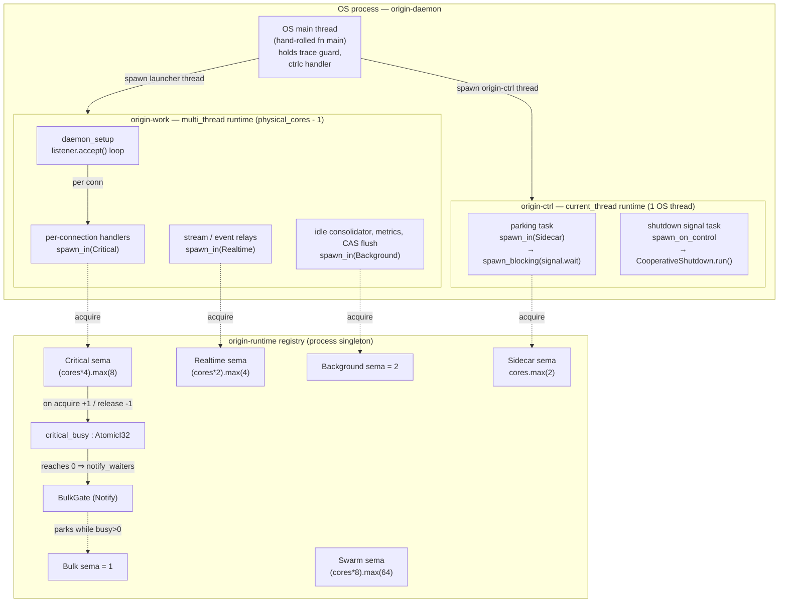

# Runtime & Concurrency Model

> **Last reviewed against workspace version 0.9.8** (`[workspace.package] version = "0.9.8"` in
> `Cargo.toml`). Authoritative source files are cited inline; where this document and an
> in-code "P-number" comment disagree, the *code* is authoritative.

## Abstract

`origin` is an agentic coding harness: a thin CLI client (`origin-cli`) talking over a
local socket (`origin-ipc`) to a supervised daemon (`origin-daemon`) that hosts LLM-driven
coding sessions. The daemon multiplexes wildly heterogeneous work onto a finite machine —
latency-critical renderer/IPC traffic, CPU- and network-heavy provider turns and tool
execution, opportunistic background maintenance (CAS GC, SQLite vacuum, memory
consolidation), and fan-out swarm sub-agents — without letting any one class starve the
others.

Three mechanisms, each in its own crate, carry that load:

| Crate | Mechanism | One-line summary |
|-------|-----------|------------------|
| `origin-runtime` | Task-class budgeting + `spawn_in` | Every async task acquires a per-class semaphore permit before it polls; `Bulk` is additionally parked while any `Critical` task is in flight. |
| `origin-stream`  | SPMC byte ring  | One append-only `rkyv`-archived byte buffer with an atomic write cursor; each subscriber holds a private read cursor. |
| `origin-alloc`   | Per-component arenas | Ten logical allocator arenas with a zero-cost no-op default and an opt-in jemalloc backend (per-arena `mallctl`). |

Above them, `origin-daemon` runs **two** Tokio runtimes — a `current_thread` control core
pinned to one named OS thread, and a `multi_thread` worker pool — and a **phased
cooperative shutdown** driver that drains in-flight work in a fixed order with per-phase
budget timers.

This document grounds each claim in the file that implements it. Names (task classes,
arena ids, shutdown phases, public API) are quoted verbatim from the source; nothing here is
invented.

---

## The two-runtime daemon

The daemon does not use `#[tokio::main]`. `crates/origin-daemon/src/main.rs` is a
hand-rolled `fn main() -> Result<()>` (see the comment at `main.rs:69`, *"Hand-rolled
entrypoint — replaces `#[tokio::main]` with the P12.8 two-runtime split"*). It spawns the
launcher on its own OS thread and the launcher (`crates/origin-daemon/src/runtime_launch.rs`)
brings up **two** distinct Tokio runtimes.

### Why two runtimes

The module doc of `runtime_launch.rs:1-16` states the rationale directly:

> *The control core runs the IPC accept loop, renderer ticks, and event dispatch. The
> worker pool runs everything else — provider HTTP/2, agent turns, tool execution, relays,
> background tasks. The split keeps the latency-critical control path isolated from
> CPU-heavy work.*

A single multi-threaded runtime would let a CPU-bound tool execution or a sidecar
small-model job land on the same worker thread that is mid-way through draining the IPC
accept loop or pushing a renderer frame, injecting scheduling jitter into the
keystroke-to-pixel path. Isolating the control path onto its own OS thread with its own
single-threaded reactor means the accept loop and event dispatch are never *co-scheduled*
with heavy work — they cannot be starved by it.

### What gets launched, and in what order

`runtime_launch::start(signal)` (`runtime_launch.rs:205`):

1. **Worker pool first.** A `multi_thread` runtime with `worker_threads = physical_cores - 1`
   (`cores.saturating_sub(1).max(1)`), `thread_name("origin-work")`, `enable_all()`
   (`runtime_launch.rs:206-216`). Built first *"so the control core can dispatch to it the
   moment it comes up"* (`runtime_launch.rs:194-198`). Its `Handle` is published into the
   shared `WorkerHandle` before the control thread even spawns.
2. **Control core on its own named OS thread.** `thread::Builder::new().name("origin-ctrl")`
   hosts a `current_thread` runtime (`Builder::new_current_thread().enable_all()`), publishes
   its `Handle` into `ControlHandle`, then `block_on`s a parking future
   (`runtime_launch.rs:218-247`).

The OS-thread name `origin-ctrl` is load-bearing: the integration test
`crates/origin-daemon/tests/runtime_split.rs` observes the thread name from inside a
`spawn_in(TaskClass::Critical, …)` future to prove a stable, named control thread exists
(see the comment at `runtime_split.rs:47` and the `spawn_in` at `:51`).

### The parking trick (don't block the single-threaded reactor)

The control runtime must block until shutdown is requested, but a naive blocking
`Condvar::wait` on the single-threaded reactor would wedge it — no other control future
could run. `runtime_launch.rs:228-244` solves this by pushing the blocking wait onto a
blocking thread via `spawn_blocking`, wrapped in `spawn_in(TaskClass::Sidecar, …)`:

```rust
let s = signal_ctrl.clone();
let outer = spawn_in(TaskClass::Sidecar, async move { sb(move || s.wait()).await }).await;
```

The `Condvar` wait (`ShutdownSignal::wait`, `runtime_launch.rs:80-86`) runs on a blocking
pool thread; the `current_thread` runtime stays free to service futures spawned via
`ControlHandle::spawn_on_control`. The comment at `runtime_launch.rs:229-233` spells this
out: *"the parking Condvar wait doesn't starve the single-thread runtime — the wait happens
on a blocking thread."*

### Handles and how `main` wires the halves together

`ShutdownSignal` (`runtime_launch.rs:29-97`) is the shared coordination object. It is
`Clone` (every field is `Arc`-shared) and carries:

| Field | Type | Purpose |
|-------|------|---------|
| `inner` | `Arc<(Mutex<bool>, Condvar)>` | The shutdown flag + parking condvar. `trigger()` flips it; `wait()` blocks on it. |
| `control` | `ControlHandle` | Lazily-populated `Handle` for the `origin-ctrl` runtime. `spawn_on_control` / `raw`. |
| `worker` | `WorkerHandle` | Lazily-populated `Handle` for the `origin-work` pool. `spawn_on_worker` (`spawn_blocking`) / `raw`. |

`main.rs` (`:96-176`) drives the dance:

1. Construct `ShutdownSignal::new()` and a shared `Arc<Mutex<DaemonState>>`.
2. Spawn the launcher on the `origin-launcher` OS thread (`main.rs:102-105`).
3. `wait_for_worker_handle` polls until `start()` populates the worker handle
   (`main.rs:109`, `:182-193` — 5 ms poll, 5 s deadline).
4. Hand the *entire* async daemon body — `daemon_setup` — to the worker pool via
   `worker_handle.spawn_blocking(move || h.block_on(daemon_setup(state)))`
   (`main.rs:116-131`). **The IPC accept loop runs on the worker runtime, not the control
   core** (comment at `main.rs:111-114`).
5. Install a cross-platform `ctrlc` handler that posts to an `mpsc` channel; a
   control-core task (`spawn_on_control`, `main.rs:159-170`) receives the signal, runs the
   `CooperativeShutdown` driver, then calls `signal.trigger()`.

So the *control core* owns signal handling and the shutdown phase driver; the *worker pool*
owns the accept loop, every per-connection handler, agent turns, tools, relays, and
background loops. The trace guard (`origin_trace::init`) is held on the OS main thread so
its `Drop` (span flush) runs *after* both runtimes tear down (`main.rs:88-94`).

> **Note on the accept loop's home.** Despite the control core being the "IPC accept loop"
> owner conceptually (`runtime_launch.rs:9`), the *current* wiring runs `daemon_setup` — which
> contains the `listener.accept()` loop at `main.rs:697-730` — on the worker pool via
> `block_on`. The control core's present job is signal handling + the shutdown driver. The
> module docs describe the intended end-state of the P12.8/P12.9 split; the code is the
> ground truth for 0.9.8.

---

## Task classes and `spawn_in`

`origin-runtime` is a tiny crate (`lib.rs:1-12`) with one job: make every spawned task
declare a *class*, and budget each class independently. Its public surface is exactly:

```rust
pub use bulk_gate::BulkGate;                                   // test-visible gate handle
pub use class::TaskClass;                                      // the class enum
pub use registry::{critical_tasks_in_flight, init_for_test};   // counters + test init
pub use spawn::spawn_in;                                       // the sanctioned spawn
```

### The actual `TaskClass` enum

Quoted verbatim from `crates/origin-runtime/src/class.rs:12-30` — `#[repr(u8)]`, lower
number = more important:

| Variant | Discriminant | Doc-string purpose (`class.rs`) |
|---------|:---:|---------------------------------|
| `Critical`   | 0 | *Agent loop turns; provider HTTP/2; tool exec; swarm worker bodies.* |
| `Realtime`   | 1 | *Renderer ticks; IPC event dispatch; per-stream relays.* |
| `Sidecar`    | 2 | *Sidecar small-model jobs; MCP server clients; hook dispatch.* |
| `Background` | 3 | *CAS GC; `SQLite` vacuum; memory idle consolidation.* |
| `Bulk`       | 4 | *Initial code-graph build; bulk MCP discovery. Paused when `Critical` has any in-flight work.* |
| `Swarm`      | 5 | *Swarm sub-agent worker bodies. An isolated permit pool … the real limiter is the memory-governed `AdmissionGate` in `origin-swarm`. Non-`Critical` and non-`Bulk`, so a parent awaiting a child never deadlocks.* |

`TaskClass::COUNT == 6` (`class.rs:33`); `TaskClass::label()` maps each to a stable string
(`"critical"`, `"realtime"`, `"sidecar"`, `"background"`, `"bulk"`, `"swarm"`).

> The `Critical` doc-string lists *"swarm worker bodies"* as an example, but the swarm
> coordinator deliberately spawns worker bodies in `TaskClass::Swarm`, **not** `Critical`
> (see `crates/origin-swarm/src/coordinator.rs:276-284` and the deadlock rationale below).
> `Swarm` is the authoritative class for worker bodies in 0.9.8.

### Per-class concurrency caps

The semaphore permit counts are computed in `permits_for` at
`crates/origin-runtime/src/registry.rs:20-30`. They scale with
`std::thread::available_parallelism()` (`cores`, defaulting to 4 if unavailable):

| Class | Permits (`permits_for`) | At `cores = 8` | Rationale |
|-------|-------------------------|:---:|-----------|
| `Critical`   | `(cores * 4).max(8)`   | 32 | The hot pool — agent turns + provider I/O + tools must never queue behind maintenance. |
| `Realtime`   | `(cores * 2).max(4)`   | 16 | Renderer + event relays; lighter than Critical but still latency-sensitive. |
| `Sidecar`    | `cores.max(2)`         | 8  | Small-model jobs / MCP / hooks; one-per-core is plenty. |
| `Background` | `2` (fixed)            | 2  | Maintenance is deliberately throttled to two concurrent passes. |
| `Bulk`       | `1` (fixed)            | 1  | Single-slot — and additionally parked by the `BulkGate` (below). |
| `Swarm`      | `swarm_lane_ceiling(cores)` = `(cores * 8).max(64)`, env-overridable via `ORIGIN_SWARM_LANE_MAX` | 64 | A **coarse runaway backstop**, NOT the real limiter — swarm concurrency is bound by the memory-governed `AdmissionGate` in `origin-swarm`. |

The registry is a process singleton (`registry.rs:11-67`): a `OnceLock<Registry>` holding an
array of six `Arc<Semaphore>` (one per class), an `Arc<Notify>` bulk gate, and an
`AtomicI32 critical_busy` counter. `init_for_test()` (`registry.rs:65`) is a no-op idempotent
initializer for tests.

### What `spawn_in` actually does

`spawn::spawn_in` (`crates/origin-runtime/src/spawn.rs:36-54`) is the single sanctioned
spawn primitive. Per its module doc it is *"the only sanctioned way to spawn an async task
in `origin-daemon`. Every call acquires a per-class permit before polling the inner
future."* The body:

```rust
pub fn spawn_in<F>(class: TaskClass, fut: F) -> JoinHandle<F::Output> {
    let reg = registry();
    let sema = std::sync::Arc::clone(&reg.sema[class as usize]);
    tokio::spawn(async move {
        let _permit = sema.acquire_owned().await.expect("semaphore closed");
        let _critical = matches!(class, TaskClass::Critical).then(CriticalGuard::new);
        if matches!(class, TaskClass::Bulk) {
            BulkGate::current().wait_until_idle().await;   // park while Critical is busy
        }
        fut.await
    })
}
```

Three things happen before the inner future runs:

1. **Acquire the class permit** (`acquire_owned().await`), held for the task's entire life.
2. **Critical busy accounting.** For `Critical`, a `CriticalGuard` RAII token
   (`spawn.rs:16-29`) bumps `critical_busy` on construction and decrements on `Drop`. The
   doc at `spawn.rs:12-15` is explicit: the `Drop` runs on *every* exit path — *"normal
   return, panic unwind, or task cancellation (future dropped mid-await) — so the counter
   can never leak and permanently park `Bulk` tasks."*
3. **Bulk parking.** A `Bulk` task additionally calls `BulkGate::current().wait_until_idle()`
   and blocks until no `Critical` task is in flight.

`spawn_in` **panics if called outside a Tokio runtime context** (`spawn.rs:33-34`).

### The bulk gate — the fairness invariant

`BulkGate` (`crates/origin-runtime/src/bulk_gate.rs`) is the watcher that parks `Bulk` work
while *any* `Critical` work runs. Its `wait_until_idle` (`bulk_gate.rs:18-32`) is carefully
race-free: it constructs the `Notified` future **before** checking `critical_in_flight()`,
so a `notify_waiters()` fired between the check and the `.await` is not lost (the comment at
`bulk_gate.rs:19-23` notes `Notify` buffers only a single permit and `notify_waiters` buffers
none). The producer side lives in `registry.rs`:

- `note_critical_acquire()` (`:69-71`) — `critical_busy.fetch_add(1)`.
- `note_critical_release()` (`:73-79`) — `fetch_sub(1)`; when the previous value was `<= 1`
  (i.e. the count just hit zero) it calls `bulk_gate.notify_waiters()` to release parked
  `Bulk` tasks.

`critical_tasks_in_flight()` (`registry.rs:90-92`) exposes the counter so tests get a
*deterministic readiness signal* instead of sleeping. The behaviour is proven by
`crates/origin-runtime/tests/bulk_gate.rs`:

- `bulk_parks_while_critical_runs` — a `Critical` task holds its permit via a oneshot; the
  test waits until `critical_tasks_in_flight() >= 1`, spawns a `Bulk` task, yields 50 times,
  and asserts the `Bulk` body has *not* run; then releases `Critical` and asserts `Bulk`
  completes.
- `many_bulk_under_repeated_critical` — 8 `Bulk` + 4 `Critical` tasks; asserts *"every Bulk
  eventually runs"* (counter reaches 8).

`crates/origin-runtime/tests/spawn.rs` proves the basic contract: `spawn_in` runs the future
to completion and returns its value; each class runs independently.

### Who uses `spawn_in` — the call sites

A workspace grep for `spawn_in` shows it threaded through every long-lived async task in the
client and daemon. Representative call sites and their chosen classes:

| File | Class | What it spawns |
|------|-------|----------------|
| `origin-cli/src/main.rs:710,764,1422,1486` | `Realtime` | CLI-side stream/event relays and renderer-feeding tasks. |
| `origin-daemon/src/main.rs:846` | `Critical` | `spawn_handler_task` — the per-IPC-connection handler future (the agent-turn host). |
| `origin-daemon/src/main.rs:518` | `Realtime` | The `PlanHandle → PlanBus` broadcast bridge. |
| `origin-daemon/src/main.rs:741` | `Background` | `spawn_idle_consolidator` — the 30 s memory consolidation loop. |
| `origin-daemon/src/main.rs:1793,1805,3108,4244,4262` | `Realtime` | Token-stream relay + event relay handles. |
| `origin-daemon/src/main.rs:4608` | `Background` | Metrics HTTP server task. |
| `origin-daemon/src/agent.rs:2492` | `Critical` | Agent-loop sub-task. |
| `origin-daemon/src/agent.rs:2370,9410,4214` | `Sidecar`/`Realtime` | Per-stream relays + sidecar dispatch. |
| `origin-daemon/src/remote_quic.rs:77,117,178` | `Realtime`/`Critical` | QUIC accept relay + per-connection bridge. |
| `origin-daemon/src/mem_garden.rs:80` | `Sidecar` | Auto-memory mining loop. |
| `origin-daemon/src/swarm_worker.rs:296` | `Realtime` | Worker progress → parent relay. |
| `origin-daemon/src/runtime_launch.rs:235` | `Sidecar` | The control-core parking task (see above). |
| `origin-cas/src/store.rs:499` | `Background` | `io_uring` flush outer task. |
| `origin-swarm/src/coordinator.rs:284` | `Swarm` | **Swarm sub-agent worker bodies.** |

### Why swarm workers are `Swarm`, not `Critical` or `Bulk`

`coordinator.rs:276-284` documents the deadlock-freedom argument precisely:

> *A parent agent holds a `Critical` permit while it awaits a child (`Task` →
> `await_completion`); a `Critical` child would deadlock once the fixed `Critical` pool is
> exhausted, and a `Bulk` child would be parked by the `BulkGate` while the parent
> (Critical) is in flight. `Swarm` has an independent permit pool gated only by the memory
> `AdmissionGate`, breaking the circular wait while letting concurrency scale with available
> RAM.*

The `Swarm` semaphore (64+ permits) is a *runaway backstop*; the real limiter is
`AdmissionGate::admit()` (`origin-swarm/src/admission.rs`), whose RAII `ticket` is moved into
the worker body and releases on every exit path (`coordinator.rs:284-288`).

### How the `spawn_in`-over-`tokio::spawn` rule is enforced

Two layers enforce that no daemon code calls raw `tokio::spawn`:

1. **`xtask lint-spawn`** (`xtask/src/lint_spawn.rs`). A workspace-walking lint that bans
   `tokio::spawn(`, `tokio::task::spawn(`, and `tokio::task::spawn_blocking(` outside an
   allowlist. Banned patterns are assembled at runtime from fragments (`banned_patterns`,
   `:20-27`) so the lint doesn't trip on its own source. Integration tests/benches
   (`/tests/`, `/benches/`), `target/`, `.git/`, `.claude/`, `build.rs`, and `fixtures/`
   subtrees are exempt (`scan`, `:65-110`). The per-file allowlist
   (`xtask/src/lint_spawn_allowlist.rs:7-23`) is deliberately tiny and justified:
   - `crates/origin-runtime/src/spawn.rs` — *the only sanctioned spawn site* (`spawn_in` itself).
   - `crates/origin-sidecar/src/runtime.rs` — pre-dates the migration (P14 follow-up).
   - `crates/origin-supervisor/src/launch_{unix,windows}.rs` — `Command::spawn`, a different
     `spawn`, listed to make intent explicit.
   - `crates/origin-provider-{anthropic,gemini,ollama,bedrock,github}/src` — a few one-off
     keepalive tasks, tracked for P14.
2. **A unit test** — `crates/origin-daemon/tests/spawn_audit.rs`. A compile-time `grep`:
   `no_raw_tokio_spawn_in_daemon_src` `include_str!`s nine daemon source files (`agent.rs`,
   `compactor.rs`, `main.rs`, `memory_wiring.rs`, `runtime_launch.rs`, `session.rs`,
   `session_store.rs`, `stream_relay.rs`, `tool_use_parser.rs`) and asserts no
   non-comment line contains `tokio::spawn(` / `tokio::task::spawn(`. This *"catches it in
   `cargo test` before xtask runs"* (`spawn_audit.rs:2-4`).

> **Lint naming.** The enforcement in 0.9.8 is an `xtask` subcommand plus a unit test, not a
> `clippy.toml` `disallowed-methods` entry — `clippy.toml` (3 lines) only configures
> `doc-valid-idents`. Workspace clippy lints (`[workspace.lints.clippy]` in `Cargo.toml`)
> set `pedantic`/`nursery` to `warn`, `unwrap_used = "deny"`, `panic = "warn"`. The spawn
> ban is the `lint-spawn` xtask.

---

## Backpressure & the byte ring (`origin-stream`)

`origin-stream` (`crates/origin-stream/src/lib.rs`) implements **Mechanism N2.1**: a
single-producer multi-consumer (SPMC) byte ring. Per its module doc (`lib.rs:1-9`):

> *one append-only `Bytes` buffer + an atomic write cursor; each subscriber holds its own
> read cursor. Wakeups via `tokio::sync::Notify`. After warmup the ring never reallocates
> (it's a fixed-capacity buffer). Records are rkyv-archived `TokenEvent`s, length-prefixed
> (`u32` BE).*

### Why a byte ring (and why `rkyv`)

The provider stream parser, the renderer, and the tool-use parser all read the *same bytes*
with no intermediate `String` (`event.rs:1-6`). A `TokenEvent` is an `rkyv`-`Archive` record
(`event.rs:30-35`) so a subscriber validates a record in roughly the time of a bounds-checked
cast — vastly cheaper than JSON-decoding each delta. (The README quantifies the archived-IR
win at *"~200 ns to validate vs. ~20 µs to JSON-decode"*.)

### Data layout

`Inner` (`lib.rs:35-41`):

| Field | Type | Role |
|-------|------|------|
| `buf` | `Mutex<Vec<u8>>` | The append-only byte buffer (pre-allocated to `capacity`). |
| `write_cursor` | `AtomicUsize` | Total bytes committed; the producer's published high-water mark. |
| `notify` | `Notify` | Wakes parked subscribers on `publish`/`close`. |
| `closed` | `AtomicBool` | Set by `close()`; subscribers drain remaining records then see end-of-stream. |
| `capacity` | `usize` | Fixed byte cap. *"Phase 2: no wrap-around. The ring is sized for one turn."* (`lib.rs:70`). |

Each record on the wire is `[u32 BE length][rkyv bytes]`.

### Public API surface

| Type / fn | Signature | Behaviour |
|-----------|-----------|-----------|
| `Ring::with_capacity` | `fn(usize) -> Ring` | Fixed-capacity ring; `buf` pre-reserved. |
| `Ring::publish` | `fn(&self, &TokenEvent) -> Result<(), RingError>` | `rkyv::to_bytes::<_,256>` the event, length-prefix it, append under the `buf` lock, `store` the new `write_cursor` (`Release`), then `notify_waiters()`. |
| `Ring::close` | `fn(&self)` | Set `closed` (`Release`) + `notify_waiters()`. |
| `Ring::subscribe` | `fn(&self) -> Subscriber` | New tail starting at the **current** write cursor (a late subscriber does not replay history). |
| `Subscriber::next` | `async fn(&mut self) -> Result<Option<TokenEvent>, RingError>` | Await the next event; `Ok(None)` once closed *and* drained. |
| `Subscriber::try_next` | `fn(&mut self) -> Result<Option<TokenEvent>, RingError>` | Non-blocking; `Ok(None)` when caught up. Lets a consumer drain a burst without a yield per record. |
| `parse` | `fn(&[u8]) -> Result<(), RingError>` | Panic-free fuzz-target decoder over the same length-prefixed format. |
| `RingError` | enum | `Closed`, `TooLarge(usize)`, `Encode(String)`, `Decode(String)`. |
| `TokenEvent` / `TokenKind` | (re-exported from `event`) | The archived record + its discriminant. |

`TokenKind` (`event.rs:13-28`): `TextDelta=0`, `ToolUseDelta=1`, `ThinkingDelta=2`,
`TurnEnd=3`, `Usage=4`, `ToolUseStart=5`. `TokenEvent::new(kind, payload: Vec<u8>)` plus
`kind()` / `payload()` accessors (`event.rs:37-51`).

### Per-subscriber cursors & what happens on a slow consumer

The key property of the design: **subscribers do not block the producer.** `publish` appends
and bumps the atomic write cursor regardless of how far behind any reader is — there is no
per-subscriber acknowledgement and no shared read position. Each `Subscriber` carries its own
`read_cursor` (`lib.rs:144-148`); `read_ready` (`lib.rs:198-218`) only decodes when
`read_cursor < write_cursor`, advancing the private cursor past the record it returns.

Consequences for a slow consumer:

- **A slow subscriber never stalls the producer or other subscribers.** It simply lags; its
  `read_cursor` trails the write cursor. A fast subscriber on the same ring is unaffected.
- **Backpressure is by capacity, not by the slowest reader.** Because the ring is fixed-size
  and append-only with *no wrap-around* (Phase 2), the producer's `publish` returns
  `RingError::TooLarge` once `buf.len() + 4 + bytes.len() > capacity` (`lib.rs:78-82`). The
  ring is sized for one turn; the producer — not the consumer — observes the limit.
- **A subscriber that never reads holds no lock and costs only its cursor.** Memory is bounded
  by the ring capacity, independent of subscriber count.

### Wake-race correctness

`Subscriber::next` (`lib.rs:156-182`) closes two classic races with `Acquire`/`Release`
ordering:

1. **Publish-before-close.** After observing `closed`, it re-loads `write_cursor` before
   declaring end-of-stream — the `Acquire` load of `closed` synchronizes-with the producer's
   `Release` stores, so a record written immediately before the close is still observed
   (`lib.rs:161-171`).
2. **Wake-race window.** It constructs the `notified` future, then re-checks `write_cursor` /
   `closed` *before* awaiting it, so a `notify_waiters()` fired between the ready-check and the
   await is not lost (`lib.rs:173-180`).

The `keystroke_to_pixel` bench (`crates/origin-cli/benches/keystroke_to_pixel.rs:40-66`,
`stream_under_load`) drives 1 000 8-byte `TextDelta`s through the widget per frame to prove the
render path keeps up with a burst — the consumer-side counterpart to the ring's
producer-never-blocks guarantee.

---

## Allocator strategy (`origin-alloc`)

`origin-alloc` (`crates/origin-alloc/src/lib.rs:1-3`) provides *"per-component allocator
arenas with a no-op default and an opt-in jemalloc backend."* The crate **never installs a
`#[global_allocator]`** — that is the binary's choice (`lib.rs:22-33`).

### Backend selection (compile-time)

`lib.rs:8-16` picks the backend by cargo feature **and** target OS:

```rust
#[cfg(not(all(feature = "jemalloc", unix)))]  use noop_backend as backend;   // default
#[cfg(all(feature = "jemalloc", unix))]        use jemalloc_backend as backend; // opt-in, Unix-only
```

So the jemalloc backend is active **only** when the `jemalloc` feature is on *and* the target
is Unix. On Windows — or with the feature off — the no-op backend is compiled in.

### The arena taxonomy (`ArenaId`)

`crates/origin-alloc/src/arena_id.rs:9-30` defines ten stable arenas (`#[repr(u8)]`,
`ArenaId::COUNT == 10`):

| `ArenaId` | Disc. | `label()` | Purpose (doc-string) |
|-----------|:---:|-----------|----------------------|
| `Agent`        | 0 | `agent`         | Agent-loop turn buffers, message-log staging, cache-planner scratch. |
| `Cas`          | 1 | `cas`           | CAS write buffers and decompression scratch. |
| `Sidecar`      | 2 | `sidecar`       | Sidecar small-model worker — summaries, structure extraction. |
| `SwarmCoord`   | 3 | `swarm_coord`   | Swarm coordinator state — plan ops, completion-report assembly. |
| `SwarmWorker`  | 4 | `swarm_worker`  | Per-worker swarm allocations — `destroy`'d on worker exit. |
| `Ipc`          | 5 | `ipc`           | IPC frame buffers and rkyv staging. |
| `MetricsHttp`  | 6 | `metrics_http`  | `/metrics` Prometheus encoder scratch. |
| `CodeGraph`    | 7 | `code_graph`    | Code knowledge graph node/edge build buffers. |
| `Mem`          | 8 | `mem`           | Conversation memory graph and HNSW scratch. |
| `Other`        | 9 | `other`         | Catch-all for short-lived allocations not classified above. |

`backend_index()` is the dense 0-based index into the backend's per-arena tables; `label()` is
the stable string for logs/metrics.

### Public API

| fn | Signature | No-op behaviour | jemalloc behaviour |
|----|-----------|-----------------|--------------------|
| `with_arena` | `fn<R>(ArenaId, impl FnOnce(&ArenaScope)->R) -> Result<R, AllocError>` | Records the bind in a thread-local; runs the closure; restores prev on drop. | Binds `thread.arena` via `mallctl`; closure's allocations land in that arena; restores prev on drop. |
| `stats_snapshot` | `fn() -> Result<[ArenaStat; 10], AllocError>` | All zeros. | Per-arena `resident_bytes` + `allocated_bytes` via `stats.arenas.<i>.*`. |
| `reset` | `fn(ArenaId) -> Result<(), AllocError>` | `Err(Unavailable)`. | `arena.<i>.reset` — drop physical pages, keep the arena. |
| `destroy` | `fn(ArenaId) -> Result<(), AllocError>` | `Err(Unavailable)`. | `arena.<i>.destroy` — fully invalidate; next bind allocates fresh. |

`AllocError` (`lib.rs:44-50`): `Bind(ArenaId, String)`, `Unavailable`.

`ArenaScope` (`scope.rs`) is a `#[must_use]` RAII guard holding the arena id and the previous
arena index; its `Drop` calls `backend::restore_thread_arena(prev)`. Scopes are **re-entrant**
— a nested `with_arena` restores the outer binding on drop (`scope.rs:1-3, 30-34`).

### The no-op default — why it's zero-cost

`noop_backend.rs` keeps the *exact same public signatures* as the jemalloc backend so calling
code is backend-agnostic. `bind_thread_arena` stashes the `backend_index()` in a thread-local
`Cell<Option<u32>>` purely for the routing test (`noop_backend.rs:9-25`); `snapshot()` returns
all-zero `ArenaStat`s; `reset_arena`/`destroy_arena` return `Err(Unavailable)`. No allocator
state changes at all — `with_arena` is just a closure call.

### The jemalloc backend — per-arena `mallctl`

`jemalloc_backend.rs` lazily creates one jemalloc arena per `ArenaId` via the
`arenas.create` `mallctl` (`ensure_arena`, `:27-50`), tracked in a
`OnceLock<Mutex<[Option<u32>; 10]>>`. `bind_thread_arena` (`:52-63`) reads the thread's *real*
current `thread.arena` first (so `prev` is always a concrete index — the comment at
`:53-57` notes the old `None` path leaked the binding for the thread's lifetime), then sets
`thread.arena` to the target arena. `reset_arena`/`destroy_arena` issue
`arena.<idx>.reset` / `arena.<idx>.destroy`; `snapshot()` bumps the `epoch` `mallctl` then reads
`stats.arenas.<i>.resident`, `small.allocated`, `large.allocated`. Every FFI call asserts the
`mallctl` return code is `0`. All of this works even though the crate is not the global
allocator: *"the `tikv-jemalloc-sys` dependency links in the jemalloc symbols regardless"*
(`jemalloc_backend.rs:4-10`).

To make jemalloc the global allocator a binary opts in explicitly (`lib.rs:22-33`):

```rust
#[global_allocator]
static GLOBAL: origin_alloc::JemallocAllocator = origin_alloc::JemallocAllocator;
```

### `background_threads` and when/why to opt in

The workspace pins jemalloc with the `background_threads` feature
(`Cargo.toml:45`):

```toml
tikv-jemallocator = { version = "0.6", default-features = false, features = ["background_threads"] }
```

`background_threads` lets jemalloc run **purge/decay on dedicated background threads** instead
of inline on the allocating thread. That matters for `origin` because the latency-sensitive
paths (renderer ticks, IPC dispatch) must not pay a synchronous page-purge tax mid-frame —
deferring decay to a background thread keeps RSS down without injecting jitter into the
keystroke-to-pixel path. You opt into jemalloc (and thus background purge + per-arena
`reset`/`destroy`/`stats`) when you want:

- **Steady-RSS control** — `reset(arena)` / `destroy(arena)` to return pages to the OS at known
  boundaries (e.g. `SwarmWorker` is *"`destroy`'d on worker exit"*, `arena_id.rs:18-19`).
- **Per-component memory attribution** — `stats_snapshot()` resident/allocated bytes per arena
  feed the RSS KPI and the supervisor's memory governance.

You stay on the no-op default (the common case, and the only option on Windows) when you want
zero allocator overhead and the system allocator's behaviour.

### The Windows PDB note (`Cargo.toml` profiles)

`Cargo.toml:78-86` constrains debuginfo specifically to dodge a Windows linker limit:

```toml
# Limit debuginfo to keep PDB under the Windows 4 GB limit (LNK1318).
# The origin-cli binary links the daemon, every provider, and every tool —
# full debuginfo blows the PDB past the linker's hard cap on Windows.
# line-tables-only keeps backtrace line numbers but drops type info.
[profile.dev]
debug = "line-tables-only"

[profile.test]
debug = "line-tables-only"
```

Because `origin-cli` statically links the daemon, every provider crate, and every tool, full
debuginfo overflows the 4 GB PDB cap and the MSVC linker fails with **LNK1318**.
`debug = "line-tables-only"` keeps backtrace line numbers (so panics are still useful) while
dropping type info to stay under the cap. This is also *why the jemalloc backend is Unix-only*
in practice: on Windows the default no-op backend sidesteps both the FFI surface and the
PDB-size pressure that a heavier allocator dependency would add.

---

## Cancellation, shutdown & draining

Phased cooperative shutdown lives in `crates/origin-daemon/src/shutdown.rs` (labelled
**N8.10**). It is a builder over per-phase callbacks: the caller (`main.rs`) captures the real
subsystem handles and installs one closure per phase; unset phases are no-ops, so the driver
behaves identically in tests and production (`shutdown.rs:1-11`).

### The shutdown phases

`ShutdownPhase` (`shutdown.rs:26-46`) is an ordered enum walked in a fixed sequence — the
N8.10 contract is *"stop accepting work first, cancel best-effort tasks, drain critical work,
then persist state, then close transports, then release shared resources"* (`shutdown.rs:21-24`):

| # | `ShutdownPhase` | What it does (production wiring in `build_shutdown_driver`, `main.rs:214-259`) |
|:-:|-----------------|-------------------------------------------------------------------------------|
| 1 | `StopAcceptingIpc` | Sets the `accept_disabled` `AtomicBool` (`Release`). The accept loop polls it between accepts and breaks (`main.rs:225-230`, `:697-701`). |
| 2 | `CancelBulkAndBackground` | Cancel best-effort tasks. (No production callback wired in 0.9.8 → `yield_now` no-op; `Bulk`/`Background` tasks are already non-load-bearing and parked.) |
| 3 | `DrainCritical` | Let in-flight `Critical` work finish. (No explicit callback; draining is implicit — see below.) |
| 4 | `PersistSidecarQueue` | `sidecar.shutdown().await` — drains in-flight `SidecarJob`s by dropping the queue sender and awaiting workers (`main.rs:231-236`). |
| 5 | `FlushCasWriteBuffer` | `cas.flush_all()` — persists Hot + Warm tiers (not just warm-pending, else offloaded tool-result payloads still in Hot are dropped, `main.rs:237-248`). |
| 6 | `CheckpointSqlite` | `store.checkpoint()` → `PRAGMA wal_checkpoint(TRUNCATE)` (`main.rs:249-257`). |
| 7 | `CloseIpc` | Close the transport. (No production callback in 0.9.8 → no-op.) |
| 8 | `ReleaseSharedMemoryAndArenas` | Release shared memory + allocator arenas (`origin-alloc` `destroy`/`reset`). (No production callback in 0.9.8 → no-op.) |

`ALL_PHASES` (`shutdown.rs:37-46`) is the canonical order; `run()` iterates it.

### Per-phase budget timers & force-advance

`CooperativeShutdown::run` (`shutdown.rs:138-152`) wraps each phase in
`tokio::time::timeout(self.budget, work)`. If a phase exceeds its budget the driver logs a
warning and returns `ShutdownReport::ForcedAdvance(phase)` — *and stops*, because remaining
phases *"would block on the same hung resource"* (`shutdown.rs:52-56`). A clean run returns
`ShutdownReport::Clean`. The production budget is **30 s** (`for_production`,
`shutdown.rs:124-130`).

`ShutdownReport` (`shutdown.rs:49-57`): `Clean` | `ForcedAdvance(ShutdownPhase)`.

The driver is *infallible* by construction (`shutdown.rs:132-137`): each `PhaseCallback`
returns `()`, so any failure must already be logged *inside* the callback (which the
production closures do — e.g. `warn!("shutdown: cas flush_all failed")`). Test constructors
`for_test` / `for_test_with_hang` exercise ordering (via an `mpsc` channel that surfaces each
phase) and the budget-timer contract (a `hang_at` phase sleeps an hour to force the timeout,
`shutdown.rs:155-159`).

### How in-flight tool calls / sessions drain

The control-core signal task (`main.rs:159-170`) receives the `ctrlc` signal, builds the
driver from the current `DaemonState` snapshot, runs it, then calls `signal.trigger()`.
Draining is layered:

1. **Stop intake** (`StopAcceptingIpc`) — no new connections are accepted, so no new sessions
   or tool calls begin.
2. **Per-connection handlers finish naturally.** Each IPC connection runs as a
   `spawn_in(TaskClass::Critical, …)` future (`main.rs:846`). In-flight agent turns and the
   tool calls they await hold a `Critical` permit; the `DrainCritical` phase gives them their
   budget window to complete.
3. **Subsystem persistence** (`PersistSidecarQueue` → `FlushCasWriteBuffer` →
   `CheckpointSqlite`) flushes durable state *after* the live work has had its chance to
   settle, in dependency order.
4. **Runtime teardown.** When `signal.trigger()` fires, the launcher returns; `start()` then
   `drop`s the worker `Runtime`, and *"Tokio's `Drop` impl waits for all worker tasks to
   settle"* (`runtime_launch.rs:199-201, 251-252`). Finally the OS-main-thread trace guard's
   `Drop` flushes buffered spans (`main.rs:88-94`).

### Cancellation safety

Cancellation is not a special path — it is the *normal* `Future`-drop path, and the runtime is
built to be correct under it:

- **`spawn_in`'s `CriticalGuard`** decrements `critical_busy` on `Drop`, so a cancelled
  (dropped-mid-await) `Critical` task still releases parked `Bulk` work (`spawn.rs:12-29`).
- **The swarm `AdmissionGate` ticket** releases its memory reserve on *"EVERY exit path
  (return, panic unwind, cancellation)"* (`coordinator.rs:284-288`).
- **`ArenaScope`** restores the previous thread-arena binding on `Drop` even if the closure
  unwinds (`scope.rs:30-34`).

> The doc comment at `main.rs:133-139` notes the production `CooperativeShutdown::for_production`
> is currently a 30 s-budget driver with the four callbacks above wired; full per-phase wiring
> for phases 2/7/8 is a P14 polish item. The *phase order and budget-timer semantics* are fully
> implemented and tested today.

---

## Performance KPIs as CI gates

`origin` treats four performance numbers as **first-class CI gates** rather than aspirations
(`README.md:18-22`): **cold start, keystroke-to-pixel latency, steady RSS, and cache hit
rate.**

### The four KPIs

| KPI | What it measures | Where it's exercised |
|-----|------------------|----------------------|
| **Cold start** | Time from process launch to ready-to-serve. | The two-runtime launch path (`runtime_launch.rs`); shell cold-start is explicitly factored out of tool-latency tests (`agent.rs:9414, 9446, 9507`). |
| **Keystroke-to-pixel latency** | Time from an input event to a rendered frame. | `crates/origin-cli/benches/keystroke_to_pixel.rs` — `type_then_render_one_frame` inserts a char and draws one frame; `stream_under_load` pushes 1 000 deltas/frame. The TUI trims scrollback in batches *"to bound the CI-gated keystroke latency"* (`origin-cli/src/tui/mod.rs:220`). |
| **Steady RSS** | Resident memory under sustained load. | `origin-alloc` per-arena `stats_snapshot` + `reset`/`destroy`; jemalloc `background_threads` purge. |
| **Cache hit rate** | CAS dedupe effectiveness across turns/sessions/workers. | `origin-cas` Hot/Warm/Cold tiers; `origin-metrics`. |

The investigating-performance-regressions skill (`crates/origin-skills/embedded/superpowers/
investigating-performance-regressions/SKILL.md:26`) triggers when *"a benchmark or CI perf
gate regressed (e.g., cold start, keystroke latency, RSS, cache hit rate)"* — the same four.

### The perf-gate workflow & the ≤ 80 ms read-only gate

The CHANGELOG, CONTRIBUTING, and README all reference a `perf-gate` GitHub Actions workflow:

- `README.md:35-36`: *"The `perf-gate` workflow asserts read-only tasks complete in ≤ 80 ms
  wall time, in CI."*
- `CONTRIBUTING.md:60-61`: *"Performance is a gate … asserts read-only tasks stay within
  budget (≤ 80 ms wall)."*
- `CHANGELOG.md:45`: *"Perf gate workflow asserts read-only task `wall_ms` worst ≤ 80 ms."*

**What the ≤ 80 ms gate means.** "Read-only tasks" are tool calls that observe but do not
mutate — file reads, greps, glob/listing, code-graph queries. The gate asserts the **worst**
observed `wall_ms` across the read-only task set stays at or under **80 ms**. The number is a
*tail* (worst), not a mean, so a single slow read-only task fails the build. It is a wall-time
budget — it includes scheduling, permit acquisition (`spawn_in`), and I/O, which is exactly
why the two-runtime split and the `Critical`/`Realtime` permit pools exist: a read-only task
must never queue behind CPU-heavy `Background`/`Bulk` work. The corollary is that read-only
tasks are cheap, idempotent, and safe to run speculatively — so an 80 ms tail is achievable and
worth gating on.

> **Workflow file presence.** The `.github/workflows/perf-gate.yml` file is referenced from
> the repo docs (and was a 1.0.0 GA gate, `CHANGELOG.md:45, 52`) but is **not present in the
> working tree** at review time for 0.9.8 (the `.github/` directory is absent here). The KPIs,
> the benches that feed them (`origin-cli/benches/keystroke_to_pixel.rs`), and the ≤ 80 ms
> contract are real and documented; the workflow YAML itself is part of the CI configuration
> that ships with the published repository.

---

## Concurrency pitfalls & rules

A do/don't table distilled from the code and its safety comments. Each rule cites the
mechanism that makes it load-bearing.

| Rule | Do | Don't | Why / cite |
|------|----|----|------------|
| **Spawning** | Use `origin_runtime::spawn_in(class, fut)` for every async task. | Call `tokio::spawn` / `tokio::task::spawn(_blocking)` directly in daemon `src`. | Permit budgeting + bulk gating depend on it; enforced by `xtask lint-spawn` + `spawn_audit.rs`. |
| **Control-plane thread** | Push blocking work onto the worker pool / `spawn_blocking`. | Block the `origin-ctrl` `current_thread` runtime (no `std::thread::sleep`, no sync `Mutex` held across `.await`, no inline `Condvar::wait`). | A blocked single-threaded reactor wedges signal handling + event dispatch (`runtime_launch.rs:229-233`). |
| **Class choice for children** | Spawn swarm worker bodies in `TaskClass::Swarm`. | Spawn a child that a `Critical` parent awaits as `Critical` (pool-exhaustion deadlock) or `Bulk` (parked by `BulkGate` while parent runs). | `coordinator.rs:276-284`. |
| **Critical accounting** | Let `spawn_in` own the `CriticalGuard`. | Hand-roll a critical counter or hold the permit past the task. | `Drop` must run on cancel/panic/return or `Bulk` parks forever (`spawn.rs:12-29`). |
| **Bounded channels** | Bound every mpsc (`mpsc::channel(N)` — e.g. `64` in `swarm_worker.rs:292`, `256` for the sidecar queue). | Use unbounded channels for hot/streaming paths. | Unbounded queues turn a slow consumer into unbounded RSS — the opposite of the ring's capacity-bounded backpressure. |
| **Stream backpressure** | Rely on the SPMC ring's per-subscriber cursors; a slow reader just lags. | Add a per-subscriber ack that lets one consumer stall the producer. | `origin-stream`: producer never blocks on readers (`lib.rs:71-105, 198-218`). |
| **Ring sizing** | Size the ring for one turn; handle `RingError::TooLarge`. | Assume wrap-around. | Phase-2 ring has no wrap-around (`lib.rs:70`). |
| **Memory ordering** | Construct the `Notified`/`notified` future *before* the readiness check. | Check-then-await (lost-wakeup). | `BulkGate::wait_until_idle` (`bulk_gate.rs:19-23`); `Subscriber::next` (`lib.rs:173-180`). |
| **Allocator scopes** | Use `with_arena`; let `ArenaScope::Drop` restore. | Leave a thread pinned to a custom arena. | Re-entrant restore on drop incl. unwind (`scope.rs:30-34`); the jemalloc `None`-prev bug it fixed (`jemalloc_backend.rs:53-57`). |
| **Global allocator** | Opt into jemalloc per-binary via `#[global_allocator]`. | Assume the library installs one. | `origin-alloc` deliberately does not (`lib.rs:22-33`). |
| **Shutdown callbacks** | Log failures *inside* the phase closure; keep each phase under budget. | Let a phase block indefinitely. | Driver force-advances on the 30 s budget and skips the rest (`shutdown.rs:138-152`). |
| **CAS flush on exit** | `flush_all()` (Hot + Warm). | `flush_warm_pending()` only. | Else Hot-resident tool-result payloads are dropped → `cas miss` after restart (`main.rs:238-247`). |
| **Provider snapshots** | Snapshot `Arc<dyn Provider>` per request. | Read the live `RwLock` across a turn. | A mid-flight `/account` switch must not yank the provider out (`main.rs:947-953`). |

---

## Diagrams

### Two runtimes + task-class semaphores



### `spawn_in` lifecycle (per task)

```
spawn_in(class, fut)
        │
        ▼
  tokio::spawn ─────────────────────────────────────────────┐
        │                                                    │
        ▼                                                    │
  sema[class].acquire_owned().await   ── held for task life ─┤
        │                                                    │
        ├── class == Critical? ── yes ──▶ CriticalGuard::new │  (busy +1)
        │                                                    │
        ├── class == Bulk? ── yes ──▶ BulkGate.wait_until_idle()
        │                              (park until critical_busy == 0)
        ▼                                                    │
      fut.await                                              │
        │                                                    │
        ▼                                                    │
   task ends (return / panic / cancel)                       │
        │                                                    │
        ├── CriticalGuard::drop ──▶ busy -1 ──▶ if 0: notify_waiters()
        └── permit dropped ───────────────────────────────────┘
```

### SPMC byte ring — one producer, private read cursors

```
            write_cursor (AtomicUsize, Release on publish)
                          │
   buf: [len|rkyv][len|rkyv][len|rkyv][len|rkyv]·····(cap)
         ▲             ▲          ▲
         │             │          └── Subscriber C.read_cursor (lagging — OK)
         │             └───────────── Subscriber B.read_cursor
         └─────────────────────────── Subscriber A.read_cursor (caught up)

   publish():  lock buf → append [u32 len][rkyv bytes]
               → write_cursor.store(Release) → notify_waiters()
               → if buf.len()+4+n > cap: Err(TooLarge)   (no wrap-around)

   Subscriber::next(): read_ready while read_cursor < write_cursor;
                       else build Notified, re-check, await.
   A slow subscriber never blocks the producer or its siblings.
```

---

### Cross-reference index

| Subsystem | Crate / file |
|-----------|--------------|
| Task classes + semaphores | `crates/origin-runtime/src/{class,registry,spawn,bulk_gate}.rs` |
| Two-runtime launch | `crates/origin-daemon/src/runtime_launch.rs`, `main.rs` |
| Phased shutdown | `crates/origin-daemon/src/shutdown.rs` (+ `build_shutdown_driver` in `main.rs`) |
| SPMC byte ring | `crates/origin-stream/src/{lib,event}.rs` |
| Allocator arenas | `crates/origin-alloc/src/{lib,arena_id,scope,noop_backend,jemalloc_backend}.rs` |
| Swarm admission / worker class | `crates/origin-swarm/src/{coordinator,admission}.rs` |
| Spawn lint | `xtask/src/{lint_spawn,lint_spawn_allowlist}.rs`, `crates/origin-daemon/tests/spawn_audit.rs` |
| Perf benches | `crates/origin-cli/benches/keystroke_to_pixel.rs` |
| Profiles / PDB note | `Cargo.toml` (`[profile.dev]`, `[profile.test]`, jemalloc dep) |

*Last reviewed against workspace version 0.9.8.*
