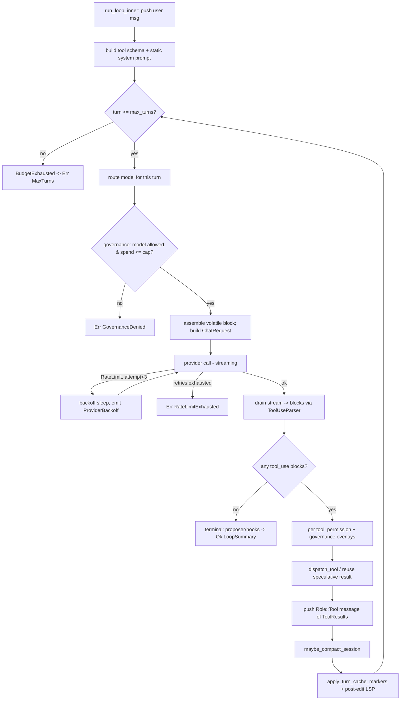
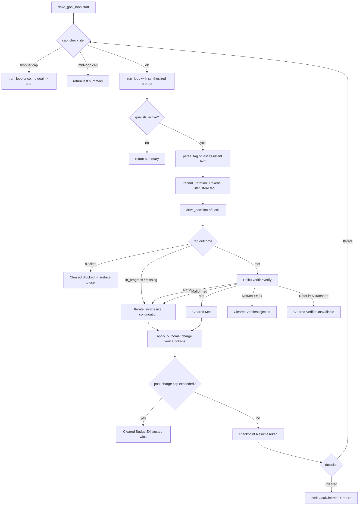

# Agent Loop & Session Orchestration

> **Last reviewed against workspace version 0.9.8**
>
> Subsystem scope: the per-prompt control loop that turns a user message into a
> sequence of provider calls and tool dispatches; the session container that
> owns the transcript; the goal driver that re-enters the loop until a
> persistent completion condition is met; and the supporting machinery for
> context-window compaction, mid-execution steering, per-prompt verification,
> and spend/iteration budgets.

This document is grounded in the live code of the `origin-daemon`,
`origin-goal`, and `origin-steering` crates. The canonical control loop is
`run_loop` / `run_loop_inner` in
[`crates/origin-daemon/src/agent.rs`](../../crates/origin-daemon/src/agent.rs)
(9,602 lines — the largest single file in the daemon). Unless otherwise noted,
line numbers refer to that file at workspace version 0.9.8.

## Abstract

A prompt enters the daemon over the IPC socket and is dispatched through one of
two entry points:

* **`run_loop`** — the bare agent loop. One user message in, one final
  assistant answer (or a `LoopError`) out, after `1..=max_turns` provider
  round-trips with tool dispatch in between.
* **`drive_goal_loop`** (in `main.rs`) — wraps `run_loop` when a `/goal` is
  active, re-entering it with *synthesized continuation prompts* until the
  goal driver decides to clear the goal.

The loop is deliberately a flat, single large function (`run_loop_inner`,
agent.rs:2849) annotated `#[allow(clippy::too_many_lines)]`. Each turn:

1. assembles a system prompt from a set of mostly-static blocks plus a small
   trailing *volatile* block (goal status, LSP diagnostics, swarm notices);
2. calls the provider (streaming by default, buffered when
   `LoopOptions.streaming_disabled`);
3. parses the streamed response into `Block`s — including incrementally-parsed
   `tool_use` blocks via the SAX-style `ToolUseParser`;
4. dispatches every `Block::ToolUse`, appends a `Role::Tool` message of
   `Block::ToolResult`s;
5. compacts the transcript if it crossed the per-model soft cap, plants
   prompt-cache breakpoints, and iterates.

Termination is by a tool-free assistant turn (success), a `LoopError`
(provider/permission/tool/governance failure), or exhaustion of `max_turns`.

Key entry-point functions and the budget/cap fields documented here:

| Symbol | Location | Role |
|---|---|---|
| `run_loop` | agent.rs:2810 | public contract; tags fatal exits with telemetry |
| `run_loop_inner` | agent.rs:2849 | the turn loop proper |
| `run_streaming_turn` | agent.rs:7038 | one provider call → `StreamingTurn` |
| `drain_subscriber_into_response` | agent.rs:7140 | stream → `Block`s + tool parsing |
| `dispatch_tool` | agent.rs:5124 | the buffered tool-execution switch |
| `maybe_compact_session` | agent.rs:217 | live in-loop compaction guard |
| `decide_permission` | agent.rs:325 | base permission resolution |
| `estimate_spend_usd` | agent.rs:660 | spend-cap costing |
| `drive_goal_loop` | main.rs:2651 | goal re-entry loop |
| `drive_decision` / `apply_outcome` | goal_driver.rs:98 / :264 | goal driver core |
| `GoalState::cap_check` | state.rs:97 | `max_iter` / `token_budget` gate |
| `GoalArgs { max_iter, token_budget }` | flags.rs:13 | parsed `/goal` caps |
| `DEFAULT_MAX_ITER = 20`, `DEFAULT_TOKEN_BUDGET = 200_000` | state.rs:11 | goal cap defaults |
| `MAX_CONSECUTIVE_VERIFIER_REJECTIONS = 3` | state.rs:48 | verifier give-up cap |
| `LoopOptions.max_turns` (default `u32::MAX`) | agent.rs:1968 / 2214 | per-loop turn budget |
| `policy.spend_cap_usd()` | agent.rs:3396 | governance USD spend cap |
| `MAX_PROVIDER_RETRIES = 3`, `MAX_RATE_LIMIT_SLEEP_SECS = 60` | agent.rs:1388 / :1394 | provider backoff |

---

## Session lifecycle

### What a session owns

A `Session`
([`crates/origin-daemon/src/session.rs`](../../crates/origin-daemon/src/session.rs))
is a thin, in-memory container — deliberately so, since persistence is a
separate concern wrapped around it (`session_store.rs`). Its fields:

| Field | Type | Purpose |
|---|---|---|
| `id` | `String` | session identity; a `MessageId` string for fresh sessions, or a caller-supplied id on restore |
| `provider_name` | `String` | provider that opened the session (empty after `new_with_id`) |
| `model` | `String` | the active model id; consulted by `compaction_soft_cap` to size the window |
| `messages` | `Vec<Message>` | the working transcript — the single source of truth fed into each `ChatRequest` |
| `next_proposal_id` | `u32` | monotonic counter handed to `origin_mem::Proposer::scan` |
| `roots` | `Vec<PathBuf>` | extra workspace roots (cline-style multi-root); empty ⇒ single-root, byte-identical prompt |

The session exposes exactly three operations:

* `Session::new(provider, model)` (session.rs:25) — fresh id, empty transcript,
  `next_proposal_id = 1`.
* `Session::new_with_id(id, model)` (session.rs:41) — used by admin/restore
  paths that materialize a *known* id (e.g. loading from `SessionStore`).
* `push(Message)` (session.rs:52) and `snapshot() -> Vec<Message>`
  (session.rs:57). `snapshot()` clones the transcript; every turn rebuilds its
  `ChatRequest.messages` from a fresh snapshot.

The session itself holds no locks, no goal, no budget. Those live in
`LoopOptions` (agent.rs:1967) and the per-connection goal slot
(`Arc<Mutex<Option<GoalState>>>`, agent.rs:2072).

### Create / bind

A new prompt request binds an existing or fresh `Session` and a per-request
`LoopOptions`. The loop's *first* action is to push the user message:

```text
run_loop_inner: session.push(Message::new(Role::User).with_block(Block::text(user_text)))   // agent.rs:2861
```

It then records activity against two subsystems (no-ops by default):

* **Ambient idle gate** — `crate::ambient::note_user_activity()` (agent.rs:2875)
  is bumped only for *genuine* user prompts. Self-dispatched prompts
  (ambient/scheduler/overnight/webhook) are recognized by their synthetic
  session-id prefix via `is_self_dispatch_session` (agent.rs:2557) and skip the
  bump, so a background loop cannot hold the idle gate open.
* **Supervisor lifecycle** — `crate::supervisor::note_activity(&session.id,
  class)` (agent.rs:2892), where `class` is `Interactive` for user prompts and
  `Detached` for self-dispatch. `Detached` sessions are shed first under memory
  pressure and get a longer idle grace.

### Persist

Persistence is SQLite-backed via `SessionStore`
([`crates/origin-daemon/src/session_store.rs`](../../crates/origin-daemon/src/session_store.rs)),
opened over an `origin_store::Store`. Messages are serialized with `rkyv`
(`persist_message`, session_store.rs:125) and stored inline in the `messages`
table keyed by `(session_id, turn_index)`. Notable methods:

| Method | Line | Behavior |
|---|---|---|
| `persist_session` | :84 | UPSERT (not REPLACE) so `created_at` and child rows survive; derives a `title` from the first user message and never clobbers an existing one |
| `persist_message` | :125 | `INSERT OR REPLACE` one message at `turn_index` |
| `persist_transcript` | :173 | persist all messages, then `truncate_after(len)` to delete a stranded tail (load-bearing — see below) |
| `update_summary` | :195 | set the eager per-turn `summary` column |
| `load_messages` | :215 | ordered load + `strip_orphan_tool_results` repair on the way out |
| `load_summaries` | :254 | `(turn_index, Option<summary>)` rows for compaction |
| `snapshot_original` | :359 | write-once pre-compaction body for rewind-across-compaction |
| `truncate_after` | :341 | rewind: keep `turn_index < keep_turns`, delete the rest |
| `rewind_restoring` | :391 | rewind + restore compacted-but-kept bodies from snapshots, in one transaction |

The **stranded-tail invariant** is critical to correctness. Because
`persist_message` is `INSERT OR REPLACE`, re-persisting a *shorter* transcript
under a reused session id would overwrite the prefix but leave the old run's
higher-indexed rows behind. A later `load_messages` would splice the new prefix
onto that stale tail; if the splice boundary fell between an assistant
`tool_use` and its `tool_result`, the Anthropic Messages API rejects the
request with `400 unexpected tool_use_id`. `persist_transcript` therefore always
calls `truncate_after(messages.len())` (session_store.rs:186), and
`load_messages` additionally runs `strip_orphan_tool_results`
(session_store.rs:244) as defense-in-depth so a corrupted transcript self-heals
on resume.

### Rehydrate / resume

Resume uses an `origin_resume_token::ResumeToken` persisted to
`<db_dir>/resume/<session_id>.json` (`save_resume_token` / `load_resume_token`,
session_store.rs:67 / :76). The goal-aware token is built by
`make_goal_checkpoint_token`
([`goal_checkpoint.rs`](../../crates/origin-daemon/src/goal_checkpoint.rs):55):

* `session_id`, `last_turn` (highest persisted turn index) — used by the resume
  handshake to cap the hydrated transcript.
* `cas_handle_root`, `pending_tool_calls`, `plan_seq` — **placeholders** today
  (`[0u8; 32]`, empty, `0`). A zero CAS root is read by the supervisor as "no
  CAS hydration; replay from sqlite", which is identical to a session with no
  token. The module-level TODO documents the future unified-writer design to
  avoid a concurrent-writer race on the shared token file.
* `goal` — a `GoalSnapshot` of the active `/goal` (`condition`, `iter`,
  `max_iter`, `tokens_spent`, `token_budget`, `started_at_unix`, `status`,
  `last_status_tag`) so a daemon restart rehydrates the goal at the correct
  counters. A pre-epoch `started_at` is clamped to `0` with a warning rather
  than panicking (goal_checkpoint.rs:86).

---

## The agent loop

The public entry is `run_loop` (agent.rs:2810); the body is `run_loop_inner`
(agent.rs:2849). `run_loop` is a thin wrapper that times the call and, on a
fatal `Err` that is **not** `MaxTurns`, emits the generic `Error` pain bucket
(the `MaxTurns` path emits its own `BudgetExhausted` bucket inside the inner
loop, so the wrapper never double-emits).

### One-time setup (before the turn loop)

`run_loop_inner` does its preamble exactly once:

1. **Push the user message** and record ambient/supervisor activity
   (agent.rs:2861–2892).
2. **Fire `PrePrompt`** lifecycle hook (no-op without `~/.origin/hooks.json`).
3. **Build the tool schema** from `registry_iter()` (agent.rs:2907). `hot` tools
   embed their full schema; non-hot tools are *deferred* — name + a one-line
   "call `ToolSearch` with `select:<name>` to fetch full schema" description and
   a minimal `{}` input schema. Worker inline-MCP tools are appended via
   `runtime_tool_schemas()`.
4. **Per-session memoization cache** `origin_tools::Cache::new()` (agent.rs:2936)
   — identical `(tool_name, input_bytes)` pairs in this run avoid re-execution.
5. **Prompt-recall** — if an `Injector` is wired, embed the prompt once and reuse
   the resulting `<context>` block across all turns (agent.rs:2942).
6. **Assemble the static system-prompt blocks** — skill catalog, active-skill
   bodies, workflows, recall, output style, workspace roots, edit-format,
   subagents, result-encoding (agent.rs:2954–3238). These are joined once and
   reused as `recalled_system` so Anthropic prompt-cache breakpoints stay warm.
7. Initialize cumulative counters: `total_input_tokens`, `total_output_tokens`,
   `total_cache_read_tokens`, `total_tool_calls`, plus the pain-bucket clocks
   `loop_start`, `tool_time_ms`, `first_tool_ms`, `first_token_ms`
   (agent.rs:3240–3313).

### The per-turn loop

```text
for turn in 1..=opts.max_turns {                                  // agent.rs:3323
    // (a) per-turn model routing
    let turn_model = router.choose_model_ref(turn) ... else session.model;
    // cross-provider pick rebuilds an owned provider into `rebuilt`
    // (b) governance gate: model allow/deny + spend cap
    if policy denies turn_model           -> Err(GovernanceDenied)
    if estimate_spend_usd > spend_cap     -> Err(GovernanceDenied)
    // (c) assemble the VOLATILE trailing block
    volatile_context = [goal_block, lsp_diag_block, swarm_notices_block]
    // (d) build ChatRequest { system, messages: session.snapshot(), model,
    //     tools, effort, thinking_tokens, attachments(turn==1 only) }
    //     volatile_context is appended to the LAST message, not the system
    // (e) fire BeforeModel hook; open gen_ai span
    // (f) call provider with retry/backoff loop (streaming or buffered)
    // (g) record latency/router health; accumulate token totals
    session.push(resp.assistant.clone());
    let tool_uses = resp.assistant.blocks.filter(ToolUse);
    if tool_uses.is_empty() {                                     // agent.rs:3827
        // terminal: optional editfmt prose-apply, proposer scan,
        // PostPrompt + Notification hooks, then RETURN Ok(LoopSummary)
        return Ok(LoopSummary { assistant_text, turns, input_tokens, output_tokens });
    }
    // (h) for each tool_use: permission + governance overlays, dispatch,
    //     push Block::ToolResult; speculative results are reused
    session.push(Message { role: Tool, blocks: tool_results });   // agent.rs:4703
    // (i) maybe_compact_session; apply_turn_cache_markers; post-edit LSP probe
}
// loop fell through max_turns:
record BudgetExhausted pain bucket;
return Err(LoopError::MaxTurns(opts.max_turns));                  // agent.rs:4755
```

### Termination conditions

| Outcome | Site | Condition |
|---|---|---|
| `Ok(LoopSummary)` | agent.rs:3944 | the assistant turn produced **no** `tool_use` blocks (tool-free final answer) |
| `Err(MaxTurns)` | agent.rs:4755 | loop ran `max_turns` turns and never settled on a tool-free answer |
| `Err(GovernanceDenied)` | agent.rs:3384 / :3404 | policy denied the turn's model, or cumulative spend exceeded the cap |
| `Err(RateLimitExhausted)` | agent.rs:3639 | every `MAX_PROVIDER_RETRIES` retry returned `RateLimit` |
| `Err(Provider/Denied/UnknownTool/ToolFailure/BadArgs)` | dispatch path | a tool call failed permission, was unknown, errored, or had malformed args |

`LoopSummary` (agent.rs:2396) carries `assistant_text`, `turns`,
`input_tokens`, `output_tokens` — the latter two so the goal driver can charge
the per-goal token budget without re-instrumenting the provider trait.

### Volatile context vs cached prefix

A key design point: the system prompt is split into a **stable cached prefix**
(`recalled_system`, built once) and a **per-turn volatile block**
(`volatile_context`, agent.rs:3436). The volatile block — goal status, freshly
arrived LSP diagnostics, sibling-swarm notices — rides as a *trailing message
block* appended to the last message, **not** concatenated into the system
prompt. The model still reads it as the most-recent context, but a changing
goal iteration counter no longer invalidates the cached system+tools prefix on
every request (agent.rs:3429–3473). The `<origin-goal>` block is deliberately
rendered last for the same reason (agent.rs:3102).

### Provider call: retry / backoff

The provider call (agent.rs:3531) sits in an inner retry loop. On
`ProviderError::RateLimit { retry_after_secs, message }` and
`attempt < MAX_PROVIDER_RETRIES` (= 3, agent.rs:1388):

* sleep `retry_after_secs.max(1 << (attempt+1))` clamped to
  `[1, MAX_RATE_LIMIT_SLEEP_SECS=60]` (agent.rs:3558) — an exponential floor of
  2, 4, 8 … seconds;
* mark the model exhausted in the live router and fold the failure into its
  health EMA (agent.rs:3576);
* emit `StreamEvent::ProviderBackoff` so a 60s sleep does not look like a hang.

After the budget is exhausted the loop returns `LoopError::RateLimitExhausted`
(agent.rs:3639) whose `Display` string embeds actionable next steps (mid-session
model swap).

### State diagram

```mermaid
stateDiagram-v2
    [*] --> PushUser: run_loop_inner
    PushUser --> Setup: hooks, tool schema, system prompt
    Setup --> TurnStart
    TurnStart --> RouteModel: turn <= max_turns
    TurnStart --> MaxTurns: turn > max_turns
    RouteModel --> GovernanceGate
    GovernanceGate --> Denied: model denied / spend > cap
    GovernanceGate --> CallProvider: allowed
    CallProvider --> Backoff: RateLimit & attempt<3
    Backoff --> CallProvider: sleep, retry
    CallProvider --> RateLimitExhausted: retries exhausted
    CallProvider --> ParseResponse: ok
    ParseResponse --> Terminal: no tool_use blocks
    ParseResponse --> DispatchTools: tool_use present
    DispatchTools --> AppendResults: push Role::Tool message
    AppendResults --> Compact: maybe_compact_session
    Compact --> CacheMarkers: apply_turn_cache_markers
    CacheMarkers --> TurnStart: iterate
    Terminal --> [*]: Ok(LoopSummary)
    MaxTurns --> [*]: Err(MaxTurns)
    Denied --> [*]: Err(GovernanceDenied)
    RateLimitExhausted --> [*]: Err(RateLimitExhausted)
    DispatchTools --> ToolError: permission/unknown/failure
    ToolError --> [*]: Err(...)
```

---

## Tool-call parsing (`tool_use_parser`)

Tool calls are extracted from the *streaming* response, not from a buffered
JSON blob. The streaming drain (`drain_subscriber_into_response`, agent.rs:7140)
maintains a per-`tool_use_id` `ToolUseParser`
([`crates/origin-daemon/src/tool_use_parser.rs`](../../crates/origin-daemon/src/tool_use_parser.rs))
and feeds it the incremental `tool_use.input` fragments as they arrive over the
stream ring.

### Why incremental

`ToolUseParser` is a SAX-style JSON parser that emits a `Field` event the moment
each *top-level* key/value pair completes — **before** the outer closing `}`
arrives (tool_use_parser.rs:1–13). That early `Field` event is the trigger for
*speculative* tool dispatch: as soon as a pure tool's argument object can be
parsed, the daemon spawns the tool without waiting for the model to finish
streaming. See `try_speculative_spawn` (agent.rs:7107), which only spawns
`SideEffects::Pure` tools (`Read`, `Glob`, `Grep`) and skips handle-dependent
ones.

### Events and state machine

```rust
pub enum ToolUseDelta {
    Field { tool_name: String, name: String, value: Vec<u8> },  // a k/v pair completed
    Closed { tool_name: String },                                // outer `}` arrived
}
```

The parser walks an explicit state machine
(`State`: `Idle`, `BeforeKey`, `InKey`, `AfterKey`, `BeforeValue`, `InString`,
`InStringEscape`, `InNumber`, `InBoolNull`, `InNested`, `AfterValue`, `Closed`).
`feed(chunk)` (tool_use_parser.rs:115) steps byte-by-byte; `feed` is infallible —
malformed JSON is silently skipped so a partial fragment never panics.

### Nested-call / nested-value handling

Only the **outer object** is walked as structured key/value pairs. Nested
values (objects/arrays) are captured verbatim as raw bytes between matching
`{}`/`[]` via the `InNested` state (tool_use_parser.rs:230). Crucially,
`InNested` tracks a `NestedState` sub-state (`Outside` / `InString { escape }`)
so that brace/bracket bytes appearing **inside a string literal** are treated as
payload and do not skew `nest_depth` (N10.10, tool_use_parser.rs:47–57). A `\`
inside a nested string sets the one-byte escape flag so the following `"` is
data, not a string terminator.

String values have their wrapping quotes stripped and a minimal escape pass
applied (tool_use_parser.rs:179) — sufficient for path-bearing arguments, which
never use `\u`-style escapes in this codebase. Numbers and `true`/`false`/`null`
literals each have their own resync-on-delimiter handling so a malformed literal
cannot swallow the rest of the object.

After the stream closes, the accumulated raw input bytes are reassembled into a
`Block::ToolUse { id, name, input_json, cache_marker }` (agent.rs:7304) which is
then dispatched by the buffered `dispatch_tool` path (agent.rs:5124) — the
speculative result, if one was spawned, is reused instead.

---

## Context window management & compaction

Two cooperating modules:
[`model_window.rs`](../../crates/origin-daemon/src/model_window.rs) (the shared
per-model window resolver) and
[`compactor.rs`](../../crates/origin-daemon/src/compactor.rs) (summary-backed
compaction).

### The soft cap

`model_context_window(model)` (model_window.rs:25) is the single resolver used
by the live compactor, the CLI `ctx %` meter, and the onboarding picker.
Resolution order:

1. An explicit trailing marker `[<digits><k|m>]` on the id wins —
   `claude-opus-4-8[1m]` ⇒ `1_000_000`.
2. Otherwise a lowercased-substring match: Opus 4.8 / Gemini ⇒ `1_000_000`;
   other Claude families ⇒ `200_000`; GPT-4/5/o1/o3 ⇒ `128_000`.
3. Otherwise the conservative `FALLBACK_WINDOW = 200_000` fallback.

`compaction_soft_cap(model)` (agent.rs:152) converts the token window into a
byte heuristic: `window × BYTES_PER_TOKEN(4) × COMPACT_WINDOW_NUM(3) /
COMPACT_WINDOW_DEN(5)` = **60 % of the window in bytes**. For a 200K-token
Claude session that is 480 KB. `ORIGIN_COMPACT_SOFT_CAP` overrides everything
(tuning/tests).

### When compaction triggers

`maybe_compact_session` (agent.rs:217) runs **once per turn**, after the
freshly-closed turn is appended and before the next `ChatRequest` is built
(called at agent.rs:4713). Its cheap pre-check is `estimate_transcript_bytes`
(compactor.rs:19) — an allocation-free heuristic summing block payloads plus a
fixed `PER_BLOCK_OVERHEAD` of 16 bytes. If the estimate is at or under the cap,
it returns immediately: no hook fires, no allocation, byte-identical for short
sessions.

### What is summarized vs dropped

Over the cap, `compact` (compactor.rs:68) selects the **oldest** turns that have
an eager summary, up to `COMPACT_OLDEST_N_TURNS` (= 4, compactor.rs:7). Each
selected turn is replaced by a single `Block::Text` reading
`[compacted turn N] <summary>` (or a bare `[compacted turn N]` marker when the
turn has no summary of its own). Summaries come from the wired `SessionStore`
(`load_summaries`, eager per-turn summaries) keyed by `turn_index == message
index`; with no store wired, every entry is `None` and the transcript is
returned structurally unchanged even past the cap, but the `PreCompress` hook
still fires so listeners observe the pressure event.

### How it preserves correctness

The Anthropic Messages API requires every `tool_result` to have a matching
`tool_use` in the immediately-preceding message. A tool turn spans **two**
messages (an `Assistant` with `tool_use` blocks, then a `Role::Tool` with the
matching `tool_result`s). Folding one half without the other orphans the pair.
`compact` therefore **closes the selection under tool pairing**
(compactor.rs:99–119): whenever it compacts one half it compacts the partner
too — even if the partner has no summary, and even if that pushes past
`COMPACT_OLDEST_N_TURNS` (the cap is a soft heuristic; correctness wins). Two
regression tests pin this:
`compaction_never_orphans_a_tool_result_with_sparse_summaries` and
`compaction_does_not_split_a_tool_pair_at_the_n_boundary` (compactor.rs:293,
:319).

Before collapsing, `maybe_compact_session` snapshots each compacted turn's
pre-compaction body via `SessionStore::snapshot_original` (agent.rs:248) so a
later `rewind_restoring` can reconstruct it — making compaction reversible
across a rewind. The `PreCompress` lifecycle hook fires inside
`compact_with_hooks` (compactor.rs:155). After compaction the loop re-plants
prompt-cache breakpoints on the post-compaction transcript via
`apply_turn_cache_markers` (agent.rs:4787), picking the latest ≤ `MAX_CACHE_MARKERS`
(= 4) turn boundaries (Anthropic's per-request ceiling).

---

## The goal driver (`origin-goal`)

The goal driver layers a *persistent completion condition* on top of the agent
loop. A `/goal <condition>` keeps re-entering `run_loop` with synthesized
continuation prompts until the condition is verified met, blocked, or a cap
trips. The novel mechanism: the main model **self-tags** every turn with a
`<goal-status>` outcome, and the expensive verifier runs **only** on `Met`
claims — keeping cost-per-goal proportional to `~80 × N` system-prompt tokens
plus one verifier call, instead of `~50k × N` for a per-turn full-transcript
eval (goal_driver.rs:1–10).

### Goal state & caps

`GoalState` ([`crates/origin-goal/src/state.rs`](../../crates/origin-goal/src/state.rs):25):

| Field | Purpose |
|---|---|
| `condition` | the completion condition text (≤ `MAX_CONDITION_LEN = 4_000`) |
| `status` | `Active` / `Verifying` / `Met` / `Cleared { by }` |
| `iter` / `max_iter` | iteration counter vs cap (default `DEFAULT_MAX_ITER = 20`) |
| `tokens_spent` / `token_budget` | cumulative tokens vs cap (default `DEFAULT_TOKEN_BUDGET = 200_000`) |
| `started_at` / `started_at_instant` | wall + monotonic clocks; only the monotonic one is used for elapsed math (Bug #25) |
| `last_status_tag` | the parsed `<goal-status>` from the previous turn |
| `consecutive_rejections` | counter vs `MAX_CONSECUTIVE_VERIFIER_REJECTIONS = 3` |

The caps are parsed from the `/goal` argument string by `parse_goal_args`
([`flags.rs`](../../crates/origin-goal/src/flags.rs):41): grammar
`(--key=value )* <condition...>`, where `--max-iter=<u32>` (nonzero) and
`--budget=<n>[k|m]` populate `GoalArgs { condition, max_iter, token_budget }`.
A duplicate or zero value is a `FlagParseError`.

`cap_check` (state.rs:97) is the top-of-iteration gate:

```rust
pub const fn cap_check(&self) -> Option<ClearReason> {
    if self.iter >= self.max_iter        { Some(ClearReason::MaxIter) }
    else if self.tokens_spent >= self.token_budget { Some(ClearReason::BudgetExhausted) }
    else { None }
}
```

`record_iteration(in, out, tag)` (state.rs:109) adds `in+out` tokens (saturating),
increments `iter`, and stores `tag`. `record_verifier_tokens` (state.rs:118)
charges the verifier's own spend against the **same** budget so the budget cap
counts both the main model and the verifier.

### The inline self-tag protocol

The `<origin-goal>` system block (agent.rs:3119) instructs the model to **end
every response with exactly one** `<goal-status>` tag:

```text
<goal-status state="met|in_progress|blocked"><reason>...</reason></goal-status>
```

`parse_tag` ([`tag.rs`](../../crates/origin-goal/src/tag.rs):17) extracts the
**rightmost well-formed** tag (the model's latest status wins; a trailing tag
with an unknown `state=` overrides earlier valid ones, yielding `Missing`). It
is tolerant by design — case-insensitive `state=`, whitespace in attributes,
missing `<reason>` defaults to empty, with strict token-boundary checks so
`state-extra` does not match `state`. Anything unparseable → `TagOutcome::Missing`
so a forgetful model never accidentally ends the loop.

### The driver decision

`drive_decision` ([`goal_driver.rs`](../../crates/origin-daemon/src/goal_driver.rs):98)
takes an owned `DriverInputs` snapshot (so the slot lock is **not** held across
the verifier's network round-trip — Bug #6) and returns a `DecisionOutcome`
that the caller applies under a fresh lock via `apply_outcome` (goal_driver.rs:264):

| `last_status_tag` | Verifier? | Decision |
|---|---|---|
| `InProgress { what_remains }` | no | `Iterate` with "Continue … What remains: …" |
| `Missing` | no | `Iterate` nudging the model to emit a tag |
| `Blocked { why }` | no | **`Cleared { Blocked }`** — surface to the human instead of spinning |
| `Met` → verifier `Met` | yes | `Cleared { Met }`, reset rejection counter |
| `Met` → verifier `NotMet { reason }` | yes | `Iterate` with the reason; or `Cleared { VerifierRejected }` after 3 consecutive |
| `Met` → `Malformed` | yes | treated as `NotMet { unparseable }` — **not** fail-open (Bug #3) |
| `Met` → `RateLimit`/`Transport` | yes | `Cleared { VerifierUnavailable }` — fail **open** (trust the model) |

The asymmetry between `Malformed` (retry) and `RateLimit`/`Transport`
(fail-open) is deliberate: a reachable-but-garbled verifier should not falsely
confirm a goal, but an unreachable verifier should not strand the model
forever.

`apply_outcome` implements **Bug #11**: after charging the verifier's tokens it
re-runs `cap_check`; if the verifier's own spend pushed the goal past budget,
the `BudgetExhausted` cap reason wins over a tentative `Met`.

### The re-entry loop

`drive_goal_loop` (main.rs:2651) is the orchestrator:

```text
loop {
    goal_cap_clear(...)            // top-of-iteration cap_check; Bug #7 first-iter handling
    summary = run_loop(session, next_text, provider, &AlwaysAllow, opts)   // main.rs:2714
    if goal slot is now None  -> return Ok(summary)
    decision = run_verifier_dispatch(...)   // parse_tag, record_iteration, drive_decision off-lock
    checkpoint(session)            // persist a goal-aware ResumeToken
    match decision {
        Iterate { synthesized_prompt, iter_event } => { emit iter_event; next_text = prompt; }
        Cleared { reason, iter, tokens_spent }     => { emit GoalCleared; return; }
    }
}
```

`run_verifier_dispatch` (main.rs:2599) holds the slot lock only to call
`record_iteration` and snapshot `DriverInputs`, then **drops it** before the
verifier round-trip, re-acquiring it for `apply_outcome`. It emits
`StreamEvent::GoalVerifying` before the Haiku call so the CLI status line flips
ahead of the latency.

### Checkpoints

Between iterations, `drive_goal_loop` persists a fresh goal-aware
`ResumeToken` (main.rs:2680) via `make_goal_checkpoint_token` so a crash
restarts mid-goal at the correct `iter` / `tokens_spent`. See *Session
lifecycle → Rehydrate / resume* for the token shape.

---

## Verification gate (`anthropic_verifier`)

The verifier is the *per-prompt* gate that confirms a `Met` claim before the
goal driver clears a goal. The trait lives dependency-free in `origin-goal`; the
concrete implementation lives in the daemon so the goal crate stays free of
`origin-provider`.

### Trait

`Verifier::verify(condition, last_turn) -> Result<(Verdict, in_tok, out_tok),
VerifierError>`
([`verifier.rs`](../../crates/origin-goal/src/verifier.rs):28). It returns the
verdict plus the token counts so the driver can charge the verifier's spend
against the goal budget. `Verdict` is `Met | NotMet { reason }`; `VerifierError`
is `Transport | RateLimit | Malformed`.

### Concrete implementation

`AnthropicHaikuVerifier`
([`anthropic_verifier.rs`](../../crates/origin-daemon/src/anthropic_verifier.rs):23)
is a thin wrapper over a `Provider` (a small/cheap Haiku-class model). It:

1. Builds a `ChatRequest` with the system prompt `VERIFIER_SYSTEM`
   (anthropic_verifier.rs:28) — "answer with exactly one of `VERDICT: met` /
   `VERDICT: not_met — <one-sentence reason>`" — and a single user message
   `"Goal: {condition}\nAssistant's claim of completion: {last_turn}"`.
2. Issues **one** `provider.chat(req)` call (not streaming), mapping
   `ProviderError::RateLimit` → `VerifierError::RateLimit` and everything else →
   `Transport`.
3. Guards an empty assistant reply with an informative `Malformed("empty
   reply")` (anthropic_verifier.rs:65) rather than parsing `""`.
4. Parses the text via `parse_verdict` (verifier.rs:53), which is tolerant of
   `:` / `—` / `-` separators and leading whitespace.

The driver truncates `last_turn` to the **tail** `VERIFIER_INPUT_MAX_CHARS =
4_000` chars (`truncate_for_verifier`, goal_driver.rs:331) on a UTF-8 boundary,
so the verifier sees the most-recent text without re-sending the whole
transcript — the cost discipline that makes the self-tag protocol cheap.

> Note: the daemon also runs an *unrelated* per-prompt `gen_ai` telemetry span
> and an optional memory `Proposer` scan at turn end; those are not part of the
> goal verification gate.

---

## Steering (`origin-steering`)

Mid-execution steering lets a user type a hint while the agent is running; the
hint is queued and merged into the **next** turn without stopping the loop. The
crate ([`crates/origin-steering/src/lib.rs`](../../crates/origin-steering/src/lib.rs))
is a pure queue + merge — no I/O, `#![forbid(unsafe_code)]`.

### Queue

`SteeringQueue` (lib.rs:32) is a FIFO `VecDeque<String>`. Hints accumulate
while a turn is in flight (`push`, lib.rs:44) and are merged into a single block
when the next turn is assembled. `drain_block` (lib.rs:64) joins every queued
hint in insertion order, one per line, and **clears** the queue, returning
`None` when empty (leaving the queue untouched).

### Merge into the next turn

Two merge helpers preserve the cached prefix so Anthropic prefix caching stays
warm:

* `merge_into_prompt(base_user_text, Some(block))` (lib.rs:82) appends the block
  **after** the base text, wrapped in `<steering>` / `</steering>` markers,
  separated by a blank line. With `None` it returns the base text unchanged.
* `wrap_block(block)` (lib.rs:95) returns just the wrapped block, so the daemon
  can append steering as a **separate trailing user-message block** — keeping
  the stable prefix (system + prior turns + base user text) byte-identical.

This mirrors the volatile-context discipline of the agent loop: steering rides
as a *trailing* suffix, never a prepended prefix, so it never invalidates the
prompt cache. The delimiters `STEER_OPEN` / `STEER_CLOSE` are public constants
(lib.rs:11/14) so the consumer and any inspector agree on the wire shape.

---

## Spend caps & budgets

The subsystem enforces budgets at three independent layers.

### 1. Per-loop turn budget (`max_turns`)

`LoopOptions.max_turns` (agent.rs:1968) bounds the turn loop
(`for turn in 1..=opts.max_turns`, agent.rs:3323). The default is
**`u32::MAX`** (agent.rs:2214): there is intentionally *no* fixed turn cap — the
loop runs until the model settles on a tool-free answer, and the real bounds are
the token/compaction budget, the spend cap, and the goal driver's `max_iter`.
Swarm sub-agents set an explicit small `max_turns` to bound their runs. On
exhaustion the loop emits the `BudgetExhausted` pain bucket and returns
`Err(MaxTurns)` (agent.rs:4755).

### 2. Governance USD spend cap

When an `[[policy_layers]]` `PolicyEngine` is wired and a layer sets
`max_spend_usd`, the loop refuses to **start** a turn whose cumulative spend
already exceeds the cap (agent.rs:3389–3410):

```rust
if let Some(cap) = policy.spend_cap_usd() {
    if let Some(spent) = estimate_spend_usd(&turn_model, total_input_tokens,
                                            total_output_tokens, total_cache_read_tokens) {
        if spent > cap { return Err(LoopError::GovernanceDenied(...)); }
    }
}
```

`estimate_spend_usd` (agent.rs:660) costs the running token totals via
`origin_cost::price_for(model)`. It splits the cached portion back out of the
input total and bills it at the cache-read rate, charging only the fresh
remainder at the full input rate — matching the real billing model. An
unknown-priced (local) model returns `None`, leaving the turn unconstrained
exactly as a missing cap would. **Turn 1 always proceeds** (cumulative spend is
still 0 ⇒ within any non-negative cap).

The same governance gate also enforces a model allow/deny-list
(`is_model_allowed`, agent.rs:3383) — both produce `LoopError::GovernanceDenied`
with a user-facing explanation. Both are deny-only and default-safe: with no
policy the entire block is skipped, byte-identical.

### 3. Per-goal token budget & iteration cap

Covered above under *The goal driver*: `GoalState::cap_check` (state.rs:97)
gates each iteration on `iter >= max_iter` (`ClearReason::MaxIter`) and
`tokens_spent >= token_budget` (`ClearReason::BudgetExhausted`). Both the main
model's `LoopSummary.input_tokens + output_tokens` and the verifier's spend are
charged against the same `token_budget`.

### Other enforced caps

| Cap | Field / const | Location | Effect |
|---|---|---|---|
| Provider retries | `MAX_PROVIDER_RETRIES = 3` | agent.rs:1388 | `RateLimitExhausted` after 3 backoffs |
| Rate-limit sleep ceiling | `MAX_RATE_LIMIT_SLEEP_SECS = 60` | agent.rs:1394 | clamps the exponential backoff |
| Browser actions per session | `LoopOptions.browser_rate_limit` | agent.rs:2126 / `browser_rate_limit_ok` :684 | ENFORCED cap on `Browser`/`WebFetch`/`WebSearch`; default `None` ⇒ unlimited |
| Cache markers per request | `MAX_CACHE_MARKERS = 4` | agent.rs:4760 | Anthropic's per-request ceiling |
| Consecutive verifier rejections | `MAX_CONSECUTIVE_VERIFIER_REJECTIONS = 3` | state.rs:48 | clears goal as `VerifierRejected` |

---

## Failure modes & resumption

### Interrupts

A user interrupt arriving mid-turn is handled by the connection task's
`poll_for_interrupt` (in `handle_request`), which is the **sole** connection
reader during a turn. The goal re-entry loop (`drive_goal_loop`) no longer peeks
the connection itself; dropping its future via the outer `select!` performs the
goal-clear cleanup in `interrupt_cleanup` (main.rs:2752 comment block). This
removes the historical race where two readers double-consumed the same frame.

### Provider failures

* **Rate limit** — retried up to `MAX_PROVIDER_RETRIES` with exponential
  backoff; surfaced as `StreamEvent::ProviderBackoff`; then
  `RateLimitExhausted`.
* **Other provider errors** — propagate as `LoopError::Provider` and exit the
  loop; the `run_loop` wrapper tags an `Error` pain bucket.
* **Cross-provider router rebuild failure** — missing creds / unknown id / no
  factory ⇒ `build_provider_for` returns `None` and the loop falls back to the
  active provider with the session model, no panic (agent.rs:3364).

### Tool failures

A failed permission check, unknown tool, tool error, or malformed args produce
`Denied` / `UnknownTool` / `ToolFailure` / `BadArgs` and exit the loop. Tool
results are appended as `Block::ToolResult` even on error so the transcript
stays well-formed.

### Checkpoints & resume across compaction

Resumability rests on three persistence mechanisms working together:

1. **Per-iteration goal checkpoint** — `make_goal_checkpoint_token` →
   `save_resume_token` after each goal iteration, so a daemon crash rehydrates
   the active goal at the correct counters.
2. **Transcript persistence** — `persist_transcript` always truncates the
   stranded tail, and `load_messages` strips orphan tool-results, so a
   reused/shortened session id never loads a malformed transcript that the
   provider would reject.
3. **Rewind across compaction** — before compaction collapses a turn,
   `snapshot_original` writes its pre-compaction body write-once. A later
   `rewind_restoring(session_id, keep_turns)` (session_store.rs:391) restores
   those bodies for kept turns (clearing their `summary`), drops the consumed
   snapshots, and deletes rewound-past turns — all in one transaction — so the
   retained transcript is byte-identical to its pre-compaction state rather than
   leaving `[compacted turn N]` placeholders behind. The regression test
   `rewind_restoring_recovers_precompaction_bodies` (session_store.rs:656) pins
   this.

The optional, default-off shadow-git checkpoint feature
(`ORIGIN_CHECKPOINTS=1` / `ORIGIN_CHECKPOINTS_PER_TOOL=1`, agent.rs:116/292)
brackets per-turn or per-tool snapshots with `PreCommit`/`PostCommit` hooks via
`origin_vcs::ShadowGit`; every failure is swallowed so a checkpoint never fails
the turn that produced it.

### Optional plan bus

`PlanBus` ([`plan_bus.rs`](../../crates/origin-daemon/src/plan_bus.rs)) is the
daemon-wide fan-out for `OpEnvelope`s that IPC clients subscribe to as
`StreamEvent::PlanOp` frames (`BROADCAST_CAP = 64`; lagging subscribers see
`RecvError::Lagged` and must re-snapshot). It is threaded through `main.rs` for
swarm-spawning call sites; nothing in the hot loop publishes to it today.

---

## Diagrams

### Agent-loop state machine



### Goal-driver iteration loop



---

*End of document. Grounded against agent.rs (9,602 LOC), session.rs,
session_store.rs, tool_use_parser.rs, compactor.rs, model_window.rs,
goal_driver.rs, goal_checkpoint.rs, anthropic_verifier.rs, plan_bus.rs, and the
`origin-goal` / `origin-steering` crates at workspace version 0.9.8.*
