# Memory, Code-Graph & Retrieval

> **Last reviewed against workspace version 0.9.8**

This document describes the **memory, code-graph & retrieval subsystem** of the
`origin` Rust workspace: the cluster of crates that give the agent a durable,
searchable recollection of past conversations, a structural map of the
codebase, and the retrieval machinery that injects both into a prompt.

The subsystem spans five crates plus the daemon glue that wires them into a
live session:

| Crate | Role | Storage |
|-------|------|---------|
| `origin-mem` | Conversation memory: ONNX MiniLM embeddings, int8 quantization, HNSW ANN, temporal-decay re-rank | SQLite rows + CAS body blobs |
| `origin-codegraph` | Native code knowledge graph via tree-sitter extraction + typed graph queries | SQLite rows + CAS signature/body/evidence blobs |
| `origin-knowledge` | Local document index: TF-IDF inverted index + cosine vector search | In-memory, JSON-persistable |
| `origin-repomap` | Token-budgeted repo map via personalized PageRank over a symbol graph | Pure, in-memory |
| `origin-daemon` | Memory wiring, auto-memory gardening, tool dispatch | — |

The design rule shared by all of them is **content-addressed storage (CAS) for
bodies, small SQL rows for metadata, and pure/deterministic compute on top** so
that every layer is independently testable and re-buildable.

---

## Conversation memory (origin-mem)

`origin-mem` (`crates/origin-mem/src/lib.rs`) is the conversation-memory engine.
Its lib doc summarises the pipeline succinctly: *"ONNX MiniLM embeddings + int8
quantization + HNSW + temporal-decay re-rank, with bodies in CAS and edges in
SQLite."* The module layout:

| Module | File | Responsibility |
|--------|------|----------------|
| `embedder` | `embedder.rs` | ONNX MiniLM wrapper → `[f32; 384]` |
| `quantizer` | `quantizer.rs` | int8 product quantizer (256 centroids) |
| `index` | `index.rs` | HNSW ANN + temporal-decay re-rank |
| `storage` | `storage.rs` | SQLite metadata + CAS body blobs |
| `injector` | `injector.rs` | embed → search → `<context>` block |
| `consolidator` | `consolidator.rs` | idle clustering / supersedion / contradiction |
| `proposer` | `proposer.rs` | turn-end regex extraction of memory candidates |

Two crate-level time constants anchor the recency math
(`lib.rs:13-19`):

```rust
pub const SECS_PER_DAY: u64 = 86_400;
pub const MS_PER_DAY: f32 = 86_400_000.0;
```

### Embeddings

The embedder (`embedder.rs`) loads a sentence-transformer ONNX graph and exposes
`embed(text) -> Vec<f32>` of length `EMBED_DIM`. The dimension is fixed:

```rust
/// Output dimension of MiniLM L6 v2.
pub const EMBED_DIM: usize = 384;
```

Key properties of the embed path (`Embedder::embed`, `embedder.rs:101-142`):

- **CPU-only ONNX Runtime** (`ort` rc.12). The `Session` lives behind a
  `std::sync::Mutex` because `Session::run` takes `&mut self` while `embed` must
  stay `&self`; inference therefore serialises per embedder, which is fine for a
  single CPU session.
- Input tensors are `[1, seq_len]` `i64` `input_ids` and `attention_mask`,
  built as borrowing `TensorRef`s with no `ndarray::Array2` intermediary.
- Empty token sequences are guarded so the runtime never sees an `[1, 0]`
  tensor.
- The output is validated for shape `[1, 384]` — anything else raises
  `EmbedderError::BadShape`.
- **L2 normalization is applied in place** (`l2_normalize_in_place`,
  `embedder.rs:164`). This is load-bearing: the index ranks with a *dot-product*
  metric (`DistDot`), and dot product equals cosine similarity *only* on unit
  vectors. Because `embed` is the single source feeding both the insert path
  (daemon `memory_wiring`) and the query path (`injector`/`consolidator`),
  normalizing once here keeps the entire index on the unit sphere.

`EmbedderError` (`embedder.rs:23-52`) covers `Io`, `Ort`, `Tokenizer`,
`BadShape`, `NotFound`, and `SessionPoisoned`.

### int8 quantization

Raw `f32` vectors are ~32× larger than needed for storage, so each is quantized
before it lands in SQLite (`quantizer.rs`). The quantizer is an int8 product
quantizer with 256 cluster centroids:

```rust
pub const NUM_CENTROIDS: usize = 256;
```

`EncodedVector` stores `(centroid_id: u8, deltas: Box<[i8; EMBED_DIM]>)`, where
each delta is the residual from the centroid scaled to `i8` by a global
per-quantizer `scale`. Training is k-means++ init + Lloyd refinement
(`MAX_ITERS = 25`, `CONVERGE_THRESHOLD = 1e-4`); centroids are normalised to the
unit sphere so cosine equals dot at query time. The serialised quantizer
(`to_bytes`/`from_bytes`, magic `0xC0FFEE42`, version `1`) is persisted in the
singleton `mem_quantizer` SQLite row so it survives restarts.

### HNSW index

`MemIndex` (`index.rs`) wraps `hnsw_rs::hnsw::Hnsw<f32, DistDot>`. `DistDot`
returns `1 − dot`, so for pre-normalised vectors a *lower distance is a higher
similarity* and `raw_sim = 1.0 − distance`.

Construction parameters (spec P6.3, `index.rs:22-29`):

| Constant | Value | Meaning |
|----------|-------|---------|
| `HNSW_MAX_NB_CONNECTION` | 16 | max neighbours per node |
| `HNSW_MAX_ELEMENTS` | 10_000 | capacity |
| `HNSW_MAX_LAYER` | 16 | layer cap |
| `HNSW_EF_CONSTRUCTION` | 200 | build-time beam width |
| `HNSW_EF_SEARCH` | 64 | default search beam (clamped up to `shortlist_k`) |
| `SMALL_INDEX_THRESHOLD` | 256 | below this, brute-force instead of the graph |

Public ids are `u64` and are passed directly as the `usize` data-id to
`hnsw_rs` (lossless on 64-bit; checked for overflow on hypothetical 32-bit
targets via `IndexError::Insert`).

**Small-index brute force.** For ≤ `SMALL_INDEX_THRESHOLD` inserted points the
index scores *every* point with the same `DistDot` metric
(`brute_force_shortlist`, `index.rs:221`). This is both trivially cheap and
*more correct*: `hnsw_rs` assigns layers with an OS-seeded RNG, so a sparse
graph can drop a genuine nearest neighbour non-deterministically. Both paths
feed the identical re-rank function, so ranking is consistent.

### Temporal-decay re-ranking

The HNSW shortlist is re-ranked by the spec N6.2 formula (documented in the
module header, `index.rs:7-9`, implemented in `rerank_one`, `index.rs:248-282`):

```text
score = raw_sim
      * exp(-age_days / decay_tau_days)   ← recency decay
      * cluster_priority                  ← topic/cluster weight
      * (1 + edge_boost)                  ← graph-edge reinforcement
```

So the final ranking *blends*:

1. **Semantic similarity** (`raw_sim = 1 − distance`) — how close the query is.
2. **Recency** — an exponential half-life over `age_days`; older memories decay
   with a tunable `decay_tau_days` (default 30 days).
3. **Cluster priority** — a per-memory weight bumped when the consolidator
   re-touches a memory (caps at 2.0).
4. **Edge boost** — additive reinforcement from outbound edge strength
   (`1 + edge_boost`), so a memory linked to other relevant memories ranks
   higher.

Non-finite scores are dropped. Results are sorted descending by `score`, ties
broken by ascending `id`.

#### `SearchOpts`

Search behaviour is controlled by `SearchOpts` (`index.rs:62-82`):

| Field | Type | Default | Meaning |
|-------|------|---------|---------|
| `shortlist_k` | `usize` | 3000 | neighbours fetched from HNSW before re-rank |
| `top_n` | `usize` | 5 | results returned after re-rank |
| `decay_tau_days` | `f32` | 30.0 | exponential half-life of the recency term |
| `drop_superseded` | `bool` | true | drop candidates whose `superseded_by` is `Some` |

#### `MetaRow`

Re-ranking metadata is supplied per-candidate by the caller's `lookup` closure
as a `MetaRow` (`index.rs:101-110`). **These are the four `MetaRow` fields:**

| Field | Type | Role in the score |
|-------|------|-------------------|
| `age_days` | `f32` | feeds `exp(-age_days / decay_tau_days)` |
| `cluster_priority` | `f32` | multiplicative cluster/topic weight |
| `edge_boost` | `f32` | additive edge reinforcement `(1 + edge_boost)` |
| `superseded_by` | `Option<u64>` | when `Some`, dropped if `drop_superseded` |

The decoupling is deliberate: `MemIndex` holds only vectors and ids; all
mutable metadata (age, priority, edges, supersedion) is resolved at query time
through the closure, which the daemon backs with the live `MemoryStore`.

A re-ranked result is a `Candidate` (`index.rs:45-58`) carrying `id`, `raw_sim`,
the three metadata terms, and the final `score`.

### Persistent storage

`MemoryStore` (`storage.rs`) combines a SQLite metadata table with CAS body
blobs. The public identity is a `ULID` (`MemoryId = Ulid`); the high 64
timestamp+random bits are projected to the HNSW `u64` slot via
`memory_id_to_u64` (`injector.rs:162`).

A stored `MemoryRecord` (`storage.rs:34-47`) carries:

- `id: MemoryId`
- `encoded: EncodedVector` (centroid id + 384 i8 deltas, inline in the row)
- `body_handle: [u8; 32]` (32-byte CAS blake3 hash)
- `body_preview: String` (≤ 64 UTF-8 bytes, codepoint-boundary truncated)
- `tags: Vec<String>` (resolved from a 128-bit bitset over the `mem_tags`
  dictionary)
- `created_at_ms` / `last_seen_at_ms: i64`
- `superseded_by: Option<MemoryId>`
- `cluster_priority: f32`

`save` (`storage.rs:135`) quantizes the vector, CAS-puts the body, increments
the CAS refcount (`RefTable::incr`), resolves tags into a 16-byte bitset BLOB,
and inserts the row — all in one atomic transaction. `forget` deletes the row
and decrements the CAS refcount in a single transaction so partial state is
impossible; once the refcount hits zero the GC sweeper
(`RefTable::dead_hashes`) reclaims the blob. `mark_superseded`, `add_edge`
(directed, idempotent `INSERT OR IGNORE`), and `bump_priority` (capped at 2.0)
round out the CRUD surface.

`EdgeKind` (`storage.rs:26-30`): `RelatedTo = 0`, `Supersedes = 1`,
`Contradicts = 2`.

### Recall in a turn (Injector)

`Injector::for_prompt` (`injector.rs:73`) is the read path:

1. **Embed** the user prompt → `[f32; 384]` query (zero-padded if the stub
   returns short).
2. Build a `u64 → MemoryRecord` map from `store.iter_all()` so the search
   closure can synchronously return a `MetaRow`.
3. **Search** the index with `SearchOpts { top_n: k, ..default() }`; the closure
   computes `age_days` from `created_at_ms`, threads `cluster_priority`, sets
   `edge_boost = 0.0`, and maps `superseded_by`.
4. **Filter** survivors by `MIN_SCORE = 0.2` (`injector.rs:17`); return `None`
   if nothing qualifies or the index is empty.
5. **Format** an XML-ish `<context source="origin-mem">` block, one `<memory
   id="…" age="1.2d" tags="…">preview</memory>` line per survivor
   (`format_memory_line`, `injector.rs:188`).

The returned `InjectedContext` also carries `touched_ids`, which the daemon uses
to bump `last_seen_at_ms` for surfaced memories.

---

## The embedding model

From `crates/origin-mem/models/MODEL_INFO.md`:

| Property | Value |
|----------|-------|
| **Name** | `sentence-transformers/all-MiniLM-L6-v2` (ONNX export) |
| **Source** | huggingface.co/sentence-transformers/all-MiniLM-L6-v2 (`onnx/model.onnx`) |
| **License** | Apache-2.0 |
| **Output dim** | 384 `f32` (quantized to int8 in `quantizer`) |
| **Model path** | `${ORIGIN_DATA:-$HOME/.origin}/models/minilm-l6-v2.onnx` |
| **Integrity** | Expected SHA-256 verified at first download; checksum mismatch fails loudly rather than silently swapping models |

On first `Embedder` construction the file is downloaded if missing and
SHA-256-verified. CI never touches the network: tests use a generated stub at
`crates/origin-mem/tests/fixtures/stub_minilm.onnx` with identical input/output
names, regenerated via `python crates/origin-mem/tests/fixtures/_gen_stub.py`.
The license of the model (Apache-2.0) matches the workspace SPDX headers.

The tokenizer is loaded from a sibling `<stem>.tokenizer.json`; when absent the
embedder falls back to a minimal whitespace word-level tokenizer
(`default_stub_tokenizer`) sufficient only for the test stub.

---

## Memory gardening & lifecycle (mem_garden)

Two distinct mechanisms bound and curate memory growth: the **idle
consolidator** (inside `origin-mem`) and the **auto-memory gardener** (in the
daemon, `mem_garden.rs`). They operate at different layers.

### Idle consolidation (origin-mem `Consolidator`)

`Consolidator::run_pass(max_pairs)` (`consolidator.rs:60`) is one *bounded*
clustering pass, safe to call repeatedly from a background task. It:

- Loads the quantizer, fetches all memories sorted by id, and builds
  `ULID ↔ u64` maps keyed by the **same `memory_id_to_u64` scheme** the index,
  injector, and search handle all share (a deliberately canonical id scheme —
  an earlier positional bug made every candidate lookup miss).
- For each memory, decodes its vector and searches the index
  (`SearchOpts { top_n: 3, shortlist_k: 30, drop_superseded: false,
  decay_tau_days: 30.0 }`).
- For candidates with `raw_sim > 0.92`:
  - **Supersede proposal**: if candidate `C` is *older* than memory `M`, propose
    `(C, M)` — the newer memory supersedes the older near-duplicate.
  - **Contradiction flag**: a lexical antonym heuristic over `body_preview` —
    positive markers (`prefer`, `like`) in one body and negative markers
    (`not`, `never`, `don't`, `hate`, `avoid`) in the other flag a candidate
    contradiction.
- If a memory touched ≥ 2 peers, its `cluster_priority` is bumped by `0.05`
  (capped at 2.0 by `bump_priority`) — this is the feedback loop that lifts
  recurring, central memories in the re-rank.

The pass returns a `ConsolidationReport { supersedes_proposed,
contradictions_flagged, priority_bumped }`. Supersedion proposals are *applied*
via `MemoryStore::mark_superseded`, after which `drop_superseded` search
silently elides the loser. This is what bounds the *effective* working set:
near-duplicates collapse into a single live memory plus a chain of superseded
tombstones.

### Auto-memory gardening (daemon `mem_garden.rs`)

The daemon's `mem_garden` is a **default-off** idle mining loop, gated by
`ORIGIN_MEM_GARDEN=1` (`enabled()`, `mem_garden.rs:64`). When off, daemon
behaviour is byte-identical. When on, `maybe_spawn` launches a `Sidecar`-class
background task that, every `TICK = 300s` and only while the ambient
`BudgetPolicy` has non-reserved headroom:

| Constant | Value | Role |
|----------|-------|------|
| `TICK` | 300 s | inter-pass cadence |
| `TOTAL_BUDGET_TOKENS` | 1_000_000 | per-process auto-memory budget |
| `USER_RESERVE_TOKENS` | 200_000 | reserve mining never dips below |
| `PASS_COST_TOKENS` | 10_000 | estimated cost charged per pass |
| `MAX_SESSIONS_PER_PASS` | 16 | sessions scanned per pass |
| `MAX_DRAFT_BODY_BYTES` | 2_000 | per-draft body cap |

Each pass scans recent session transcripts, runs the turn-end `Proposer` over
the user/assistant text, **redacts secrets** token-by-token via
`origin_telemetry::redact`, and writes one Markdown draft per candidate into a
**review inbox** at `~/.origin/memory-inbox/<key>.md`. The key is an FNV-1a
content hash of `(session_id, redacted_body)`, so the loop is **idempotent**: a
candidate already staged (or already accepted-and-removed) is skipped. Crucially
**nothing is ever written into the live memory store** — the inbox is a staging
area only, and the user accepts/rejects drafts out of band.

### The Proposer

`Proposer` (`proposer.rs`) is the regex extractor shared by both the live
turn-end path and `mem_garden`. It runs a `RegexSet` single-pass pre-filter per
side, then per-pattern capture extraction. The pattern table
(`PATTERNS`, `proposer.rs:34`):

| Pattern | Side | Tag | Hint |
|---------|------|-----|------|
| `remember[: ]+(.+)` | user | `user-statement` | `remember-directive` |
| `i (prefer\|like\|always\|never)…` | user | `feedback` | `preference-phrase` |
| `i'll (remember\|note) that (.+)` | assistant | `assistant-note` | `assistant-note` |
| `TODO: (.+)` | both | `todo` | `todo-marker` |

Bodies are deduped (so "remember: i prefer X" doesn't fire two near-identical
proposals), with the proposal-id counter rolled back on a duplicate to stay
packed.

---

## Code knowledge graph (origin-codegraph)

`origin-codegraph` (`crates/origin-codegraph/src/lib.rs`) is the native code
knowledge graph (Phase 7). It extracts declarations with tree-sitter, stores a
CAS-backed graph in SQLite, and answers typed structural queries with no LLM
round-trip.

### Supported languages

`Language` (`lang.rs:17-36`) enumerates the tree-sitter-backed grammars. **The
seventeen supported codegraph languages are**, with their persisted SQL
discriminants (`record.rs:97-120`):

| Discriminant | Variant | Extensions |
|-------------:|---------|------------|
| 0 | `Rust` | `rs` |
| 1 | `TypeScript` | `ts`, `tsx`, `mts`, `cts` |
| 2 | `Python` | `py`, `pyi` |
| 3 | `Go` | `go` |
| 4 | `Java` | `java` |
| 5 | `C` | `c`, `h` |
| 6 | `Cpp` | `cpp`, `cc`, `cxx`, `hpp`, `hh`, `hxx` |
| 7 | `CSharp` | `cs` |
| 8 | `Ruby` | `rb` |
| 9 | `Bash` | `sh`, `bash` |
| 10 | `Php` | `php` |
| 11 | `Swift` | `swift` |
| 12 | `Kotlin` | `kt`, `kts` |
| 13 | `Scala` | `scala`, `sc` |
| 14 | `Haskell` | `hs` |
| 15 | `Elixir` | `ex`, `exs` |
| 16 | `Lua` | `lua` |

The discriminant order is a **persisted SQL contract**: slots 0–4 were the
Phase 7 original five; 5–9 were reserved for a parallel C/C++/C#/Ruby/Bash
branch; 10–16 are the extended grammars added for codegraph⇄repomap parity. New
variants are *appended, never interleaved* — changing the order would require a
data migration. `Language::from_extension` / `from_path` (`lang.rs:57,88`) do
the dispatch; unrecognised extensions return `None` and callers fall back to the
`origin-repomap` heuristic scanner.

### Extraction

`extract.rs` walks a parsed tree into `CodeNode` records.

`NodeKind` (`extract.rs:13-21`): `Function`, `Method`, `Struct`, `Class`,
`Trait`, `Interface`, `Module`.

`EdgeKind` (`extract.rs:52-57`): `Calls`, `Mentions`, `Implements`, `Extends`.

- `extract_nodes` walks declarations recursively; `extract_nodes_with_cas`
  additionally CAS-writes the signature and body byte ranges and fills the
  handles.
- `classify` (`extract.rs:287`) maps a tree-sitter node to a `NodeKind`. Most
  languages go through the generic `node_kind_for` + `name_node_for` table, but
  three have bespoke classifiers: **Elixir** (`defmodule`/`def`/`defp` are
  `call` nodes, not declarations), **Go** (type name + struct-vs-interface live
  on the inner `type_spec`/`type_alias`), and the **C/C++** declarator chain
  (`function_definition` hides the name at the end of a `declarator` chain).
  Kotlin names are a positional `simple_identifier`/`type_identifier` fallback.
- `extract_edges` (`extract.rs:155`) emits *intra-file, name-based* reference
  edges: an identifier inside one definition's body that names another
  definition produces an edge — a name followed by `(` resolving to a
  function/method is `Calls`, anything else is `Mentions`. Resolution is
  file-local and does not chase cross-file references or shadowing, so edges are
  intended to be stored at `Confidence::Inferred`.

### The SQLite-backed graph

`CodeGraphIndex` (`index.rs`) holds an `origin_cas::Store` for
signature/body/evidence blobs and an `origin_store::Store` for the SQL rows
(migration V3). Insert is content-deduplicating: identical signature bytes from
two files collapse to one CAS handle, so `nodes_by_signature` can fan out from a
signature to every file that declares it.

**`EntityId`** is the stable 32-byte node identity:
`blake3(kind || 0 || name || 0 || file_path || 0 || range_start_le_bytes)`
(`derive_entity_id`, `index.rs:264`). The trailing zero separators prevent
prefix collisions, and the same source span in the same file always upserts the
same row (`INSERT … ON CONFLICT(entity_id) DO UPDATE`).

Row shapes:

- **`NodeRow`** (`index.rs:41-48`): `entity_id`, `kind`, `name`, `file_path`,
  `signature_handle`, `body_handle`. The full `code_nodes` row also carries
  `language` (discriminant), `range_start`/`range_end`, and `last_seen` (epoch
  ms).
- **`EdgeRow`** (`index.rs:52-58`): `from`, `to`, `kind`, `confidence`,
  `evidence_handle`.

**`Confidence`** (`record.rs:23-27`, rkyv-archived): `Extracted` (directly from
the AST), `Inferred` (heuristic, e.g. unresolved call by name), `Ambiguous`
(multiple candidate resolutions).

`insert_node` / `insert_edge` CAS-put their byte payloads then write the SQL
row; `edges_from` and `with_store` give the typed query DSL read access to the
edge table and the raw connection.

### Rebuild

`rebuild_paths` (`rebuild.rs:59`) is the incremental driver: for each changed
path it re-extracts nodes and upserts them, folding per-file read/parse failures
into `RebuildReport.errors` (so one bad file never stalls the pass) while
bubbling fatal CAS/SQLite errors as `RebuildError::Index`. `RebuildReport`
counts `paths_seen`, `nodes_added`, `nodes_updated`, and `errors`.

### Non-code sidecars

`sidecar.rs` defines the `Sidecar` trait for pluggable non-code extraction.
`NoopSidecar` returns nothing; `LopdfTextSidecar` emits one `ExtractedEntity`
per non-empty PDF page (`name = "<file>#page=N"`, `Confidence::Extracted`).
Non-PDF inputs succeed with an empty `Vec` so jobs can be fanned across many
sidecars.

---

## Graph query kinds

The typed query DSL (`query.rs`) is **no-NL, no-LLM** (P7.6 N6.10). Callers
compose a `Query` enum value and hand it to `dispatch(idx, q)`, which walks the
index with its SQL/edge primitives and returns a `QueryResult`.

`QueryResult` variants: `Nodes(Vec<NodeRow>)`, `Path(Vec<NodeRow>)`,
`Partitions(Vec<Vec<NodeRow>>)`, `Empty`.

| Kind | Args | Computes | Algorithm | Use when |
|------|------|----------|-----------|----------|
| `Neighbors` | `node`, `depth` | BFS-reachable set up to `depth` hops, excluding the start | BFS over `edges_from` | "what does this symbol touch within N hops" |
| `Path` | `from`, `to`, `max_hops` | shortest node chain `from → … → to` (inclusive) | BFS with parent backtrack | "how is A connected to B" |
| `Communities` | — | partition of the whole graph into node bags | **Label Propagation (LPA)**, O(E)/sweep, ≤ `LPA_MAX_SWEEPS = 32`, deterministic (sorted order, smallest-label tie-break) | "what are the natural modules/clusters" |
| `GodNodes` | `top_per_partition` | top-`k` nodes per community ranked by in-degree | `communities` + inbound-degree sort | "what are the central/hub symbols per cluster" |
| `RecentChanges` | `since_ms` | nodes with `last_seen ≥ since_ms`, newest first | SQL `ORDER BY last_seen DESC` | "what changed recently" |

Notes from `query.rs`:

- **`Communities`** runs synchronous LPA directly over the (undirected, deduped,
  sorted) edge set. The whole edge list is blake3-hashed into an
  `edge_snapshot_hash` (`EdgeSet::snapshot_hash`) — currently bound but unused,
  reserved so a future revision can cache the partition in a `code_communities`
  table and skip recompute when the graph is unchanged. LPA is chosen over an
  offline Louvain/Leiden build to keep the read path lean. Singletons are kept
  (a lone function is a legitimate partition); communities are emitted sorted by
  their smallest member id for determinism.
- **`GodNodes`** reuses `communities`, then sorts each community's members by
  inbound degree (computed from `SELECT to_id FROM code_edges`), descending,
  ties broken by entity id, truncated to `top_per_partition`.
- **`Path`** with `from == to` returns the single node (or `Empty` if it
  doesn't resolve).

---

## Graph tools surface

The agent reaches the code graph through five built-in tools in
`origin-tools/src/builtins/`. All are `Tier::AutoAllowed` and `SideEffects::Pure`
except `graph_rebuild`. **The defining distinction: `graph_explain` is the only
NL-output graph tool; everything else returns typed/structured output (a CAS
handle to a `QueryResult`).**

| Tool | File | Side effects | Output | Args |
|------|------|--------------|--------|------|
| `graph_query` | `graph_query.rs` | Pure | typed `QueryResult` (CAS handle) | `{ kind, args }` — `neighbors\|path\|communities\|god_nodes\|recent_changes` |
| `graph_path` | `graph_path.rs` | Pure | typed `QueryResult::Path` | `{ from, to, max_hops? }` (hex entity ids) |
| `graph_summarize` | `graph_summarize.rs` | Pure | typed `QueryResult::Nodes` (target + ≤ `MAX_NEIGHBORS = 32` neighbours) | `{ node }` hex id **or** `{ community_id }` |
| `graph_explain` | `graph_explain.rs` | Pure | **natural language** (one deterministic English sentence) | same as `graph_query` |
| `graph_rebuild` | `graph_rebuild.rs` | **Mutating**, `RequiresPermission` | `RebuildReport` (job handle) | `{ paths: string[] }` (empty = full repo) |

- **`graph_query`** is a thin wrapper over `dispatch` — the typed read surface.
- **`graph_path`** is sugar for `Query::Path`.
- **`graph_summarize`** returns a node neighbourhood: the target row first, then
  up to 32 direct out-edge targets, deduped and in stable id order. A malformed
  hex id or unknown node yields `Empty`. The tool description notes it can also
  summarize a community by id.
- **`graph_explain`** is *query-describing*, not result-describing: it has no
  index handle and renders the `Query` itself into a sentence (e.g.
  *"shortest path from 1a2b3c4d to deadbeef within 5 hops"*,
  *"top 8 god-nodes per community"*) using `hex8` short ids. It is the one
  NL-emitting graph tool; result-aware explanation is deferred until callers
  thread a `CodeGraphIndex` through the signature.
- **`graph_rebuild`** is the only mutating tool — it re-extracts and upserts
  nodes for a path set, requires permission, and is `Urgency::Medium`.

The tools are registered via the `origin_tool!` macro and discovered through the
tool-search surface (`origin-daemon/src/subsystems.rs`,
`origin-daemon/src/swarm_worker.rs`).

---

## Repo map (origin-repomap)

`origin-repomap` (`crates/origin-repomap/src/lib.rs`) is the *ranker* that turns
a symbol graph into the most context-worthy slice of a repository, packed to a
token budget — the "repo map" trick popularised by `aider`.

**Mechanism: personalized PageRank over a directed file graph.** A file `A`
points at file `B` when `A` references a symbol that `B` defines, so importance
flows toward files that *define* widely-used symbols (config, core types, hot
utilities). A `focus` set biases the random-restart (teleport) vector toward the
files the user is actively working on. `build_map` then greedily admits
top-ranked files until the token budget is exhausted.

Core types:

- **`FileSymbols`** (`lib.rs:55-64`): per-file row — `file`, `defines:
  Vec<String>`, `references: Vec<String>`, `tokens: u32` (approximate render
  cost).
- **`RankedEntry`**: `file`, `score: f64`, `symbols`.

Public entry points:

- `pagerank` / `personalized_pagerank` — raw scores.
- `build_map(files, focus, token_budget)` — rank + greedy budget admission. A
  file too big to fit is *skipped, not abandoned*: scanning continues so smaller
  lower-ranked files can still fill the remaining budget.
- `build_map_multi_root` / `merge_and_rerank_maps` — concatenate per-root corpora
  (first-wins dedup by path), then rank globally so cross-root dependencies
  count.
- `build_map_per_root` — rank each root independently under its even share of
  the budget, preserving within-root locality.

Defaults: `DEFAULT_DAMPING = 0.85`, `DEFAULT_ITERS = 24`. Power iteration
conserves probability by teleporting dangling-node mass; output is sorted by
descending score with file-name tie-breaks (fully deterministic).

### How it differs from the full code-graph

The crate is **pure** — no I/O, no async, no tree-sitter. It consumes a *prebuilt
symbol graph*. To stay grammar-free on the fast path it ships its **own
dependency-free heuristic scanner** (`scan_definitions`, `scan_path`,
`lib.rs:565,587`) with a *broader, separate* `Language` enum (`lib.rs:464-501`)
that adds `Zig` and treats JS/TS as one, recognising definition "leaders"
(`fn`, `def`, `class`, `func`, `fun`, …) by cheap line-oriented string work.

| | `origin-codegraph` | `origin-repomap` |
|--|--------------------|------------------|
| Parser | tree-sitter (compiled grammar per language) | line heuristics, no grammar |
| Languages | 17, fixed SQL discriminants | 19 incl. Zig (heuristic set, broader) |
| Output | persistent CAS+SQLite node/edge graph | ephemeral ranked file list |
| Granularity | per-symbol nodes + edges | per-file ranking |
| Precision | accurate, edge-typed | approximate, recall-favouring |
| Purpose | structural queries (paths, communities) | budgeted context selection |

Upstream `origin-codegraph` *can* feed `FileSymbols` for accurate ranking; the
heuristic scanner is the zero-dependency alternative for the repo-map fast path.

---

## Local knowledge index (origin-knowledge)

`origin-knowledge` (`crates/origin-knowledge/src/lib.rs`) is a single,
dependency-light document store that does *both* lexical and semantic retrieval,
closing the gap the baseline left (no searchable memory of prior notes/files).
`#![forbid(unsafe_code)]`, no I/O, no async — embeddings are produced elsewhere
and handed in, keeping the layer pure and trivially testable.

Two indexes over the same `Vec<Doc>`:

1. **Inverted index** (`HashMap<String, Vec<usize>>`) — token → doc indices,
   with multiplicity captured as repeated postings so term frequency falls out
   of a count. `search_text` ranks by **TF-IDF**: each query term contributes
   `tf × idf` where `idf = ln(1 + N/df)`, down-weighting common terms so a rare
   discriminative match ranks higher than a common one.
2. **Cosine vector search** (`search_vec`) over caller-supplied `Doc.embedding`.
   Docs with empty or dimension-mismatched embeddings are skipped; zero-magnitude
   vectors score 0.

A `Doc` is `{ id, text, embedding: Vec<f32> }` (re-adding an id replaces it). A
`Hit` is `{ id, score }`. Ties break deterministically by ascending id; an empty
query or `k == 0` yields nothing.

**JSON persistence**: the store is `serde`-serializable via a `KnowledgeData`
shape that persists **documents only** — `to_json`/`from_json` rebuild the
inverted index on load (`#[serde(from/into = "KnowledgeData")]`). The daemon can
therefore checkpoint a knowledge store to a JSON file and reload it next session.

**Use cases**: indexing project notes, fetched documents, or PDF-extracted
sidecar text for lexical *and* semantic recall, independent of the conversation
memory's HNSW/quantizer machinery — a lighter store when full ANN+decay ranking
is overkill.

---

## Retrieval in the turn

The three retrieval sources feed prompt assembly distinctly. (For the full
prompt-band/Sticky-band assembly and session lifecycle, see
[../subsystems/agent-and-sessions.md](../subsystems/agent-and-sessions.md).)

The daemon's `MemoryWiring` (`origin-daemon/src/memory_wiring.rs`) bundles the
`MemoryStore`, optional `Embedder`, the in-RAM `MemIndex`, `Injector`,
`Consolidator`, and `Proposer` behind cheap `Arc`s. A
`MemoryDispatchHandle` adapts the store/index/embedder triple into the
object-safe `origin_tools::dispatch::MemoryHandle` so in-process tool dispatch
can route `mem_search`/`mem_save`/`mem_forget` without `origin-tools` depending
on `origin-mem`.

**Graceful degradation.** When the ONNX embedder is unavailable
(`ORIGIN_MEM_MODEL_DIR` unset or load fails), the daemon still wires the store
plus a naïve substring search over `body_preview`; the `Injector` and
`Consolidator` are omitted (both need the embedder). `mem_save`/`mem_forget`
remain usable from day one without ONNX installed.

**Index rehydration.** A restarted daemon starts with an empty `MemIndex`.
`rehydrate_index` (`memory_wiring.rs:97`) walks every stored row, decodes its
quantized vector, and re-inserts it under the same `memory_id_to_u64` key the
search path uses — skipping the `[1,0,0,…]` placeholder vector that rows saved
before the embedder was installed carry, so recall is never polluted.

How each source reaches the prompt:

1. **Conversation memory recall** — `Injector::for_prompt` embeds the user
   prompt, searches the HNSW index, re-ranks with temporal decay, and emits a
   `<context source="origin-mem">` block prepended to the system prompt's Sticky
   band. `touched_ids` drive `last_seen_at_ms` bumps.
2. **Code-graph context** — the agent calls `graph_query` / `graph_path` /
   `graph_summarize` on demand; results are CAS-handled `QueryResult`s the agent
   inlines. `graph_explain` produces a one-line NL gloss of a query.
3. **Repo map** — `build_map` (optionally `focus`ed on the active files) packs
   the most central files' signatures into a fixed token budget for an
   orientation block.

The proposer runs at turn end to mine new memory candidates; with
`ORIGIN_MEM_GARDEN=1` the background gardener stages redacted drafts to the
review inbox instead of writing them live.

---

## Diagrams

### Memory recall & re-rank pipeline

```mermaid
flowchart TD
    P["user prompt"] --> E["Embedder.embed<br/>ONNX MiniLM L6 v2 → [f32;384]<br/>L2-normalised"]
    E --> Q["query vector"]
    Q --> H{"index size<br/>≤ 256?"}
    H -- "yes" --> BF["brute_force_shortlist<br/>(exact, deterministic)"]
    H -- "no" --> HN["HNSW search<br/>DistDot, ef=max(64, shortlist_k)"]
    BF --> SL["shortlist (id, distance)"]
    HN --> SL
    SL --> RR["rerank_one per candidate"]
    LK["lookup(u64) → MetaRow<br/>(age_days, cluster_priority,<br/>edge_boost, superseded_by)"] --> RR
    RR --> F["score = raw_sim<br/>× exp(-age/τ)<br/>× cluster_priority<br/>× (1 + edge_boost)"]
    F --> DS{"drop_superseded<br/>& superseded_by?"}
    DS -- "drop" --> X["discard"]
    DS -- "keep" --> SO["sort desc by score,<br/>tie-break id asc<br/>truncate top_n"]
    SO --> MIN{"score ≥ MIN_SCORE<br/>(0.2)?"}
    MIN -- "no" --> NONE["return None"]
    MIN -- "yes" --> CTX["&lt;context source=\"origin-mem\"&gt;<br/>&lt;memory …&gt;preview&lt;/memory&gt;"]
    CTX --> STICKY["system-prompt Sticky band"]

    subgraph store["MemoryStore (SQLite + CAS)"]
        REC["MemoryRecord<br/>encoded vector · body_handle · tags<br/>created_at · last_seen · superseded_by · cluster_priority"]
    end
    REC -. "backs lookup closure" .-> LK
```

### Code-graph build → query

```mermaid
flowchart LR
    SRC["source files"] --> DET["Language::from_path<br/>(17 grammars)"]
    DET --> TS["tree-sitter parse"]
    TS --> EX["extract_nodes_with_cas<br/>classify → NodeKind"]
    TS --> EE["extract_edges<br/>intra-file name resolution<br/>(Confidence::Inferred)"]
    EX --> CAS["CAS: signature + body bytes"]
    EX --> IN["CodeGraphIndex.insert_node<br/>EntityId = blake3(kind|name|path|range_start)"]
    EE --> IE["insert_edge<br/>evidence → CAS"]
    CAS --> IN
    IN --> CN[("code_nodes<br/>SQLite")]
    IE --> CE[("code_edges<br/>SQLite")]

    subgraph queries["query.rs · dispatch(Query)"]
        NB["Neighbors<br/>BFS depth"]
        PA["Path<br/>BFS + backtrack"]
        CO["Communities<br/>Label Propagation"]
        GN["GodNodes<br/>communities + in-degree"]
        RC["RecentChanges<br/>last_seen ≥ since_ms"]
    end
    CN --> queries
    CE --> queries

    queries --> QR["QueryResult<br/>Nodes / Path / Partitions / Empty"]
    QR --> TQ["graph_query · graph_path · graph_summarize<br/>(typed → CAS handle)"]
    QR --> NL["graph_explain<br/>(NL sentence — query-describing)"]
    REBUILD["graph_rebuild<br/>(mutating, RequiresPermission)"] --> IN
```



---

## Appendix — key constants & identifiers

| Symbol | Value / type | File |
|--------|--------------|------|
| `EMBED_DIM` | `384` | `origin-mem/src/embedder.rs:15` |
| `NUM_CENTROIDS` | `256` | `origin-mem/src/quantizer.rs:20` |
| `SECS_PER_DAY` | `86_400` | `origin-mem/src/lib.rs:15` |
| `MS_PER_DAY` | `86_400_000.0` | `origin-mem/src/lib.rs:19` |
| `HNSW_MAX_ELEMENTS` | `10_000` | `origin-mem/src/index.rs:23` |
| `SMALL_INDEX_THRESHOLD` | `256` | `origin-mem/src/index.rs:39` |
| `SearchOpts` default | `shortlist_k=3000, top_n=5, tau=30.0, drop_superseded=true` | `origin-mem/src/index.rs:73` |
| `MetaRow` fields | `age_days, cluster_priority, edge_boost, superseded_by` | `origin-mem/src/index.rs:101` |
| `MIN_SCORE` | `0.2` | `origin-mem/src/injector.rs:17` |
| consolidator similarity threshold | `> 0.92` | `origin-mem/src/consolidator.rs:156` |
| `LPA_MAX_SWEEPS` | `32` | `origin-codegraph/src/query.rs:260` |
| codegraph languages | 17 (`Rust`…`Lua`, discriminants 0–16) | `origin-codegraph/src/lang.rs:17` |
| `DEFAULT_DAMPING` / `DEFAULT_ITERS` | `0.85` / `24` | `origin-repomap/src/lib.rs:127` |
| `TICK` / `USER_RESERVE_TOKENS` | `300s` / `200_000` | `origin-daemon/src/mem_garden.rs:38,46` |
