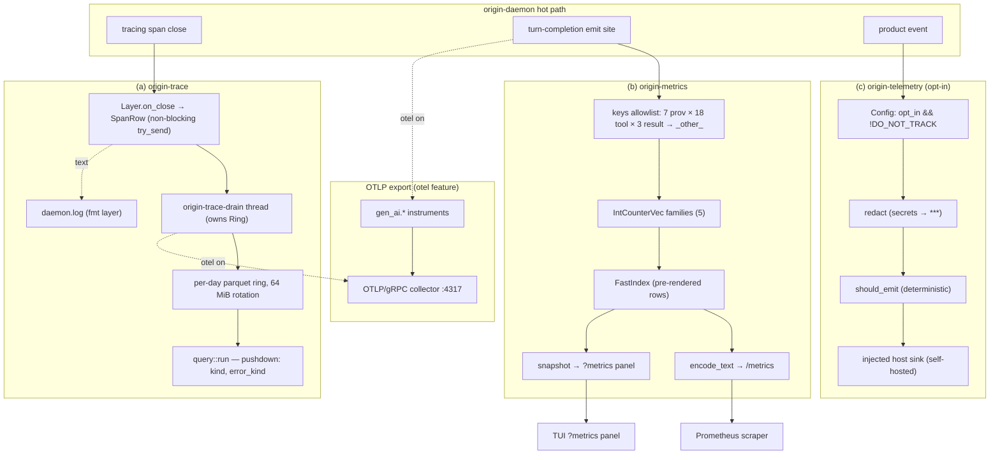

# Observability, Telemetry & Diagnostics

> Last reviewed against workspace version 0.9.8

This subsystem is the part of `origin` that lets an operator (and, separately, a
product team) answer three different questions about a running daemon:

1. **What did the agent *do*, in detail, and why was it slow or wrong?** —
   *developer tracing*, served by [`origin-trace`](#tracing-origin-trace).
2. **How is the fleet behaving in aggregate right now?** — *operational
   metrics*, served by [`origin-metrics`](#metrics-origin-metrics).
3. **How is the product being used, in a privacy-respecting, opt-in way?** —
   *product telemetry*, served by [`origin-telemetry`](#product-telemetry-origin-telemetry).

These three concerns are deliberately **separate crates with separate stores,
separate transports, and separate privacy postures**. They are not layered on
top of one another and they do not share a pipeline:

| Concern | Crate | Default state | Leaves the machine? | Store |
|---|---|---|---|---|
| (a) Developer tracing | `origin-trace` | **On** (local file ring) | No (unless OTLP enabled) | Local parquet ring + text log |
| (b) Operational metrics | `origin-metrics` | **Off** endpoint, counters always live | No (unless `/metrics` bound or OTLP enabled) | In-process registry |
| (c) Product telemetry | `origin-telemetry` | **Off** (opt-in) | Only if you opt in *and* set an endpoint | Caller-supplied sink |

Three further crates round out the subsystem and are documented here because
they are the human-facing and accounting faces of observability:

- [`origin-doctor`](#diagnostics-origin-doctor) — environment/runtime
  diagnostics and the explicit phone-home disclosure.
- [`origin-cost`](#cost-accounting-origin-cost) — per-turn and cumulative
  token/USD accounting (cross-linked to [`providers.md`](./providers.md)).
- [`origin-notify`](#notifications-origin-notify) — out-of-band human
  notifications with quiet-hours and batching.

The unifying design principle across all six crates is **purity at the core,
I/O at the edge**: the verdict logic, redaction, sampling, cost arithmetic, and
quiet-hours math are all pure functions with no I/O — deterministic and
unit-testable — while the network/filesystem/process side-effects are pushed to
injected sinks and probes owned by the daemon or CLI.

---

## Tracing (origin-trace)

`origin-trace` (`crates/origin-trace/src/`) is a `tracing::Subscriber`-compatible
layer that turns **every span close into one row** and writes those rows to a
**per-day parquet ring** with column-pushdown query predicates. The crate header
(`crates/origin-trace/src/lib.rs:1`) describes it as three pieces: (1) the
layer, (2) the per-day parquet writer that rotates at 64 MiB, and (3) a query
layer with column-pushdown predicates.

### The span row schema

Every span becomes a single fixed-width row. The Arrow schema is the single
source of truth and lives in `crates/origin-trace/src/schema.rs` (`span_schema()`
and `struct SpanRow`):

| Column | Arrow type | Nullable | Meaning |
|---|---|---|---|
| `ts_ns` | `UInt64` | no | Wall-clock nanoseconds since the UNIX epoch, stamped at span **close** (`layer.rs:211`, `now_ns()`). Leading/sort column. |
| `span_id` | `UInt64` | no | `tracing` span id (`Id::into_u64`). |
| `parent_id` | `UInt64` | no | Parent span id, or `0` for a root span. |
| `kind` | `Utf8` | no | Span class — the `kind` field, defaulting to `"span"`. |
| `provider` | `Utf8` | no | Provider name from the `provider` field (e.g. `anthropic`). |
| `tool` | `Utf8` | no | Tool name from the `tool` field. |
| `dur_us` | `UInt64` | no | Span duration in microseconds (`Instant::elapsed`). |
| `error_kind` | `Utf8` | no | Error class from the `error_kind` field, empty when the span succeeded. |
| `attrs_json` | `Utf8` | no | All other span fields, serialized as a compact JSON object on the hot path. |

The five "well-known" fields — `kind`, `provider`, `tool`, `error_kind`, and
(implicitly) the parent — are lifted out of the field set by `FieldCollector`
(`layer.rs:247`) so they become first-class columns; everything else is folded
into `attrs_json` by the hand-rolled JSON builder (`FieldCollector::attrs_json`,
`layer.rs:292`) that avoids `serde_json` pretty-print cost on the hot path.

### How a span becomes a row (the write path)

The layer (`crates/origin-trace/src/layer.rs`) is built for a hot path that must
never block the agent loop:

1. **`on_new_span`** (`layer.rs:179`) records a start `Instant`, walks the field
   set once with `FieldCollector`, and stashes the collected fields plus the
   parent id in the span's extensions (`SpanStash`). Strings are interned via
   `leak_str`.
2. **`on_close`** (`layer.rs:198`) computes `dur_us`, stamps `ts_ns` with
   `now_ns()`, builds the `SpanRow`, and does a **non-blocking** `try_send` into
   a bounded SPSC channel (`sync_channel::<SpanRow>(4096)`). If the channel is
   full because the drain thread is wedged, **the row is dropped** — the design
   explicitly prefers losing a trace row to blocking the agent (`layer.rs:221`).
3. A dedicated background OS thread named `origin-trace-drain` (`layer.rs:69`)
   owns the `Ring` and drains the channel with a 25 ms `recv_timeout`. The
   `LayerGuard` drop (`layer.rs:44`) flips a kill switch and joins the thread,
   draining any in-flight rows before exit.

**String interning is bounded.** `leak_str` (`layer.rs:322`) interns
`'static` strings through a dedup pool capped at `MAX_INTERNED = 4096`
(`layer.rs:320`). Past the cap, new distinct strings collapse to the sentinel
`"<interned-pool-full>"` rather than leaking unboundedly — this fixes a slow
memory leak in long-running daemons that see many distinct tool/error names.

In addition to the parquet ring, `init` also installs a **human-readable text
log** (`layer.rs:105`) at `<data>/origin/logs/daemon.log`, a sibling of the trace
dir — what an operator tails when the daemon looks wedged (the parquet ring is
postmortem-only and not human-readable). Verbosity follows `ORIGIN_LOG`, then
`RUST_LOG`, defaulting to `info`.

### The parquet ring and its rotation

The ring (`crates/origin-trace/src/ring.rs`) batches rows in Arrow builders and
flushes a `RecordBatch` every `BATCH_ROWS = 4096` rows (`ring.rs:29`) or on
explicit `flush()`/`Drop`. Files are SNAPPY-compressed parquet.

**Rotation** (`ring.rs:143`) fires when the current file's approximate size would
exceed `cap_bytes`. The daemon opens the ring at **64 MiB**
(`64 * 1024 * 1024`, `layer.rs:64`). Each rotated file is named:

```
trace-<YYYY-MM-DD>-<unix_ms>-<seq>.parquet
```

The ISO date is the "per-day" facet; the millisecond timestamp plus a monotonic
`rotate_seq` counter guarantee distinct names even for back-to-back rotations in
the same millisecond. Because the file name embeds an ISO date + ms timestamp, a
lexicographic sort of the directory matches creation order — the query path
relies on exactly this (`query.rs:74`).

Size is estimated from the raw in-memory Arrow batch size (`approx_batch_bytes`,
`ring.rs:175`), deliberately a **conservative over-estimate** for SNAPPY's
~25–40% compression of this string-heavy schema; the real file is usually
smaller than `cap_bytes`, which is acceptable.

### Querying traces (pushdown predicates)

`crates/origin-trace/src/query.rs` is the reader. `run(&QueryArgs)` walks every
`.parquet` file under `args.dir` in chronological order, decodes each
`RecordBatch`, and emits matching `QueryRow`s up to `args.limit`.

The supported **pushdown predicates** are the two low-cardinality string columns:

| `QueryArgs` field | Predicate | Source column |
|---|---|---|
| `kind: Option<String>` | exact match on `kind` | column 3 |
| `error_kind: Option<String>` | exact match on `error_kind` | column 7 |
| `limit: usize` | hard cap on rows returned | — |

Filtering is currently **per-row after column decode**; the file header
(`query.rs:1`) notes that row-group statistics pushdown is a deferred
optimization, pending the ring writing min/max stats. A missing trace directory
is treated as "no traces yet" and returns an empty result (`query.rs:63`) —
friendlier for a freshly-installed daemon. The `limit` is checked *before*
pushing a row, so `limit == 0` correctly returns zero rows (`query.rs:144`).

A typical "show me the last 100 provider errors" query is
`QueryArgs { dir, kind: None, error_kind: Some("rate_limit".into()), limit: 100 }`.

### OpenTelemetry / OTLP span export

Independent of the local parquet ring, the daemon can *also* export spans over
OTLP. That span pipeline lives in `origin-metrics`
(`crates/origin-metrics/src/exporter.rs`, `install_traces`) and is described
under [Metrics](#opentelemetry--otlp-export) — both signals share a `Resource`
so they correlate on `service.name`, and `gen_ai_span`
(`crates/origin-metrics/src/instruments.rs`) brackets each provider call when the
`otel` feature is on.

---

## Metrics (origin-metrics)

`origin-metrics` (`crates/origin-metrics/src/lib.rs`) is a bounded-cardinality
counter registry with a Prometheus text encoder. Its mandate (`lib.rs:1`) is a
small, allocation-light wrapper around `prometheus::IntCounterVec` with a
**static label allowlist enforced at the call site**, suitable for embedding in
a long-lived daemon.

### The counter families

All families are pre-declared at `Metrics::new()` (`lib.rs:110`) so the
underlying `prometheus::Registry` never sees a new family after construction:

| Family | Labels | Meaning |
|---|---|---|
| `origin_tool_call_total` | `provider`, `tool`, `result` | Total tool invocations. |
| `origin_tokens_in_total` | `provider`, `model` | Input tokens billed. |
| `origin_tokens_out_total` | `provider`, `model` | Output tokens billed. |
| `origin_cache_hit_total` | `provider` | Prompt-cache reads served from cache. |
| `origin_sandbox_violation_total` | `profile`, `kind` | Kernel-enforced sandbox denials. |

All five are `IntCounterVec` (monotonic counters). The accessors
(`tool_call_total`, `tokens_in_total`, …, `lib.rs:245`+) return the upstream
`prometheus::IntCounter` so a caller increments it directly.

### The cardinality guard (why it is bounded)

This is the central design point. **Metric cardinality — the number of distinct
label-value combinations — is bounded by construction**, not by hope. The
keyspace (`crates/origin-metrics/src/keys.rs`) holds a static allowlist:

- `ALLOWED_PROVIDERS` — **7** values: `anthropic`, `openai`, `gemini`,
  `openrouter`, `bedrock`, `ollama`, `github` (`keys.rs:8`).
- `ALLOWED_TOOLS` — **18** values: `Bash`, `Edit`, `Read`, `Glob`, `Grep`,
  `Write`, `Recall`, `WebFetch`, `graph_query`, `graph_path`, `graph_summarize`,
  `graph_explain`, `graph_rebuild`, `mem_search`, `mem_save`, `mem_forget`,
  `Ask`, `Task` (`keys.rs:18`).
- `ALLOWED_RESULTS` — **3** values: `ok`, `err`, `denied` (`keys.rs:39`).

`canonical_provider` / `canonical_tool` / `canonical_result` (`keys.rs:42`+) map
any value **not** in the allowlist to the single bucket `"_other_"`
(`canonicalize`, `keys.rs:56`). The motivating threat is explicit in the file
header (`keys.rs:6`): *"a pathological MCP server can't inflate cardinality."*
Without this guard, a malicious or buggy tool server could emit unbounded
distinct `tool` strings and blow up the registry's memory and the Prometheus
scrape size — a classic metrics-cardinality denial-of-service.

The **hard cardinality bound** for the allowlisted families is therefore a
fixed product:

- `origin_tool_call_total`: `(7+1) providers × (18+1) tools × 3 results` =
  **456** series at most.
- `origin_cache_hit_total`: `(7+1)` = **8** series at most.

> **Cardinality bound found:** the `provider`/`tool`/`result` keyspace is capped
> at **7 providers + 18 tools + 3 results** (each plus one `_other_` bucket),
> bounding `origin_tool_call_total` to **456** series.

Two label values are intentionally **not** allowlisted: `model` (on the
`tokens_*` families) and `profile`/`kind` (on `sandbox_violation`). These flow
through `intern_label` (`lib.rs:413`), which `Box::leak`s a `'static` copy on
**first** observation and memoizes it in a `HashSet` so a repeated value reuses
one allocation. The reasoning (`lib.rs:264`): model strings come from upstream
provider metadata, which is *already* bounded by the provider crates, so the
leak grows with the number of *distinct* values, not the number of calls.

### The Prometheus text encoder (fast path)

`encode_text()` (`lib.rs:327`) produces the `/metrics` exposition. Rather than
call `Registry::gather()` (which does a protobuf clone walk), the crate keeps a
parallel **fast index** (`FastIndex`, `lib.rs:77`): each accessor registers its
`(family, sorted-labels)` tuple once into the index, storing a pre-rendered
`origin_name{a="x",b="y"}` prefix plus a clone of the `IntCounter` handle. Encode
then walks the index, reads each counter atomically, and writes one line per row.
At 1 000 series this drops encode from ~600 µs to under the 200 µs target
(`lib.rs:24`). The `# HELP`/`# TYPE` headers are pre-rendered once per family at
boot (`FamilyHeader`, `lib.rs:61`) so encode does zero formatting beyond the
value.

**Label-value injection is defended at the encoder.** When `register_fast`
(`lib.rs:184`) builds the label segment, it escapes `\`, `"`, and newline in the
*value* per the Prometheus exposition spec (`lib.rs:222`). An un-escaped
double-quote or newline in an untrusted `model` string would otherwise break out
of the `name="value"` quoting and inject counterfeit metric lines into
`/metrics`.

### The CLI `?metrics` panel

For in-process, human-facing consumption the crate exposes `snapshot()`
(`lib.rs:355`), which re-parses each fast-index row back into `(name, labels,
value)` `SnapshotRow`s. This is the read path for the **TUI `?metrics` panel**:
pressing `?` in the interactive UI toggles a metrics view that replaces the queue
display until dismissed (`crates/origin-tui/src/panel.rs:60`, `:118`, `:121`).
Because the panel reads the same registry the daemon increments, it shows live
numbers; the daemon takes care to actually wire its turn-completion path to those
counters so `/metrics`, `origin usage`, and the `?metrics` panel all report real
values rather than zero (`crates/origin-daemon/src/main.rs:1720`, `:1960`).

### OpenTelemetry / OTLP export

Behind the `otel` cargo feature, `crates/origin-metrics/src/exporter.rs` builds a
**real OTLP/gRPC (tonic) pipeline** and installs it as the process-global meter
provider (`set_meter_provider`). The default endpoint is `http://localhost:4317`
(`DEFAULT_ENDPOINT`, `exporter.rs:32`); a `PeriodicReader` flushes every **30 s**
(`exporter.rs:38`) with a **10 s** per-export timeout (`exporter.rs:41`).
`install()` (`exporter.rs:70`) is non-blocking — an unreachable collector still
installs cleanly and failed exports are retried/dropped off the hot path.
Alongside metrics, `install_traces()` (`exporter.rs:123`) stands up a
`BatchSpanProcessor` against the same endpoint so spans and metrics correlate on
a shared `service.name` `Resource` (`exporter.rs:45`).

The OTLP signal carries the **OpenTelemetry GenAI semantic conventions**. The
internal Prometheus family names keep their `origin_*` identities for `/metrics`,
while `keys::gen_ai_for_internal` / `gen_ai_attr_for_label` (`keys.rs:270`, `:286`)
map them to the convention vocabulary: `origin_tokens_in_total` →
`gen_ai.usage.input_tokens`, `provider` → `gen_ai.system`, `model` →
`gen_ai.request.model`, `tool` → `gen_ai.tool.name`, and so on. The full
`gen_ai.*` keyspace is declared in the `keys::genai` module (`keys.rs:74`).
`origin_sandbox_violation_total` has no convention counterpart (it is
origin-specific) and is deliberately mapped to `None`.

The actual `gen_ai.*` instruments live in
`crates/origin-metrics/src/instruments.rs`. The daemon calls
`record_gen_ai_usage`, `record_time_to_first_token`,
`record_time_per_output_token`, and `gen_ai_span` **unconditionally on every
turn**: when the `otel` feature is off, or before the exporter is installed,
each is a zero-cost no-op (`instruments.rs:56`+). The attribute set is built by
the pure `gen_ai_attributes` function, which *derives* every convention key from
the relabel map rather than hand-typing it, keeping `keys` the single source of
truth.

---

## Product telemetry (origin-telemetry)

`origin-telemetry` (`crates/origin-telemetry/src/lib.rs`) is the **opt-in,
self-hostable product telemetry pipeline**. It is wholly distinct from the OTLP
transport above: this crate is about *product* usage analytics, not operational
metrics, and its privacy posture is the most conservative in the workspace.

### The opt-in model (privacy posture)

Telemetry is **off by default and never emits unless the user explicitly opts
in**. The decision is computed by `Config::from_env(do_not_track, opt_in, sample)`
(`lib.rs:141`):

```rust
let enabled = opt_in && !do_not_track;
```

Two gates, both of which must pass:

1. `opt_in` must be `true` (explicit user consent).
2. `do_not_track` (the `DO_NOT_TRACK` convention) **always wins** and forces
   `enabled = false` regardless of `opt_in` (`lib.rs:435` test
   `do_not_track_forces_disabled`).

The crate is **pure** (`#![forbid(unsafe_code)]`, `lib.rs:9`): it computes the
JSONL lines a host *should* ship and hands them back; **network or filesystem
delivery is left to the caller via an injected sink** (`lib.rs:8`). Nothing in
this crate opens a socket. The optional `Config::endpoint` (`lib.rs:131`) is a
hint for the host-side sink, not a transport — which is what makes the pipeline
**self-hostable**: point it at your own collector.

### Secret redaction

Every event is redacted before it can leave the buffer. `redact(&mut props)`
(`lib.rs:112`) replaces any value that *looks like a secret* with the constant
`REDACTED = "***"` (`lib.rs:14`); **keys are never altered**. The detector,
`is_secret_value` (`lib.rs:79`), flags:

- Known token prefixes: `sk-`, `sk_`, `pk-`, `ghp_`, `xoxb-`, `aiza`,
  `Bearer ` (`lib.rs:86`).
- Inline assignments: `api_key=`, `apikey=`, `access_token=`, `authorization:`
  (`lib.rs:97`).
- Long hex blobs (≥ 32 hex chars, `looks_like_long_hex`, `lib.rs:61`).
- Long base64-ish blobs (≥ 40 chars with a digit or mixed case so ordinary
  English words are not flagged, `looks_like_long_base64`, `lib.rs:66`).

`to_jsonl` (`lib.rs:214`) clones the event, redacts in place, and emits **one
compact JSON line with no trailing newline**, so a leaked `sk-…` token can never
reach the sink (test `to_jsonl_is_valid_and_redacted`, `lib.rs:513`).

### Deterministic, hash-based sampling

The sampling rate is configurable and the decision is **deterministic**:
`should_emit(cfg, event_hash)` (`lib.rs:174`) maps a stable 64-bit
`event_hash` (FNV-1a over the event name + timestamp, `lib.rs:191`) into
`[0,1)` and keeps it when `position < sample_rate`. Properties:

- `sample_rate` is clamped to `0.0..=1.0` and NaN coerces to `0.0`
  (`lib.rs:143`).
- `sample_rate <= 0.0` (or a disabled config) **never** emits; `>= 1.0` always
  emits (for an enabled config).
- The same event hash always yields the same decision, so retries do not change
  inclusion (test `should_emit_is_deterministic`, `lib.rs:504`).

### The pipeline and the pain-bucket schema

`Pipeline` (`lib.rs:359`) buffers `Event`s with `record()` and produces
redacted, sampled JSONL on `drain()` (`lib.rs:401`). Policy is applied **at
drain time**, so toggling config before draining takes effect, and the buffer is
always emptied (even when disabled, draining clears it and returns nothing).

For product "pain" analysis the crate ships a forward-compatible
`PainMetrics` record (`lib.rs:260`) — model-vs-tool time split,
time-to-first-useful-action, turn count, an autonomy streak, and a
`SessionStopReason` (`completed` / `user_interrupt` / `error` /
`budget_exhausted` / `abandoned` / `idle`, `lib.rs:228`). Every numeric field is
optional, so an all-`None` record serializes to `{}`. `into_event` (`lib.rs:349`)
folds it into the existing JSONL sink under a single `pain_metrics` property, so
it rides the same redaction + sampling path with no new event type.

---

## Diagnostics (origin-doctor)

`origin-doctor` (`crates/origin-doctor/src/lib.rs`) is the
environment/runtime health checklist and the explicit privacy disclosure. It
mirrors openclaude's `doctor:runtime` and `verify:privacy` (`lib.rs:4`), but with
a crucial design choice: it performs **no real I/O**. Every fact about the
environment arrives through an **injected `DoctorInputs`** value (`lib.rs:95`);
the daemon/CLI does the probing, and this crate does the pure verdict logic. That
keeps the verdicts fully deterministic and trivially testable
(`#![forbid(unsafe_code)]`, `lib.rs:28`).

### The probe set

`diagnose(&DoctorInputs)` (`lib.rs:185`) runs exactly **six** probes in a stable
display order, each returning a `Check { name, health, detail }` with a
`Health` of `Ok` / `Warn` / `Fail` (`lib.rs:45`). `DoctorReport::worst()`
(`lib.rs:125`) takes the most severe verdict across all checks.

| # | Probe (`Check.name`) | Injected input | `Ok` | `Warn` | `Fail` |
|---|---|---|---|---|---|
| 1 | `toolchain` | `rust_version: Option<String>` | ≥ MSRV `1.83` | unknown / unparseable version | older than MSRV |
| 2 | `config` | `config_present: bool` | config file found | none found (runs on defaults) | — |
| 3 | `daemon` | `daemon_running: bool` | daemon reachable | not running (started on demand) | — |
| 4 | `providers` | `providers_configured: Vec<String>` | ≥ 1 configured | — | none configured |
| 5 | `home` | `writable_home: bool` | home/config writable | — | not writable (sessions can't persist) |
| 6 | `network` | `network_ok: Option<bool>` | connectivity verified | not checked (offline/skipped) | probe failed |

The MSRV constant is `MIN_RUST_VERSION = (1, 83)` (`lib.rs:38`); version parsing
tolerates suffixes like `1.85.0-nightly` (`parse_major_minor`, `lib.rs:303`). The
probes that are merely "degraded" (`config`, `daemon`, `network=None`) warn
rather than fail, so the daemon can still come up; missing providers, an
unwritable home, and an old toolchain are hard fails.

Because the verdict logic is pure, the daemon is the **injected probe** harness:
it reads the real toolchain version, stats the config file, pings the daemon
socket, etc., assembles a `DoctorInputs`, and hands it to `diagnose`. Tests
construct `DoctorInputs` directly (`lib.rs:316` `all_ok()`) and assert verdicts
with zero I/O.

### The phone-home disclosure

`phone_home_disclosures()` (`lib.rs:172`) returns a **constant list** of every
outbound behaviour the tool can perform, surfaced up front for `verify:privacy`
parity. It is intentionally a hard-coded constant so the disclosure cannot
silently drift from the actual behaviour set (`lib.rs:168`):

1. `npm auto-update check (disable with ORIGINX_NO_UPDATE=1)`
2. `model/provider API requests to the endpoints you configure`
3. `optional telemetry (opt-in; off unless you enable it)`

The disclosure is **always populated**, even when every check fails (test
`phone_home_always_lists_auto_update`, `lib.rs:395`), and is rendered in the
`privacy — outbound behaviours:` section of `DoctorReport::to_text()`
(`lib.rs:137`). The report also serializes to JSON via `to_json()` (`lib.rs:154`)
for machine consumption.

---

## Cost accounting (origin-cost)

`origin-cost` (`crates/origin-cost/src/lib.rs`) provides per-turn and cumulative
token/USD accounting. It is **pure arithmetic — no I/O, no async**
(`#![forbid(unsafe_code)]`, `lib.rs:21`). For provider-side token shapes and
pricing context see [`providers.md`](./providers.md); `TokenUsage` (`lib.rs:70`)
mirrors `origin_provider`'s `Usage` so the daemon converts without a lossy
intermediate.

### Per-turn and cumulative accounting

`CostMeter` (`lib.rs:336`) accumulates a session. `record(model, usage, now_ms)`
(`lib.rs:353`) returns a `TurnCost` and folds it into the running totals:

- `TokenUsage` (`lib.rs:70`) breaks tokens into `input`, `output`, `cache_read`,
  and `cache_write`.
- `price_for(model)` (`lib.rs:225`) does a **case-insensitive longest-prefix
  match** against the builtin `PRICES` table (`lib.rs:250`), ignoring a provider
  prefix like `anthropic/` or `openai:`. Unknown models return `None` so the UI
  shows tokens **without a misleading dollar figure** (`priced: false`).
- `cost_of(price, usage)` (`lib.rs:208`) computes USD per token category at
  `USD / 1M tokens` rates.
- `Cost::microdollars()` (`lib.rs:181`) gives integer-safe microdollar accounting
  (kilocode parity) for sub-cent turns; `fmt_usd` (`lib.rs:432`) formats compactly
  (`$0.0023`, `$1.42`, `$128`).
- `insights()` (`lib.rs:398`) produces a per-model breakdown sorted by descending
  cost (claude-code `/insights` parity), surfaced by `origin usage`/`insights`
  and the TUI.

### Prompt-cache economy

The crate is cache-economy-aware. `PROMPT_CACHE_TTL_MS` (`lib.rs:29`) encodes
Anthropic's ~5-minute ephemeral cache lifetime. `is_cache_cold(...)`
(`lib.rs:49`) is the pure decision behind the live TUI "your cache just went
cold" nudge: a cache is **cold** when either the idle gap since the previous turn
exceeds the TTL (so the cache likely expired and this turn re-paid the
cache-write premium) **or** the turn read zero cache tokens while a prior turn had
been warm. `CostMeter` tracks `cold_cache_turns` (`lib.rs:341`) for the insights
report. `TokenUsage::cache_hit_rate()` (`lib.rs:102`) gives the fraction of input
tokens served from cache. This is the data behind the `origin_cache_hit_total`
metric and the cost UI.

---

## Notifications (origin-notify)

`origin-notify` (`crates/origin-notify/src/lib.rs`) delivers **out-of-band human
notifications** — the daemon reaching out to a human when something needs
attention while the operator is away from the TUI. Like the rest of the
subsystem it is pure at the core (`#![forbid(unsafe_code)]`, `lib.rs:22`): it
models the notification, the quiet-hours window, and the batching policy, and
dispatches over an **injectable `Channel`** so it stays free of network/process
side effects and is unit-testable entirely offline (`lib.rs:6`).

### When the agent notifies a human

`should_send(notification, quiet, minute_of_day)` (`lib.rs:178`) is the gate:

- **Urgent notifications always send**, bypassing quiet hours (`lib.rs:179`).
- Otherwise the notification is suppressed while inside the quiet-hours window;
  with no quiet hours it always sends.

The daemon raises notifications on out-of-band events an absent human would want
to know about — e.g. a long-running goal completing, a build/test failure, or a
budget threshold reached — encoded as a `Notification { title, body, urgent }`
(`lib.rs:59`).

### Quiet-hours policy

`QuietHours` (`lib.rs:86`) is a daily window in minutes-of-day that **may wrap
around midnight**: when `start_min > end_min` (e.g. `23:00`→`07:00`),
`is_quiet()` (`lib.rs:105`) treats the period as `start..midnight` plus
`midnight..end`. The start is inclusive, the end exclusive, and a degenerate
window (`start == end`) is never quiet.

### Batching policy

`Batcher` (`lib.rs:127`) accumulates notifications and returns them FIFO on
`flush()` (`lib.rs:167`). `push()` (`lib.rs:149`) returns `true` once the buffer
reaches `max_batch`, signalling the caller to flush; `max_batch == 0` is
normalised to `1` so the batcher always makes progress (`lib.rs:138`). This
coalesces a burst of events into a single human-facing digest instead of a
notification storm.

### Injectable channel dispatch

The `Channel` enum (`lib.rs:40`) has three variants, all realised as **data the
caller executes**, never side effects the crate performs:

| `Channel` | Realisation |
|---|---|
| `Desktop` | `desktop_command(n)` (`lib.rs:191`) returns the OS-native program + args: `osascript` on macOS, a `PowerShell` WinRT toast on Windows, `notify-send` elsewhere. |
| `Command { program, args }` | An arbitrary program the caller spawns. |
| `Webhook { url }` | `webhook_payload(n)` / `try_webhook_payload(n)` (`lib.rs:240`, `:230`) produce the JSON body the caller `POST`s. |

The crate **builds** the command line or payload; the daemon **runs** it. This is
the same injected-sink pattern as `origin-telemetry`: the side effect lives at
the edge, so the policy core stays pure and offline-testable.

---

## What gets recorded where

| Signal | Producer | Store / transport | Default | Retention | Privacy posture |
|---|---|---|---|---|---|
| Trace spans (rows) | `origin-trace` layer | Per-day parquet ring under `<data>/origin/trace`, 64 MiB rotation | **On**, local | Bounded by ring file count on disk; postmortem-only | Local-only unless OTLP enabled; row dropped under backpressure |
| Daemon text log | `origin-trace` fmt layer | `<data>/origin/logs/daemon.log` (truncating) | **On**, local | Truncated on each daemon start | Local-only; verbosity via `ORIGIN_LOG`/`RUST_LOG` |
| Operational counters | `origin-metrics` | In-process `prometheus::Registry` | Always live | Process lifetime (monotonic) | In-process only |
| Prometheus `/metrics` | `origin-metrics` + daemon | HTTP text exposition on `--metrics-bind` addr | **Off** (no bind by default) | Scrape-time snapshot | Exposed only when you bind it; label values escaped + cardinality-bounded |
| OTLP metrics + spans | `origin-metrics` (`otel` feature) | OTLP/gRPC to collector (default `:4317`), 30 s period | **Off** (feature + `ORIGIN_OTLP_ENDPOINT`) | Collector-side | Leaves machine only when explicitly enabled; GenAI conventions |
| Product telemetry (JSONL) | `origin-telemetry` | Caller-supplied sink/endpoint | **Off** (opt-in; `DO_NOT_TRACK` overrides) | Sink-side | **Redacted + sampled**; self-hostable; nothing sent unless opted in |
| Diagnostics report | `origin-doctor` | In-memory `DoctorReport` (text/JSON) | On demand (`origin doctor`) | Ephemeral | No I/O in-crate; phone-home behaviours disclosed up front |
| Cost / token accounting | `origin-cost` | In-process `CostMeter` | On (session-scoped) | Session lifetime | In-process only; powers `origin usage`/`insights` |
| Human notifications | `origin-notify` | Injectable `Channel` (desktop / command / webhook) | On demand | Ephemeral | Side effect at the edge; quiet-hours + batching |

---

## Operating the observability stack

This section is the operator runbook. For broader runtime/deployment topics see
[`../operations/`](../operations/) and the
[runtime & concurrency architecture](../architecture/runtime-and-concurrency.md).

### Reading parquet traces

The daemon writes the ring automatically (`origin_trace::init(&trace_dir)`,
`crates/origin-daemon/src/main.rs:94`). To inspect traces:

- **Tail the live text log** for "what is the daemon doing right now":
  `<data>/origin/logs/daemon.log`. This is the human-readable layer; the parquet
  ring is **not** human-readable.
- **Query the parquet ring** for postmortem analysis with the `query::run` API
  (predicates on `kind` and `error_kind`, plus a `limit`). Any parquet-capable
  tool (DuckDB, `parquet-tools`, Arrow) can also read the files directly — the
  schema is the nine columns in [the table above](#the-span-row-schema), and
  files sort chronologically by name.
- Raise verbosity with `ORIGIN_LOG=debug` (or `RUST_LOG`) before starting the
  daemon.

### Scraping Prometheus

The `/metrics` endpoint is **off until you bind it**. Bind it one of two ways
(`parse_metrics_bind`, `crates/origin-daemon/src/main.rs:4225`):

- CLI flag: `origin-daemon --metrics-bind 127.0.0.1:9090`
- Env var: `ORIGIN_METRICS_BIND=127.0.0.1:9090`

The daemon then spawns a minimal `hyper` 1.x server
(`spawn_metrics_endpoint`, `main.rs:4243`) that serves the current text
exposition (`metrics.encode_text()`, `main.rs:4265`) on **every** request path.
Point Prometheus at it:

```yaml
scrape_configs:
  - job_name: origin
    static_configs:
      - targets: ["127.0.0.1:9090"]
```

A bind failure is logged and does **not** abort the daemon. The exposition is
cardinality-bounded (see [the cardinality guard](#the-cardinality-guard-why-it-is-bounded)),
so the scrape size is bounded regardless of workload.

### Enabling OTLP

OTLP export requires **both** the `otel` cargo feature at build time **and** the
`ORIGIN_OTLP_ENDPOINT` env var at runtime (`main.rs:621`):

```sh
# build with the feature
cargo build --features otel -p origin-daemon
# run pointing at a collector
ORIGIN_OTLP_ENDPOINT=http://localhost:4317 origin-daemon
```

`origin_metrics::exporter::otel::install(&endpoint)` (`main.rs:624`) then installs
the global meter provider, re-binds the `gen_ai.*` instruments, and best-effort
installs the span pipeline against the same endpoint. Metrics flush every 30 s.
Both metrics and spans carry a shared `service.name`. Off by default; nothing
leaves the machine unless you do both steps.

### Turning product telemetry on / off

Product telemetry is **off unless you opt in**, and `DO_NOT_TRACK` always wins.
The decision is `Config::from_env(do_not_track, opt_in, sample)`
(`crates/origin-telemetry/src/lib.rs:141`):

- **To enable:** opt in explicitly and set a non-zero `sample` rate (and, for a
  self-hosted pipeline, a `with_endpoint(...)` for your own collector).
- **To disable / guarantee silence:** set `DO_NOT_TRACK` (forces disabled
  regardless of opt-in), or simply leave opt-in off (the default).

Everything emitted is redacted (`redact`) and sampled (`should_emit`) before it
reaches your sink, and delivery is your code — the crate never opens a socket.

### Running diagnostics

`origin doctor` assembles a `DoctorInputs` from live probes and prints the
`DoctorReport` (six checks + the phone-home disclosure). Use it to confirm
toolchain MSRV, config presence, daemon reachability, configured providers,
home-directory writability, and outbound connectivity, and to read the full list
of outbound behaviours the tool can perform.

---

## Diagram

Signal flow for the three independent concerns — developer tracing (a),
operational metrics (b), and opt-in product telemetry (c):



The arrows that cross a machine boundary (`→ COLL`, `→ SINK`, `→ PROM`) are all
**opt-in / disabled by default**; the local arrows (`→ RING`, `→ LOG`,
`→ FAST`, `→ TUI`) are the always-on, in-process paths.