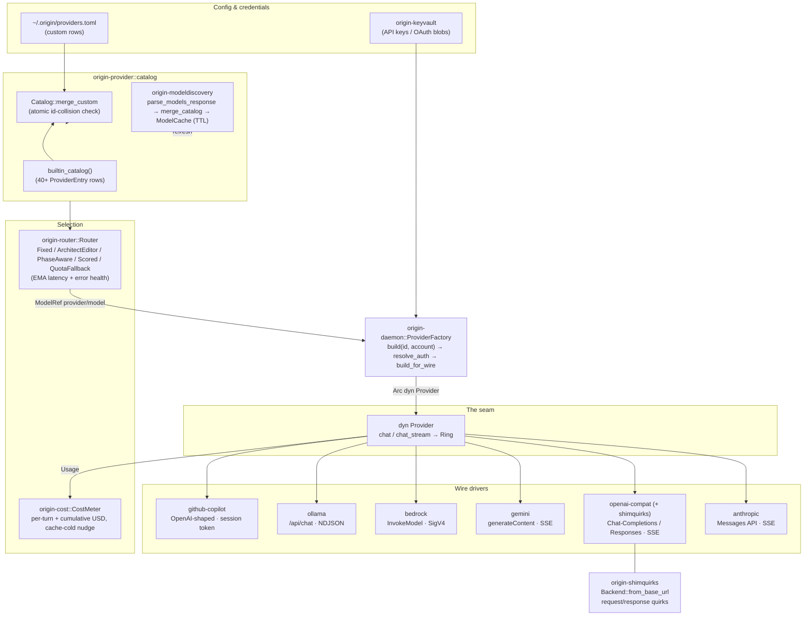

# Provider Subsystem

> **Last reviewed against workspace version 0.9.8.**

The **provider subsystem** is the wire boundary between `origin`'s
content-addressed agent loop and the ~40 LLM backends it can drive. Its job is
to translate one set of *canonical* request/response/usage/error types into
every vendor's idiosyncratic HTTP shape, and to fold the inverse translation
back so that the rest of the daemon never sees a vendor-specific byte.

The design follows a single, narrow seam — the
[`Provider`](#the-provider-trait-origin-provider) trait in
`crates/origin-provider/src/lib.rs`. Everything above it (the agent loop, the
router, the cost meter) works against the trait object `Arc<dyn Provider>`;
everything below it is a per-vendor wire driver crate. A small number of
*native* wire formats (Anthropic Messages, Gemini `generateContent`, AWS
Bedrock `InvokeModel`, Ollama `/api/chat`, GitHub Copilot) get their own crate,
while the long tail of "OpenAI-shaped" vendors — OpenRouter, DeepSeek, xAI,
Mistral, Qwen, Groq, Cerebras, and ~25 more — all ride a single generic
**openai-compat** driver, with the per-vendor differences isolated in
`origin-shimquirks`.

Subsystem map (crate → responsibility):

| Crate | Responsibility |
| --- | --- |
| `origin-provider` | The `Provider` trait + canonical types + static catalog + SSE/NDJSON pumps |
| `origin-provider-anthropic` | Anthropic Messages API (API key + Claude-CLI OAuth) |
| `origin-provider-openai-compat` | Generic OpenAI Chat-Completions + Responses driver |
| `origin-provider-gemini` | Google Generative Language REST API |
| `origin-provider-bedrock` | AWS Bedrock `InvokeModel` (SigV4) |
| `origin-provider-ollama` | Local Ollama `/api/chat` (NDJSON) |
| `origin-provider-github` | GitHub Copilot (OpenAI-shaped over a minted session token) |
| `origin-shimquirks` | Per-backend request/response massaging for openai-compat |
| `origin-modeldiscovery` | Runtime model-listing parse + catalog merge + cache |
| `origin-router` | Pluggable model-routing strategies driven by health/latency |
| `origin-cost` | Per-turn + cumulative USD/token accounting, cache-economy awareness |
| `origin-daemon` (`provider_factory.rs`) | Instantiating a provider from catalog + KeyVault |

---

## The Provider trait (origin-provider)

The contract lives at `crates/origin-provider/src/lib.rs`. The trait is named
**`Provider`**. It is object-safe (`Arc<dyn Provider>` is the unit the daemon
passes around), `Send + Sync`, and async via `#[async_trait::async_trait]`.

### Method list

`Provider` declares **four** methods, two of which have default
implementations:

| Method | Required? | Signature (canonical) |
| --- | --- | --- |
| `name` | required | `fn name(&self) -> &'static str` |
| `base_url` | default (`None`) | `fn base_url(&self) -> Option<&str>` |
| `chat` | required | `async fn chat(&self, req: ChatRequest) -> Result<ChatResponse, ProviderError>` |
| `chat_stream` | default (falls back to `chat`) | `async fn chat_stream(&self, req: ChatRequest, ring: &origin_stream::Ring) -> Result<(), ProviderError>` |

The real signature, copied verbatim from `lib.rs`:

```rust
#[async_trait::async_trait]
pub trait Provider: Send + Sync {
    fn name(&self) -> &'static str;

    /// The provider's upstream base URL, when statically known (e.g. an
    /// OpenAI-compatible endpoint). Used to populate the OpenTelemetry
    /// `server.address` / `server.port` `gen_ai` attributes (otel feature only).
    fn base_url(&self) -> Option<&str> {
        None
    }

    /// Send a single non-streaming chat request.
    async fn chat(&self, req: ChatRequest) -> Result<ChatResponse, ProviderError>;

    /// Stream tokens into `ring`. Default impl falls back to `chat` and emits
    /// one `TextDelta` + `TurnEnd` so providers without native streaming still
    /// work behind the ring API.
    async fn chat_stream(&self, req: ChatRequest, ring: &origin_stream::Ring) -> Result<(), ProviderError> {
        let resp = self.chat(req).await?;
        let text: String = resp
            .assistant
            .blocks
            .iter()
            .filter_map(|b| match b {
                origin_core::types::Block::Text { text, .. } => Some(text.clone()),
                _ => None,
            })
            .collect();
        ring.publish(&origin_stream::TokenEvent::new(
            origin_stream::TokenKind::TextDelta,
            text.into_bytes(),
        ))
        .map_err(|e| ProviderError::Api(e.to_string()))?;
        ring.publish(&origin_stream::TokenEvent::new(
            origin_stream::TokenKind::TurnEnd,
            Vec::new(),
        ))
        .map_err(|e| ProviderError::Api(e.to_string()))?;
        ring.close();
        Ok(())
    }
}
```

The default `chat_stream` is the key reuse seam: a provider that only knows how
to do a blocking round-trip (Bedrock, at present) gets ring-based streaming
*for free* — the default impl runs `chat`, publishes one `TextDelta`, then a
`TurnEnd`, and closes the ring. Providers with native streaming (Anthropic,
OpenAI-compat, Gemini, Ollama) override it.

### Canonical types

All canonical types live in the same `lib.rs` so a driver only needs one
`use origin_provider::{...}`.

**`ChatRequest`** — the inbound turn:

```rust
#[derive(Debug, Clone, Default)]
pub struct ChatRequest {
    pub system: String,
    pub messages: Vec<Message>,             // origin_core::types::Message
    pub model: String,
    pub tools: Vec<ToolSchema>,
    pub effort: Option<ReasoningEffort>,    // /effort + /fast slider
    pub attachments: Vec<origin_multimodal::ContentBlock>, // images/PDF pages
    pub thinking_tokens: Option<u32>,       // extended-thinking budget
}
```

Two fields encode "best-effort, wire-identical when unset" semantics: `effort`
and `thinking_tokens` are both `Option`, and a `None` value leaves the wire
**byte-identical** to the pre-feature behavior. A provider that does not
understand a field simply ignores it.

**`ToolSchema`** — one tool advertised to the model:

```rust
#[derive(Debug, Clone)]
pub struct ToolSchema {
    pub name: String,
    pub description: String,
    pub input_schema_json: String,  // JSON Schema for the tool input
}
```

**`ChatResponse`** — the assistant turn plus token accounting:

```rust
#[derive(Debug, Clone)]
pub struct ChatResponse {
    pub assistant: Message,
    pub usage: Usage,
}
```

**`Usage`** — the four canonical token counters that the cost meter folds in:

```rust
#[derive(Debug, Default, Clone, Copy, PartialEq, Eq)]
pub struct Usage {
    pub input_tokens: u32,
    pub output_tokens: u32,
    pub cache_read_input_tokens: u32,
    pub cache_creation_input_tokens: u32,
}
```

**`ProviderError`** — the canonical failure taxonomy every driver maps its
HTTP statuses into:

```rust
#[derive(Debug, Error)]
pub enum ProviderError {
    #[error("transport: {0}")]
    Transport(String),
    #[error("api: {0}")]
    Api(String),
    #[error("auth")]
    Auth,
    #[error("rate limit; retry after {retry_after_secs}s")]
    RateLimit { retry_after_secs: u32, message: String },
}
```

The convention across every driver's `status_error` helper is uniform:
`401`/`403` → `Auth`, `429` → `RateLimit { retry_after_secs, .. }` (parsing the
`retry-after` header, defaulting to `1`), everything else → `Api("status …")`,
and `reqwest` transport failures → `Transport`.

**`ReasoningEffort`** — a six-level effort ladder
(`Fast`, `Low`, `Medium`, `High`, `Max`, `Ultracode`) with per-vendor
projection helpers (`as_anthropic_effort`, `as_openai_effort`,
`as_wire_str`). `Ultracode` is an origin-internal tier that projects to the
highest valid wire level (`max` on Anthropic, `high` on OpenAI).

### The streaming model

Streaming is mediated by `origin_stream::Ring` — a bounded ring buffer of
`TokenEvent`s. A driver's `chat_stream` parses the upstream byte stream and
`ring.publish(...)`es one event per token/tool-delta, ending with a `TurnEnd`
and `ring.close()`. The canonical `TokenKind` set (`TextDelta`, `TurnEnd`, …)
lives in `origin-stream`. Two shared pumps in `origin-provider` keep drivers
thin:

- `origin_provider::sse` (`sse.rs`) — wraps a `reqwest::Response` body into an
  `eventsource_stream` event stream yielding
  `Result<eventsource_stream::Event, ProviderError>`. Used by Anthropic,
  OpenAI-compat, and Gemini.
- `origin_provider::ndjson` (`ndjson.rs`) — a newline-delimited JSON line
  splitter, used by Ollama (whose `/api/chat` stream is NDJSON, not SSE).

### CAS handle inflation

The daemon stores every tool result as a content-addressed handle (a CAS
hash), not inline bytes. Before encoding, a driver must inflate those handles
back into bytes or the model sees empty tool results. The shared helper is
`origin_provider::inflate_tool_result_handles(messages, cas)`. A CAS *miss*
(e.g. payload lost across a daemon restart) degrades gracefully to the
`CAS_MISS_PLACEHOLDER` string rather than failing the whole turn; a handle with
no CAS configured is a hard `ProviderError::Api`. Every wire driver calls this
at the top of `chat`/`chat_stream` (the Anthropic driver layers extra
Plan-aware `Reference` downgrading on top).

---

## Wire drivers

Each provider crate translates the canonical `ChatRequest`/`ChatResponse` to
and from one vendor's wire shape. The salient axes are: the API it speaks, how
it authenticates, and what its streaming frames look like.

### origin-provider-anthropic

`crates/origin-provider-anthropic/src/lib.rs`. Speaks the **Anthropic Messages
API** (`POST {base}/v1/messages`, `anthropic-version: 2023-06-01`, default base
`https://api.anthropic.com`). The `Anthropic` struct carries an `AuthKind` that
is either:

- `ApiKey(String)` → sent as the `x-api-key: <key>` header, or
- `OAuthBearer(String)` → sent as `Authorization: Bearer <token>`, used for the
  Claude-CLI OAuth flow. The OAuth path also injects a battery of beta headers
  (`OAUTH_BETA_HEADERS` — `claude-code-…,oauth-…,interleaved-thinking-…,
  effort-2025-11-24`, etc.), a `claude-cli/…` User-Agent, and a billing header
  to mirror the official client.

**Notable quirks.** Anthropic is the only driver that is *effort-* and
*thinking-budget-aware*. `thinking_tokens` selects a `thinking` block whose
shape depends on the model family: `model_uses_adaptive_thinking()` routes the
4.6/4.7/4.8 families (`-4-6`/`-4-7`/`-4-8`) to `{"type":"adaptive"}`, because
manual `budget_tokens` is deprecated on 4.6 and **400s on 4.7+**; older models
keep the legacy fixed-budget form. `resolve_max_tokens()` guarantees the
top-level `max_tokens` strictly exceeds the thinking budget
(`budget + DEFAULT_MAX_TOKENS`, default 16 384), per Anthropic's constraint.
The effort level is carried as `output_config.effort` (a nested block, *not* a
top-level `effort` field). This driver also takes a `Plan` for handle→band
downgrading and prompt-cache scoping.

**Streaming.** Native SSE (`text/event-stream`). The adapter in `streaming.rs`
handles `content_block_delta`, `message_delta` (`stop_reason` → `TurnEnd`), and
folds `usage` reported on `message_start`/`message_delta`.

### origin-provider-openai-compat

`crates/origin-provider-openai-compat/src/lib.rs`. The generic **OpenAI
Chat-Completions** wire client, parameterised over base URL, chat path, auth
header, and extra headers via `OpenAiCompatConfig`:

```rust
#[derive(Clone)]
pub struct OpenAiCompatConfig {
    pub name: &'static str,
    pub base_url: String,
    pub chat_path: String,
    pub auth: Arc<dyn TokenSource>,
    pub extra_headers: Vec<(String, String)>,
}
```

Auth is abstracted by the `TokenSource` trait, with built-in implementations
`NoAuth`, `StaticBearer`, and `StaticHeader` (plus dynamic ones such as the
Copilot session-token source). On each `chat` it: inflates CAS handles →
encodes the typed wire request → injects multimodal attachments →
`apply_shim_quirks(base_url, &mut body)` (see next section) → classifies the
backend with `origin_shimquirks::Backend::from_base_url` → POSTs. The same
crate also ships `OpenAiResponses` (`responses.rs`), a **distinct** encoder for
the OpenAI **Responses API** (`input[]`/`output[]`, not `messages`/`choices[]`)
used by Codex / ChatGPT-OAuth.

**Streaming.** Native SSE; the adapter consumes the shared `sse` pump and stops
on the `data: [DONE]` sentinel.

### origin-provider-gemini

`crates/origin-provider-gemini/src/lib.rs`. Speaks Google's **Generative
Language REST API**: `POST {base}/v1beta/models/{model}:generateContent`
(non-streaming) and `:streamGenerateContent?…&alt=sse` (SSE), default base
`https://generativelanguage.googleapis.com`. Auth `AuthKind`:

- `ApiKey(String)` → embedded as a `?key=<api_key>` **query parameter** (not a
  header), and the struct deliberately omits `Debug` so the key cannot be
  logged; or
- `OAuthBearer(String)` → `Authorization: Bearer <token>` header (Gemini CLI
  OAuth), with the `?key=` parameter dropped from the URL.

**Streaming.** Native SSE via the shared `sse` pump (`alt=sse`).

### origin-provider-bedrock

`crates/origin-provider-bedrock/src/lib.rs`. AWS **Bedrock** `InvokeModel`:
`POST {endpoint}/model/{model_id}/invoke` with the Anthropic
`bedrock-2023-05-31` JSON shape (system + messages + `max_tokens`, default
16 384). Auth is **SigV4** — each request is signed (`service = "bedrock"`,
region from the constructor) by the in-crate `sigv4` module; static
access/secret keys are supplied at construction (parsed from a JSON credential
blob by the factory).

**Streaming.** None yet — falls back to the trait-default `chat_stream`, which
emits a single `TextDelta` + `TurnEnd`.

### origin-provider-ollama

`crates/origin-provider-ollama/src/lib.rs`. Talks to a local Ollama daemon at
`POST {base}/api/chat` (default `http://127.0.0.1:11434`). **Unauthenticated** —
the struct holds only a base URL and an HTTP client.

**Streaming.** Native **NDJSON** (newline-delimited JSON frames), parsed by the
shared `origin_provider::ndjson` line splitter into the ring.

### origin-provider-github

`crates/origin-provider-github/src/lib.rs` + `copilot.rs`. The wired production
provider is GitHub **Copilot**. Its chat API is OpenAI-shaped
(`POST /chat/completions` at `https://api.individual.githubcopilot.com`), so it
**reuses `OpenAiCompat`** for the actual wire and supplies a custom
`TokenSource` (`CopilotTokenSource`). That source mints a short-lived *Copilot
session token* by exchanging the stored GitHub OAuth token (`ghu_…`, device
flow, client id `Iv1.b507a08c87ecfe98`) at
`GET api.github.com/copilot_internal/v2/token`, caches it (refreshing
`EXPIRY_MARGIN_SECS = 60` early), and adds the editor-identity headers Copilot
validates (`Copilot-Integration-Id`, `Editor-Version`, `Editor-Plugin-Version`,
`User-Agent`). (A dead `GitHub Models` impl was removed; the factory only ever
built the Copilot path.)

**Streaming.** Inherits OpenAI-compat SSE.

### Summary table

| Crate | Provider(s) | Wire API | Auth | Streaming |
| --- | --- | --- | --- | --- |
| `origin-provider-anthropic` | Anthropic (API key + Claude CLI OAuth) | Messages API `/v1/messages` | `x-api-key` **or** `Authorization: Bearer` (OAuth) | SSE (`content_block_delta` / `message_delta`) |
| `origin-provider-openai-compat` | OpenAI + ~30 OpenAI-shaped vendors (see below) | Chat-Completions `/v1/chat/completions`; Responses `/responses` | `TokenSource` → `Bearer`/header/none | SSE (`data: [DONE]` sentinel) |
| `origin-provider-gemini` | Google Gemini (API key + Gemini CLI OAuth) | `generateContent` / `streamGenerateContent` | `?key=` query param **or** `Authorization: Bearer` (OAuth) | SSE (`alt=sse`) |
| `origin-provider-bedrock` | AWS Bedrock | `InvokeModel` `/model/{id}/invoke` (Anthropic body) | AWS **SigV4** | none (trait-default fallback) |
| `origin-provider-ollama` | Ollama (local) | `/api/chat` | none | **NDJSON** |
| `origin-provider-github` | GitHub Copilot | OpenAI Chat-Completions (over Copilot host) | minted **Copilot session token** from GitHub OAuth | SSE (via openai-compat) |

---

## The openai-compat driver & shimquirks

The defining trick of the subsystem is that *one* generic Chat-Completions
client serves the long tail of vendors. Every catalog row whose `wire` is
`WireFormat::OpenAIChat` is built into an `OpenAiCompat` with a different
`base_url`, `chat_path`, and `auth` — the encoder/decoder is identical. The only
per-vendor variation is in **`origin-shimquirks`**
(`crates/origin-shimquirks/src/lib.rs`), a pure (`#![forbid(unsafe_code)]`,
no-I/O) crate of request/response massaging.

### How the generic client stays generic

On every request the openai-compat driver calls `apply_shim_quirks(base_url,
&mut body)`, which:

1. classifies the backend via `Backend::from_base_url(base_url)` (host-substring
   matching), then
2. remaps the model alias with `map_model_name(backend, model)`, then
3. strips fields the backend cannot accept via
   `apply_request_quirks(backend, &mut body)`.

On the response side, `decode_response(wire, backend)` applies two
backend-gated recoveries: **raw-text tool-call recovery**
(`parse_raw_toolcall_text` recovers a `<tool_call>…</tool_call>` or fenced-JSON
inline call into a structured `Block::ToolUse` when `tool_calls` is empty) and a
**truncation diagnostic** (`detect_truncation` warns on a `length`/`max_tokens`
finish). For `Backend::OpenAi` and `Backend::Other` both passes are **inert**, so
a canonical OpenAI request/response is byte-identical.

### Special-cased backends

`origin_shimquirks::Backend` enumerates **nine** variants. Eight are concrete
flavors; `Other` is the conservative catch-all. The classifier
(`Backend::from_base_url`) checks specific vendor hosts before generic
fallbacks; localhost on the Ollama port maps to `Ollama`, and `vllm`/`:8000`
maps to `VLlm`.

| `Backend` | Detected by (host/port substring) | Quirk(s) applied |
| --- | --- | --- |
| `OpenAi` | `openai.com` / `api.openai` | none (reference behavior) |
| `VLlm` | `vllm`, `:8000` | removes top-level `store` **and** `parallel_tool_calls` |
| `Cerebras` | `cerebras.ai` / `cerebras.net` | removes `store` **and** `parallel_tool_calls`; model aliasing (`llama-3.1-70b` → `llama3.1-70b`) |
| `Groq` | `groq.com` | removes `parallel_tool_calls`; model aliasing (`llama-3.1-70b` → `llama-3.1-70b-versatile`) |
| `Together` | `together.ai` / `together.xyz` | removes `parallel_tool_calls` |
| `Ollama` | `:11434` / `ollama` | removes `parallel_tool_calls`; model aliasing (`llama-3.1-8b` → `llama3.1:8b`) |
| `Mistral` | `mistral.ai` | none (request quirks inert) |
| `DeepSeek` | `deepseek.com` | removes `parallel_tool_calls` |
| `Other` | anything unrecognized | none (treated conservatively) |

The crate additionally provides `redact_url_secrets()` (scrubs `api_key`,
`key`, `token`, `access_token`, `auth` query params and inline `user:pass@`
userinfo for safe logging), used wherever a base URL might be traced.

### Which catalog providers ride the compat driver

Every builtin catalog row with `wire: WireFormat::OpenAIChat` is built as an
`OpenAiCompat` (the factory's `WireFormat::OpenAIChat` arm). From
`crates/origin-provider/src/catalog_rows.rs`, the **openai-compat backends**
(provider ids) are:

```
openai, openrouter, deepseek, fireworks, together, xai, mistral, moonshot,
minimax, stepfun, synthetic, venice, arcee, byteplus, chutes, qwen, qianfan,
volcengine, xiaomi, z-ai, ms-foundry, litellm, vercel-ai, cloudflare, kilo,
opencode, copilot-proxy, vllm, sglang, huggingface, groq, cerebras, deepinfra,
nvidia, tencent, lmstudio, kimi, qwen-intl, nebius
```

That is **39** Chat-Completions ids riding the single compat driver
(`github-copilot` also reuses `OpenAiCompat` internally but carries its own
`WireFormat::GitHubCopilot` catalog row; `openai-codex` is OpenAI-shaped but
uses the distinct `OpenAIResponses` wire). Notably this includes the
README-named third-party vendors — **OpenRouter, DeepSeek, xAI (Grok), Mistral,
Qwen** — alongside gateways (LiteLLM, Vercel AI, Cloudflare, Kilo) and
self-hosted servers (vLLM, SGLang, LM Studio).

---

## Provider catalog & model discovery (origin-modeldiscovery)

### The builtin catalog

The static provider catalog is `origin_provider::catalog`
(`catalog.rs` + `catalog_rows.rs`). `builtin_catalog()` returns a `Vec<ProviderEntry>`;
a unit test asserts `cat.len() >= 40`. Each `ProviderEntry` is:

```rust
pub struct ProviderEntry {
    pub id: Cow<'static, str>,
    pub display_name: Cow<'static, str>,
    pub wire: WireFormat,        // OpenAIChat | OpenAIResponses | Anthropic | Gemini | Bedrock | Ollama | GitHubCopilot
    pub auth: AuthScheme,        // None | ApiKey{header,prefix} | OAuth(OAuthSpec) | SigV4{service} | Custom
    pub base_url: Cow<'static, str>,
    pub chat_path: Cow<'static, str>,
    pub default_model: Cow<'static, str>,
    pub capabilities: Capabilities, // { streaming, tools, prompt_cache, thinking }
}
```

`Catalog::builtin()` wraps the rows; `Catalog::merge_custom(Vec<ProviderEntry>)`
folds user-defined entries from `~/.origin/providers.toml` in **atomically** —
it validates every id against both existing and earlier custom entries *before*
mutating, so a single `CatalogError::IdCollision` leaves the catalog completely
unchanged. `Catalog::lookup(id)` is the linear find used by the factory.

### Runtime discovery

`origin-modeldiscovery` (`crates/origin-modeldiscovery/src/lib.rs`) adds
*runtime* model discovery on top of the hand-maintained list. It is pure parse +
merge + cache — **no network I/O** (the HTTP GET belongs to the caller; this
crate consumes the response body and the caller passes `now_unix`, so it is
fully offline-testable).

- `parse_models_response(json) -> Result<Vec<ModelInfo>, DiscoveryError>` accepts
  **three** top-level listing shapes via a `serde(untagged)` envelope
  (`ModelsEnvelope`): the OpenAI shape `{"data":[{"id":…}]}`, the alternative
  `{"models":[…]}`, and a bare top-level array `[{"id":…}]`. Per-model fields
  other than `id` are ignored; rows lacking a non-empty `id` are skipped rather
  than rejecting the whole listing.
- `merge_catalog(builtin: &[String], discovered: &[ModelInfo]) -> Vec<String>`
  returns the de-duplicated union: builtin ids first (original order), then
  discovered ids in listing order, collapsing duplicates to first occurrence.

### The cache

`ModelCache` maps a provider name → its last discovered `Vec<ModelInfo>`, with
`put`/`get` plus `to_json`/`from_json` for on-disk persistence. The crate itself
holds **no** time state: it is "plain in-memory state with no background
expiry." The **TTL policy is wall-clock and owned by the caller** — the daemon
decides whether a cached listing is stale by comparing a stored fetch timestamp
against a TTL (the crate-level docs frame this as "caches the result behind a
wall-clock TTL so the daemon refetches only when stale"; the time comparison is
supplied by the caller, keeping `ModelCache` pure and deterministically
testable).

---

## Routing strategies (origin-router)

`origin-router` (`crates/origin-router/src/lib.rs`) is pure logic — no network.
Latency and error signals are fed in via `Router::record_result(model,
latency_ms, ok)` and folded into an **exponential moving average** with
`EMA_ALPHA = 0.3`; the first observation seeds the EMA directly so a single
sample isn't diluted toward zero.

The unit a strategy routes to is `ModelRef { provider, model }` (keyed as
`provider/model`). A turn carries a `Phase` (`Plan`, `Edit`, `Execute`,
`Default`). The actual strategies in the `Strategy` enum:

| `Strategy` | Behavior (from `Router::choose`) |
| --- | --- |
| `Fixed(ModelRef)` | Always returns its model; ignores phase and candidates. |
| `ArchitectEditor { architect, editor }` | Aider-style split: `architect` for `Phase::Plan`, `editor` for every other phase. |
| `PhaseAware { plan, fast }` | Gemini-style: heavy `plan` model for `Phase::Plan`, `fast` model otherwise. |
| `Scored` | openclaude `SmartRouter`-style: rank the supplied `candidates` by `Health::score`, skipping exhausted; `None` if empty/all exhausted. |
| `QuotaFallback { chain }` | kilocode Virtual Quota Fallback: return the first non-exhausted model in the ordered chain. |

### How health/latency feed in

`Health` per model tracks `ema_latency_ms`, `ema_error_rate` (both EMAs), and an
`exhausted` flag (caller-managed via `mark_exhausted`/`clear_exhausted`). The
routing score is

```rust
pub fn score(&self) -> f64 {
    let latency = self.ema_latency_ms.max(1.0);
    (1.0 - self.ema_error_rate.clamp(0.0, 1.0)) / latency
}
```

so low error *and* low latency both raise the score; `Scored` picks the
`max_by` this score among non-exhausted candidates, and `scored_order` returns
the full best-first ranking. `QuotaFallback` consults only the `exhausted`
flag (set when a model hits a quota / rate limit), walking the chain to the
first eligible model. The free function `rank_by_latency(samples)` is the pure
ranking helper behind `origin providers recommend` (e.g. ordering local Ollama
models by measured latency).

`Router::try_new` rejects a `QuotaFallback` with an empty chain
(`RouterError::EmptyChain`). The agent loop's live per-turn routing is performed
by the daemon's `LiveRouter` (wired through `LoopOptions::router`);
`ProviderFactory::route` is a stateless diagnostic helper over the same
`Router::choose`.

---

## Cost & token accounting (origin-cost)

`origin-cost` (`crates/origin-cost/src/lib.rs`) is pure arithmetic — no I/O, no
async. It closes the "no user-facing dollar cost" gap (aider `/tokens`,
claude-code `/usage` + `/insights`, kilocode microdollar tracking) and adds
**prompt-cache economy awareness**.

### Per-turn and cumulative USD

`TokenUsage { input, output, cache_read, cache_write }` mirrors the canonical
`origin_provider::Usage` shape. `ModelPrice` holds USD-per-million-tokens for
each of the four categories; `cost_of(price, usage) -> Cost` does the
per-million arithmetic. `price_for(model)` does a **longest-prefix** match
against a builtin price table (stripping a `provider/` or `provider:` prefix and
lowercasing), so `claude-3-5-haiku` beats the broad `claude-` row. Unknown
models return `None`, and the meter then records `priced: false` so the UI shows
tokens without a misleading dollar figure.

`CostMeter` is the running accumulator: `record(model, usage, now_ms)` computes
the turn cost, folds it into `cumulative_usage`/`cumulative_cost`, and returns a
`TurnCost`. `insights()` builds a claude-code `/insights`-style `Insights`
report with a per-model breakdown sorted by descending cost plus a
`cold_cache_turns` counter. `Cost::microdollars()` gives kilocode-parity
integer-safe sub-cent accounting, and `fmt_usd` buckets the display
(`$0.0023` / `$1.42` / `$128`).

### Prompt-cache economy awareness

Anthropic's ephemeral prompt cache lives ~5 minutes
(`PROMPT_CACHE_TTL_MS = 5 * 60 * 1_000`). After that gap the next request
re-pays the cache-write premium instead of the cheap cache-read. Two surfaces
detect this:

- `CostMeter::record` sets `TurnCost.cache_warm = false` (and bumps
  `cold_cache_turns`) when `now_ms - last_turn_at_ms > PROMPT_CACHE_TTL_MS`.
- `is_cache_cold(prev_turn_ms, now_ms, cache_read_tokens, had_prior_warm)` is the
  extracted pure decision behind the live TUI "your cache went cold" nudge
  (jcode parity). It is cold when either the idle gap exceeds the TTL *or* the
  turn read **zero** cache tokens while a prior turn was warm (the provider-side
  signal that the entry is gone). The first turn of a session is always warm.

The builtin price table includes Anthropic (with published cache read/write
rates), OpenAI (`gpt-4o`, `o1`/`o3`, …), Gemini, and open/aggregator models
(DeepSeek, Grok, Qwen, Mistral, Llama). When a provider publishes no separate
cache rates, `ModelPrice::flat` applies Anthropic-style multipliers
(read = 0.1×input, write = 1.25×input).

---

## Instantiation & config (provider_factory)

`crates/origin-daemon/src/provider_factory.rs` is where a provider id + account
becomes a live `Arc<dyn Provider>`. The flow at session start (and on a hot
`/account` switch — Phase 8.9 wires the factory in so providers swap without a
daemon restart):

1. **Parse the id.** `ProviderId::parse(s, catalog)` lowercases and applies
   aliases (`open-ai` → `openai`, `aws-bedrock` → `bedrock`, `gemini` → `google`,
   `github`/`github-models` → `github-copilot`, `open-router` → `openrouter`),
   then confirms the canonical id exists in the catalog.

2. **Resolve auth.** `ProviderFactory::build(id, account)` looks up the
   `ProviderEntry`, then `resolve_auth(entry, account)` reads the credential from
   the `KeyVault` according to `entry.auth`:
   - `AuthScheme::None` → `NoAuth`.
   - `AuthScheme::ApiKey { header, prefix }` → `StaticBearer` when the header is
     `Authorization` + `Bearer `, else `StaticHeader`.
   - `AuthScheme::OAuth(spec)` → an `OAuthClient` that `refresh_if_due` (60 s
     window) rotates the access token, falling back to the stored
     `<account>/oauth` blob; yields a `StaticBearer`.
   - `AuthScheme::SigV4` / `Custom` → `NoAuth` placeholder (SigV4 is handled
     inside the Bedrock builder).

3. **Build for wire.** `build_for_wire(entry, token, account)` matches on
   `entry.wire`:
   - `OpenAIChat` → `OpenAiCompat::new(OpenAiCompatConfig { name, base_url,
     chat_path, auth: token, extra_headers })`. `render_base_url` expands any
     `{placeholder}` (e.g. Cloudflare's `{account_id}`/`{gateway}`) from a
     `<account>/extras` vault blob; `openai_extra_headers` adds OpenRouter's
     `HTTP-Referer`/`X-Title`. CAS attached when configured.
   - `OpenAIResponses` → `OpenAiResponses::new(cfg)` (Codex/ChatGPT-OAuth).
   - `Anthropic` → `Anthropic::new(api_key)` or `::with_oauth_bearer(token)`
     `.with_base(base)`, `.with_cas(cas)`, `.with_plan(plan)`.
   - `Gemini` → `Gemini::new(api_key)` or `::with_oauth_bearer(token)` (feature
     `gemini`).
   - `Bedrock` → parses a `BedrockCreds` JSON blob (`access`, `secret`, `region`;
     defaulted `endpoint`/`model_id`) and builds `Bedrock::new(...)` (feature
     `bedrock`).
   - `Ollama` → `Ollama::with_base_url(render_base_url(...))` (unauthenticated;
     feature `ollama`).
   - `GitHubCopilot` → `origin_provider_github::copilot::provider(vault, account)`
     (feature `github-models`).

   The `&'static str` for `Provider::name()` is produced by
   `intern_provider_name`, which leaks each distinct id at most once so repeated
   account switches don't leak unboundedly.

4. **Cross-provider per-turn routing.** The factory can be registered
   process-wide via `set_global(Arc<ProviderFactory>, account)`. The agent loop
   then calls the free `build_provider_for(provider_id, model)` (or
   `build_provider_for_account`) to rebuild a different provider for a single
   turn when the router picks across providers. Both return `None` (never panic)
   on an unknown id or missing credential, so the loop falls back to the active
   provider. The `model` is informational — it's applied per-turn via
   `ChatRequest.model`, not baked into the provider.

Compiled-in providers depend on cargo features: `anthropic`, `openai`,
`gemini`, `ollama` ship by default; `openrouter`, `bedrock`, `github-models`
are opt-in. A `WireFormat` arm whose feature is disabled returns
`FactoryError::UnknownProvider`.

---

## Adding a new provider

There are two paths. If the vendor is OpenAI-shaped, you almost never write a
new crate — you add a catalog row. If it has a genuinely novel wire, you
implement the trait in a new crate.

**Path A — OpenAI-shaped vendor (the common case):**

1. Add a `ProviderEntry` to `builtin_catalog()` in
   `crates/origin-provider/src/catalog_rows.rs` (or ship it as a user
   `providers.toml` entry merged via `Catalog::merge_custom`): set
   `wire: WireFormat::OpenAIChat`, the `base_url`, `chat_path`, `auth`
   (`bearer()` / `xapikey()` / `AuthScheme::None`), `default_model`, and
   `Capabilities`.
2. If the vendor needs request/response massaging, add a `Backend` variant in
   `crates/origin-shimquirks/src/lib.rs`: extend `Backend::from_base_url` to
   detect its host, and add arms to `apply_request_quirks` / `map_model_name` (and
   leave `OpenAi`/`Other` inert).
3. If it needs extra headers (à la OpenRouter), extend `openai_extra_headers` in
   `provider_factory.rs`.
4. Add a price row to the `PRICES` table in `crates/origin-cost/src/lib.rs` (use
   the longest-prefix convention).
5. Add the id to the catalog unit tests (`first_class_providers_present`,
   `ids_are_unique`) if it's first-class.

**Path B — novel wire format (new crate):**

1. Create `crates/origin-provider-<vendor>/` and add it to the workspace.
2. `impl origin_provider::Provider`:
   - `fn name(&self) -> &'static str`,
   - optional `fn base_url(&self) -> Option<&str>`,
   - `async fn chat(&self, req: ChatRequest) -> Result<ChatResponse, ProviderError>`,
   - optionally override `chat_stream` (else inherit the `chat`-backed default).
3. At the top of `chat`/`chat_stream`, call
   `origin_provider::inflate_tool_result_handles(&req.messages, self.cas.as_ref())?`
   and rebuild the request with the inflated messages.
4. Encode `ChatRequest` → vendor body; decode the vendor response into
   `ChatResponse { assistant, usage }`. Map HTTP statuses to `ProviderError`
   uniformly (`401`/`403` → `Auth`, `429` → `RateLimit`, else `Api`).
5. For streaming, reuse `origin_provider::sse` (SSE) or `origin_provider::ndjson`
   (NDJSON) and publish `TokenEvent`s into the `Ring`, ending with `TurnEnd` +
   `ring.close()`.
6. Add a `WireFormat` variant in `catalog.rs`, a `ProviderEntry` row in
   `catalog_rows.rs`, and a `build_for_wire` arm (feature-gated) in
   `provider_factory.rs` that resolves auth and constructs the provider.
7. Add a price row to `origin-cost` and (if useful) a discovery shape to
   `origin-modeldiscovery`.

---

## Diagram



ASCII fallback:

```
 providers.toml ─┐
                 ├─► Catalog (builtin_catalog + merge_custom) ◄─ modeldiscovery (TTL cache)
 builtin rows  ──┘            │
                              ▼
                      Router (Strategy + Health/EMA)
                              │  picks ModelRef(provider/model)
                              ▼
   KeyVault ─────────► ProviderFactory.build(id, account)
                              │  resolve_auth + build_for_wire
                              ▼
                        Arc<dyn Provider>  ──► CostMeter (Usage → USD)
                              │
        ┌──────────┬─────────┼──────────┬──────────┬───────────┐
        ▼          ▼         ▼          ▼          ▼           ▼
    anthropic  openai-    gemini     bedrock    ollama    github-copilot
    (Messages) compat    (genContent)(InvokeMdl)(/api/chat)(OpenAI-shaped)
       SSE     SSE+shimquirks  SSE     SigV4      NDJSON       SSE
```
