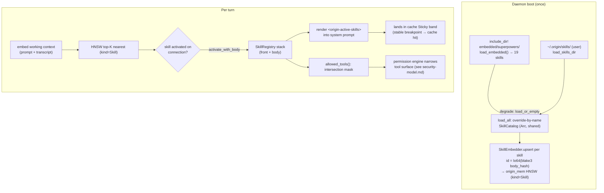
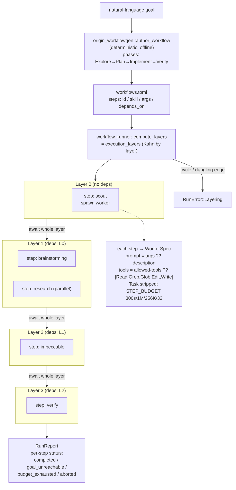

# Skills, Hooks & Workflows

> Subsystem reference for the `origin-skills`, `origin-hooks`, and
> `origin-workflowgen` crates plus their daemon-side wiring
> (`origin-daemon/src/skill_catalog.rs`, `subagents_md.rs`, `workflows.rs`,
> `workflow_runner.rs`, `workflow_progress.rs`, `default_workflow.rs`).
>
> **Last reviewed against workspace version 0.9.8.**

## Abstract

Origin's behavioural-extension subsystem is three cooperating layers that share
one data shape — a Markdown file with YAML frontmatter — and one design rule:
**default-off, byte-identical**. Nothing in this subsystem changes the assembled
system prompt, the permission surface, or the cache breakpoints unless a skill
is actually activated, a hook is actually configured, or a workflow is actually
run.

- **Skills** (`origin-skills`) are `SKILL.md` documents — YAML frontmatter +
  Markdown body — that carry (a) model-facing instructions injected verbatim
  into the per-turn system prompt and (b) an `allowed-tools` mask that *narrows*
  the permission surface. Every body is content-addressed by a blake3
  `SkillHash` and embedded into the same HNSW vector index the memory subsystem
  uses, so the *right* skills surface lazily per turn with zero session-start
  scan cost.
- **Hooks** (`origin-hooks`) are long-lived NUL-framed shell responders bound to
  typed lifecycle events (`PreTool`, `PostTool`, `SessionStart`, …). A
  pre-spawned `ShellPool` amortizes dispatch to one `write_all` + one
  `read_until` — no per-event `fork+exec`. A `PreTool` hook can `Deny`, `Allow`,
  or `Mutate` a pending tool call.
- **Workflows** (`origin-workflowgen` + the daemon's `workflow_runner`) are
  ordered skill pipelines. `origin-workflowgen` *authors* a workflow from a
  natural-language goal deterministically (no model round-trip); the daemon
  either walks it one step per turn (linear skill-mask sequencer,
  `workflow_progress.rs`) or fans it out as a dependency-layered parallel DAG of
  swarm workers (`workflow_runner.rs`, the `RunWorkflow` tool).

The README's "embedding-indexed lazy injection" tagline is this subsystem: the
catalog is loaded once, embedded once, and queried per turn so only the
top-K relevant skill bodies materialize into the cache's `Sticky` band.

---

## The skill model (origin-skills)

A skill lives at `<root>/<name>/SKILL.md`. The file is split into a YAML
frontmatter block delimited by `---` lines and a Markdown body.

### Frontmatter schema

`crates/origin-skills/src/frontmatter.rs` defines the **real** schema. It is
small and strict:

```rust
#[derive(Debug, Clone, Deserialize)]
pub struct SkillFrontmatter {
    pub name: String,
    pub description: String,
    #[serde(default, rename = "allowed-tools")]
    pub allowed_tools: Vec<String>,
}
```

| Field           | YAML key        | Type         | Required | Meaning |
|-----------------|-----------------|--------------|----------|---------|
| `name`          | `name`          | `String`     | yes      | Catalog key. Drives override-by-name precedence (`load_all`), the catalog `find`, and the `<skill name="…">` wrapper in the active-skills block. |
| `description`   | `description`   | `String`     | yes      | One-line summary. Embedded for lazy injection (see below); surfaced in the catalog and workflow runner's prompt fallback. |
| `allowed_tools` | `allowed-tools` | `Vec<String>`| no (`default`) | The tool allow-list this skill imposes when active. Empty ⇒ *no* narrowing. |

Note the serde `rename = "allowed-tools"`: on disk the key is hyphenated
(`allowed-tools`), matching Claude/Anthropic skill convention; in Rust it is
`allowed_tools`. The same struct is reused verbatim by the daemon's declarative
subagents loader (`subagents_md.rs`) so a `SKILL.md` and a subagent `.md` parse
through the identical `parse_frontmatter` path.

### Parsing rules

`parse_frontmatter(source) -> Result<ParsedSkill, FrontmatterError>`:

- Strips an optional leading UTF-8 BOM (`\u{FEFF}`).
- Accepts both Unix (`\n`) and Windows (`\r\n`) line endings; normalizes the
  body to LF, and only allocates a normalized copy when a `\r` is actually
  present (lazy).
- Requires an opening `---\n` (else `FrontmatterError::MissingOpen`) and a
  closing `\n---\n` separator (else `FrontmatterError::MissingDelimiter`).
- Deserializes the YAML between the delimiters; a YAML error becomes
  `FrontmatterError::Yaml(String)`.

`ParsedSkill { front, body }` is the parse result. The body string is the
remainder after the closing delimiter.

### The loaded `Skill` and the `SkillHash`

`crates/origin-skills/src/loader.rs` wraps a parsed skill with its content hash
and source path:

```rust
pub struct SkillHash(pub [u8; 32]);   // 32-byte blake3 of the body bytes

pub struct Skill {
    pub front: SkillFrontmatter,
    pub body: String,
    pub body_hash: SkillHash,
    pub source: std::path::PathBuf,
}
```

The `SkillHash` is computed as `SkillHash(*blake3::hash(body.as_bytes())
.as_bytes())`. It is `Copy + Eq + Hash`, so it doubles as a CAS key:

- **CAS dedupe.** Two skills with byte-identical bodies hash to the same value
  regardless of path. The first-run importer (`import.rs`) keys its
  "already present" set on `body_hash.0`, so re-importing the same skill body is
  a no-op (`skipped_duplicate`).
- **Deterministic embedding id.** The embed step (`embed.rs`) derives the
  index's public `u64` id from the *lower 64 bits* of the same blake3 hash
  (`u64::from_le_bytes(body_hash.0[..8])`). Re-importing or re-embedding the
  same body is therefore idempotent across hosts — the id is a pure function of
  the content.

---

## Loading & precedence

The loader has three entry points (`loader.rs`, `embedded.rs`), re-exported from
`lib.rs`:

| Function | Source | Behaviour |
|----------|--------|-----------|
| `load_embedded()` | `include_dir!` of `embedded/superpowers/` | Returns every vendored skill. **Panics** on malformed vendored frontmatter (a build-time bug, not user input). |
| `load_skills_dir(root)` | one filesystem level under `root` | Walks `<root>/<dir>/SKILL.md`; dirs without a `SKILL.md` are silently skipped. **Fail-fast**: any unreadable / malformed file returns `LoaderError`. |
| `load_all(user_root)` | embedded + user overrides | Embedded first, then user entries override by `name`. |

### Embedded inclusion

`embedded.rs` uses `include_dir::include_dir!("$CARGO_MANIFEST_DIR/embedded/superpowers")`
so the daemon binary ships with every superpowers skill compiled in — users
never copy files anywhere to get the baseline catalog. `load_embedded` walks the
embedded directory tree, parses each `SKILL.md`, and hashes its body exactly as
the on-disk loader does.

### User overrides — by name

`load_all(user_root)` merges with **override-by-name** semantics:

```rust
let mut acc = load_embedded();
if user_root.exists() {
    let user = load_skills_dir(user_root)?;
    // index embedded by name for O(1) replacement
    for skill in user {
        if let Some(i) = by_name.get(&skill.front.name) {
            acc[i] = skill;             // replace embedded in place
        } else {
            acc.push(skill);            // append new user skill
        }
    }
}
```

A user `~/.origin/skills/brainstorming/SKILL.md` *replaces* the embedded
`brainstorming` skill (same `name`), keeping the catalog count unchanged; a user
skill with a fresh name is appended. The regression test
`user_skill_overrides_embedded_by_name` asserts both the description swap and the
unchanged count of 19.

A **missing `user_root` is fine** — the embedded skills are always returned. The
test `load_includes_embedded_when_user_dir_missing` covers this.

### Fail-fast vs. degrade

There are two distinct failure postures, deliberately:

- **`load_skills_dir` / `load_all` are fail-fast.** A single malformed
  `SKILL.md` aborts the whole load with `LoaderError::Frontmatter { path, … }`.
  This is the right behaviour for a CLI verb that wants to tell the user exactly
  which file is broken.
- **The daemon degrades.** `SkillCatalog::load_or_empty(root)` (in
  `origin-daemon/src/skill_catalog.rs`) wraps `load_from`; on *any* error it
  logs `tracing::warn!` and returns an **empty** catalog so a corrupt skills dir
  cannot deny service:

  ```rust
  pub fn load_or_empty(root: &Path) -> Arc<Self> {
      match Self::load_from(root) {
          Ok(c) => Arc::new(c),
          Err(e) => {
              tracing::warn!(error = %e, path = %root.display(),
                  "skill catalog load failed; running with empty catalog");
              Arc::new(Self::default())
          }
      }
  }
  ```

  The consequence is documented in the catalog's own test
  `load_or_empty_degrades_on_corrupt_frontmatter`: because the underlying walk is
  fail-fast, **one** corrupt `SKILL.md` drops the *entire* catalog (including
  valid siblings). The contract is "show no skills rather than a silently-partial
  catalog with no signal about the broken file."

### The in-process catalog

`SkillCatalog` (`skill_catalog.rs`) is a read-only `Vec<Skill>` loaded once at
daemon startup and held in an `Arc` shared across every connection. It exposes
`find(name)`, `iter()`, `len()`, `is_empty()`. Activation state — *which* subset
of catalog skills is in the stack right now — is separate and per-connection
(the `SkillRegistry`, below).

---

## The embedded superpowers catalog

The daemon ships **19 embedded "superpowers" skills**. The exact set is
**gated by a test**: `crates/origin-skills/tests/embedded_skills.rs` ::
`embedded_includes_all_19_superpowers_skills` enumerates all 19 names and asserts
`skills.len() == 19`. Adding or removing a vendored skill without updating that
list fails CI.

| # | Skill (`name`) | `description` (first line) |
|---|----------------|----------------------------|
| 1 | `brainstorming` | You MUST use this before any creative work — creating features, building components, adding functionality, or modifying behavior. Explores user intent, requirements and design before implementation. |
| 2 | `dispatching-parallel-agents` | Use when facing 2+ independent tasks that can be worked on without shared state or sequential dependencies. |
| 3 | `executing-plans` | Use when you have a written implementation plan to execute in a separate session with review checkpoints. |
| 4 | `finishing-a-development-branch` | Use when implementation is complete, all tests pass, and you need to decide how to integrate the work — guides completion by presenting options for merge, PR, or cleanup. |
| 5 | `goal` | Invoked by `/goal <condition>`. Sets a persistent completion condition for the session — origin commits to keep working toward it across turns, with a Haiku-backed verifier deciding when it's met. |
| 6 | `investigating-performance-regressions` | Use when something got slower, a latency/memory budget is exceeded, a benchmark regressed, or you are tempted to optimize — before changing code for speed. |
| 7 | `managing-dependencies` | Use when adding, upgrading, or removing a third-party dependency, or when a lockfile, audit, or supply-chain alert changes — before committing the change. |
| 8 | `receiving-code-review` | Use when receiving code review feedback, before implementing suggestions — requires technical rigor and verification, not performative agreement or blind implementation. |
| 9 | `requesting-code-review` | Use when completing tasks, implementing major features, or before merging to verify work meets requirements. |
| 10 | `reviewing-security` | Use when adding or changing code that handles untrusted input, authentication, secrets, file paths, subprocess execution, deserialization, or network requests — before merging or claiming code is safe. |
| 11 | `subagent-driven-development` | Use when executing implementation plans with independent tasks in the current session. |
| 12 | `systematic-debugging` | Use when encountering any bug, test failure, or unexpected behavior, before proposing fixes. |
| 13 | `test-driven-development` | Use when implementing any feature or bugfix, before writing implementation code. |
| 14 | `using-git-worktrees` | Use when starting feature work that needs isolation or before executing implementation plans — ensures an isolated workspace via native tools or git worktree fallback. |
| 15 | `using-superpowers` | Use when starting any conversation — establishes how to find and use skills, requiring Skill tool invocation before ANY response including clarifying questions. |
| 16 | `verification-before-completion` | Use when about to claim work is complete, fixed, or passing, before committing or creating PRs — requires running verification commands and confirming output; evidence before assertions. |
| 17 | `writing-commits-and-prs` | Use when committing changes or opening a pull request — before running git commit or creating the PR, to produce atomic commits and a reviewable description. |
| 18 | `writing-plans` | Use when you have a spec or requirements for a multi-step task, before touching code. |
| 19 | `writing-skills` | Use when creating new skills, editing existing skills, or verifying skills work before deployment. |

> **Recently expanded.** The catalog grew from 15 to 19 skills; the gating test
> name and the assertion count (`19`) are the single source of truth. (Older
> docstrings in `skill_catalog.rs` still mention "14 superpowers skills" — that
> comment is stale; trust the test.)

Each `SKILL.md` body is the actual instruction set the model follows once the
skill is active. Bodies are dense and prescriptive — e.g. `brainstorming` opens
with a `<HARD-GATE>` forbidding any implementation action until a design is
approved; `test-driven-development` enshrines "NO PRODUCTION CODE WITHOUT A
FAILING TEST FIRST"; `using-superpowers` is the meta-skill that tells the model
to invoke a skill before *any* response. These are vendored verbatim from the
upstream superpowers project and are the building blocks the default workflow and
`origin-workflowgen` compose.

---

## Embedding-indexed lazy injection

The naïve approach — dump every skill description into every system prompt — is
quadratic in catalog size and burns cache budget on skills that don't apply. The
README's "embedding-indexed lazy injection" is the alternative.

### `SkillEmbedder` — upsert into the shared HNSW index

`crates/origin-skills/src/embed.rs` embeds skill bodies into
`origin_mem::MemIndex` with `kind = Skill`:

```rust
pub struct SkillEmbedder { inner: Inner }
enum Inner {
    Stub,                    // deterministic test embedder (blake3 → unit vector)
    Real(Arc<Embedder>),     // production: a real ONNX origin_mem::Embedder
}
```

- **Shared vector space.** The production arm holds an `Arc<origin_mem::Embedder>`
  **shared with the daemon's memory subsystem**, so skill bodies and memories
  embed through the *same* MiniLM-L6-v2 model into the *same* `EMBED_DIM = 384`
  space. A semantic query against the index can therefore retrieve skills and
  memories together.
- **Deterministic, idempotent ids.** `upsert(index, skill)` computes the public
  id as the lower 64 bits of `skill.body_hash` (`u64::from_le_bytes(body_hash.0
  [..8])`) and `index.insert(id, &vec)`. Same body ⇒ same id ⇒ idempotent
  re-embed.
- **Vector shaping.** The ONNX embedder L2-normalizes and returns a `Vec<f32>`;
  `upsert` defensively copies it into a fixed `[f32; EMBED_DIM]`, zero-padding or
  truncating to `EMBED_DIM`.

What text gets embedded is the skill **body** (the instruction prose). In
practice the most semantically load-bearing signal is the
`name + description + first line of the body`: the name and description are the
trigger language ("Use when …"), and the body's opening line states the skill's
purpose. The index returns the top-K nearest skill ids for a turn's query
embedding.

### Per-turn materialization → the cache `Sticky` band

The flow per turn:

1. The daemon embeds the turn's working context (prompt + recent transcript)
   through the shared `Embedder`.
2. It queries the HNSW index for the top-K nearest entries of `kind = Skill`.
3. The matched skill bodies are materialized into the assembled system prompt
   under the `<origin-active-skills>` block (when the skill is also activated on
   the connection — see *allowed-tools narrowing*).
4. Because skill bodies are reusable across turns, they land in the cache's
   **`Sticky` band** (the same band a `Pure`/`Sticky` tool result lands in — see
   `agent.rs`: `SideEffects::Pure => Band::Sticky`). Sticky content sits above a
   stable cache breakpoint, so a re-surfaced skill is a cache hit, not a
   re-billed prefix.

### Zero session-start scan cost

The catalog is loaded once (`SkillCatalog::load_or_empty` at boot) and embedded
once. There is **no per-session walk of `~/.origin/skills/`** and no
session-start prompt bloat: an idle session with no relevant skill pays nothing.
Relevance is computed lazily, per turn, from the index — which is exactly why a
19-skill (or 200-skill) catalog has the same session-start cost as an empty one.

---

## allowed-tools narrowing

A skill does two things when active: it injects its body, and it can **shrink the
permission surface** to its declared `allowed-tools`. Narrowing lives in the
per-connection `SkillRegistry` (`crates/origin-skills/src/registry.rs`).

### The active-skill stack

```rust
pub struct ActiveSkill { pub front: SkillFrontmatter, pub body: String }

pub struct SkillRegistry { stack: Vec<ActiveSkill> }
```

- `activate(front)` pushes a frontmatter-only entry (empty body) — contributes
  the tool mask and the catalog `*` marker but **no** prompt instructions.
- `activate_with_body(front, body)` pushes the full skill — the body is what the
  daemon renders into `<origin-active-skills>` so the model actually executes the
  directives. Prefer this; frontmatter-only activation means the model never
  receives the skill's instructions.
- `deactivate(name)` removes the most-recent (rposition) matching entry.
- `iter_active()` / `iter_active_entries()` iterate in activation order
  (oldest-first) for snapshotting and prompt assembly.

### The intersection mask

```rust
pub fn allowed_tools(&self) -> Option<HashSet<String>> {
    // Only skills with a NON-EMPTY allowed-tools list restrict.
    let mut restricting = self.stack.iter().map(|s| &s.front)
        .filter(|s| !s.allowed_tools.is_empty());
    let first = restricting.next()?;        // None ⇒ no narrowing in effect
    let mut acc: HashSet<String> = first.allowed_tools.iter().cloned().collect();
    for skill in restricting {
        let cur = skill.allowed_tools.iter().cloned().collect();
        acc = acc.intersection(&cur).cloned().collect();   // monotonic shrink
    }
    Some(acc)
}
```

The semantics matter and are carefully chosen:

- **A skill that declares no `allowed-tools` imposes no narrowing.** It must not
  collapse the intersection to deny-all. Only non-empty lists contribute.
- **`None`** ⇒ no skill is restricting; the permission engine falls through to
  its default tier check.
- **`Some(set)`** ⇒ the *intersection* of every restricting skill's list. Two
  active skills only allow what they *both* allow — narrowing is monotonic:
  activating another restricting skill can only ever shrink the surface.
- **`Some(empty set)`** ⇒ no tool is allowed (a genuine deny-all if two skills'
  lists are disjoint).

### Enforcement at the permission engine

The mask is **advice the permission engine consumes**, not an honour system. The
intersection set is intersected with the tier-derived allow decision: a tool is
permitted this turn only if it passes the default permission tier *and* is in the
active-skills mask (when one is in effect). The same `allowed-tools` field powers
genuine isolation for declarative subagents — the swarm worker substrate enforces
each subagent's `allowed_tools`, and the workflow runner always strips `Task` so
a step can never recurse into another workflow's swarm.

> **Cross-link:** the precise tier model, the deny-by-default posture, and how
> the skill mask composes with sandbox profiles are documented in
> [`../security/security-model.md`](../security/security-model.md). The
> `PreTool` lifecycle event even carries the `sandbox_ordinal` the daemon will
> enforce, so a hook can short-circuit without round-tripping the permission
> engine.

---

## Authoring a skill

Full authoring guidance — naming, trigger-language conventions, the
`writing-skills` meta-skill, and the testing-with-subagents loop — lives in
[`../guides/authoring-skills.md`](../guides/authoring-skills.md). The minimal
shape is small. Create `~/.origin/skills/<name>/SKILL.md`:

```markdown
---
name: rust-clippy-gate
description: Use before claiming a Rust change is done — runs clippy with -D warnings and pastes the output.
allowed-tools: [Read, Grep, Glob, Bash]
---

# Clippy Gate

Before reporting any Rust change complete:

1. Run `cargo clippy --all-targets --all-features -- -D warnings`.
2. Paste the *full* output. A clean run is required to claim success.
3. If clippy reports anything, fix it and re-run. Never suppress with `#[allow]`
   unless the user approves the specific lint.
```

Rules to honour:

- `name` must match the directory name (it is the catalog key and override key).
- `description` is your trigger language — write it as "Use when …" so the
  embedding retrieves it for the right turns.
- `allowed-tools` is optional; include it only to *narrow*. An empty/omitted list
  means "this skill adds instructions but does not restrict tools."
- The body is plain Markdown and is injected verbatim — keep it imperative and
  self-contained.

A new user skill is picked up at the next daemon start (the catalog is loaded
once at boot). A skill whose `name` matches an embedded skill overrides it.

---

## Hooks (origin-hooks)

`origin-hooks` lets external programs observe and (for one event) veto the
agent's lifecycle. It is **default-off**: with no `~/.origin/hooks.json` the
daemon spawns no pools and the agent path is byte-identical to running without
hooks at all (`HooksConfig::load` returns an empty config on a missing file).

### Lifecycle events

`LifecycleEvent` (`crates/origin-hooks/src/event.rs`) is the typed,
JSON-serialized event the daemon emits. There are **13** event kinds; each
serializes with a `snake_case` `kind` tag:

| Event (`LifecycleEvent`) | Kind tag | Payload | Capability |
|--------------------------|----------|---------|------------|
| `PrePrompt` | `pre_prompt` | `text` | informational |
| `PostPrompt` | `post_prompt` | `text` | informational |
| `PreTool` | `pre_tool` | `tool`, `args_preview`, `sandbox_ordinal` | **override-capable** (Deny skips the tool) |
| `PostTool` | `post_tool` | `tool`, `phase` (`ok`/`err`/`skipped`), `sandbox_ordinal` | informational |
| `PreCommit` | `pre_commit` | `branch` | informational |
| `PostCommit` | `post_commit` | `sha` | informational |
| `SessionStart` | `session_start` | — | informational |
| `SessionEnd` | `session_end` | — | informational |
| `MessageDisplay` | `message_display` | `text` | transform/hide capable |
| `BeforeModel` | `before_model` | `model` | informational |
| `AfterModel` | `after_model` | `model` | informational |
| `PreCompress` | `pre_compress` | `current_bytes` | informational |
| `Notification` | `notification` | `message` | informational |

The mapping from a `LifecycleEvent` value to its `HookEventKind` is the total
`LifecycleEvent::kind()` match in `config.rs`. `HookEventKind::from_label`
additionally accepts **Claude-compatible aliases** so an existing Claude
`hooks.json` loads unchanged: `PreToolUse → pre_tool`, `PostToolUse →
post_tool`, `UserPromptSubmit → pre_prompt`, `Stop → post_prompt`, `PreCompact →
pre_compress`, `Notification → notification`. Matching is case- and
whitespace-insensitive.

### Hook override schema

A hook reads one event-JSON line on stdin and may write one JSON object on
stdout. `parse_hook_stdout` (`event.rs`) interprets it:

```rust
pub enum HookOverride {
    Passthrough,                 // empty stdout = "no opinion"
    Allow  { reason: String },
    Deny   { reason: String },   // PreTool: skip the tool
    Mutate { patch: String },
}
```

The on-the-wire form is `{ "override": { "action": "deny", "reason": "…" } }`.
Empty (or whitespace-only) stdout ⇒ `Passthrough`. Non-empty non-JSON ⇒
`HookParseError::Json`.

### The pre-spawned shell pool

`crates/origin-hooks/src/shellpool.rs` is the performance core. Each hook gets a
`ShellPool` of long-lived `tokio::process::Child` workers with piped stdin/stdout
and `stderr` nulled. The framing contract is **NUL-terminated** responses
(`read_terminator: 0`):

- `ShellPool::new(spec, size)` pre-spawns `size` (≥1) workers up front.
- `dispatch(script)` picks a worker round-robin, does one `write_all` + `flush`
  on stdin and one `read_until(NUL)` on stdout. **Amortized cost is one write +
  one read — never a fresh `fork+exec` per event** (the N9.7 invariant; the
  `spawn_count` accessor lets tests assert no per-event spawn).
- **Self-healing.** A dead or desynchronized worker is respawned and the dispatch
  retried once. `respawnable` treats `StdoutClosed`, `FramingViolation` (bytes
  buffered past the terminator ⇒ the stream is desynced), and a `BrokenPipe`
  write as respawnable; a partial response (last byte ≠ NUL) is rejected rather
  than handed back as if complete.

### How a hook fires around a tool call / turn

`dispatch_event(pool, event)` (`dispatch.rs`) is the end-to-end path: serialize
the `LifecycleEvent` to a single JSON line (`\n`-terminated), `pool.dispatch` it,
and `parse_hook_stdout` the reply.

- **Around a tool call.** Before a tool runs, the daemon emits `PreTool { tool,
  args_preview, sandbox_ordinal }`. A `Deny` short-circuits the tool (it is never
  invoked); `Mutate` rewrites the pending call; `Allow`/`Passthrough` proceed.
  After the tool completes, `PostTool { tool, phase, sandbox_ordinal }` fires for
  logging/side-effects (`phase` is `ok`/`err`/`skipped`).
- **Around a turn.** `PrePrompt`/`PostPrompt` bracket prompt processing;
  `BeforeModel`/`AfterModel` bracket the provider call; `PreCompress` fires before
  transcript compaction; `SessionStart`/`SessionEnd` bracket the connection.
- **Configuration.** `hooks.json` maps event kinds to programs:

  ```json
  {
    "hooks": [
      { "event": "pre_tool",      "program": "/usr/local/bin/guard", "args": ["--strict"] },
      { "event": "session_start", "program": "node", "args": ["hooks/on-start.js"], "pool_size": 1 }
    ]
  }
  ```

  `HooksConfig::has_event(kind)` lets the daemon skip spawning a pool for any
  event nobody subscribes to, preserving the byte-identical no-hooks path.
  `pool_size` defaults to `1` and clamps to ≥1.

---

## Workflows (origin-workflowgen, workflow_runner)

A **workflow** is a named, ordered pipeline of skills. The on-disk shape lives in
`~/.origin/workflows.toml` (`SCHEMA_VERSION = 1`); the daemon mirror is
`origin-daemon/src/workflows.rs`:

```rust
pub struct WorkflowStep {
    #[serde(default)] pub id: usize,        // stable id; carries the phase-DAG
    pub skill: String,
    #[serde(default, skip_serializing_if = "Option::is_none")] pub args: Option<String>,
    #[serde(default, skip_serializing_if = "Vec::is_empty")]  pub depends_on: Vec<usize>,
}
pub struct Workflow { pub name: String, pub description: Option<String>, pub steps: Vec<WorkflowStep> }
pub struct WorkflowsFile { pub schema_version: u32, pub workflows: Vec<Workflow> }
```

`id` / `depends_on` carry an authored **phase-layered DAG** from author time to
run time. They are serde-defaulted so a pre-DAG `workflows.toml` (no `id` field)
still parses; the linear sequencer ignores them, the parallel runner uses them.
`load_from` returns an empty file when the path is missing; `save_to` writes
atomically (write-then-rename a `.tmp` sibling).

### Authoring from a natural-language goal (origin-workflowgen)

`crates/origin-workflowgen/src/lib.rs` turns a plain-English goal into a
validated skill pipeline **entirely offline — no model call**. This is the key
novelty: authoring with an LLM would cost a full generation turn and be
non-deterministic; the heuristic planner is a pure function of `(goal, catalog)`.

The pipeline (`author_workflow(goal, catalog)`):

1. **Phase classification.** The goal is decomposed into the canonical lifecycle
   `Phase`s — **Explore → Plan → Implement → Verify** (enum order *is* pipeline
   order). Each phase has *trigger lexemes* (e.g. `investigate`/`understand`/
   `audit` for Explore; `verify`/`test`/`lint` for Verify). Goal tokens vote for
   which phases are explicitly requested (`detected_phases`); with no votes, the
   full default pipeline is used so a bare "dark mode toggle" still yields a
   complete chain.
2. **Skill matching.** For each active phase, `score_skill` scores every catalog
   skill by token overlap between (phase lexemes + meaningful goal tokens) and
   the skill's `name + description` tokens. Name matches weigh **4**, description
   matches **2**, substring/partial name hits **1**; stop-words and duplicate
   query tokens are dropped. The highest scorer wins the slot
   (`best_skill_excluding` avoids reusing a skill across phases); ties break to
   the lowest catalog index, which is what makes the whole thing deterministic.
3. **DAG assignment.** Every step in phase *P* `depends_on` **all** steps of the
   immediately-preceding non-empty phase and on no step within its own phase — so
   same-phase steps are parallelizable. The first non-empty phase has empty
   `depends_on`.
4. **Validation.** `WorkflowSpec::validate` guarantees every emitted `skill`
   exists in the catalog; a non-empty goal against a non-empty catalog never
   yields an empty workflow (fallback: the single best whole-goal match).

Errors: `EmptyGoal`, `EmptyCatalog`, `NoMatch(goal)`, `UnknownSkill`,
`UnknownDependency`, `CyclicDependency`. `WorkflowSpec::to_toml` /
`author_and_render` emit the exact `WorkflowsFile` document the daemon's
`load_from` parses (proven by the `toml_round_trips_into_daemon_shape` test). The
public `AuthorWorkflow` tool's input schema is `tool_input_schema()` — a single
required `goal` plus an optional `name`; the catalog is supplied by the daemon
from its live registry, never by the model.

### Two execution paths

Origin runs an authored workflow in one of two complementary ways.

**1. Linear skill-mask sequencer (`workflow_progress.rs`).** Walks the workflow
one step per turn, activating each step's skill (with its body) on the live
connection and deactivating the previous one. It deliberately **ignores
`args`** and never fans out. `WorkflowProgress::start` finds the first
catalog-resolvable step (collecting unresolvable prefixes into `skipped`);
`advance` walks to the next resolvable step after each successful prompt, ending
in `AdvanceOutcome::Complete`. This is the `{workflow:<name>}` activation path.

**2. Dependency-layer parallel runner (`workflow_runner.rs`).** The fan-out path
for the `RunWorkflow` tool / `origin workflow run`:

- `compute_layers(workflow)` re-derives the layering from each step's
  `id`/`depends_on` via `origin_workflowgen::execution_layers` (Kahn's algorithm
  grouped by layer — a *single* source of truth, so a hand-edited
  `workflows.toml` is validated; a cycle or dangling edge surfaces as
  `RunError::Layering`). Layers reference *positions* into `workflow.steps`.
- `step_worker_spec(step, catalog)` builds a `WorkerSpec`: the **prompt** is
  `step.args` if non-empty, else the step skill's catalog description, else a
  generic "run the `<skill>` skill"; the **allowed_tools** are the step skill's
  declared `allowed-tools`, else `DEFAULT_STEP_TOOLS = [Read, Grep, Glob, Edit,
  Write]`. `Task` is always stripped by the worker substrate, so a step can never
  recurse into another workflow's swarm. The per-step `STEP_BUDGET` is
  300 s wall / 1M input / 256K output tokens / 32 tool calls.
- `run_workflow(workflow, coordinator, catalog, event_tx)` executes layer by
  layer: it **spawns every step in a layer up front** (so same-layer steps run
  concurrently on the coordinator's swarm pool), then `await_completion`s the
  whole layer before starting the next — exactly the spawn-all-then-await shape
  the `Task` tool uses. The `RunReport` aggregates each step's terminal status
  (`completed` / `goal_unreachable` / `budget_exhausted` / `aborted`). When
  `event_tx` is `Some` (the agent-loop `RunWorkflow` tool, intercepted in the main
  loop), each worker emits a `"spawned"` + terminal `SwarmWorker` event so the
  live swarm side panel renders — `dispatch_tool`'s arm passes `None`.

### The baked-in default workflow

`crates/origin-daemon/src/default_workflow.rs` prepends a **default workflow
directive** to every system prompt so the model self-orchestrates without the
user invoking each skill by name. Trivial requests (single facts, one-line edits)
bypass it. The flow:

1. **`/goal` first** — pin the concrete outcome and success criterion;
   interactive via `AskUserQuestion` (2–4 mutually-exclusive options per turn).
2. **`/brainstorming`** — surface 2–3 approaches, name trade-offs, recommend one;
   dispatch parallel `Task` subagents using `WebFetch`/`WebSearch` for external
   references.
3. **`/writing-plans`** — step-by-step plan with exact file paths, full code, and
   per-step verification command; save under `docs/plans/`, get approval.
4. **`/dispatching-parallel-agents`** — one `Task` subagent per independent unit,
   each running **`/test-driven-development`** (RED → GREEN) then
   **`/verification-before-completion`** (paste fresh evidence).

Two cross-cutting mandates the directive enforces: **ADVERSARIAL VERIFICATION IS
MANDATORY** (try to *refute* the work; for non-trivial changes dispatch a
separate verifier subagent) and **SWARM IS ALWAYS ON** (reach for parallel `Task`
delegation by default). The directive maps directly onto the embedded skills
(`goal`, `brainstorming`, `writing-plans`, `dispatching-parallel-agents`,
`test-driven-development`, `verification-before-completion`) and is disabled
globally with `ORIGIN_DEFAULT_WORKFLOW=off` (`directive()` returns `""`, which the
caller concatenates unconditionally so the prompt stays byte-identical when off).

---

## Diagrams

### Skill injection flow (load → embed → per-turn materialization)



### Workflow dependency-layer fan-out (RunWorkflow)



---

## File map

| Concern | File |
|---------|------|
| Frontmatter parse + schema | `crates/origin-skills/src/frontmatter.rs` |
| `Skill`, `SkillHash`, `load_skills_dir`, `load_all` | `crates/origin-skills/src/loader.rs` |
| Embedded catalog (`include_dir!`, `load_embedded`) | `crates/origin-skills/src/embedded.rs` |
| `SkillEmbedder` upsert into HNSW | `crates/origin-skills/src/embed.rs` |
| Active-skill stack + intersection mask | `crates/origin-skills/src/registry.rs` |
| First-run import (CAS dedupe) | `crates/origin-skills/src/import.rs` |
| Embedded skill count gate (19) | `crates/origin-skills/tests/embedded_skills.rs` |
| Embedded skill bodies | `crates/origin-skills/embedded/superpowers/<name>/SKILL.md` |
| In-process catalog + degrade | `crates/origin-daemon/src/skill_catalog.rs` |
| Declarative tool-isolated subagents | `crates/origin-daemon/src/subagents_md.rs` |
| Hook lifecycle events + override schema | `crates/origin-hooks/src/event.rs` |
| Hook config (`hooks.json`, Claude aliases) | `crates/origin-hooks/src/config.rs` |
| Pre-spawned shell pool | `crates/origin-hooks/src/shellpool.rs` |
| End-to-end hook dispatch | `crates/origin-hooks/src/dispatch.rs` |
| Workflow on-disk shape + loader | `crates/origin-daemon/src/workflows.rs` |
| Linear skill-mask sequencer | `crates/origin-daemon/src/workflow_progress.rs` |
| Dependency-layer parallel runner | `crates/origin-daemon/src/workflow_runner.rs` |
| Deterministic workflow authoring | `crates/origin-workflowgen/src/lib.rs` |
| Baked-in default workflow directive | `crates/origin-daemon/src/default_workflow.rs` |
| `<origin-active-skills>` prompt block | `crates/origin-daemon/src/agent.rs` |

**Last reviewed against workspace version 0.9.8.**
