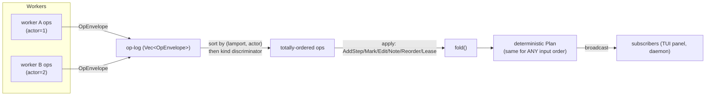
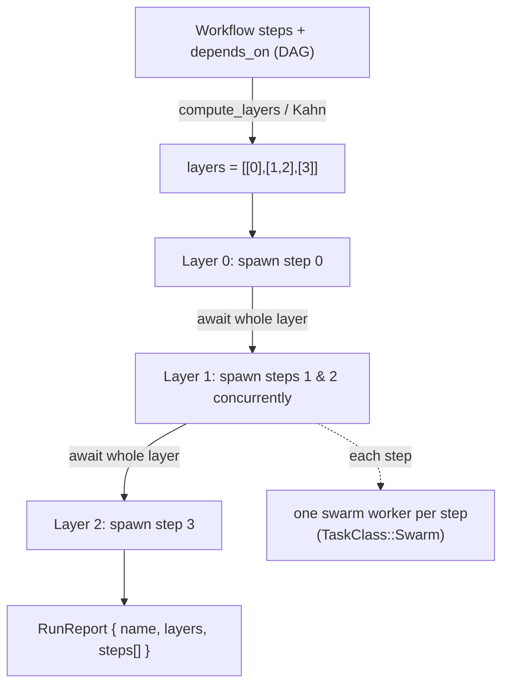

# Swarm, Multi-Agent & Orchestration

> **Last reviewed against workspace version 0.9.8**

## Abstract

`origin` is a multi-agent system at its core. A single interactive turn can fan
out into a *swarm* of sub-agents, each pursuing a narrow goal under an explicit
tool allow-list and resource budget, all editing a **shared plan** that is a
CRDT op-log folded deterministically into a tree of steps. This document is the
authoritative reference for that subsystem: the coordinator/worker protocol
(`origin-swarm`), the conflict-free shared plan (`origin-plan`), the
dependency-layer fan-out used by workflows (`workflow_runner`), named agent
teams (`teams.rs`), goal-driven unattended runs (`origin-goal` +
`goal_driver.rs`), always-on/overnight autonomy under an adaptive token budget
(`origin-ambient` + `overnight.rs`/`ambient.rs`), clock-driven triggers
(`origin-schedule` + `scheduler.rs`), mid-execution steering
(`origin-steering`), and the agent-facing tool surface (`Task`, `RunWorkflow`,
`AuthorWorkflow`).

The design has three load-bearing invariants:

1. **Workers report structured data, not prose.** A worker returns a
   [`CompletionReport`](#the-swarm-protocol-origin-swarm) the parent can parse
   without an LLM round-trip; free-form text lives in a CAS-addressed
   transcript.
2. **Concurrent edits never conflict.** The shared plan is a CRDT whose fold is
   permutation-invariant, so any ordering of ops from any number of workers
   folds to the same `Plan`.
3. **Children cannot recurse and cannot starve their parent.** A sub-agent's
   tools are stripped of `Task`, and worker bodies run in a dedicated
   `TaskClass::Swarm` execution lane gated by a RAM-aware admission gate, so the
   parent↔child circular wait that a naive `Critical`-on-`Critical` design would
   cause is structurally impossible.

| Concern | Crate / file | Key type(s) |
|---|---|---|
| Coordinator/worker protocol | `crates/origin-swarm/src/` | `Coordinator`, `WorkerSpec`, `CompletionReport` |
| Shared plan CRDT | `crates/origin-plan/src/` | `Op`, `OpEnvelope`, `fold`, `Plan` |
| Real worker agent loop | `crates/origin-daemon/src/swarm_worker.rs` | `real_worker`, `AllowList` |
| Dependency-layer fan-out | `crates/origin-daemon/src/workflow_runner.rs` | `compute_layers`, `run_workflow` |
| Named teams | `crates/origin-swarm/src/team.rs`, `crates/origin-daemon/src/teams.rs` | `TeamRegistry`, `Team`, `Teammate` |
| Goal-driven autonomy | `crates/origin-goal/src/`, `crates/origin-daemon/src/goal_driver.rs` | `GoalState`, `DriverDecision`, `drive_decision` |
| Ambient & overnight policy | `crates/origin-ambient/src/lib.rs` | `BudgetPolicy`, `IdleTracker`, `OvernightDriver` |
| Ambient/overnight daemon loops | `crates/origin-daemon/src/{ambient,overnight}.rs` | `maybe_spawn`, `select_task` |
| Scheduling | `crates/origin-schedule/src/lib.rs`, `crates/origin-daemon/src/scheduler.rs` | `Schedule`, `parse_schedule`, `due_triggers` |
| Steering | `crates/origin-steering/src/lib.rs` | `SteeringQueue`, `merge_into_prompt` |
| Admission control | `crates/origin-swarm/src/admission.rs` | `AdmissionGate`, `MemoryProbe` |
| Agent-facing tools | `crates/origin-tools/src/builtins/{task,run_workflow,author_workflow}.rs` | `Task`, `RunWorkflow`, `AuthorWorkflow` |

---

## The swarm protocol (origin-swarm)

`crates/origin-swarm/src/lib.rs` wires three pieces together (lib.rs docs,
Phase 9.6 / N7.5):

- **`Coordinator`** (`coordinator.rs`) dispatches workers and aggregates their
  reports.
- **`PlanHandle`** (`rpc.rs`) is the shared, mutex-guarded plan fold every
  worker authors against.
- **`CompletionReport`** (`report.rs`) is the structured worker → coordinator
  handoff — no prose, only `plan_updates`, `files_touched`, `decisions`,
  `follow_ups`, a transcript CAS handle, and `Usage` accounting.

### The coordinator/worker model

One `Coordinator` owns a single logical "room" / session
(`crates/origin-swarm/src/coordinator.rs:113`). Internally it keeps:

- `plan: PlanHandle` — the shared CRDT fold handed to every worker;
- `workers: Arc<Mutex<HashMap<WorkerId, WorkerState>>>` — per-worker bookkeeping;
- `default_worker: WorkerFn` — the closure run on `spawn` (the
  `default_noop_worker` until the daemon installs `real_worker` via
  `set_default_worker`);
- `gate: Arc<AdmissionGate>` — the process-shared, RAM-governed admission gate;
- `collab: Option<RoomCollab>` — room-wide real-time collaboration state (file
  read registry + per-worker mailboxes), built only when `ORIGIN_SWARM_COLLAB`
  is set.

A `WorkerId` is an opaque ULID (`coordinator.rs:64`); `WorkerHandle` wraps it
and is the token a caller passes to `await_completion`.

### Dispatch: goal + allowed tools + budget

A worker is described by `WorkerSpec` (`crates/origin-swarm/src/spec.rs:71`):

```rust
pub struct WorkerSpec {
    pub goal: String,                    // natural-language goal
    pub allowed_tools: Vec<String>,      // allow-list of tool names (globs ok)
    pub budget: Budget,                  // resource ceiling
    pub workspace: Option<PathBuf>,      // optional CoW workspace root (P9.5)
    pub parent_actor: ActorId,           // threads Lamport ordering into ops
    #[serde(default)]
    pub model: Option<String>,           // per-agent model override (openclaude)
    #[serde(default)]
    pub mcp_servers: Vec<McpServerSpec>, // inline MCP-per-subagent (gap 9b)
}
```

`Budget` (`spec.rs:20`) is a four-field ceiling: `max_wall_ms`,
`max_input_tokens`, `max_output_tokens`, `max_tool_calls`. The real worker loop
checks the budget at tool-call boundaries; the noop worker never spends any.

`Coordinator::spawn` (`coordinator.rs:186`) delegates to `spawn_inner`, which:

1. generates a `WorkerId` and a `watch::channel` seeded at `Lifecycle::Spawning`;
2. registers the worker's `Mailbox` in the shared room map *before* spawning
   (so a sibling that later edits a path this worker reads can find it) when
   collab is on;
3. builds the `WorkerContext { plan, budget, parent_actor, spec, collab,
   progress }` (`worker.rs:74`);
4. **acquires memory admission before spawning** via `self.gate.admit().await`
   — a parked admit holds nothing, so it can never be the resource a running
   worker needs (deadlock-freedom);
5. spawns the worker body in `TaskClass::Swarm` (an independent permit pool,
   *not* `Critical` and *not* `Bulk`), moving the admission ticket into the task
   so its RAII `Drop` releases the reserve on every exit path.

The lifecycle a spawn publishes is: `Spawning → Running → Reporting → Done`
(or `→ Failed { reason }`) — see `crates/origin-swarm/src/lifecycle.rs`. A
worker's terminal `CompletionReport` lands in a per-worker `report_slot` *before*
`Done` is published, so `await_completion` (`coordinator.rs:347`) can read it
once it observes the transition. A separate `last_completion` slot is a coarse
test-only "most recent any-worker" helper.

### The `WorkerFn` and the real worker

```rust
pub type WorkerFn = Arc<
    dyn Fn(WorkerContext) -> Pin<Box<dyn Future<Output = Result<CompletionReport, SwarmError>> + Send>>
        + Send + Sync,
>;
```
(`crates/origin-swarm/src/worker.rs:96`)

`default_noop_worker` (`worker.rs:105`) immediately returns `Completed` with
empty fields — the P9.6 placeholder. The daemon replaces it at startup with
`real_worker` (`crates/origin-daemon/src/swarm_worker.rs:207`), which:

- snapshots the active provider and the worker's `model` override (per-agent
  routing);
- builds a fresh `Session`, spins up any inline MCP servers
  (`build_runtime_tools`, namespacing tools `mcp__<server>__<tool>`);
- narrows the child's tools to its allow-list **minus `Task`** via the
  `AllowList` prompter (`swarm_worker.rs:159`) — `Task` is denied even under a
  `*` glob, forbidding recursion;
- forks a session-isolated `Plan` view that *shares* the daemon's
  content-addressed handle bands (sub-agent prefix-cache inheritance, N7.1/P9.7);
- drives `run_loop` for `max_turns` (the budget's `max_tool_calls`, default 32),
  optionally relaying per-tool `ToolStarted` progress to the TUI swarm panel;
- maps the `LoopSummary` into a `CompletionReport` (`Completed` on success;
  `GoalUnreachable` with a `detail` string on loop failure — a sub-agent failure
  surfaces to the parent as **data**, not a torn-down turn).

### The CompletionReport shape

`crates/origin-swarm/src/report.rs:24` — the structured handoff (N7.5):

```rust
pub struct CompletionReport {
    pub goal: String,                    // verbatim goal the worker was given
    pub status: ReportStatus,            // terminal status (enum below)
    pub plan_updates: Vec<OpEnvelope>,   // ordered plan-op envelopes authored
    pub files_touched: Vec<[u8; 32]>,    // 32-byte blake3 CAS handles
    pub decisions: Vec<DecisionRecord>,  // explicitly logged decisions
    pub follow_ups: Vec<TaskRef>,        // suggested follow-up tasks
    pub transcript_handle: [u8; 32],     // CAS handle of full transcript
    pub usage: Usage,                    // provider token / tool-call accounting
    #[serde(default, skip_serializing_if = "Option::is_none")]
    pub detail: Option<String>,          // optional human-readable detail
}
```

| Field | Type | Meaning |
|---|---|---|
| `goal` | `String` | Verbatim copy of the dispatched goal |
| `status` | `ReportStatus` | `Completed` \| `GoalUnreachable` \| `BudgetExhausted` \| `Aborted` |
| `plan_updates` | `Vec<OpEnvelope>` | In-order CRDT ops the worker authored (already applied; carried for audit) |
| `files_touched` | `Vec<[u8; 32]>` | CAS handles of files created/rewritten |
| `decisions` | `Vec<DecisionRecord>` | `{ at_lamport, decision, rationale }` records |
| `follow_ups` | `Vec<TaskRef>` | `{ goal, allowed_tools }` the parent may dispatch |
| `transcript_handle` | `[u8; 32]` | CAS address of the worker's full chat log |
| `usage` | `Usage` | `{ input_tokens, output_tokens, tool_calls }` |
| `detail` | `Option<String>` | Error string when `status == GoalUnreachable`, else `None` |

`ReportStatus` (`spec.rs:119`) has four variants: `Completed`,
`GoalUnreachable`, `BudgetExhausted`, `Aborted`. `Usage` (`spec.rs:108`) is
`{ input_tokens: u64, output_tokens: u64, tool_calls: u32 }`. `DecisionRecord`
(`spec.rs:132`) anchors a decision to a Lamport timestamp.

`CompletionReport::store_in_cas` (`report.rs:63`) bincode-encodes the report
into the CAS and returns its 32-byte handle, so completion fan-out passes a
compact handle instead of the full body.

---

## The shared plan (origin-plan)

`crates/origin-plan/src/` is the pure CRDT substrate (Phase 9.1) that lets many
concurrent workers edit one plan tree without coordination. The crate owns only
the conflict-free types and the fold; the `PlanHandle` that wraps them with
persistence + broadcast lives in `origin-swarm` (it is the first consumer).

### Why a CRDT?

A swarm is, by construction, many actors mutating one shared structure
concurrently. Locking the plan would serialize them and re-introduce the
parent↔child contention the `TaskClass::Swarm` lane exists to avoid. Instead the
plan is an **op-log**: every mutation is an `Op` wrapped in an `OpEnvelope`
carrying the producing `ActorId` and a `Lamport` timestamp. The canonical state
is the deterministic **fold** of that log. Because the fold sorts by
`(lamport, actor)` before applying, *any* ordering of ops from *any* number of
workers folds to the identical `Plan` — the fold is permutation-invariant
(`crates/origin-plan/src/fold.rs:5`).

### The op alphabet

`crates/origin-plan/src/ops.rs:146` — the seven CRDT op types:

| Op | Payload | Semantics |
|---|---|---|
| `AddStep` | `{ id, parent, body, key }` | Insert a step at Logoot position `key` under `parent` (root if `None`). **First-writer-wins** on `StepId`. |
| `MarkStep` | `{ id, status }` | Set a step's `Status` (`Pending`/`InProgress`/`Done`/`Cancelled`). **Last-writer-wins** on `(lamport, actor)`. |
| `EditContent` | `{ id, body }` | Replace a step body. **Last-writer-wins**. |
| `AddNote` | `{ id, body }` | Append a note to a step. Notes form an ordered list driven by `(lamport, actor)`. |
| `Reorder` | `{ id, key }` | Move a step to a new Logoot position. **Last-writer-wins**. |
| `LeaseStep` | `{ step, expires_at_ms }` | Request a worker lease on a step (N7.6). Race winner is the lexicographically larger `(lamport, actor)`. Expired leases are filtered from `lease_holder` but stay in the fold state (determinism). |
| `Snapshot` | `Snapshot` | Persistence-layer fast-forward marker (P9.3/N7.7). Folding one is a **no-op**; restoration loads the CAS-stored body directly via `PlanStore::load_latest_snapshot`. |

Each `OpEnvelope` (`ops.rs:202`) is `{ actor: ActorId, lamport: Lamport, op: Op }`
and exposes `key() -> OpKey` = `(lamport, actor)`, the total-order sort key.

### Deterministic fold semantics

`fold<I: IntoIterator<Item = OpEnvelope>>(envs) -> Plan` (`fold.rs:22`):

1. Collect all envelopes, then `sort_by` `(lamport, actor)` with the op-kind
   discriminator (`Op::kind_discriminator`, `ops.rs:172`) as a degenerate
   tie-breaker for the should-never-happen case of identical keys.
2. Apply in sorted order:
   - `AddStep` → `plan.insert(Step::from_add(...))`;
   - `MarkStep`/`EditContent`/`Reorder` → mutate the step *iff present*, each
     last-writer-wins on the field's highest `OpKey` seen;
   - `AddNote` → `push_note` in fold order (stably sorted);
   - `LeaseStep` → `plan.apply_lease`, with races resolved by
     `LeaseRecord::supersedes`;
   - `Snapshot` → no-op.

The determinism rules, summarized from `crates/origin-plan/src/lib.rs:16`:

- **Total order** over the log is `(lamport, actor)`; op-kind is the degenerate
  tie-breaker.
- `EditContent`, `MarkStep`, `Reorder` are **last-writer-wins** on that key —
  each step tracks the highest key per field.
- `AddNote` appends in fold order — notes stably sort by `(lamport, actor)`.
- `AddStep` is **first-writer-wins** on `StepId` (duplicate ids are a producer
  bug, not a fold failure).
- **Drop-on-floor**: ops referencing an unknown `StepId` are silently dropped.
  This is correct mid-stream: a peer may not yet have delivered the
  corresponding `AddStep`; once it does, re-folding the now-complete log yields
  the right state. The `unknown_id_ops_are_dropped` test (`fold.rs:111`) pins
  this.

`StepId` (`ops.rs:20`) holds a 128-bit value (ULID / content-hash prefix) and
serializes as 32-char lowercase hex (serde_json lacks native `u128`). Position
keys come from `LogootKey::between` (`logoot.rs`), which produces dense,
totally-ordered list positions without coordinator round-trips, so `Reorder` is
a pure local computation.

### The PlanHandle funnel

`crates/origin-swarm/src/rpc.rs:39` — `PlanHandle` is the single funnel for all
op authoring. `apply(op)` (`rpc.rs:79`):

1. Persists the envelope via `PlanStore::append_op` **before** mutating
   in-memory state (under the log lock, no `.await` inside the guard), so on a
   persistence failure the `?` returns before the log push and the Plan
   overwrite — no lost update, no orphan op.
2. Pushes the op onto the in-memory log and **re-folds the entire log** into the
   canonical `Plan` (O(n log n) per apply; P9.3 snapshot compaction keeps the
   log bounded so the amortized cost stays low).
3. Broadcasts the envelope to every subscriber (`broadcast::channel`, capacity
   64; laggards see `RecvError::Lagged` and recover by re-`snapshot()`-ing).

`subscribe()` (`rpc.rs:104`) feeds the TUI plan panel (P9.9); `snapshot()`
(`rpc.rs:109`) takes a cheap clone of the current fold. `PlanHandle` is cheap to
clone — every field is `Arc`/`Sender`-backed — and each worker receives a clone
in its `WorkerContext`.

---

## Dependency-layer fan-out (workflow_runner)

`crates/origin-daemon/src/workflow_runner.rs` is the **fan-out** path behind the
`RunWorkflow` tool and the `origin workflow run` verb. It complements — but is
entirely separate from — the linear `{workflow:<name>}` skill-mask sequencer in
`workflow_progress`, which walks one step at a time and never fans out. The
linear path is byte-identical and does not call into this module.

A daemon `Workflow` is a list of `WorkflowStep`s, each carrying an `id` and a
`depends_on` set (the authored phase-layered DAG). The runner has two halves:

### 1. Layering

`compute_layers(workflow) -> Result<Vec<Vec<usize>>, RunError>`
(`workflow_runner.rs:93`) re-derives the dependency layering rather than
trusting a stored field, so a hand-edited `workflows.toml` is validated. It
builds an `origin_workflowgen::WorkflowSpec` mirroring the steps' `id`/
`depends_on`, runs the crate's Kahn layering (`execution_layers` — the single
topological-sort source of truth), then maps each layer's ids back to
*positions* in `workflow.steps`. A cycle or dangling edge surfaces as
`RunError::Layering`. The diamond DAG `0 → {1,2} → 3` layers as
`[[0], [1,2], [3]]` (test `compute_layers_groups_independent_steps_into_one_layer`).

### 2. Per-layer concurrent dispatch

`run_workflow(workflow, coordinator, catalog) -> Result<RunReport, RunError>`
(`workflow_runner.rs:190`) is the spawn-all-then-await turn shape — exactly what
the `Task` tool uses (`task_spawn` + `task_await`):

```text
for each dependency layer (in order):
    spawn EVERY step in the layer up front  →  runs concurrently on the swarm pool
    await_completion on each                →  the WHOLE layer joins before the next
```

Spawning every step before awaiting any is what makes same-layer steps run in
parallel; joining the whole layer before the next guarantees a downstream step
never begins before its dependencies finish.

`step_worker_spec(step, catalog)` (`workflow_runner.rs:149`) derives each
worker's `WorkerSpec`:

- **Prompt (`goal`)**: `step.args` when non-empty; else the step skill's catalog
  description; else `"run the <skill> skill"`.
- **`allowed_tools`**: the step skill's declared `allowed-tools`, else
  `DEFAULT_STEP_TOOLS` = `["Read", "Grep", "Glob", "Edit", "Write"]`. Note that
  `Task` is always stripped by the worker substrate, so a workflow step can
  never recurse into another workflow's swarm.
- **`budget`**: `STEP_BUDGET` (`workflow_runner.rs:39`) =
  `Budget::new(300_000 ms wall, 1_000_000 in-tok, 256_000 out-tok, 32 tool-calls)`.

The aggregate result is a `RunReport { name, layers, steps }` where each
`StepReport { index, skill, layer, status }` carries the lower-snake-cased
terminal status (`completed`, `goal_unreachable`, `budget_exhausted`,
`aborted`) — the same vocabulary the `Task` tool emits.

---

## Teams (teams.rs)

Multi-agent **team composition** is present in two layers.

### Vocabulary + bookkeeping — `crates/origin-swarm/src/team.rs`

A pure, IO-free, async-free vocabulary layer on top of the real worker
substrate (WS-C; claude-code Agent Teams, cline). Key types:

| Type | Role |
|---|---|
| `Team` | `{ name, coordinator: WorkerId, teammates: Vec<Teammate> }` with register / lookup-by-name / `idle_teammates` helpers (`team.rs:106`). |
| `Teammate` | `{ id: WorkerId, name, status: TeammateStatus }` — a named real worker (`team.rs:79`). |
| `TeammateStatus` | `Idle` \| `Working { task }` \| `Done` (`team.rs:40`). |
| `TeamEvent` | The two lifecycle events: `TeammateIdle { teammate }` and `TaskCompleted { teammate, report_summary }` (`team.rs:195`). |
| `MissionLog` / `MissionEntry` | Append-only timeline with a plain-text `render()` (`team.rs:264`). Events: `Registered`, `Assigned { task }`, `Completed { summary }`, `Idled`. |
| `TeamRegistry` | Owns teams, mission logs, and one `Mailbox` per teammate; drives the status transitions and emits the events (`team.rs:356`). |

`TeamRegistry` is the single place that drives transitions so the mission log
and events stay consistent: `assign_task` → `Working` + `Assigned` entry (no
event); `complete_task` → `Done` + `Completed` entry + `TaskCompleted` event;
`mark_idle` → `Idle` + `Idled` entry + `TeammateIdle` event. Teammates DM each
other through their `WorkerId`-keyed mailboxes, reusing the WS-L collab
`Message`/`MsgScope` types (a `Direct` to another teammate is dropped;
`Repo`/`Broadcast` always deliver). `report_summary(&CompletionReport)`
(`team.rs:565`) builds the prose-free summary line
`"{status:?}: {goal} ({n} plan-ops, {m} files)"`.

### Daemon control plane — `crates/origin-daemon/src/teams.rs`

The thin adapter that holds a process-global `TeamRegistry` behind a
`OnceLock<Mutex<…>>` and drives it from IPC `Team*` verbs. **Default-off by
construction**: no team exists until a client sends `TeamCreate`, so default
daemon behaviour is byte-identical.

- `create_team(name)` — idempotent-by-replace; returns a `StreamEvent::TeamStatus`.
- `begin_assignment(team, teammate, task)` — registers a teammate against a
  fresh real `WorkerId` and flips it to `Working`.
- `run_teammate(coordinator, team, teammate, task)` (`teams.rs:159`) — spawns a
  **real** swarm worker via the daemon's live `Coordinator`
  (`spawn`/`await_completion`, on `TaskClass::Swarm` exactly like a `Task`
  sub-agent), then transitions `Working → Done → Idle`, journaling and bridging
  each `TeamEvent` onto the wire (`event_to_stream`) and lifecycle hooks
  (`event_to_notification`). Best-effort: a spawn/await failure still settles the
  teammate to `Done` with the error as the summary, so the team never wedges.
- Default teammate tools are read-only (`["Read", "Grep", "Glob"]`,
  `teams.rs:41`); the budget mirrors the `Task` default
  (`TEAMMATE_BUDGET`, 32 tool-calls).

---

## Goal-driven autonomy

> Cross-reference: the session/turn mechanics live in
> `docs/subsystems/agent-and-sessions.md`. This section focuses on the
> *orchestration* — how a goal drives an unattended multi-turn run to a
> completion condition.

`crates/origin-goal/src/` + `crates/origin-daemon/src/goal_driver.rs` implement
*persistent completion conditions*. The user sets a goal; the daemon then loops
the agent autonomously until a verifier confirms the goal is met, the budget is
exhausted, or the goal is blocked.

The novel mechanism (goal_driver.rs docs): the **main model self-tags** every
turn with a `<goal-status>` outcome, and the driver runs the cheap Haiku
**verifier only on `Met` claims** (at most once per goal). This keeps the
token-cost-per-goal proportional to ~80×N system-prompt tokens plus one verifier
call, instead of the ~50k×N full-transcript-per-turn eval other CLIs use.

After every `run_loop` return, `drive_decision(inputs, last_turn_text, verifier)`
(`goal_driver.rs:98`) dispatches on the last `<goal-status>` tag
(`origin_goal::TagOutcome`):

| Tag | Driver action |
|---|---|
| `Met` | Run the verifier. `Verdict::Met` → `Cleared { Met }` (reset rejection counter). `NotMet` → `Iterate` with the gap, counting rejections; after `MAX_CONSECUTIVE_VERIFIER_REJECTIONS` → `Cleared { VerifierRejected }`. `Malformed` → **not** fail-open; retry as `NotMet { unparseable }`. `RateLimit`/`Transport` → fail open, `Cleared { VerifierUnavailable }`. |
| `InProgress { what_remains }` | `Iterate` with the remaining work; reset rejection counter. |
| `Missing` | `Iterate` nudging the model to emit a tag this turn. |
| `Blocked { why }` | `Cleared { Blocked }` — a human-blocking goal stops the loop rather than spinning. |

The driver returns a `DecisionOutcome` (mutations + decision) so the caller can
do the lock-free async path (snapshot under a short lock, drive without the
lock, then `apply_outcome`). `DriverDecision` is either `Cleared { reason, iter,
tokens_spent }` or `Iterate { synthesized_prompt, iter_event }`. Bug #11: after
charging the verifier's own token spend, a post-charge `cap_check` lets the
budget reason win over a tentative `Met`. Verifier input is left-truncated to
the most recent 4 000 chars on a UTF-8 boundary (`truncate_for_verifier`).

---

## Ambient & overnight modes (origin-ambient)

`crates/origin-ambient/src/lib.rs` is the **pure policy core** for
resource-aware always-on and overnight autonomous work (jcode Ambient/OpenClaw
+ Overnight). It performs *no* execution, IO, or async — the daemon owns the
loop. The policy decides **when** ambient work may run, picks the **next** task
round-robin, names a PR-gated **branch**, and assembles a **morning report**.

### Adaptive token budget

`BudgetPolicy { total_daily_tokens, reserve_for_user }` (`lib.rs:112`) is the
"resource-aware" guarantee: ambient work spends from `total_daily_tokens` but
**never** consumes the final `reserve_for_user` tokens, so an interactive
session is never starved.

- `available(spent_today)` = `(total − reserve).saturating_sub(spent_today)`.
- `may_run(spent_today, est_cost)` = `est_cost <= available(spent_today)` — a
  task runs only if its estimate fits entirely within the non-reserved headroom.
- `reserve_for_user` is clamped to `total` at construction so headroom can never
  go negative.

The daemon loop wires concrete constants (`crates/origin-daemon/src/ambient.rs`):
`TOTAL_BUDGET_TOKENS = 1_000_000`, `USER_RESERVE_TOKENS = 200_000`,
`TASK_COST_TOKENS = 50_000` (the per-task estimate), `TICK = 60s`.

### Idle gating

`IdleTracker` (`lib.rs:63`) is a lock-free `AtomicU64` of the last user-activity
instant. `is_idle(now_ms, threshold_ms)` gates dispatch on the user having been
quiet ≥ `DEFAULT_MIN_IDLE_MS` (5 minutes). `note_activity` is monotonic-by-max,
so a stale call can never make the user appear *more* idle. The daemon exposes
`note_user_activity()` (`ambient.rs:57`) for the prompt path to call on every
interactive turn.

### Round-robin selection

`next_task(recent)` (`lib.rs:191`) advances through the fixed order
`[Tests, Refactor, Docs, MemoryGarden]`, never repeating the last task
immediately. `select_task` in the daemon (`ambient.rs:130`) only returns a task
when `budget.may_run(spent_today, TASK_COST_TOKENS)` holds.

### Always-on loop — `ambient.rs`

`maybe_spawn(sock_path)` (`ambient.rs:72`) is **default-off**: nothing spawns
unless `ORIGIN_AMBIENT=1`. When enabled, each `TICK` the loop consults the idle
gate and budget, picks a task, and **dispatches its prompt onto the live agent
path** by submitting a `ClientMessage::Prompt` to the daemon's own IPC socket
(`scheduler::dispatch_prompt`). Reusing the socket means the proactive turn runs
through the exact same provider/tool/permission path as an interactive turn.

### Overnight driver — `overnight.rs`

`maybe_spawn(sock_path)` (`overnight.rs:88`) is default-off behind
`ORIGIN_OVERNIGHT=1`. It runs a single **windowed** session driving an
`OvernightPlan` (`[Tests, Refactor, Docs, MemoryGarden]`) to completion within a
hard wall-clock ceiling (`DEFAULT_WALL_MS = 8h`, override `ORIGIN_OVERNIGHT_MS`).

`OvernightDriver` (`lib.rs:355`) is pure: it never reads the clock or executes
tasks. The daemon owns the loop and passes `now_ms` in:

- `next_due(now_ms)` — peek the next task while the window is open (does not
  advance the cursor).
- `record(task, tokens, pr)` — record the outcome and advance.
- `is_finished(now_ms)` — window elapsed **or** every task recorded.
- `into_report(day_unix)` — consume into a `MorningReport`.

Per-task token accounting uses **real usage**:
`scheduler::dispatch_prompt_with_usage` drains the turn's `StreamEvent::Usage`
frames and returns their summed `input + output` tokens; a zero total falls back
to the `TASK_COST_TOKENS` estimate via `real_or_estimate`/`observe_task_tokens`.

The optional `ORIGIN_OVERNIGHT_WORKTREE=1` runs each task against a dedicated
git **worktree + branch** (`branch_name(task, day) = origin/ambient/<slug>-<day>`),
so the user's live working tree is never switched. The
`MorningReport` (`lib.rs:227`) renders as Markdown (`Ran`, `Tokens spent`,
`PRs opened`, optional `Worktrees`) and persists to
`~/.origin/overnight/latest.{json,md}`.

### Safety bounds (ambient/overnight)

- **Default-off**: both loops require an explicit env var; unset ⇒ byte-identical.
- **Reserve guarantee**: ambient work never dips into `reserve_for_user`.
- **Idle gating**: ambient never interrupts an active user.
- **Wall-clock ceiling**: overnight stops at `max_wall_ms` regardless of
  remaining tasks; a persistently failing task still advances the cursor (zero
  tokens recorded) so it cannot wedge the window.
- **Isolation**: worktree mode confines edits to a branch; the live tree is
  untouched.

---

## Scheduling (origin-schedule)

`crates/origin-schedule/src/lib.rs` supplies the *time arithmetic* for
clock-driven agent triggers (claude-code `/schedule`+`/loop`, cline cron,
kilocode Triggers, opencode cron). Everything is deterministic `u64`-millisecond
math — no real timers, threads, IO, or clock reads. Civil time is decomposed
from the unix epoch with a self-contained UTC algorithm (Howard Hinnant's
`civil_from_days`), so the crate is std-only and trivially testable.

### Spec parsing

`parse_schedule(s) -> Result<Schedule, ScheduleError>` (`lib.rs:114`) accepts
three forms:

| Form | Example | `Schedule` variant |
|---|---|---|
| `@every <N><s\|m\|h\|d>` | `@every 5m` | `Interval { ms }` (positive only) |
| `@daily HH:MM` | `@daily 09:30` | `DailyAt { minute_of_day }` (UTC) |
| 5-field cron subset | `0 9 * * *` | `Cron { min, hour, dom, mon, dow }` |

Each cron `Field` (`lib.rs:47`) is `Any` (`*`) or `Only(Vec<u32>)` (a single int
or comma list); ranges and steps are intentionally unsupported.

### Next-fire computation

`Schedule::next_after(now_unix_ms) -> Option<u64>` (`lib.rs:241`) returns the
smallest fire time strictly greater than `now`:

- **Interval**: snaps `now` up to the next epoch-phase-aligned multiple (stable
  cadence across repeated calls).
- **DailyAt**: next occurrence of the minute-of-day, rolling to tomorrow if
  today's has passed.
- **Cron**: scans minute-by-minute up to `CRON_SCAN_MINUTES` (~366 days) and
  returns `None` if nothing matches within a year. Cron day matching follows
  vixie-cron: when both DOM and DOW are restricted, fire if *either* matches
  (`matches_day`, `lib.rs:291`); Sunday is both 0 and 7.

### Trigger queue — `scheduler.rs`

`crates/origin-daemon/src/scheduler.rs` is the **default-off** background tick
loop (`ORIGIN_SCHEDULER=1`). It periodically loads `~/.origin/schedule.toml`
(the same file `origin schedule add|ls|rm` manages). A trigger fires when its
`next_after` time lands in the half-open window `(last_tick_ms, now_ms]`
(`due_triggers`, `scheduler.rs:148`). Each due trigger's prompt is **dispatched
onto the live agent path** via a fresh client connection to the daemon's own IPC
socket — same provider/tool/permission path as an interactive turn, no
daemon-internal handles threaded into the loop. Triggers carry template
variables resolved from a named `profile` plus inline `env` (inline overrides
profile); built-in vars (`{{date}}`, `{{trigger_id}}`, `{{trigger_spec}}`,
`{{trigger_count}}`) always win on a name clash (`fire_vars`,
`resolve_trigger_vars`).

---

## Steering (origin-steering)

`crates/origin-steering/src/lib.rs` lets a user inject hints **mid-run** without
stopping the agent. Pure queue + merge, no IO.

`SteeringQueue` (`lib.rs:32`) is a FIFO `VecDeque<String>`: `push` queues a hint
while a turn is in flight; `drain_block` joins all queued hints (insertion
order, one per line) into a single block and clears the queue, returning `None`
when empty.

When the next turn is assembled, the block is injected as a **trailing suffix**:

- `merge_into_prompt(base_user_text, Some(block))` (`lib.rs:82`) appends
  `\n\n<steering>\n{block}\n</steering>` after the base text.
- `wrap_block(block)` (`lib.rs:95`) wraps a block as a standalone user message.

Crucially, steering is a *trailing* suffix so the stable prefix (system + prior
turns + base user text) stays **byte-identical** and Anthropic prefix caching
stays warm. The `STEER_OPEN`/`STEER_CLOSE` markers (`<steering>` /
`</steering>`) delimit the injected block so the model can distinguish it from
the original goal.

---

## Agent-facing API

Three builtin tools expose the orchestration subsystem to the model itself.

### `Task` — `crates/origin-tools/src/builtins/task.rs`

Dispatch a sub-agent (swarm worker) with a goal, allowed tools, and budget; it
runs concurrently and returns a structured `CompletionReport` summary. Input
schema (`task.rs:245`):

```json
{ "goal": "string", "allowed_tools": ["string"],
  "budget": {…}, "model": "string", "mcp_servers": [{…}] }
```

- **When to use**: parallelize independent units of work — spawn several at
  once. No permission prompt is required; the sub-agent is confined to the
  `allowed_tools` allow-list the parent grants.
- **Budget scoping**: `TaskBudget` defaults are **unlimited**
  (`max_wall_ms`/`max_input_tokens`/`max_output_tokens = u64::MAX`,
  `max_tool_calls = u32::MAX`) — a sub-agent runs to natural completion unless
  the caller passes an explicit smaller `budget` (omitted fields deserialize to
  the unlimited default). The internal real-worker default turn cap is 32 only
  when no cap is given via the swarm `Budget` path.
- **Tool scoping**: the parent's grant is glob-matched against the registry; the
  child can never see `Task` (recursion forbidden) even under `*`.
- **Output**: the tool inlines the actionable view — `status`, `summary`,
  `files_touched` (hex CAS handles), `follow_ups` (goal strings). The full
  report stays in CAS via its `transcript_handle`.

### `RunWorkflow` — `crates/origin-tools/src/builtins/run_workflow.rs`

Run a previously-authored workflow by name. Loads it from the user's workflows
file, groups its steps into dependency layers, and for each layer dispatches one
sub-agent per step concurrently (see
[Dependency-layer fan-out](#dependency-layer-fan-out-workflow_runner)). Each
step's `args` is the sub-agent's prompt; its tools come from the step skill's
declared allowed-tools. Returns a JSON summary (`RunReport`) of layers +
per-step status. Complements the linear `{workflow:<name>}` skill-mask
activation by actually fanning out to the swarm.

### `AuthorWorkflow` — `crates/origin-tools/src/builtins/author_workflow.rs`

Author a new, runnable workflow from a natural-language goal. Decomposes the
goal into an ordered explore/plan/implement/verify pipeline over the skills
currently available, persists it to the user's workflows file, and returns the
rendered TOML plus the chosen name. The result is immediately runnable via
`{workflow:<name>}` (linear) or `RunWorkflow` (fan-out).

### How budgets/tools are scoped to sub-agents

```text
parent agent
  └─ Task{ goal, allowed_tools, budget, model?, mcp_servers? }
        → Coordinator::spawn(WorkerSpec)              [TaskClass::Swarm]
            → real_worker(ctx)
                · narrow tools to allowed_tools  −  "Task"   (AllowList glob)
                · install inline MCP servers (mcp__<srv>__<tool>)
                · fork session-isolated Plan (shared handle bands)
                · run_loop for max(max_tool_calls, default 32) turns
            → CompletionReport { status, usage, files_touched, … }
        ← await_completion(handle)
```

A sub-agent's authority is **exactly** the intersection of the parent's grant
and the registry — never wider — and its resource consumption is bounded by the
`Budget` the parent supplies (or unlimited-to-natural-completion if omitted).

---

## Safety & resource governance

| Mechanism | Where | Guarantee |
|---|---|---|
| **Memory admission gate** | `crates/origin-swarm/src/admission.rs` | `Coordinator::spawn` admits through `AdmissionGate` before launching; admission is `min(static ceiling, live RAM governor)`, each in-flight worker debits a full reserve at admit (committed, not realised), and a `>= 1` forward floor always admits the first worker. Backpressure is *await*, never reject; a parked admit holds nothing. |
| **`TaskClass::Swarm` lane** | `coordinator.rs:284`, `swarm_worker.rs` | Worker bodies run in an independent permit pool — not `Critical` (which the parent holds while awaiting), not `Bulk` (which the `BulkGate` would park). Breaks the parent↔child circular wait. |
| **No recursion** | `swarm_worker.rs:159` (`AllowList`) | `Task` is stripped from every child's tools, denied even under a `*` glob, so a child can never re-enter the swarm pool. |
| **Tool allow-list** | `WorkerSpec.allowed_tools` + `AllowList` | A sub-agent can invoke only the glob-matched intersection of its grant and the registry. Workflow steps default to read+edit; teammates default to read-only. |
| **Token / wall / tool budgets** | `Budget` (`spec.rs:20`) | Per-worker ceiling on wall-ms, input/output tokens, and tool calls; `BudgetExhausted` is a terminal status. |
| **Ambient daily budget** | `BudgetPolicy` (`origin-ambient`) | Ambient/overnight work never spends the user reserve; spend caps are enforced before each dispatch. |
| **Context isolation** | `swarm_worker.rs` | Each worker builds a fresh `Session` and a session-isolated `Plan` view; per-session marker state is isolated so concurrent siblings never clobber each other (though they *share* content-addressed handle bands for prefix-cache reuse). |
| **Real-time collab cleanup** | `coordinator.rs:299` | On any exit path a worker's read-tracking and mailbox are dropped, so a finished worker is never notified and never leaks into a sibling's notice set. |
| **Crash-safe plan persistence** | `rpc.rs:79` | `PlanHandle::apply` persists before mutating in-memory state, so a store failure leaves the log, Plan, and subscribers untouched. |
| **Default-off autonomy** | `ambient.rs`, `overnight.rs`, `scheduler.rs`, `teams.rs` | Every autonomous loop and the team registry require an explicit env var / client verb; unset ⇒ byte-identical daemon behaviour. |

---

## Diagrams

### Coordinator → workers fan-out

```mermaid
flowchart TD
    P["Parent agent turn"] -->|Task / RunWorkflow| C["Coordinator (one per room)"]
    C -->|admit via AdmissionGate| G{"RAM headroom?"}
    G -->|park (await)| G
    G -->|admit| S1["spawn_inner → TaskClass::Swarm"]
    S1 --> W1["worker 1: real_worker(ctx)"]
    S1 --> W2["worker 2: real_worker(ctx)"]
    S1 --> W3["worker N: real_worker(ctx)"]
    W1 -->|CompletionReport| C
    W2 -->|CompletionReport| C
    W3 -->|CompletionReport| C
    W1 -. plan ops .-> PH["PlanHandle (shared CRDT)"]
    W2 -. plan ops .-> PH
    W3 -. plan ops .-> PH
    C -->|await_completion| P
```

### CRDT plan merge



### Dependency-layer scheduling



---

## Appendix: facts extracted from the workspace

**`CompletionReport` fields** (`crates/origin-swarm/src/report.rs:24`):
`goal: String`, `status: ReportStatus`, `plan_updates: Vec<OpEnvelope>`,
`files_touched: Vec<[u8; 32]>`, `decisions: Vec<DecisionRecord>`,
`follow_ups: Vec<TaskRef>`, `transcript_handle: [u8; 32]`, `usage: Usage`,
`detail: Option<String>`.

**`ReportStatus` variants** (`spec.rs:119`): `Completed`, `GoalUnreachable`,
`BudgetExhausted`, `Aborted`.

**CRDT op types** (`crates/origin-plan/src/ops.rs:146`, `enum Op`): `AddStep`,
`MarkStep`, `EditContent`, `AddNote`, `Reorder`, `LeaseStep`, `Snapshot`.

**Fold total order**: `(lamport, actor)`, op-kind discriminator as degenerate
tie-breaker; LWW for `EditContent`/`MarkStep`/`Reorder`, FWW for `AddStep`,
append-in-fold-order for `AddNote`, drop-on-floor for unknown `StepId`.
