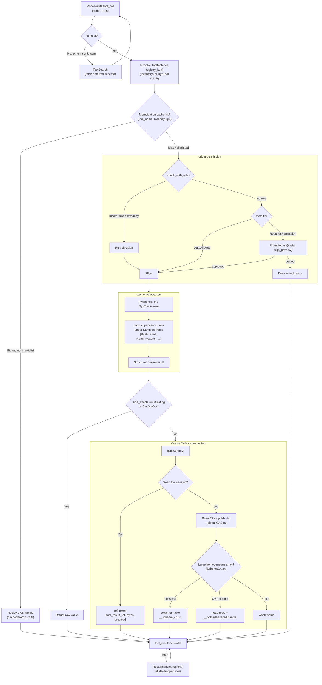

# Tool System

> **Subsystem:** `origin-tools` and its satellite crates
> **Workspace:** `origin` (agentic harness), Rust workspace at the repo root
> **Last reviewed against workspace version 0.9.8**

The **tool system** is the layer through which the `origin` agent acts on the
world: reading and writing files, shelling out, searching code, navigating
symbols, fetching the web, driving a browser, talking to MCP servers, querying
the code graph, and delegating to sub-agents. Every capability the model can
invoke is a *tool* with a name, a JSON-Schema input contract, a permission
**tier**, a declared **side-effect** class, and a per-tool **sandbox profile**.

Tools are registered at compile time into a single `inventory`-backed registry
(`origin-tools`), dispatched through an *envelope* that applies output
content-addressing and a per-session memoization cache, and bounded by an output
**compaction** stage (`SchemaCrush`) that turns large homogeneous result arrays
into compact tables and offloads the tail behind a content-addressed `Recall`
handle. Permission tiering decides whether an invocation prompts the user; a
**hot/deferred** split keeps cold tool schemas out of the system prompt until
the model fetches them on demand with `ToolSearch`.

This document is grounded in the source. It cites file paths and quotes the real
trait, macro, and metadata declarations. Cross-references:

- Output CAS handles, the session result-store, and the global CAS: see
  [`../architecture/data-and-storage.md`](../architecture/data-and-storage.md).
- Permission rules, sandbox enforcement, and the security envelope: see
  [`../security/security-model.md`](../security/security-model.md).
- Sub-agent dispatch (the `Task` / `RunWorkflow` tools): see
  [`agent-and-sessions.md`](agent-and-sessions.md).
- Code-graph tools (`graph_*`): see
  [`memory-and-codegraph.md`](memory-and-codegraph.md).

---

## The Tool trait & registry (origin-tools)

### Two execution models: compile-time `ToolMeta` + runtime `DynTool`

`origin-tools` does **not** model a tool as a single trait object that owns both
metadata and behaviour. Instead it splits the two concerns:

1. **`ToolMeta`** — the compile-time *metadata record* for every builtin tool.
   It is submitted into an `inventory` collection by the `origin_tool!` macro, so
   the full set of builtin tools is known at link time with zero runtime
   registration code.
2. **`DynTool`** — the runtime *behaviour* trait. It is what dispatch calls when
   a tool has no compile-time inventory entry — most importantly **MCP-discovered
   tools**, which are surfaced as `DynTool` objects (`origin-mcp`'s
   `McpToolProxy`).

Builtin tools expose their behaviour as plain async functions (e.g.
`read_v2`, `bash_v2`, `recall_tool`) invoked by the daemon's dispatcher keyed on
`ToolMeta.name`; their *metadata* is the `ToolMeta` inventory entry.

The trait, from `crates/origin-tools/src/lib.rs`:

```rust
/// Runtime tool object — what dispatch actually calls when a tool has no
/// compile-time inventory entry (MCP-discovered tools live here).
#[async_trait::async_trait]
pub trait DynTool: Send + Sync + std::fmt::Debug {
    fn meta(&self) -> &ToolMeta;
    /// `args` is JSON; the returned `Value` is the tool's structured result.
    async fn invoke(&self, args: serde_json::Value) -> Result<serde_json::Value, String>;
}
```

### The metadata record

`crates/origin-tools/src/registry.rs` defines `ToolMeta` and the `inventory`
collection that backs the registry:

```rust
#[derive(Debug)]
pub struct ToolMeta {
    pub name: &'static str,
    pub description: &'static str,
    pub tier: Tier,
    pub urgency: Urgency,
    pub side_effects: SideEffects,
    pub input_schema: &'static str,
    /// Per-tool sandbox profile applied to child processes this tool spawns.
    pub sandbox_profile: SandboxProfile,
    /// Approximate token budget for this tool's serialised result (default 25k).
    pub token_budget: u32,
    /// "Hot" tools have their full schema embedded in the system prompt.
    /// "Deferred" tools advertise only {name, description}; their schemas
    /// are fetched on demand via `ToolSearch`.
    pub hot: bool,
}

inventory::collect!(ToolMeta);

#[must_use]
pub fn registry_iter() -> impl Iterator<Item = &'static ToolMeta> {
    inventory::iter::<ToolMeta>.into_iter()
}
```

`registry_iter()` is the single enumeration point: the daemon walks it to build
the model-facing tool list, the permission engine reads `meta.tier`, and
`ToolSearch` filters it by `hot`.

The supporting enums live in `crates/origin-tools/src/lib.rs`:

```rust
pub enum Tier { AutoAllowed, RequiresPermission }
pub enum Urgency { Low, Medium, High }
pub enum SideEffects { Pure, Mutating }
```

- **`Tier`** drives the permission prompt (see §4).
- **`SideEffects`** governs output-CAS dedup and memoization: `Mutating` tools
  are never deduped and never memoized.
- **`Urgency`** is advisory scheduling metadata.
- **`SandboxProfile`** (re-exported from `origin-sandbox`) is the per-tool
  confinement applied to any child process the tool spawns.

`DEFAULT_TOKEN_BUDGET` is `25_000` (`lib.rs`).

### The registration macro

Tools register their metadata with the `origin_tool!` macro
(`crates/origin-tools/src/macros.rs`). It is a declarative macro with four
arms, from "everything specified" down to "defaults for sandbox, token_budget,
and hot". The fullest form:

```rust
#[macro_export]
macro_rules! origin_tool {
    (
        name: $name:literal,
        description: $desc:literal,
        tier: $tier:expr,
        urgency: $urg:expr,
        side_effects: $sfx:expr,
        input_schema: $schema:expr,
        sandbox: $sandbox:expr,
        token_budget: $budget:expr,
        hot: $hot:expr
        $(,)?
    ) => {
        inventory::submit! {
            $crate::ToolMeta {
                name: $name,
                description: $desc,
                tier: $tier,
                urgency: $urg,
                side_effects: $sfx,
                input_schema: $schema,
                sandbox_profile: $sandbox,
                token_budget: $budget,
                hot: $hot,
            }
        }
    };
    // … shorter arms default `sandbox: SandboxProfile::Inherit`,
    //    `token_budget: DEFAULT_TOKEN_BUDGET`, and `hot: true`.
}
```

The shorter arms apply, in order: default `hot: true`; default
`token_budget: DEFAULT_TOKEN_BUDGET`; default
`sandbox_profile: SandboxProfile::Inherit`. So a minimal registration only needs
`name`, `description`, `tier`, `urgency`, `side_effects`, and `input_schema` —
everything else defaults. A representative real registration, the `Read` tool
(`crates/origin-tools/src/builtins/read.rs`):

```rust
crate::origin_tool! {
    name: "Read",
    description: "Read a file at the given path. Optional `offset` (0-based line) and `limit` (default 1000). `as: image|pdf|text`.",
    tier: Tier::AutoAllowed,
    urgency: Urgency::Low,
    side_effects: SideEffects::Pure,
    input_schema: r#"{
        "type": "object",
        "properties": {
            "file_path": { "type": "string" },
            "offset":    { "type": "integer", "minimum": 0 },
            "limit":     { "type": "integer", "minimum": 1, "maximum": 50000 },
            "as":        { "type": "string", "enum": ["text", "image", "pdf"] }
        },
        "required": ["file_path"]
    }"#,
    sandbox: ::origin_sandbox::SandboxProfile::ReadFs,
}
```

The `input_schema` is stored as a `&'static str` — a JSON-Schema literal. It is
parsed lazily (in `ToolSearch`, via `serde_json::from_str`) rather than at
registration, which keeps the registry cheap and `const`-friendly.

### Sandbox profiles

`crates/origin-sandbox/src/profile.rs` defines the per-tool confinement enum
carried on each `ToolMeta`. Ordinals are part of the IPC ABI (carried on
`LifecycleEvent::PreTool`/`PostTool` and the hook envelope):

| Variant | Ordinal | Meaning |
| --- | --- | --- |
| `Inherit` | 0 | No sandbox layer; child inherits the daemon's privileges (default). |
| `ReadFs` | 1 | Read-only filesystem scoped to the workspace + standard libs. |
| `WriteCwd` | 2 | Read-only outside workspace; read+write inside the session cwd. |
| `Shell` | 3 | Shell-class: read+write cwd, exec stdlib binaries, no network. |
| `Network` | 4 | Read-only fs + outbound HTTPS (443) + DNS; no write, no listen. |

Enforcement is OS-specific (`backend_linux.rs`, `backend_macos.rs`,
`backend_windows.rs`, `backend_noop.rs`). On the default feature set the no-op
backend is used: a non-`Inherit` profile only logs a warning. The
`proc_supervisor` forwards `SpawnOpts.sandbox_profile` to `origin_sandbox::apply`
just before `spawn()`; `Bash` runs under `Shell`
(`crates/origin-tools/src/builtins/bash.rs`).

### Tool error taxonomy

Every builtin returns a structured `ToolError` rather than a free-form string
(`crates/origin-tools/src/error.rs`). The envelope serialises it to
`{kind, message, recoverable, hint?}` so the agent loop can pattern-match
recoverable failures without re-parsing prose:

```rust
pub enum ErrClass { Io, Edit, Bash, Regex, Budget, Subsystem, Validation }

pub struct ToolError {
    pub class: ErrClass,
    pub reason: &'static str,
    pub message: String,
    pub recoverable: bool,
    pub hint: Option<String>,
}
```

`to_json()` renders `kind` as `"{class}.{reason}"`, e.g. `"edit.no_match"` with
`recoverable: true` and `hint: "widen the context"`.

---

## Builtin tools

The builtin tools are registered across `crates/origin-tools/src/builtins/`
(one module per tool, listed in `builtins/mod.rs`). The table below is the
**complete** set of `origin_tool!` registrations as of 0.9.8, with the tier,
side-effect class, sandbox profile, and hot/deferred flag taken verbatim from
each module's registration.

| Tool | Purpose | Tier | Side-effects | Sandbox | Hot | Notes |
| --- | --- | --- | --- | --- | --- | --- |
| `Read` | Line-numbered file read; `as: text\|image\|pdf` | AutoAllowed | Pure | `ReadFs` | yes | Refuses symlinks; default limit 1000 lines, max 50000; images report dims, PDFs extract text (`read.rs`). |
| `Write` | Create/overwrite a UTF-8 file (atomic) | RequiresPermission | Mutating | `WriteCwd` | yes | Refuses to clobber an unread existing file unless `force` (`write.rs`). |
| `Edit` | Find-and-replace a unique string in a file | RequiresPermission | Mutating | `WriteCwd` | yes | CRLF-safe; `replace_all` for multi-match (`edit.rs`). |
| `MultiEdit` | Apply a sequence of edits to one file atomically | RequiresPermission | Mutating | `WriteCwd` | yes | Single read + single write per call (`multi_edit.rs`). |
| `ApplyPatch` | Apply a unified-diff or codex/opencode marker-envelope patch across files | RequiresPermission | Mutating | `WriteCwd` | yes | Add/Delete/Update/Move directives; validates all ops before any write (`apply_patch.rs`). |
| `Bash` | Execute a shell command; foreground or `run_in_background` | RequiresPermission | Mutating | `Shell` | yes | Timeout default 120s / max 600s; stdout capped to ~96 KiB head+tail; backed by `proc_supervisor` (`bash.rs`). |
| `Monitor` | Tail output of a background `Bash` process by `pid` | AutoAllowed | Pure | `Inherit` | yes | Byte-offset ring buffer; `since_byte` to resume (`monitor.rs`). |
| `Grep` | Recursive regex search + `agentgrep:` DSL | AutoAllowed | Pure | `Inherit` | yes | Modes `files_with_matches`/`content`/`count`; `agentgrep:outline:<path>` and `agentgrep:refs:<symbol>` (`grep_tool.rs`). |
| `Glob` | Find files matching a glob, mtime-sorted, gitignore-aware | AutoAllowed | Pure | `Inherit` | yes | (`glob_tool.rs`). |
| `LspNavigate` | Semantic nav: definition/references/incoming/outgoing calls | AutoAllowed | Pure | `Inherit` | **no** | Backed by the warm LSP fleet (`lsp_nav.rs`). |
| `Diagnostics` | LSP diagnostics for a path or workspace | AutoAllowed | Pure | `Inherit` | yes | Severity filter error/warning/hint/any (`diagnostics.rs`). |
| `WebFetch` | GET a URL, return reader-mode markdown; multi-URL batching | RequiresPermission | Pure | `Inherit` | **no** | Pure-Rust readability path (`web_fetch.rs`). |
| `WebSearch` | Tavily web search | RequiresPermission | Pure | `Inherit` | **no** | Requires `TAVILY_API_KEY` / vault key (`web_search.rs`). |
| `Browser` | Stateful dual-backend browser (agent-browser + Cloak fallback) | RequiresPermission | Mutating | `Inherit` | **no** | (`browser.rs`). |
| `Recall` | Inflate a CAS handle into the response; optional region slice | AutoAllowed | Pure | `Inherit` | **yes** | Hot on purpose: SchemaCrush offloads behind a `recall` handle (`recall.rs`). |
| `ToolSearch` | Fetch full schemas for deferred tools | AutoAllowed | Pure | `Inherit` | yes | `select:Name,Name` or keyword rank (`tool_search.rs`). |
| `Task` | Dispatch a sub-agent (swarm worker) | AutoAllowed | Mutating | `Inherit` | **yes** | No prompt; child confined to `allowed_tools` (`task.rs`). |
| `ask` | Free-text question routed to code-graph / memory | AutoAllowed | Pure | `Inherit` | **no** | No LLM in the router (`ask.rs`). |
| `ask_user` | Structured single/multi-select question to the human | AutoAllowed | Pure | `Inherit` | **no** | High urgency; `allow_custom` free-text (`ask_user.rs`). |
| `AuthorWorkflow` | Author a runnable workflow from an NL goal | RequiresPermission | Mutating | `Inherit` | **no** | Persists to the user's workflows file (`author_workflow.rs`). |
| `RunWorkflow` | Run a previously-authored workflow by name | RequiresPermission | Mutating | `Inherit` | **no** | Fans out per dependency layer (`run_workflow.rs`). |
| `gmail` | Read-only Gmail: `search` / `get` / `list_threads` | RequiresPermission | Pure | `Inherit` | **no** | Google OAuth refresh-token leg via keyvault (`gmail.rs`). |
| `mem_search` | Semantic search over cross-session memory | AutoAllowed | Pure | `Inherit` | **no** | (`mem.rs`). |
| `mem_save` | Persist a memory across sessions | RequiresPermission | Mutating | `Inherit` | **no** | (`mem.rs`). |
| `mem_forget` | Permanently delete a memory by id | RequiresPermission | Mutating | `Inherit` | **no** | High urgency (`mem.rs`). |
| `graph_query` | Typed code-graph query (neighbors/path/communities/…) | AutoAllowed | Pure | `Inherit` | **no** | Returns a CAS handle (`graph_query.rs`). |
| `graph_explain` | Typed query routed through the sidecar with an NL template | AutoAllowed | Pure | `Inherit` | **no** | Only NL-output graph tool (`graph_explain.rs`). |
| `graph_path` | Find a path between two code entities by id | AutoAllowed | Pure | `Inherit` | **no** | `{from, to, max_hops?}` (`graph_path.rs`). |
| `graph_summarize` | Summarize a community or node neighborhood | AutoAllowed | Pure | `Inherit` | **no** | CAS-handled bullets (`graph_summarize.rs`). |
| `graph_rebuild` | Rebuild the code graph over paths | RequiresPermission | Mutating | `Inherit` | **no** | Async; returns a job handle (`graph_rebuild.rs`). |

**Counts:** 30 builtin tool registrations. `mem.rs` registers three tools
(`mem_search`, `mem_save`, `mem_forget`) from one module; every other module
registers exactly one. Hot (schema-in-prompt) tools: `Read`, `Write`, `Edit`,
`MultiEdit`, `ApplyPatch`, `Bash`, `Monitor`, `Grep`, `Glob`, `Diagnostics`,
`Recall`, `ToolSearch`, `Task` — the core file/shell/search loop plus the two
mechanisms (`Recall`, `ToolSearch`) needed to recover deferred capability.
Everything else is deferred.

### File-mutation safety

The four file mutators (`Write`, `Edit`, `MultiEdit`, `ApplyPatch`) all run under
`WriteCwd` and are `Mutating`. `ApplyPatch` validates the **entire** patch
(every Add/Delete/Update/Move target) against the on-disk state before touching
any file, so a malformed multi-file patch is rejected atomically with no partial
write (`apply_patch.rs` module docs). `Edit` reports `edit.no_match` (recoverable)
when the search string is absent and `edit.ambiguous` when it matches more than
once. `Read` refuses to follow symlinks even inside an allowed directory — a
defense-in-depth measure layered on top of `ReadFs`.

### Bash, the supervisor, and Monitor

`Bash` is backed by `proc_supervisor` (`crates/origin-tools/src/proc_supervisor.rs`),
which owns long-running children and exposes a byte-offset ring buffer per
process. Foreground `Bash` polls the supervisor until the child reaches a
terminal `ProcStatus` (`Exited`/`TimedOut`/`Killed`), draining the ring, and
returns `{status, exit_code, stdout}`. A `KillOnDrop` guard hard-kills the child
if the turn future is dropped (e.g. on Ctrl+C). `run_in_background: true` returns
`{status: "started", pid}` immediately; the model then tails the ring with
`Monitor` (`pid`, `since_byte`, `wait`). Stdout is capped to ~96 KiB, preserving
the head and tail (errors surface at the end) with an elision marker on a UTF-8
boundary.

---

## Permission tiering & lazy schemas

### Tier → prompt behaviour

The permission engine (`crates/origin-permission/src/lib.rs`) is a tier check
with a pluggable `Prompter`:

```rust
pub async fn check(meta: &ToolMeta, args_preview: &str, prompter: &dyn Prompter) -> Decision {
    match meta.tier {
        Tier::AutoAllowed => Decision { outcome: Outcome::Allow, reason: "tier=AutoAllowed".into() },
        Tier::RequiresPermission => {
            let allowed = prompter.ask(meta, args_preview).await;
            Decision { outcome: if allowed { Allow } else { Deny }, … }
        }
    }
}
```

- **`AutoAllowed`** tools (`Read`, `Grep`, `Glob`, `Diagnostics`, `LspNavigate`,
  `Recall`, `ToolSearch`, `Task`, the `graph_*`/`mem_search`/`ask` read paths)
  bypass the prompter entirely. Notably `Task` is `AutoAllowed` *despite* being
  `Mutating`: spawning a swarm worker never prompts, because the child is
  confined to the `allowed_tools` allow-list the parent grants and any
  governance/conseca deny overlay still applies (`task.rs` comment).
- **`RequiresPermission`** tools ask the user. This covers every file mutator,
  `Bash`, `WebFetch`/`WebSearch`/`Browser`, `mem_save`/`mem_forget`,
  `graph_rebuild`, `gmail`, and the workflow authors.

A second entry point, `check_with_rules`, consults a bloom-filter pre-check plus
a user-configured wildcard rule list *before* the tier check, keyed on
`"{meta.name}@{scope}"`. An explicit allow/deny rule short-circuits; otherwise
the call falls through to the tier check. This is how a user can pre-approve
`Bash@<project>` for a session. See
[`../security/security-model.md`](../security/security-model.md).

### Hot vs deferred (lazy schemas)

`ToolMeta.hot` controls how much each tool costs in the system prompt:

- **Hot** tools embed their full JSON-Schema in the prompt — the model can call
  them in one step.
- **Deferred** tools advertise only `{name, description}`. Their full schema is
  fetched on demand by `ToolSearch` (`crates/origin-tools/src/builtins/tool_search.rs`):

```rust
pub fn tool_search(args: &ToolSearchArgs) -> Result<Value, ToolError> {
    let max = args.max_results.unwrap_or(5) as usize;
    if let Some(rest) = args.query.strip_prefix("select:") {
        let names: Vec<&str> = rest.split(',').map(str::trim).collect();
        let arr = registry_iter().filter(|m| !m.hot && names.contains(&m.name)).map(meta_to_json).collect();
        return Ok(Value::Array(arr));
    }
    // keyword search: rank deferred tools by hit count in name + description …
}
```

Two query modes: `select:Name,Name` returns the exact named deferred tools, and
a free-text query ranks deferred tools by term-overlap in name+description (top
`max_results`, default 5). `meta_to_json` parses the stored schema literal and
returns `{name, description, input_schema}`.

This is why `Recall` and `Task` are deliberately **hot** even though they are
otherwise "advanced" tools: SchemaCrush's lossy tier offloads dropped rows behind
a `recall` handle, and if `Recall` were deferred the model might never discover
it to retrieve them; and `Task` being deferred was the reason swarm delegation
was historically never invoked. Their schemas are tiny, so the per-prompt cost
is negligible against the capability they unlock (`recall.rs`, `task.rs`
comments).

---

## Output compaction & CAS handles

Large tool outputs are the single biggest token sink in an agent loop. The tool
system bounds them with three cooperating mechanisms, in increasing aggression.

### 1. Session output-CAS dedup (the envelope)

`crates/origin-tools/src/tool_envelope.rs` wraps every tool call. For
**non-mutating, CAS-eligible** results it hashes the serialised body (blake3) and
stores it once per session in a `ResultStore`
(`crates/origin-tools/src/result_cas.rs`). On a byte-identical *repeat* within the
session it returns a short reference token instead of the full body:

```rust
if ctx.result_store.get(&hash).is_some() {
    return Ok(ref_token(&hash, body_bytes.len(), &body_str)); // {tool_result_ref, bytes, preview}
}
let _ = ctx.result_store.put(body_bytes);
Ok(value)
```

Because the bytes are byte-identical across calls, the provider's prompt cache
hits and the incremental token cost is ~0. **Mutating** tools and `CasOptOut`
callers bypass dedup entirely (`EnvelopeMode`). The `ref_token` carries an
80-char preview so the model can recognise the elided body.

### 2. SchemaCrush — columnar rewrite + tail offload

`crates/origin-tools/src/array_crush.rs` (`SchemaCrush`) targets the *first*
emission of a large, homogeneous JSON array — `Grep`/`Glob` hit lists,
`graph_query` rows, `mem_search` results, MCP payloads — where the same object
keys repeat per element. Two tiers:

1. **Columnar rewrite (lossless).** An array of like-shaped objects becomes
   `{"__schema_crush":1,"columns":[…],"rows":[[…],…]}`. Off-schema rows are kept
   verbatim under an `exceptions` side-channel keyed by position, so
   `expand_value` reconstructs the original array byte-for-byte. Typically
   40–70% smaller; only committed if it wins by ≥10%.
2. **Tail offload (lossy, reversible).** If the columnar form still exceeds the
   token budget, the first `head_rows` are kept inline and the remaining rows are
   replaced by an `__offloaded` sentinel carrying `rows_offloaded` and a `recall`
   handle.

The transform is conservative: it only fires for arrays at/above `min_rows`
(default 8) whose elements are *mostly* (`min_homogeneity`, default 0.75)
homogeneous objects, and it never emits a body larger than it received.
`CrushConfig` defaults: `min_rows: 8`, `min_homogeneity: 0.75`,
`budget_tokens: 6_000`, `head_rows: 12`; `DEFAULT_MIN_BYTES` is 2 KiB.

```rust
pub fn crush_result_bytes(bytes: &[u8], original_handle_hex: &str, min_bytes: usize, cfg: &CrushConfig)
    -> Option<(Vec<u8>, CrushOutcome)>;
```

`origin` CAS-puts every tool result, so the *full uncrushed* body is always
retrievable; `original_handle_hex` is that hash, stamped into the lossy
sentinel's `recall` field via `set_offload_handle`.

### 3. Recall — inflate a CAS handle

`crates/origin-tools/src/builtins/recall.rs` is the reversibility substrate. It
reads the global CAS `Store` by handle and slices it per an optional `region`:

```rust
pub enum Region {
    Lines { start: usize, end: usize },   // 1-based inclusive
    Match { pattern: String },            // regex; matching lines in order
    OutlineOnly,                          // markdown headings + decl signatures
}

pub fn recall_tool(store: &Store, handle: [u8; 32], region: Option<Region>) -> Result<String, RecallError>;
```

`OutlineOnly` returns markdown headings and language declaration signatures
(Rust `fn/struct/enum/trait/impl`, Python `def/class`, JS `function/export …`),
capped at 200 lines. The MCP layer uses the same idea with its own envelope
(`{"cas":{"handle":…,"byte_len":N}}`, see §7).

The session `ResultStore` (in-process, `Arc<[u8]>` per body) and the durable
global CAS `Store` are described in
[`../architecture/data-and-storage.md`](../architecture/data-and-storage.md).

### Memoization cache

`crates/origin-tools/src/dispatch.rs` adds a per-session memoization `Cache`
keyed on `(tool_name, blake3(raw_input))`. Before running a tool the agent looks
up the key; a hit replays the prior CAS handle with a `(cached from turn N)`
annotation. The deny-list `MEMOIZATION_SKIPLIST = ["Bash", "Edit", "Write"]`
excludes tools whose side effects make a cached result stale.

---

## Edit formats (origin-editfmt) & post-edit policy (origin-postedit)

The structured tools (`Edit`/`MultiEdit`/`ApplyPatch`) are the *preferred* edit
path. But models frequently emit edits as **prose** — search/replace blocks,
fenced diffs, whole-file dumps, or unified diffs — and different model families
are reliable with different formats. `origin-editfmt` and `origin-postedit`
handle that reality.

### The model-tuned edit-format matrix (`origin-editfmt`)

`crates/origin-editfmt/src/lib.rs` parses four formats into a normalized `Hunk`
and applies them:

```rust
pub enum EditFormat {
    SearchReplace,  // aider-style <<<<<<< / ======= / >>>>>>> markers
    DiffFenced,     // a ```diff fence wrapping SEARCH/REPLACE
    WholeFile,      // full replacement of the file
    Udiff,          // minimal unified diff (--- / +++ / @@)
}

pub struct Hunk { pub file: String, pub before: String, pub after: String }
```

The per-model best-format table (`best_format_for`) is the matrix:

| Model family (prefix/contains, case-insensitive) | Best `EditFormat` |
| --- | --- |
| `claude*`, `anthropic`, `sonnet`, `opus`, `haiku` | `SearchReplace` |
| `gpt-4*`, `gpt4*`, `o1*`, `o3*` | `Udiff` |
| `deepseek*` | `DiffFenced` |
| `gpt-3.5*`, `turbo-instruct` | `WholeFile` |
| (unknown) | `SearchReplace` (fallback) |

`system_block(model)` builds an `<origin-edit-format>` prompt block tuned to the
model, telling it which format to prefer when showing an edit in prose outside
the structured tools. `format_from_text` detects the format actually used from
markers (`<<<<<<<`, a ```` ``` ```` fence, an `@@` hunk header), and
`extract_all_hunks(text, model)` auto-detects, falling back to the model's best
format. `apply` replaces the unique occurrence of `before` with `after`,
returning `EditFmtError::NoMatch` / `EditFmtError::Ambiguous` exactly like the
`Edit` tool. Whole-file hunks have an empty `before` and replace wholesale.

### Post-edit lint/test/format policy (`origin-postedit`)

`crates/origin-postedit/src/lib.rs` is pure config + decision logic — it never
spawns a process or touches the filesystem; the *caller* executes the chosen
commands. It decides three things after an edit:

1. **Which formatter to run.** A builtin table of ~40 `FormatterRule`s
   (opencode parity) maps a file extension to a format command:

   | Ext(s) | Command | Ext(s) | Command |
   | --- | --- | --- | --- |
   | `rs` | `rustfmt` | `go` | `gofmt` |
   | `py`, `pyi` | `ruff format` | `ts`,`tsx`,`js`,`jsx`,`mjs`,`cjs`,`json`,`css`,`scss`,`less`,`html`,`vue`,`svelte`,`yaml`,`yml`,`md`,`mdx`,`graphql` | `prettier` |
   | `c`,`cc`,`cpp`,`cxx`,`h`,`hpp` | `clang-format` | `kt`,`kts` | `ktlint` |
   | `ex`,`exs` | `mix format` | `rb` | `rubocop -a` |
   | `sh`,`bash` | `shfmt` | `lua` | `stylua` |
   | `toml` | `taplo fmt` | `dart` | `dart format` |
   | `swift` | `swift-format` | `zig` | `zig fmt` |
   | `nix` | `nixpkgs-fmt` | `tf` | `terraform fmt` |
   | `java` | `google-java-format` | | |

   `formatter_for(path)` consults the builtin table; `PostEditConfig::formatter_for`
   honours per-session `format_overrides` first (e.g. mapping `rs` →
   `leptosfmt`), then falls through to the builtin table. Extension matching is
   case-insensitive and path-separator-aware (`/` and `\`).

2. **Whether to lint and test.** `PostEditConfig { auto_lint, lint_command,
   auto_test, test_command, … }` mirrors aider's `auto-lint`/`auto-test`. Both
   default off; `validate()` rejects `auto_lint` without a `lint_command` and
   `auto_test` without a `test_command`.

3. **How many repairs to attempt.** `repair_decision(failures, prev_iters, cfg)`
   returns `Stop` (no failures), `Retry { iter }` (failures remain and
   `prev_iters < max_repair_iters`), or `GiveUp` (budget exhausted).
   `max_repair_iters` defaults to **2**.

The post-edit loop is therefore: apply edit → format the changed file → (lint?)
→ (test?) → on failure, feed the diagnostics back to the model up to
`max_repair_iters` times, then surface to the user.

---

## MCP integration (origin-mcp)

`origin-mcp` is a Model Context Protocol client: JSON-RPC over two transports,
OAuth bearer attachment, schema validation, CAS hand-off for large payloads, and
a proxy that surfaces remote tools into the same dispatch path as builtins. The
public surface (`crates/origin-mcp/src/lib.rs`):

```rust
pub use client::{ClientError, ListToolsResult, McpClient, McpTool, ToolCallResult};
pub use proxy::McpToolProxy;
pub use transport::{Transport, TransportError};
pub use transport_http::HttpTransport;
pub use transport_stdio::StdioTransport;
pub use oauth::{attach_bearer, OAuthBridgeError};
pub use cas_handoff::{cas_envelope, cas_handoff_if_large, HandoffOutcome};
pub use schema::{SchemaCache, ValidationError};
```

### The client and handshake

`McpClient` (`client.rs`) owns an `Arc<dyn Transport>` and a monotonic JSON-RPC
id allocator. It implements the three MCP methods origin needs:

- `initialize` — handshake with `protocolVersion: "2024-11-05"` and
  `clientInfo { name: "origin", version: … }`.
- `tools/list` — returns `ListToolsResult { tools: Vec<McpTool> }`. `McpTool`
  reads the wire's camelCase `inputSchema` (with a snake_case `input_schema`
  alias) and defaults to `{"type":"object"}` — without that rename every MCP
  tool would lose its parameter schema.
- `tools/call` — `{name, arguments}` → `ToolCallResult { content: Value }`.

### Transports

Both implement the object-safe `Transport` trait (`round_trip(request_json) ->
Value`).

- **stdio** (`transport_stdio.rs`): `StdioTransport::spawn(program, args)` spawns
  a child with piped stdin/stdout (`stderr` to null). Each request is written as
  a single newline-terminated JSON line; the reader accumulates bytes until the
  newline, enforcing the 16 MiB cap on every chunk (`limits::enforce_cap`) so a
  runaway server can't OOM the daemon before parse.
- **HTTP + SSE** (`transport_http.rs`): `HttpTransport::new(url, bearer)` POSTs
  the JSON body to `<base>` for request/response; `events()` opens an SSE stream
  against `<base>/events` framed by `eventsource-stream`, yielding each
  notification as a `serde_json::Value`. The bearer token lives behind a mutex
  and is rotated by `set_bearer` (OAuth).

### OAuth

`oauth.rs` is a thin bridge from the keyvault to the HTTP transport's bearer
slot. Tokens are stored under `(provider = "mcp-<server>", account =
"<id>/oauth")`, matching `origin-keyvault`'s OAuth suffix convention; the refresh
dance lives in the vault crate. `attach_bearer(vault, provider, account,
transport)` reads the bearer and pushes it onto the transport:

```rust
pub async fn attach_bearer(vault: &KeyVault, provider: &str, account: &str, transport: &Arc<HttpTransport>)
    -> Result<(), OAuthBridgeError> {
    let secret = vault.get(provider, &format!("{account}/oauth")).await?;
    transport.set_bearer(Some(secret.expose().clone()));
    Ok(())
}
```

### How MCP tools join the registry

`McpToolProxy` (`proxy.rs`) implements `origin_tools::DynTool`, so the daemon's
dispatcher walks MCP and native tools over the *same* code path. The proxy holds
an `Arc<McpClient>`, a synthesized `ToolMeta`, the server-side `remote_name`
(which may be namespaced, e.g. `mcp/<server>/`), an optional CAS store +
threshold (default 16 KiB), and an optional `SchemaCache`:

```rust
#[async_trait]
impl DynTool for McpToolProxy {
    fn meta(&self) -> &ToolMeta { &self.meta }
    async fn invoke(&self, args: Value) -> Result<Value, String> {
        if let Some(cache) = &self.schemas { cache.validate(&self.remote_name, &args)?; }
        let result = self.client.call_tool(&self.remote_name, args).await?;
        if let Some(store) = &self.cas {
            match cas_handoff_if_large(store, result.content, self.cas_threshold)? {
                HandoffOutcome::Inline(v) => Ok(v),
                HandoffOutcome::Cas { handle, byte_len } => Ok(cas_envelope(handle, byte_len)),
            }
        } else { Ok(result.content) }
    }
}
```

So the lifecycle is: discover tools via `tools/list` → build one `McpToolProxy`
per remote tool (carrying a `ToolMeta` with the discovered name + `inputSchema`)
→ register it as a `DynTool` → dispatch validates args against the cached schema
and calls `tools/call`.

### CAS hand-off & limits

`cas_handoff.rs` serialises the MCP result; if it exceeds the proxy's threshold
it `put`s the bytes into the CAS and returns
`{"cas":{"handle":"<64-hex>","byte_len":N}}` (`cas_envelope`) instead of the full
body — the model retrieves it with `Recall`. `limits.rs` caps a single inbound
MCP response at `MAX_RESPONSE_BYTES = 16 MiB`, enforced incrementally at the
transport layer.

---

## Web & browser tools (origin-browser, origin-websearch)

`origin-browser` exposes the dual-backend router plus the one-shot `WebFetch` and
`WebSearch` paths (`crates/origin-browser/src/lib.rs`):

```rust
pub use router::{BrowserRouter, RouterError};
pub use protocol::{SnapshotResp, Verb};
pub use visual::VisualCapture;
```

### Dual-backend router (agent-browser primary, CloakBrowser fallback)

`router.rs` policy: try **`agent-browser`** first; if the classifier flags the
response as bot-detected, replay the *same* verb against **`CloakBrowser`** and
emit that instead. After two consecutive Cloak fallbacks in a session, mark the
session **sticky** so future verbs skip primary entirely:

```rust
match classify(&primary) {
    Verdict::Clean => { st.cloak_streak = 0; Ok(primary) }
    Verdict::BotDetected(_reason) => {
        let cloak_resp = self.cloak.send(verb).await?;
        if cloak_resp.ok {
            st.cloak_streak = st.cloak_streak.saturating_add(1);
            if st.cloak_streak >= 2 { st.sticky = true; }
        }
        Ok(cloak_resp)
    }
}
```

`AgentBrowserClient` (`agent_browser.rs`) is a long-lived per-session subprocess
client for the `agent-browser` CLI (`agent-browser --stdio`, or
`agent-browser.cmd` on Windows), speaking one-verb-in / one-response-out
stdio-JSON. `Verb` covers `Open`/`Click`/`Fill`/`Extract`/`Snapshot`/
`Screenshot`/`Close`, each carrying a `session`. `CloakClient` (`cloak.rs`) is the
matching stealth backend — same verb protocol, an anti-detection browser used
only on fallback.

### Bot detection

`detectors.rs` is a pure classifier: `classify(&SnapshotResp) -> Verdict`. Signals
(checked in order):

- HTTP **429** → `http-429`.
- A page `title` matching (case-insensitive) `just a moment | attention required
  | access denied | verify you are human` → `title-human-check`.
- HTML containing any `BOT_PATTERNS` needle: `cf-chl-` / `__cf_chl_` /
  `cf-mitigated` (Cloudflare), `g-recaptcha`, `h-captcha`, `px-captcha` /
  `_pxhd` (PerimeterX), `datadome`, `_Incapsula_Resource` (Imperva), `kasada`.
- HTTP **403** without an explicit signature → `http-403` (a snapshot 403
  usually means "not for bots").
- Otherwise `Clean`.

### WebFetch reader-mode

`web_fetch.rs` is a pure-Rust path (no subprocess): GET a URL, run readability
over the HTML, return markdown. `FetchOptions` default to a 30s timeout, a 10 MiB
body cap (enforced *while streaming* to avoid a memory-DoS), and a
`origin/<version>` user agent. Redirects are followed only when they stay on the
original host — a cross-host 3xx is **stopped**, so an allow-listed page can't
bounce the fetch to an internal service or cloud metadata endpoint. The
`WebFetch` tool batches multiple URLs (`urls` array, up to 20) and sections the
output under `## <url>` headers.

### WebSearch via Tavily

`web_search.rs` resolves the Tavily API key in order: (1) the OS keyvault under
`tavily:default` (what `origin init` writes), then (2) the `TAVILY_API_KEY`
environment variable (legacy fallback). It POSTs to
`https://api.tavily.com/search` and returns `SearchHit { title, url, snippet }`,
asking Tavily to synthesize a source-grounded answer. The separate
`origin-websearch` crate provides offline-testable parsers for `DuckDuckGo`
(HTML scrape), `Brave` (JSON), and `Tavily` plus a term-overlap reranker, with
the network fetch injected so the whole crate is unit-testable offline.

---

## LSP & diagnostics (origin-lsp-client, origin-lspfleet)

### The client

`origin-lsp-client` (`crates/origin-lsp-client/src/lib.rs`) is a minimal stdio
JSON-RPC Language Server client implementing the subset the `Diagnostics` and
`LspNavigate` tools need: `initialize`/`initialized`,
`textDocument/didOpen`/`didChange`, listening for
`textDocument/publishDiagnostics`, and id-correlated round-trips for
`textDocument/definition`, `textDocument/references`, and `callHierarchy/*`.
`LspClient::spawn(binary, workspace_root)` and
`spawn_with_args(binary, args, workspace_root)` start the server with
`kill_on_drop(true)` so a short-lived probe doesn't leak a server. Key types:

```rust
pub struct Diagnostic { pub file: PathBuf, pub line: u32, pub col: u32,
                        pub severity: u8 /* 1=error,2=warn,3=info,4=hint */,
                        pub message: String, pub code: Option<String> }
pub struct Location { pub file: PathBuf, pub line: u32, pub col: u32 }      // 0-based wire coords
pub struct CallHierarchyItem { pub name: String, pub file: PathBuf, pub line: u32, pub col: u32 }
```

The `Diagnostics` tool surfaces these (severity filter `error|warning|hint|any`);
`LspNavigate` exposes `definition` / `references` / `incoming_calls` /
`outgoing_calls`, returning `[{file,line,col}]` (the tool layer converts 0-based
wire coords to 1-based display).

### The server fleet

`origin-lspfleet` (`crates/origin-lspfleet/src/lib.rs`) is the static registry +
auto-install decisioning. It performs **no I/O** — the daemon downloads and
spawns servers using the data it exposes. Each entry:

```rust
pub struct LspServer {
    pub language: &'static str,    // "rust"
    pub server_id: &'static str,   // "rust-analyzer"
    pub install: &'static str,     // "rustup component add rust-analyzer"
    pub launch: &'static str,      // "rust-analyzer"
    pub extensions: &'static [&'static str],
}
```

The static `REGISTRY` holds **45** `LspServer` entries (the prompt's "40+"), one
per language/server, e.g. `rust → rust-analyzer`, `go → gopls`,
`python → pyright` (`pyright-langserver --stdio`), `typescript →
typescript-language-server --stdio` (also js/jsx/mjs/cjs), `c/cpp → clangd`,
`java → jdtls`, `lua → lua-language-server`, `ruby → solargraph stdio`,
`php → intelephense --stdio`, `csharp → omnisharp -lsp`,
`kotlin → kotlin-language-server`, `swift → sourcekit-lsp`, and many more. The
public selectors and aggregators:

```rust
pub fn server_for_extension(ext: &str) -> Option<&'static LspServer>;
pub fn server_for_language(lang: &str) -> Option<&'static LspServer>;
pub fn aggregate(mut diags: Vec<Diagnostic>) -> Vec<Diagnostic>;   // sort + dedup
pub fn summary(diags: &[Diagnostic]) -> (u32, u32);                // (errors, warnings)
```

`handles_extension` matches case-insensitively. The daemon's autonomous probe
splits a server's `launch` string and routes the args through
`LspClient::spawn_with_args`; if the binary is missing it can run the `install`
command. `Severity` is `Error < Warning < Info < Hint`, and lspfleet's own
`Diagnostic` carries 1-based coordinates plus a `source` (the producing server).

---

## VCS safety (origin-vcs)

`origin`'s agents edit the user's tree directly, so `origin-vcs`
(`crates/origin-vcs/src/lib.rs`) adds an agent-native git safety layer modelled
on cline/kilocode checkpoints, aider git-as-undo, and gemini `/rewind`, plus an
isolated-worktree helper (jcode/openclaude "lanes"). Every git effect is routed
through an injected `GitRunner` trait, so the crate is unit-tested offline with a
recording mock — no subprocess, no repo, no network.

### Shadow-git checkpoints

`ShadowGit<'a>` layers a *separate* git directory (`shadow_dir`) over the user's
working tree so checkpoints never pollute the real `.git` (every command runs
with `--git-dir <shadow_dir>`):

```rust
pub struct Checkpoint { pub id: String, pub label: String,
                        pub created_at_unix_ms: u64, pub files_changed: u32 }

impl ShadowGit<'_> {
    pub fn snapshot(&self, label: &str, now_ms: u64) -> Result<Checkpoint, VcsError>; // stage all + commit
    pub fn list(&self) -> Result<Vec<Checkpoint>, VcsError>;
    pub fn restore(&self, id: &str, mode: &RestoreMode) -> Result<(), VcsError>;
    pub fn diff(&self, id: &str) -> Result<String, VcsError>;
}
```

`snapshot` stages every change and records a labelled checkpoint; the commit body
carries machine-readable `ms=<unix_ms> files=<n>` metadata. `LOG_FORMAT`
(`--format=%H\x1f%s\x1f%b\x1e`) and the free `parse_checkpoints(git_log)` function
round-trip that metadata so a checkpoint's timestamp and file count survive a
`git log` parse. `RestoreMode` is the rewind granularity:

```rust
pub enum RestoreMode {
    WorkingTree,        // overwrite the whole tree, leave HEAD (gemini /rewind of files)
    Files(Vec<String>), // restore only the listed paths
    Full,               // hard-reset HEAD + tree to the checkpoint (full rewind)
}
```

`ensure_exists` (`git cat-file -e <id>`) maps a missing id to
`VcsError::NotFound`.

### Lanes (isolated worktrees)

`Worktree<'a>` is the lane/draft-patch model — destructive work runs off the
user's tree in an isolated git worktree:

```rust
impl Worktree<'_> {
    pub fn add(&self, path: &Path, branch: &str) -> Result<(), VcsError>;          // new branch
    pub fn add_existing(&self, path: &Path, branch: &str) -> Result<(), VcsError>; // existing branch
    pub fn remove(&self, path: &Path, force: bool) -> Result<(), VcsError>;
    pub fn prune(&self) -> Result<(), VcsError>;
    pub fn list(&self) -> Result<Vec<String>, VcsError>;
}
```

A lane lets a sub-agent (or a risky multi-step refactor) land its work on a
branch in a throwaway worktree; the parent reviews the resulting diff before
merging, so a bad turn never clobbers the user's checkout.

---

## Multimodal & misc (origin-multimodal, origin-gmail)

### Image & PDF ingestion (`origin-multimodal`)

`crates/origin-multimodal/src/lib.rs` classifies raw input bytes and assembles
provider-agnostic content blocks. All decoding is pure and offline.

```rust
pub enum MediaKind { Png, Jpeg, Webp, Pdf, Text, Unknown }

pub struct ContentBlock {
    pub kind: String,                 // "image" | "text"
    pub text: Option<String>,         // text/PDF payload
    pub media_type: Option<String>,   // image/png|jpeg|webp
    pub base64: Option<String>,       // image payload
}
```

Detection is by magic bytes into a `MediaKind`. **Images** (PNG/JPEG/WebP) become
base64 `image` blocks tagged with the IANA `media_type`
(`image_media_type()`); `ImageMeta { width, height, kind, bytes_len }` records
dimensions. **PDFs** are text-extracted into `text` blocks. **Text** passes
through as a `text` block. `encode` serialises a `ContentBlock` into the
Anthropic Messages API shape (`{"type":"image","source":{"type":"base64",…}}`
for images, `{"type":"text","text":…}` otherwise). The `Read` tool dispatches to
this layer via `as: image|pdf` — `read_image` reports dimensions, `read_pdf`
extracts text (`builtins/read.rs`).

### Gmail (`origin-gmail`)

`crates/origin-gmail/src/lib.rs` is a first-class read-only Gmail tool over Google
OAuth 2.0. It uses the authorization-code grant's **refresh-token** leg (RFC 6749
§6): the long-lived `refresh_token`, `client_id`, and `client_secret` are loaded
from `origin_keyvault::KeyVault` (default location `(provider="google",
account="gmail")`) and exchanged for a short-lived bearer access token, then used
against Gmail REST API v1. Three operations:

```rust
impl Gmail {
    pub async fn from_keyvault(vault: &KeyVault) -> Result<Self>;  // refreshes an access token
    // search(query, …) | get_message(id, …) | list_threads(query, …)
}
```

The crate is a pure state machine with the network injected at one seam:
`request` builds URLs/form bodies (pure), `model` parses API JSON into typed
values (`Header`, `Message`, `MessageRef`, `Page`, `ThreadRef`), and `http` is
the only module that touches the network. Token frugality is deliberate:
`get_message` defaults to `format=metadata` with a tight `metadataHeaders`
allow-list, and list calls carry an explicit `maxResults` cap
(`DEFAULT_MAX = 25`) and page lazily — so a triage view costs a fraction of a
`format=full` fetch. All secrets are `origin_keyvault::Secret<String>` (zeroize
on drop, redacted in `Debug`). The `gmail` tool is `RequiresPermission` / `Pure`
/ deferred (`builtins/gmail.rs`).

---

## Authoring a new builtin tool

A checklist for adding a builtin tool to `origin-tools`:

1. **Create the module** under `crates/origin-tools/src/builtins/<tool>.rs` and
   add `pub mod <tool>;` to `builtins/mod.rs`.
2. **Define a typed args struct** (e.g. `FooArgs`) and the behaviour as a
   function returning `Result<Value, ToolError>` (or `Result<String, ToolError>`).
   Use the `ToolError` taxonomy: pick an `ErrClass`, a stable `reason`, and set
   `.recoverable(true)` + `.hint(…)` for failures the model can fix.
3. **Register metadata** with `crate::origin_tool! { … }`. Decide:
   - `tier`: `AutoAllowed` for read-only/side-effect-free or sub-agent-confined
     tools; `RequiresPermission` for anything that mutates the tree, shells out,
     hits the network, or spends money.
   - `side_effects`: `Mutating` disables output-CAS dedup *and* memoization;
     `Pure` enables both.
   - `urgency`: advisory (`Low`/`Medium`/`High`).
   - `input_schema`: a JSON-Schema string literal with `required` listed. Keep it
     in lock-step with the args struct.
   - `sandbox`: `ReadFs` for read-only file tools, `WriteCwd` for mutators,
     `Shell` for exec, `Network` for outbound HTTPS, else `Inherit`.
   - `token_budget`: usually `DEFAULT_TOKEN_BUDGET` (25k); raise/lower for chatty
     tools and self-cap output in the tool body.
   - `hot`: `true` only for tools the model needs in the base loop; default cold
     tools to `false` so they cost just `{name, description}` until `ToolSearch`.
4. **Wire dispatch** in the daemon: map `ToolMeta.name` to the behaviour function
   and run it through `tool_envelope::run` with the correct `SideEffects` and
   `EnvelopeMode`.
5. **Bound the output.** Apply a `head_limit`, and rely on `SchemaCrush`
   (`array_crush`) for large homogeneous arrays — never emit an unbounded body.
   For very large opaque results, CAS-put and return a handle for `Recall`.
6. **Respect the memoization skiplist.** If the tool has side effects, ensure its
   name is excluded from memoization (mutating tools already bypass dedup).
7. **Add tests.** Unit-test parsing/validation and (for pure tools) a
   crush/round-trip where relevant. Follow the existing modules' `#[cfg(test)]`
   patterns.
8. **MCP alternative.** If the capability is external, prefer surfacing it via an
   MCP server + `McpToolProxy` (a `DynTool`) rather than a hard-coded builtin.

---

## Diagram

Tool dispatch path: registry → permission → sandbox → exec → CAS.



The path for an **MCP** tool is identical from the dispatcher's perspective: the
`McpToolProxy` is a `DynTool`, its `invoke` runs `tools/call` over the transport,
and large results are handed off to the CAS via `cas_envelope` (its own
mirror of the `Recall` mechanism).

---

*End of Tool System documentation. Last reviewed against workspace version
0.9.8.*
