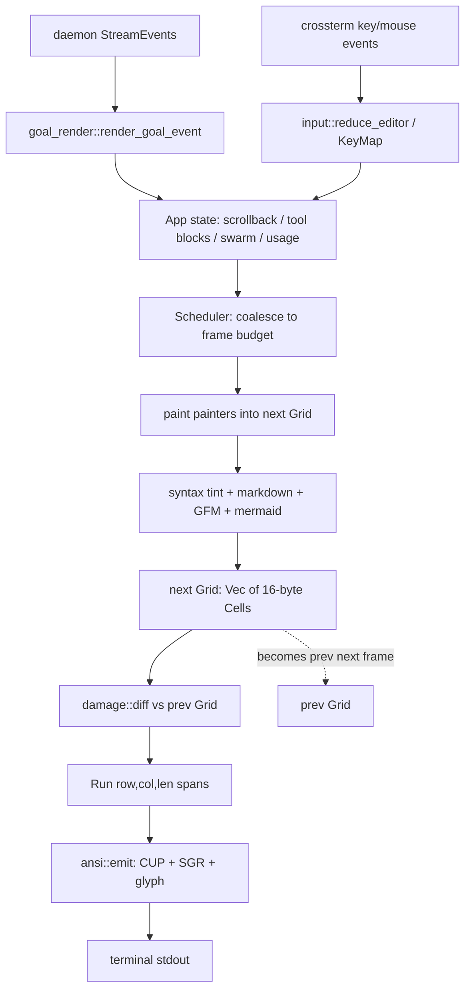

# TUI & CLI

The TUI & CLI subsystem is the user-facing client of the origin workspace — the
`origin` binary the operator actually runs. It is a *thin* client: the heavy
agentic work lives in `origin-daemon` (see
[`../architecture/overview.md`](../architecture/overview.md)), and the CLI's job
is to (a) parse a large `clap` command surface, (b) supervise/auto-spawn the
daemon, and (c) render the streamed event feed of a live agent turn into a
terminal that feels instantaneous to type into.

That last goal is load-bearing: origin ships its **own** cell-grid terminal
renderer (`origin-tui`) instead of leaning on Ratatui, because the product KPI
is *keystroke-to-pixel latency*. A custom packed-`Cell` grid plus a SIMD damage
diff means a keystroke repaints only the cells that actually changed — not the
whole screen — and the work is CI-gated so a regression in input latency is a
test failure, not a vibe.

This document grounds every claim in the code. The pieces:

| Crate | Role |
| --- | --- |
| `origin-tui` | Packed-`Cell` grid, SIMD damage diff, ANSI emit, frame scheduler, side panel, stream widget. |
| `origin-cli` | The `origin` binary: `clap` surface, interactive session UI, slash commands, daemon supervision. |
| `origin-i18n` | Zero-dependency UI string catalog with locale fallback + placeholder substitution. |
| `origin-outputstyle` | Explanatory / Learning / Concise output personas + the transform-or-hide `MessageDisplay` hook. |
| `origin-mermaid` | Dependency-free mermaid-flowchart → ASCII renderer. |
| `origin-ui-preview` | Hot-reload palette / transcript preview harness for theme work. |

> Last reviewed against workspace version 0.9.8.

---

## The cell-grid renderer (origin-tui)

`origin-tui` (`crates/origin-tui/src/lib.rs`) is described in its own crate doc
as the "custom cell-grid renderer (replaces Ratatui in Phase 4)". Its public
surface is small and deliberate:

```rust
pub use grid::{Attr, Cell, Grid, GridError};
pub use damage::Run;
pub use scheduler::{Handle, Scheduler};
pub use stream_widget::{Rect, StreamWidget};
pub use composer::Composer;
pub use panel::{Panel, PanelColors, PanelEvent, PanelState, PermissionOutcome};
pub use width::WidthCache;
```

### The `Cell` representation — 16 bytes, const-asserted

The atom of the renderer is `Cell` (`crates/origin-tui/src/grid.rs:31`). It is a
`#[repr(C)]` struct of four `u32`s — glyph, foreground, background, attribute —
which makes it exactly **16 bytes** with no padding:

```rust
#[derive(Debug, Clone, Copy, PartialEq, Eq, Hash)]
#[repr(C)]
pub struct Cell {
    pub glyph: u32,   // Unicode scalar value; BLANK uses ASCII space
    pub fg: u32,      // 0x00RRGGBB; 0 means terminal default
    pub bg: u32,      // 0x00RRGGBB; 0 means terminal default
    pub attr: u32,    // style flag bits (see `Attr`)
}
```

The 16-byte size is not incidental — it is a hard contract the SIMD diff relies
on. `crates/origin-tui/src/damage.rs:12-13` asserts it at compile time:

```rust
const CELL_BYTES: usize = std::mem::size_of::<Cell>();
const _: () = assert!(CELL_BYTES == 16, "SIMD coarse pass assumes Cell is 16 bytes");
```

`#[repr(C)]` guarantees the field order matches the byte layout the diff scans,
which is what makes `Grid::as_bytes` (`grid.rs:191`) sound: it reinterprets the
`Vec<Cell>` as a `&[u8]` of `len * 16` bytes via `from_raw_parts`, with a
SAFETY comment that turns on "`Cell` is `#[repr(C)]` with size 16 and no
padding".

A few `Cell` details that matter for correctness:

- **`Cell::BLANK`** is an ASCII space with zero color/attr (`grid.rs:45`). The
  background `0` means "terminal default", which lets `NO_COLOR` mode degrade to
  a byte-identical mono render.
- **Wide glyphs.** A double-width glyph (CJK, emoji) occupies two grid cells:
  the leading cell holds the real glyph; the trailing cell is a
  `Cell::continuation(bg)` whose glyph is the sentinel `CONTINUATION_GLYPH =
  0xFFFF_FFFF` (`grid.rs:76`). That value is *not* a valid Unicode scalar, so
  `char::from_u32` returns `None` and the ANSI emitter writes no character for
  it — the wide glyph already advanced the cursor by two columns. The
  continuation cell still carries `bg` so it diffs and repaints correctly.

`Attr` (`grid.rs:14`) is a `#[repr(transparent)]` `u32` bitfield: `BOLD`,
`ITALIC`, `UNDERLINE`, `REVERSE`, `DIM`, `STRIKE` packed into the low bits, with
the high bits reserved for future use (underline color, blink, hyperlinks).

### The grid model

`Grid` (`grid.rs:106`) is a row-major `Vec<Cell>` with `cols`/`rows` (`u16`
each). The API is small: `new` / `new_filled` / `fill` / `resize` / `put` /
`get` / `as_bytes` / `len`. Out-of-bounds `put` is a silent no-op and
out-of-bounds `get` returns `Cell::BLANK`, so painters can clip lazily without
guarding every coordinate. `resize` fully clears the buffer — callers must
`resize` the previous and next grids in lockstep on a SIGWINCH-equivalent
event, because the diff asserts matching dimensions.

The render model is double-buffered: a *previous* grid (what is on screen) and a
*next* grid (what the frame just painted). Each frame: paint `next`, diff it
against `prev`, emit ANSI for the runs, then `next` becomes `prev`.

### SIMD damage diffing — repaint only changed cells

`damage::diff(prev, next) -> Vec<Run>` (`damage.rs:28`) is the heart of the
latency story. A `Run { row, col, len }` (`damage.rs:16`) is one contiguous span
of changed cells on a single row. The diff is a **two-pass per row** algorithm:

1. **Coarse SIMD scan.** Each row's byte slice is walked in 32-byte strides
   (`u8x32` from the `wide` crate). The leading two cells of a row are 32 bytes
   (`2 * 16`), so one SIMD compare clears or flags a 2-cell window at a time. If
   any 32-byte chunk differs, the row is flagged changed and the scan breaks
   early; the tail (`< 32` bytes) is compared with a plain slice `!=`. A row
   that is byte-identical is skipped entirely — *no* per-cell work, *no* emit.
2. **Fine per-cell pass.** Only on a flagged row does the diff walk cell by cell
   (16-byte windows), coalescing maximal runs of differing cells into `Run`s.

There is a subtlety the code handles explicitly (`damage.rs:80-90`): if a run
would *begin* on the trailing half of a wide glyph, the emitter would skip that
continuation cell without advancing the cursor and shift the rest of the run one
column left. So a run that starts on a continuation cell is extended one column
to the left to include the wide glyph, guaranteeing the pair is always emitted
together. The wide-glyph cell to the left is necessarily unchanged there, so
re-emitting it is harmless.

The net effect: a single keystroke in the composer typically dirties one row and
emits a handful of cells, so the terminal write is tiny and the latency budget is
spent on `read → reduce → paint`, not on a full-screen repaint.

### ANSI emit

`ansi::emit(next, runs) -> Vec<u8>` (`crates/origin-tui/src/ansi.rs:36`)
translates a run set into the minimal `CUP + SGR + glyph` byte stream:

- For each run it emits a Cursor-Position sequence (`\x1b[row;colH`,
  1-based) once, then walks the run's cells.
- SGR (color/attribute) is emitted only on a **style change** within the run
  (`current_style` memo), then each glyph's UTF-8 bytes are appended; the run
  ends with a `\x1b[0m` reset.
- **Color gating.** `want_color_cached()` reads `NO_COLOR` exactly once
  process-wide (a `OnceLock`) so every frame emits a consistent stream and the
  hot path never does a `getenv`. The de-facto `NO_COLOR` convention is honored:
  color is suppressed when the variable is *present and non-empty* (so
  `NO_COLOR=0` still disables color, by design). Attribute SGRs
  (bold/italic/underline/reverse/dim/strike) are *always* emitted so visual
  structure survives even with color off; only the 24-bit truecolor `38;2`/`48;2`
  sequences are gated.
- **Control-char safety.** `push_glyph` (`ansi.rs:106`) substitutes a space for
  any control character, because emitting a raw `\r` (etc.) would move the cursor
  and corrupt the frame.

### Frame coalescing scheduler

`Scheduler` (`crates/origin-tui/src/scheduler.rs`) is a frame-coalescing layer:
an `AtomicBool dirty` + a tokio `Notify`, parameterized by a `frame_budget`
`Duration`. Many `mark_dirty` calls (one per stream event) collapse into at most
one repaint per frame budget, so a burst of streamed deltas does not cause a
repaint storm. `Handle` is the cheap clone callers use to mark the frame dirty
from the event loop.

### Why a custom renderer

The crate doc and the design notes are explicit that this exists for the
keystroke-to-pixel KPI. Ratatui (and most TUI frameworks) re-render and re-diff
at a high level; the packed `Cell` + byte-level SIMD diff lets origin repaint the
true minimum. The CLI's `App` carries a `MAX_SCROLLBACK` cap with hysteresis
(`crates/origin-cli/src/tui/mod.rs:222`) precisely "so the per-frame wrap [is not]
O(whole history), which degrades the CI-gated keystroke latency".

---

## Syntax highlighting & markdown

### The lexical syntax tint

`crates/origin-cli/src/tui/syntax.rs` is a "dependency-free lexical syntax tint.
Pure, no I/O." It is a tiny hand-rolled, single-line lexer that classifies byte
ranges into a six-token vocabulary:

```rust
pub enum Tok { Keyword, Str, Comment, Num, Ident, Punct }
```

It is *lexical only* — it scans one line at a time, knows nothing about
surrounding lines, and never panics on a partial / streaming / truncated line.
That property is the point: it is cheap enough to run on every visible code row
each frame and safe to call while the model is still emitting a half-finished
code block. Color is deliberately **not** decided here — `tint()` only emits
`Span { start, len, kind }` byte ranges; `codeblock.rs` maps each `Tok` to a
`Tokens` color, which keeps the lexer dependency-free.

The languages are table-driven (`Syntax` struct, `syntax.rs:115`): Rust, JS, TS,
Python, JSON, Bash, Go. Each carries `keywords`, `line_comments`,
`block_comments`, `string_delims`, `backslash_escapes`, and `dollar_vars` (Bash
`$VAR` / `${VAR}` references). `lang_from_label` resolves a fenced-code label
(`rust`, `rs`, `ts`, `py`, `sh`, `golang`, …) to a `Lang`; unknown labels render
untinted. UTF-8 safety is structural: the `Lexer` holds the line as a
`Vec<(byte_offset, char)>` with a trailing sentinel, so every span boundary lands
on a real `char` boundary regardless of multi-byte content (the tests cover
`café`, `naïve 🚀`, and `你`).

### GFM task-list rendering

`crates/origin-cli/src/markdown_tasks.rs` recognizes GitHub-flavored task-list
syntax (`- [ ] text`, `- [x] text`) and rewrites the `[ ]` / `[x]` marker into a
checkbox glyph (`□` / `■`, from the `glyph` module). It is kept free of any
terminal/grid types so the recognition rules are unit-testable in isolation; the
TUI render path calls `render_gfm_task_line` and falls through to normal markdown
rendering on `None`. The broader inline-markdown pass (bold, headers, inline
code, heading hierarchy, code-block backgrounds) lives in `tui/markdown.rs` and
`tui/codeblock.rs`.

### Mermaid-to-ASCII (origin-mermaid)

`crates/origin-mermaid/src/lib.rs` is a "dependency-free renderer for a useful
subset of mermaid flowcharts to ASCII" — pure `std`, no I/O, no async, no
external crates. It parses a small common subset:

- headers `graph TD` / `graph LR` / `flowchart TD` / `flowchart LR`
- node definitions with shape-carrying brackets — `A[Box]`, `B(Round)`,
  `C{Diamond}` → `NodeShape::Box` / `Round` / `Diamond`
- edges — `A-->B`, `A--text-->B`, `A---B`

The data model is `Diagram { direction, nodes, edges }` with `Direction::TopDown`
/ `LeftRight`, `Node { id, label, shape }`, and `Edge { from, to, label }`. Any
unrecognized line (comments, styling, subgraphs, class defs) is ignored
gracefully rather than erroring; `MermaidError` only has `Empty` and
`Unsupported`. The CLI exposes it two ways: the `origin mermaid <path>`
subcommand (reads a file or stdin via `-`), wired through
`crates/origin-cli/src/mermaid.rs`, and inline rendering of mermaid fences in the
TUI transcript.

---

## The CLI command surface (origin-cli)

`crates/origin-cli/src/cli_def.rs` defines the entire `clap` tree. It lives in
the *library* (not the binary) so introspection tools — notably `xtask
manpages`, which renders `clap_mangen` output — can build the same
`clap::Command` tree without depending on the binary crate (`main_cli()`,
`cli_def.rs:696`).

The top-level `Cli` carries global flags before any subcommand:
`--tutorial` (the 7-step guided tour), `--effort` (reasoning effort:
`fast`/`low`/`medium`/`high`/`max`), `--thinking-tokens` (Anthropic extended
thinking budget), `--root` (extra workspace roots, repeatable),
`--resume <id>`, and `--lang` (UI locale override, tolerant of region subtags).
When `cmd` is `None`, the binary enters the interactive TUI session.

`main()` (`crates/origin-cli/src/main.rs:115`) drives the tokio
`current_thread` runtime on a dedicated 16 MiB-stack thread
(`RUNTIME_STACK_SIZE`) — the comment explains the TUI's top-level future is one
giant inlined state machine that overflows Windows' default 1 MiB main-thread
stack in debug builds, so every platform is forced onto a generous explicit
stack. Before dispatch, `run_self_update()` swaps in any staged binary and kicks
off a detached background update worker (never blocking startup on the network).

### Top-level subcommands

| Command | Purpose |
| --- | --- |
| `run <text>` | One-shot headless prompt: connect, send, drain to completion, exit. Flags: `--json`, `--remote`, `--bearer`, `--model`, `--effort`, `--thinking-tokens`, `--alias`, `--attach`, `--output-format` (`text`/`json`/`stream-json`), `--json-schema`, `--root`. |
| `init` | Interactive first-time setup: pick primary/backup/subagent providers + models, capture credentials, write `~/.origin/config.toml`. |
| `tutorial` (`--tutorial`) | 7-step guided tour of origin's core surfaces. |
| `doctor` | Environment & runtime diagnostics + a privacy / phone-home disclosure (`--json`, `--privacy`). |
| `import` | Import a session/skill set from another harness. |
| `resume-foreign <source> <path>` | Cross-harness *live resume*: reconstruct a Claude Code / jcode / opencode / codex / pi transcript into a fresh resumable origin session. |
| `providers` | `ls` / `describe <id>` / `refresh` / `recommend` — inspect the builtin provider catalog and rank models by cost. |
| `lsp` | `ls` / `ensure <ext>` — inspect the builtin LSP server registry (opencode-style fleet, 40+ servers). |
| `mermaid <path>` | Render a mermaid flowchart to ASCII (`-` for stdin). |
| `knowledge` | `add` / `search` / `rm` / `ls` — local semantic index at `~/.origin/knowledge.json`. |
| `schedule` | `add` / `ls` / `rm` — cron / `@every` / `@daily` / webhook / fs-event triggers in `~/.origin/schedule.toml`. |
| `sessions` | `ls` / `resume` / `rm` / `rewind --keep N` — manage persisted sessions. |
| `export <session_id>` | Export a transcript to Markdown or JSON (`--json`, `-o`). |
| `usage` | Daemon usage snapshot (tokens in/out per provider/model). |
| `insights` | Per-session cost/usage table + a prompt-cache warm/cold nudge footer. |
| `keyring` | `add` / `list` / `remove` / `login` — manage stored provider credentials; `login` runs the OAuth flow. |
| `oidc-exchange` | Workload Identity Federation token exchange (RFC 8693) for keyless provider auth. |
| `pair` | `start` / `redeem` — pairing sessions for remote QUIC clients. |
| `checkpoint [label]` / `checkpoints` / `rewind <id>` / `checkpoint-diff <id>` | Shadow-git working-tree snapshot history. |
| `memory inbox` | `list` / `accept` / `reject` — the mem-garden auto-memory draft inbox. |
| `scout <repo_url>` | Shallow-clone a dependency repo and print a compact overview. |
| `watch` | Scan a source tree for `AI` / `AI!` / `AI?` trigger comments. |
| `copy-context <files…>` | Bundle files + an instruction onto the clipboard for a web chat. |
| `apply-clipboard` | Apply edits pasted from a web chat (read from clipboard). |
| `dictate` | Dictate a prompt via an external speech-to-text engine. |
| `search <query>` | Pluggable web search (`ddg` / `brave` / `tavily`). |
| `plugin` | `ls` / `info` / `install` — discover & install plugins / cross-tool skills. |
| `ambient` | `report` — overnight/ambient autonomous mode morning report. |
| `bench` | Run the origin-bench reliability harness (`pass@k` / `pass^k` / flakiness). |
| `review` | Confidence-scored multi-dimension review of the working-tree diff (`--strictness`, `--llm`). |
| `gmail <op>` | First-class Gmail tool over Google OAuth (`search` / `get` / `list_threads` / `login`). |
| `workflow` | `author` / `run` — dynamic workflow authoring + run substrate. |
| `selfdev` | `start` / `status` / `approve` / `reset` — supervised binary self-development (gated `ORIGIN_SELFDEV=1`). |
| `team` | `create` / `assign` / `status` — named agent teams (origin-swarm control plane). |
| `trace query` | Query the trace ring. |

Dispatch is a single linear `match` in `dispatch_subcommand`
(`main.rs:176`); every arm terminates the program with its own `Result`, and the
TUI path is reached only when `Cli::cmd` is `None`.

---

## Interactive session UI

The interactive session is owned by `App`
(`crates/origin-cli/src/tui/mod.rs:411`), a large `#[allow(clippy::struct_excessive_bools)]`
aggregate of session state. The terminal is put into raw mode + alternate screen
with bracketed paste and (by default) mouse capture (`main.rs` imports the full
crossterm `Enter/LeaveAlternateScreen`, `Enable/DisableMouseCapture`,
`Enable/DisableBracketedPaste`, `Hide/Show` set).

### The composer

The composer is the framed input field at the bottom. Its painter
(`crates/origin-cli/src/tui/composer.rs`) draws a rounded box-drawing frame
(`╭─╮ │ ╰─╯`), a `›` prompt glyph on the first content row, a dim `↳` soft-wrap
cue in the gutter of wrapped continuation rows, and a `▴` "more above" marker
when the field scrolls internally. An `EditorView` is the coordinate-free
snapshot the painter reads (wrapped `lines`, caret, placeholder, `scroll_top`,
`max_rows`). The card grows from `MIN_INPUT_ROWS = 3` to `MAX_INPUT_ROWS = 6`,
then scrolls internally so a long paste cannot swallow the scrollback above
(`tui/mod.rs:210-215`). When empty it shows the `COMPOSER_PLACEHOLDER`:
`"Ask anything — type your task and press ⏎.  / browses skills · @ mentions files"`.

A de-noised, centered keybind hint sits under the card
(`composer.rs:249`): `⏎ send · ⇧⏎ newline · / skills · @ files · ^c interrupt`.
The whole line dims (`Attr::DIM`) while a turn is in flight.

### The input reducer

`crates/origin-cli/src/input.rs` is the pure key reducer. `reduce_editor`
(`input.rs:134`) maps a crossterm `KeyEvent` against an `Editor` into an
`InputAction` (`Insert` / `Newline` / `Backspace` / `Submit` / `Quit` /
`Interrupt` / `QueueEdited` / `Noop`). Highlights:

- **Ctrl+C is context-sensitive.** `op_in_flight` (a goal is active or a prompt
  is mid-stream) remaps Ctrl+C to `Interrupt` (sends `ClientMessage::Interrupt`,
  stays running); idle, it `Quit`s. Ctrl+D and Esc are always quit, giving an
  unambiguous exit even mid-goal.
- **Shift+Enter** inserts a newline; bare **Enter** submits (or, when editing a
  queued message, commits the edit back into the queue slot → `QueueEdited`).
- **Ctrl+R** enters bash-style reverse-incremental history search
  (`reduce_reverse_search`, `input.rs:95`): typed chars build the query, Ctrl+R
  cycles older matches, Esc/Ctrl+G/Ctrl+C cancels, Enter accepts and submits.
- **Up/Down** move visually within wrapped lines, then fall through to a precise
  precedence ladder across the *queued-message* stack and the *prompt history*
  (kept mutually exclusive so one draft stash can't clobber the other).

### Vim mode

The composer has an opt-in vim layer (aider L147 parity). `App.vim_active`
gates it entirely: when `false` (the default) the vim reducer is *never*
consulted, so input is byte-identical to direct-insert. It is enabled by the
`/vim` slash command or `ORIGIN_VIM=1`, and starts in `VimMode::Normal`
(`set_vim_active`, `tui/mod.rs:777`).

### Keybindings (claude-code L147 parity)

`crates/origin-cli/src/keybindings.rs` adds rebindable composer chords. A pure
`KeyMap` resolves a crossterm event to an `Action` (`Submit`, `Cancel`,
`HistoryPrev`, `HistoryNext`, `Clear`, `ReverseSearch`, or the `None` sentinel).
The builtin map reproduces today's hard-wired chords exactly — `Enter`→Submit,
`Ctrl+C`→Cancel, `Up`/`Down`→history, `Ctrl+U`→Clear — so an absent
`~/.origin/keybindings.toml` leaves the key path byte-identical. The file shape
is a flat `action = "chord"` TOML table (`history-prev = "ctrl+p"`); a user
rebind is `canonicalize`d back to the *builtin* event the legacy reducer already
understands, and the freed default chord passes through unchanged. Unknown action
names and unparseable chords are skipped so a partly-mistyped file still loads.

### Mouse capture & selection

Mouse capture defaults *on* (`App.mouse_capture = true`, `tui/mod.rs:524`): the
wheel scrolls scrollback and a left-drag selects text in-app (auto-copied on
release via OSC 52). `/mouse off` releases capture for terminal-native
selection; the caller issues the matching `Enable`/`DisableMouseCapture`.
`Selection` (`tui/mod.rs:333`) is a normalized `anchor`/`head` cell-pair, and
`selection_text()` reconstructs exactly what is on screen from a per-frame
`screen_text` snapshot (only captured while a selection is active, so there is no
per-frame cost otherwise).

### Tool blocks, side panel & swarm status

Streamed tool activity renders as tool blocks: a header line marked with the tool
glyph (`tui/tokens.rs` `tool_token`: `✎` edit, `⌘` bash, `⌕` grep, `◇` read, `⇲`
write, `⚿` web, `⊕` task) and a `▸`/`✔`/`✘` status marker that `finish_tool_line`
flips on completion. Write/Edit diffs are capped at `MAX_DIFF_ROWS = 40` rows
(`main.rs:49`) so a large patch doesn't bury the conversation; these diff lines
are view-only (never sent to the model).

The side panel (`origin-tui/src/panel.rs`) is a separate render target with its
own `PanelEvent` queue and permission-decision UI (`PermissionOutcome::Allow /
Deny / Edit`). `PanelColors` are threaded in by the CLI from `Tokens` so the
panel follows the active theme (the `origin-tui` crate is theme-agnostic and
cannot depend on the CLI's `Tokens`).

Swarm fan-out is shown live above the composer. `SwarmAgentRow`
(`tui/mod.rs:391`) is keyed by the daemon's stable hex worker id so a worker's
completion event updates its existing row in place; each row carries a
`SwarmAgentStatus` (`Running ▸` / `Completed ✔` / `Failed ✘`), the goal, the
current tool, and an elapsed clock. A fresh wave of spawns clears the list so the
panel always reflects the current fan-out.

Other live status surfaces on `App`: a braille spinner (`SPINNER_FRAMES`,
80 ms/frame); a soft "still working…" stall notice after `STALL_SOFT_AFTER = 11s`
of daemon silence (`stall_tier`, computed from an `activity_signature` FNV mix
that deliberately excludes the spinner so a silent-but-spinning UI still reads as
"no activity"); a `ctx N%` context-window meter; a cold-prompt-cache nudge; and a
top chrome strip (`◆ origin · model · cwd · ⎇ branch · clock · ctx%`) whose
`cwd`/`branch` are resolved once at startup so `draw` does no I/O.

---

## Slash commands

In-session slash commands are parsed in `handle_submit` (`main.rs:1568`) and
gated by `is_slash_command` (`main.rs:1526`), which decides whether a Submit goes
to the model or is intercepted locally. The set found in the source:

| Slash command | What it does |
| --- | --- |
| `/help`, `/?` | Show the in-session help. |
| `/clear` | Reset the conversation; re-pushes the startup hero banner. |
| `/model [<name>]` | Show or set the active model (`cmd.model.set` / `cmd.model.usage`). |
| `/account [<provider>/<account>]` | Set the active provider account, stamped onto every `PromptRequest` (process-wide `SESSION_ACCOUNT`, `main.rs:86`). |
| `/effort <fast\|low\|medium\|high\|max>` | Set session reasoning effort, sent on every prompt. |
| `/fast` | Shorthand for `/effort fast`. |
| `/output-style <default\|explanatory\|learning\|concise>` | Switch the output persona (see `origin-outputstyle`). |
| `/steer <hint>` | Queue a mid-turn steering hint, merged ahead of the next prompt in `<steering>` markers. |
| `/plan` | Toggle read-only "plan mode" — the next prompts carry `read_only` so the daemon denies mutating tools. |
| `/vim` | Toggle the opt-in vim composer layer. |
| `/theme <name>` | Switch color preset (`default` / `dark` / `light` / `high-contrast`). |
| `/mouse [on\|off]` | Toggle terminal mouse capture (in-app scroll/select vs terminal-native). |
| `/permissions [on\|off]` | Toggle interactive tool-permission prompting (`permission_ask` on each prompt). |
| `/copy` | Copy the last assistant reply to the clipboard (OSC 52). |
| `/attach <file>` | Stage an image/PDF as multimodal context for the next prompt. |
| `/timeline` | Render the session timeline. |
| `/knowledge [add\|search\|rm\|ls …]` | Operate the local knowledge index from the session. |
| `/mem [accept\|reject] <N>` | Act on the in-session memory proposal queue (`ClientMessage::MemoryDecision`). |
| `/<skill>` | Activate a named skill (the catch-all that powers `/`-autocomplete, e.g. `/brainstorming`, `/frontend-design`). |
| `{workflow:<name>}` | Activate an authored workflow (completed via the `{workflow:` prefix). |

`slash_verb_boundary` (`main.rs:1552`) ensures a verb matches only at a word
boundary, so a skill named `/knowledgefoo` is never mistaken for the
`/knowledge` command. Slash commands that round-trip in a single frame are not
interruptible (only the streaming Prompt path threads an `interrupt_rx`).

---

## Output styles (origin-outputstyle)

`crates/origin-outputstyle/src/lib.rs` carries two orthogonal text concerns.

**Output personas.** `Style` is `Default` / `Explanatory` / `Learning` /
`Concise`. Each non-default style contributes a `system_suffix` appended to the
system prompt — Explanatory ("explain the reasoning behind your choices"),
Learning ("teach the underlying concepts… as if mentoring"), Concise ("be terse
and answer-first"). `Default` contributes the empty string. Crucially, styles
shape the *prompt*, not the rendered output: `display_transform` is the identity
for every built-in style today, so a session with a style set renders
byte-identically while steering the model's voice. Set via `/output-style` and
sent on every `PromptRequest`.

**The transform-or-hide `MessageDisplay` hook.** A hook can rewrite or suppress a
rendered message via a `DisplayAction` — `Show` (unchanged), `Hide` (render
nothing), or `Replace(String)` (substitute). `parse_display_hook` decodes a
hook's JSON verdict (`{"action":"show|hide|replace","text":…}`) and `apply_display`
applies it. `resolve_display(text, style, action)` is hook-first: a fired hook
decides outright; otherwise the active style's `display_transform` runs (identity
today). With no hook and the default style this is the identity — keeping
rendering byte-identical to the no-style / no-hook path. The whole crate is a
pure offline text transform (`#![forbid(unsafe_code)]`, no I/O, no async).

---

## Internationalization (origin-i18n)

`crates/origin-i18n/src/lib.rs` is a deliberately tiny, zero-dependency
(`#![forbid(unsafe_code)]`) UI string catalog. Every translation is a `match`
over `&'static str` literals baked into the binary at compile time — no
allocation on lookup, no `lazy_static`/`OnceLock` map to warm.

**Locales.** `Lang` covers six: `En`, `Es`, `Fr`, `De`, `Ja`, `ZhCn`.
`Lang::from_code` is case-insensitive and tolerant of region subtags — `en`,
`en-US`, `en_GB` all map to `En`; bare `zh` and any `zh-*` map to `ZhCn`. The CLI
resolves the locale from `--lang`, then `$LC_ALL`/`$LANG`, then English.

**Fallback chain.** `t(lang, key)` returns the locale's string, else the English
string, else the *key itself* — so the UI never shows a blank slot. A
catalog-known key with no translation echoes the key; a truly unknown key returns
the stable sentinel `"?"`.

**Placeholder substitution.** `tf(lang, key, args)` substitutes `{name}`
placeholders from `args`. A placeholder with no matching arg is left verbatim,
and an unbalanced `{` is emitted verbatim. The English literals for the
"newly-routed" keys are reconciled to be byte-identical to what the live call
sites already emit (e.g. `tool.running` is `"[{tool}]"`, `cost.turn` is
`"This turn cost {usd}"`), so default-English output is unchanged after routing —
a property the crate's tests pin.

---

## Onboarding & discovery

**Welcome / post-init walkthrough.** `crates/origin-cli/src/welcome.rs` runs
after `init.rs` saves `config.toml`: a short Toolbox → Skill Repository → port
skills → Workflows tour. Each screen is a brief explainer plus one interaction
(list the built-in tool registry, explain skills + the validation step, Y/N
offer to scan well-known harness locations and port skills). The
`crates/origin-cli/src/onboarding/` module (`flow.rs`, `screen.rs`, `picker.rs`)
holds the screen/flow primitives.

**Tutorial.** `crates/origin-cli/src/tutorial.rs` is `origin --tutorial`, a
7-step guided tour. Its content table (`steps`) is decoupled from the runner
(`run`) so the content is unit-testable and the runner can be driven against
arbitrary `BufRead`/`Write` pairs.

**First-run seed.** `crates/origin-cli/src/first_run_prompt.rs`: `init`'s
post-config walkthrough writes a markdown prompt to
`~/.origin/pending-prompt.txt`; the first TUI start after init reads it, fires it
as the user's first prompt, and deletes the file so it can never fire twice — the
prompt asks the agent to discover and import skills from non-standard locations
(deferred from init time, when the daemon isn't yet running, to first-chat time,
when it is).

**Provider recommendation.** `crates/origin-cli/src/recommend.rs` (the `origin
providers recommend` handler) ranks candidate models by the builtin
`origin_cost` pricing table (blended `$/Mtok`) and can persist the cheapest as a
profile at `~/.origin/recommended.json`. Cloud models differ on price so cost
ranks them; local Ollama models all cost `$0`, so when a candidate is an explicit
`ollama/`/`ollama:` model and the daemon is reachable, a quick latency probe is
folded into `origin_router`'s `Strategy::Scored` health so local models rank by
real latency. The probe is best-effort — a failed probe leaves the cost-only
ranking byte-identical.

**Autocomplete & suggestions.** `crates/origin-cli/src/autocomplete.rs` is the
pure Tab-completion logic: it detects the shape of the trailing token (`/`,
`/-`, `{workflow:`) and rewrites the buffer to the longest unambiguous
completion. `crates/origin-cli/src/suggestions.rs` is the live per-keystroke
suggestion engine: it computes ranked candidates whenever the *trailing token*
(substring after the last whitespace) matches a completable prefix, so `/` is
recognized mid-prompt ("please run /fro" surfaces `/frontend-design` just like a
bare `/fro`). Both are pure — the caller passes a `CompletionSources` snapshot
(skill names, slash verbs, workflow names). The described slash palette
(`tui/palette.rs` `draw_slash`) surfaces each candidate's description in `muted`
beside its name, highlighting the selected row with `sel_bg`; the `@`-mention
popup (`draw_mentions`) leads each row with a per-kind glyph (File `◇`, Dir `▸`,
Agent `⊕`).

---

## Client/daemon interaction

The CLI is a thin client over `origin-daemon`. Two interaction shapes:

**Admin/one-shot commands.** Handlers in `crates/origin-cli/src/admin.rs` (and
peers) open a one-shot local-socket connection to the daemon at `$ORIGIN_SOCK`
(platform default fallback), send one `ClientMessage` envelope, read one
`StreamEvent` reply, and render it. Errors propagate via `anyhow`.

**The interactive session.** `main.rs` opens a fresh daemon connection *per
prompt* via `origin_ipc::transport::{Connection, Connector}` and frames messages
with `origin_ipc::frame::{encode, FrameKind}`. Because each prompt is a new
connection, session state that the daemon would otherwise hold per-connection is
instead stamped onto each `PromptRequest` — the `/account` override
(`SESSION_ACCOUNT`), reasoning effort, output-style suffix, plan-mode
`read_only`, steering hints, workspace roots, and attachments. The streamed
`StreamEvent`s are rendered by `goal_render::render_goal_event` and folded into
`App`'s scrollback, tool blocks, swarm panel, and usage counters, with the
`Scheduler` coalescing the resulting repaints to the frame budget.

**Daemon supervision.** `crates/origin-cli/src/daemon_launch.rs` provides pure
launch-decision helpers. `ensure_daemon_running` defaults to routing the daemon
through the `origin-supervisor` binary, which owns and restarts `origin-daemon`
and consumes the self-dev relaunch sentinel (exit code 86) to hot-swap a freshly
built binary. The user can opt back into a direct spawn with
`ORIGIN_NO_SUPERVISOR=1`, and a missing supervisor binary falls back to a direct
spawn so launch never fails for lack of it. The decision and supervisor argv are
split out as pure functions so they are unit-testable without spawning
processes. For the bigger picture of the daemon, IPC, router, and tool execution,
see [`../architecture/overview.md`](../architecture/overview.md).

---

## UI preview harness (origin-ui-preview)

`crates/origin-ui-preview/src/main.rs` is a hot-reload terminal preview of the
harness UI. It renders the "Burnished Copper" identity and the other `/theme`
presets as palette swatches plus a fake transcript, so design changes to
`origin-cli/src/theme.rs` / `ansi.rs` can be eyeballed instantly without
launching the full TUI or a daemon. The trick: the theme sources are pulled in
via `#[path = "../../origin-cli/src/theme.rs"]` (and `ansi.rs`) rather than a
dependency on `origin-cli`, so the edit→rebuild→render loop compiles *two files*
instead of the whole harness.

Usage modes: `origin-ui-preview` (all themes), `origin-ui-preview dark` (one
theme), `--swatches` (palette grid only), `--transcript` (mock transcript only).
The swatch grid prints all 22 palette roles (`surface`, `surface_raised`,
`border`, `muted`, `body`, `bright`, `accent`, `accent_dim`, `user`, `tool`,
`code_fg`, `code_bg`, `green`, `yellow`, `red`, `dim`, `rule`, `panel_header`,
`panel_bg`, `h1`, `h2`, `h3`) in two compact columns. Hot reload is wired through
`cargo watch`, `bacon`, or a zero-install `scripts/ui-preview-watch.ps1`
fallback. The `Tokens` system (`tui/tokens.rs`) derives every named color role
from a `theme::Palette` snapshot via `from_palette`, with the default theme's
`muted`/`accent_dim` retuned upward so every text token clears WCAG AA 4.5:1
contrast on both surfaces (asserted by `contrast_ratio` tests).

---

## Diagram

The render pipeline, end to end:



As ASCII (the same pipeline, the way `origin mermaid` would draw it):

```
 daemon StreamEvents          crossterm key/mouse
        |                              |
 render_goal_event           input reducer / KeyMap
        \______________  ______________/
                       \/
                  App state  (scrollback, tool blocks,
                              swarm panel, usage, ctx%)
                       |
              Scheduler (coalesce → frame budget)
                       |
        paint painters → next Grid  (Vec<Cell>, 16 bytes each)
            |  (syntax tint · markdown · GFM tasks · mermaid)
                       |
        damage::diff(prev, next)  → [Run { row, col, len } …]
            |  (32-byte SIMD coarse scan → per-cell fine pass)
                       |
        ansi::emit  → CUP + SGR + glyph bytes (NO_COLOR-gated)
                       |
                terminal stdout
                       |
        next Grid becomes prev for the following frame
```

The whole point of the loop is that the only bytes written to the terminal are
the cells that actually changed since the previous frame — which is what keeps a
keystroke's path through `reduce → paint → diff → emit` inside the CI-gated
latency budget.
